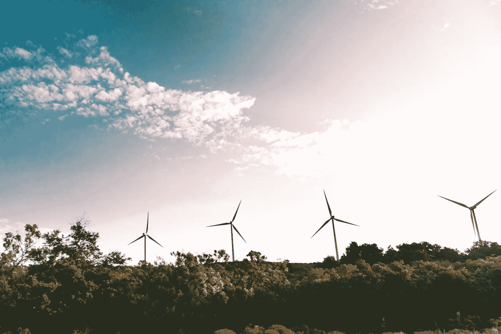
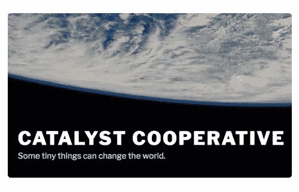

# 您需要了解的 Python 开源能源项目

> 原文：<https://towardsdatascience.com/open-source-energy-projects-in-python-you-need-to-know-about-6d770474121c?source=collection_archive---------13----------------------->

## *应对气候变化所需的数据科学工具指南*

Pexels.com

在学习如何编程的过程中，我最喜欢的一部分是发现开源软件的力量。很有可能，每当你准备投入一个新项目，构建一个新工具，或者进行一些新的分析时，有人已经想到过那个项目——或者非常类似的东西。对你选择的主题或问题进行定义明确的谷歌搜索，通常会带来大量有用的博客文章、软件包和由聪明的付费转发者创建的 Github 知识库。

Pexels.com

开发开源项目最困难的部分是它们是公共产品——每个人都受益，但创作者很少得到他们工作所提供的全部价值的补偿。真正好的工作通常是学位的副产品，直接由补助金资助，或由一家科技公司作为善意行为发布，该公司可以分享一些它认为对其酱料不重要的秘密(想想阿帕奇·斯帕克或脸书的先知)。

凭借我在可再生能源方面的背景，我对将数据科学应用于能源转型特别感兴趣，或者更具体地说，对如何管理电网上可再生发电的涌入特别感兴趣。这一领域的一些常见问题包括电力负荷预测、太阳能和风力发电预测、整体电力系统建模(测量整个电网的性能)和电池优化模型(重要的是让智能系统管理储能解决方案，以最大限度地发挥可再生能源的优势)。在我转向数据科学的过程中，我偶然发现了一些这样的项目，并想分享一些。

# **电力基因组计划**

公用事业公司、项目开发商、倡导组织和其他电网利益相关者在其工作中强烈需要电力系统建模。随着风能和太阳能继续抢占市场份额，我们需要了解如何规划和运营具有高比例可变可再生能源的电网。这种初步分析被称为容量扩展规划，这对于一些利益相关者来说是一个巨大的障碍，因为它通常是资源密集型的、复杂的和耗时的。显然需要一种工具，使资源有限的可再生能源倡导者能够测试产能扩张计划，并创建支持其观点所需的数据。

专注于能源转换的环境影响的数据科学家 Greg Schively 正在利用赠款创建 Power Genome 项目。这一开源项目将允许用户专注于美国的特定地区，并考虑各种各样的基本变量，如现有发电成本、传输约束、预计燃料成本、负荷曲线等。它还允许用户根据他们的特定项目通过聚类生成来修改调整各种粒度级别的设置。

该项目目前面向[# energy witter star Jesse Jenkins 的](https://twitter.com/JesseJenkins?ref_src=twsrc%5Egoogle%7Ctwcamp%5Eserp%7Ctwgr%5Eauthor) GenX 项目，但很快将变得更加普遍，允许支持可再生能源的倡导者或任何需要电力系统建模的人利用这些工具来支持能源过渡。

链接:【https://github.com/gschivley/PowerGenome 

# **公用事业数据解放(PUDL)**

所有数据科学家都知道，查找、组织和清理特定项目所需的数据非常耗时，而且往往是项目成功的最大障碍。对于能源行业来说尤其如此，联邦能源管理委员会(FERC)、能源信息管理局(EIA)和许多其他组织发布了大量有用的数据，但格式和标准不同。

[https://catalyst.coop/](https://catalyst.coop/)

Catalyst Cooperative 是一个由数据科学家和政策专家组成的小组，作为一个工人所有的咨询机构，创建了[公共事业数据解放(PUDL)项目](https://github.com/catalyst-cooperative/pudl)来解决这个问题。用他们的话说，PUDL“通过在一个数据库中清理、标准化和交叉链接来自不同来源的公用事业数据，获取已经公开可用的信息，并使其公开可用”PUDL 数据库目前包括燃料使用、发电组合、发电厂运营成本的数据，甚至来自环境保护署(EPA)的排放数据。该团队还着眼于增加几个新的数据集。

这个团队正在解决一个巨大的问题:组织所有这些数据，并将其转换为机器可读的格式。与 Power Genome project(使用 PUDL)类似，Catalyst Cooperative 旨在降低能源系统分析的准入门槛，并使这些资源可供所有人使用。

链接:[https://github.com/catalyst-cooperative](https://github.com/catalyst-cooperative)

# **皮伊索**

负责经营批发电力市场和平衡不同地区电网电力的独立系统运营商(ISOs)被要求每隔 15 天公布一次负荷数据。然而，收集这些数据需要将 web 抓取和下载 CSV 文件不方便地混合在一起。

WattTime 是一家非营利组织，收集实时 ISO 数据，使电力消费者能够在电网中可再生能源比例最高的时候使用能源。WattTime 开源了 PYISO 库，该库为他们的 API 提供支持，允许任何人方便地访问历史和实时负载和发电数据。我实际上使用这个库创建了 [Peaky Finders](https://github.com/kbaranko/peaky-finders) ，这是一个 NYISO(纽约 ISO)的峰值负载预测应用程序，为我节省了很多时间和麻烦。

与 PUDL 类似，PYISO 的创建者们意识到有必要将公用事业公司和 ISO 需要发布的数据标准化。虽然只有几岁，但我发现[这一集与创始人](https://talkpython.fm/episodes/show/76/renewable-python)的播客对了解项目背后的背景和原理非常有帮助。

链接:[https://github.com/WattTime/pyiso](https://github.com/WattTime/pyiso)

# **其他几个**

值得一提的其他一些项目:

**WindML**

*   提供对风力数据源的访问，用于发电预测和其他应用
*   链接:[https://github.com/cigroup-ol/windml](https://github.com/cigroup-ol/windml)

**Pvlib**

*   模拟光伏(太阳能)能源系统性能的开源工具。
*   链接**:**[https://github.com/pvlib/pvlib-python](https://github.com/pvlib/pvlib-python)

**奥斯莫**

*   随着储能资源激增以最大化可再生能源发电，电池优化建模是一个巨大的挑战——这是一个开源工具，有助于入门。
*   链接:[https://github.com/RyanCMann/OSESMO](https://github.com/RyanCMann/OSESMO)