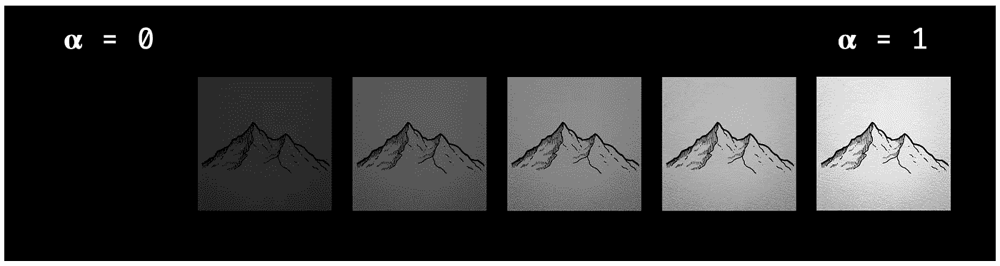
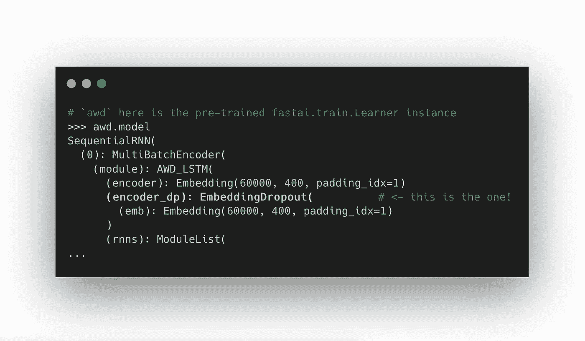
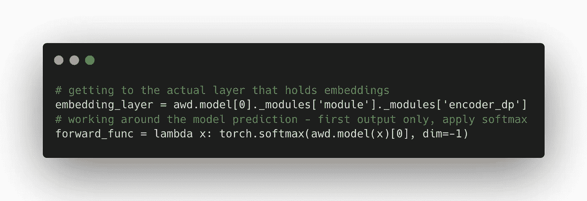
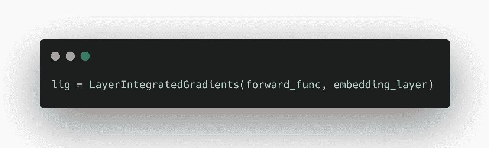
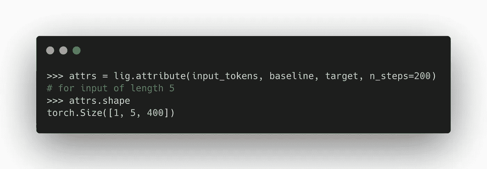
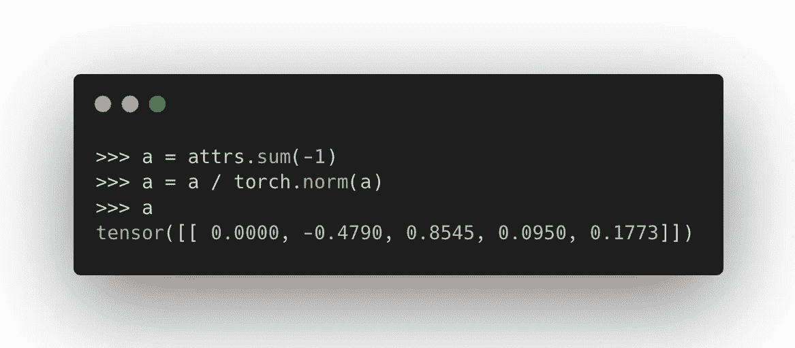
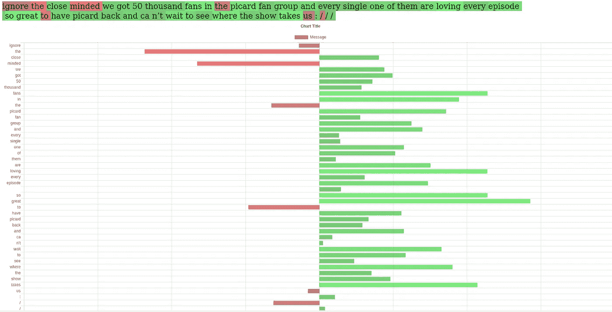
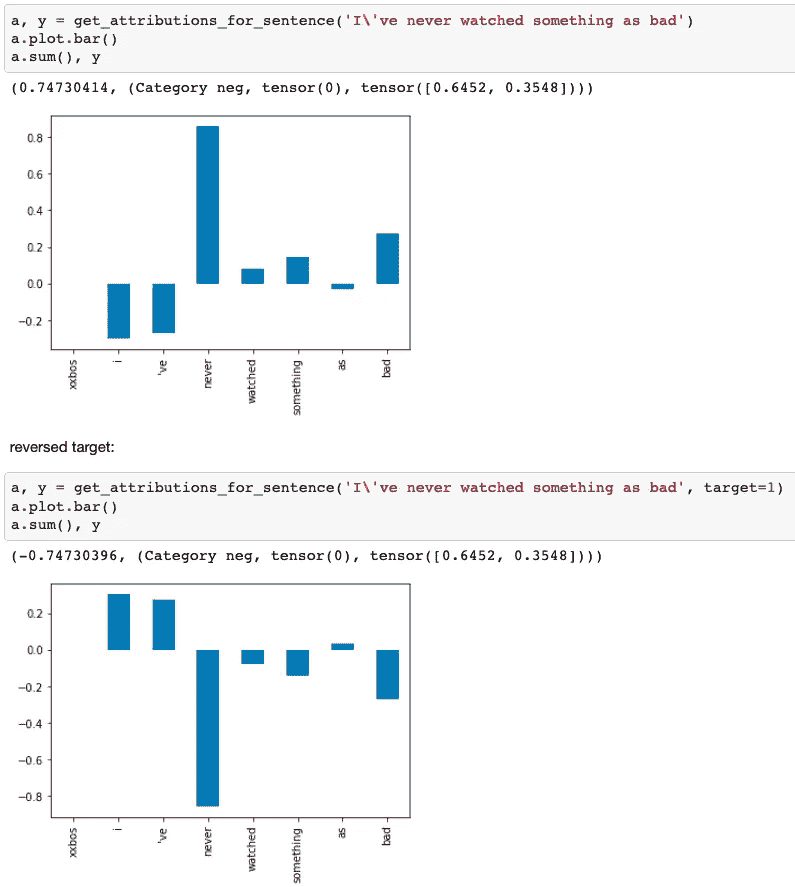
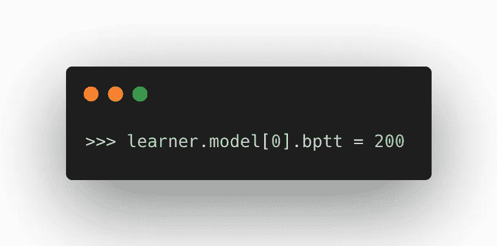

# 打开黑匣子:理解是什么驱动了深度 NLP 模型中的预测

> 原文：<https://towardsdatascience.com/open-the-black-box-understand-what-drives-predictions-in-deep-nlp-models-833f3dc923d0?source=collection_archive---------55----------------------->

## 实用且可重复的演示

***与*** [***约什·卡斯维尔***](https://medium.com/u/c78921cde464?source=post_page-----833f3dc923d0--------------------------------) 一起写的文章

电影 1917 的 IMDB 评论—使用 [Captum](http://captum.ai/) 生成并使用 [ipyvuetify](https://github.com/mariobuikhuizen/ipyvuetify/) 可视化的预测属性

> ***目标*** *-* 通过检查属性
> 理解和感知-检查模型决策制定-可视化令牌属性
> -提供易于使用的代码，以便任何人都可以将其应用到他们的 PyTorch 模型中

深度神经网络为 NLP 做了令人难以置信的事情——每年都有艺术记录被打破，全新的研究和应用子领域蓬勃发展。

毫无疑问，这些模型使研究人员能够创造出令人印象深刻的结果。从艾写诗到在保持意义的同时改变信息的语气。具体怎么做？结果如此令人印象深刻，以至于几乎很容易忘记去问。

匿名作者([来源](https://memeshappen.com/media/created/but-how-did-you-do-it-meme-49244.jpg))

大量的参数、抽象的架构方法、令人印象深刻的出版物以及创新的纯粹步伐可能会分散注意力——跟上深度学习是相当全职的努力。

*   模型是如何做出如此高质量的预测的？
*   他们知道什么？
*   什么 ***不*** 他们知道？
*   他们有多可靠？
*   是什么情况让他们纠结？

这些是很难回答的问题。见证一些领先的研究人员投入时间和工作来提供答案真是太棒了。但是有许多应用该技术的从业者，他们需要理解和可靠地解释它做什么和为什么。

这篇文章的目的是提供一个快速和实用的介绍，一个伟大的，公理化的方法来建模可解释性。我们专注于 NLP，并提供代码示例让您直接进入并获得自己独立的体验。

可解释性是关键。当高级利益相关者或法规遵从性不支持某件事情时，他们怎么会支持呢？这会带来什么新的风险？

机器学习模型是模型架构、用于训练的数据集和训练过程的结果。这意味着每个模型都是不同的，并且您需要用自己的数据集来评估自己创建的模型。

我们将重点关注一种称为**集成梯度**的方法，并使用来自著名的 [fast.ai](https://fast.ai) 深度学习 for coders 课程的预训练评论情感分类器。

照片由[拍摄于](https://unsplash.com/@ugnehenriko?utm_source=medium&utm_medium=referral) [Unsplash](https://unsplash.com?utm_source=medium&utm_medium=referral) 上的

# 路径集成渐变

综合梯度是作者 [Mukund Sundararajan](https://arxiv.org/search/cs?searchtype=author&query=Sundararajan%2C+M) 、 [Ankur Taly](https://arxiv.org/search/cs?searchtype=author&query=Taly%2C+A) 、 [Qiqi Yan](https://arxiv.org/search/cs?searchtype=author&query=Yan%2C+Q) 在 [***中介绍的公理化归因方法，用于深度网络(2017)***](https://arxiv.org/abs/1703.01365) 。

它旨在显示深度神经网络输入的哪些部分影响输出，以及有多强烈。

关键的是，与基线输入相比，属性被计算**为** **。换句话说，它不依赖于离散的直接梯度 wrt。输入的变化，但需要一个假定为中性的参考基线。空白画布与彩绘图像。**

从基线到输入端，通过空间的一条直的、连续的路径。

IG 是一种路径方法

1.  创建从基线(空的和中性的)到输入(我们要解释的信号)的穿过空间的直线路径，
2.  在连续路径上每一步聚集梯度，
3.  计算这些累积梯度的路径积分。

**它的关键优势在于公理起源**。它具有来自数学原理的理想特征。这与源自经验的归因方法(阅读“尝试看看会发生什么”)形成了对比，顺便说一下，这种方法也很棒。

**该方法的两个核心原则:**

*   敏感度—如果基线和输入之间存在差异，属性需要非零。
*   实现不变性——“如果两个网络的输出对于所有输入都相等，则这两个网络在功能上是等价的”

暗示其他期望的自然属性也起作用。其中之一是完整性——属性加起来就是给定输入与基线的模型(网络)输出的确切差异。

我们强烈推荐阅读这篇论文，它清晰明了，附有证据，并且有精心准备的例子。

我们正在使用的版本已经在 Captum 库中实现。

## 嵌入

> 对于 NLP 模型，输入特征是转换成记号的单词、标点符号和其他文本信息(例如，大写字母)。标记是离散的，不适用于这种路径方法。

当记号通过嵌入层进入网络时，它们获得了意义的连续表示。我们需要连接到这一层——文字和数字的界面——来计算有意义的属性。

# AWD-LSTM 建筑

该模型最初由 [***正则化和优化 LSTM 语言模型(2017)***](https://arxiv.org/abs/1708.02182)*中提出，由 [Stephen Merity](https://arxiv.org/search/cs?searchtype=author&query=Merity%2C+S) 、 [Nitish Shirish Keskar](https://arxiv.org/search/cs?searchtype=author&query=Keskar%2C+N+S) 和 [Richard Socher](https://arxiv.org/search/cs?searchtype=author&query=Socher%2C+R) 编写，作为免费的 f [ast.ai 深度学习 for coders 课程](https://course.fast.ai/)的一部分讲授。*

*AWD-LSTM，非常宽泛地说，包括两个阶段:*

1.  *基于 RNN 的编码器*
2.  *一个汇集线性分类器，为编码器的输出增加分类能力。*

*它结合了许多谨慎应用的正则化技术，并且很好地展示了对 LSTMs 内部工作原理的理解。*

*编码器可以在语言建模任务上预先训练，事实上这是由 [fast.ai](http://fast.ai/) 团队教授的方法。该架构做得非常好，同时比各种新的 transformer 模型小得多。这在资源受限的情况下非常有利，事实上 [fast.ai](http://fast.ai/) 值得高度赞扬，因为他们为实现深度学习所做的工作非常有影响力。*

*虽然本文是基于这个特定的模型，但是该方法将适用于任何使用嵌入层的 NLP 架构。*

**

*由[威廉·戴尼奥](https://unsplash.com/@williamdaigneault?utm_source=medium&utm_medium=referral)在 [Unsplash](https://unsplash.com?utm_source=medium&utm_medium=referral) 上拍摄的照片*

# *将 Captum 应用于 AWD-LSTM 情感分类器*

*在这一部分，我们将讨论 3 个主题:*

*   *如何计算属性，从一个预先训练好的 [fast.ai](http://fast.ai/) `Learner`对象开始*
*   *关于选择基线的说明*
*   *处理较长的序列*

# *1.计算属性*

*fast.ai 的 AWD LSTM 实现不能直接与 Captum 一起工作。*

*收集渐变时，我们需要钩入正确的图层。这不会自动发生，我们需要深入模型结构以找到该层。*

## ***提取右侧图层***

**

***看起来好像有重复，但实际上，那些是嵌套模块，原因是**[**fast . ai**](http://fast.ai/)**团队实现的自定义嵌入丢失。***

*另一方面，Captum IG 类需要模型输出一个没有任何附加的预测[。](http://fast.ai/)我们从 AWD-LSTM 模型中得到的是一个元组，其中预测伴随着来自编码器的隐藏状态。此外，我们必须应用 softmax。*

**

*幸运的是，我们可以将模型包装在一个函数中，以我们需要的方式呈现输出。*

## ***应用 IG***

*此时，我们可以自由地创建一个来自 Captum 的`LayerIntegratedGradients`实例。*

**

*调用属性方法的情况如下:*

**

*我们提供:*

*   *标记化的输入文本(有人称之为数字化的)*
*   *对应的基线记号序列*
*   *要解释的目标预测*
*   *用多少步来近似积分*

*我们收到:*

*   *对于每个嵌入向量的每个元素，从基线到给定输入的路径上的积分梯度*

*接下来，让我们对嵌入维度求和并归一化——属性就可以显示了。*

**

*要查看、克隆和运行这个完整的示例，请查看这个[笔记本](https://github.com/MichaMucha/awdlstm-integrated-gradients/blob/master/explaining_predictions_awdlstm.ipynb)。*

# *形象化*

*属性以标准化浮点数的形式出现——每个令牌一个值。在可视化这种格式时，有很多选择。在这一节中，我们为您提供代码，让您快速生成条形图和颜色编码的标记(“显著图”方法)。*

*此处适当可视化的目的是使您能够立即理解预测解释，让您快速、轻松地判断性能。*

*点击图片下方的链接，访问可以在 Jupyter 中运行的代码示例！*

## ***显著图——彩色筹码***

*[***链接到笔记本上***](https://github.com/MichaMucha/awdlstm-integrated-gradients/blob/master/Saliency%20chips.ipynb)*

**

## ***Chart.js 条形图***

*使用 Chart.js 库转换标准化输出的示例可参见[此处](https://github.com/jaycee14/tv_sentiment):*

**

*积极向上的情绪。为了可读性，删除了一些标点符号和描述性符号。(显著性图+条形图)*

## ***matplotlib/pandas 中的条形图***

> *指定目标的一个好处是你可以得到“为什么不呢？”就像“为什么是的？”*

**

# *什么是好的基线？*

*追寻这个问题的答案和计算归属一样有益。*

***基线是模型的预测中性输入，并且是特定于模型的。它描述了你的模型。***

*真的是中立吗？是什么让它动摇了？知道你在生产中使用的模型的那些事情不是很棒吗？*

*您可能希望尝试一些方法来制定基线:*

*   *零嵌入向量序列，长度与输入序列匹配*
*   *单个标记的序列，如<pad>、<bos>、<unk>，中性符号(换行符、点号)，按长度匹配输入序列</unk></bos></pad>*
*   *多重基线——你期望中立的句子的集合*
*   *使用梯度来计算嵌入序列，该序列对于所有潜在的类都是同样不确定的*

*这可以附在你的模型的文档中。积分梯度是一种适用于任何预测函数的方法，因此它甚至可以包括在模型测试中，以寻找不公平的偏差等问题。*

*我们在带有 IMDB 评论的示例[笔记本](https://github.com/MichaMucha/awdlstm-integrated-gradients/blob/master/explaining_predictions_awdlstm.ipynb)中包含了一个示例发现过程。使用< BOS >标记构建基线序列，然后重复一个在类别概率中显示高度模糊的标记。该标记作为关键字参数保存，以便快速试验。*

# *处理较长的句子*

*我们在将 IG 应用于 [fast.ai](http://fast.ai/) 实现时发现的一个早期问题是在较长的输入句子上的失败。使用情况表明，评估超过 70 个标记的句子会产生错误。仔细调试表明，这是由 AWD-LSTM 模型中通过时间反向传播(BPTT)参数的默认设置 70 造成的。*

*`bptt`参数是(由同名算法)用来指定基于 RNN 的语言模型在试图预测下一个单词时将考虑多长时间的序列的值。在这种情况下，在尝试预测下一个标记之前，最多考虑 70 个标记。*

*BPTT 是一种训练 RNNs 的有用算法，它显著地提高了训练速度。但是，在内部将序列分成 70 个更小的序列，这在尝试创建正确大小的遮罩尺寸(甚至是完全空的遮罩)时会导致模型的其他部分出现问题。*

*解决方案是将模型的`bptt`属性设置为高于句子长度，作为将模型设置为评估模式的一部分。*

**

# *结论*

*解释具有数千万个参数的超大型深度神经网络需要新的工具和方法。我们希望这为数据科学家的工具包提供了另一个工具，并有助于形成他们自己的测试方法的基础。*

*一个公理化的解释方法，加上一个简单的、迭代的和可视化的检查过程，使得“了解”ML 模型变得很容易。当数据科学家这样做时，他们可以同时创建测试用例。*

**作者是伦敦* [*fast.ai*](http://fast.ai/) *研究小组成员。我们运行免费的非正式课程迭代，专注于实践现代深度学习和构建项目。如果你想加入我们的小组，请联系我们！**

**Josh 是一名在金融部门工作的高级数据科学家，他对在商业环境中使用 NLP 技术和在滑雪环境中使用 python 感兴趣。**

**Michal 通过他的咨询公司*[*create . ml*](http://create.ml/)*提供数据科学和人工智能项目，他为机构和个人提供数据科学、机器学习和 Python 方面的培训。**