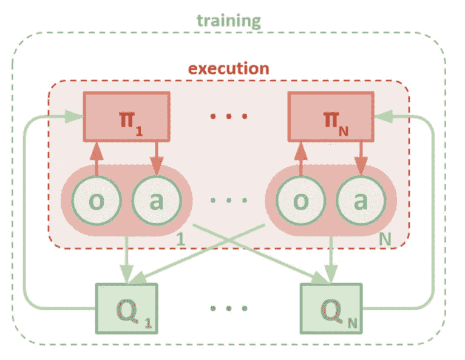
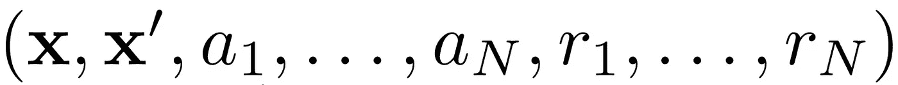
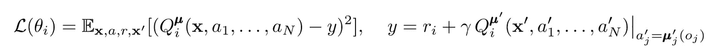
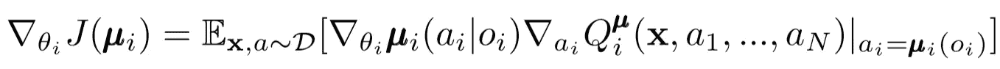
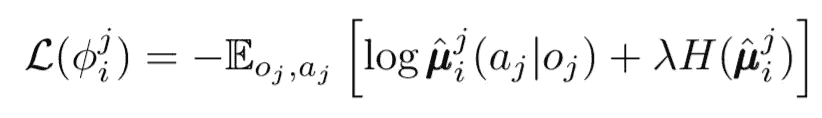
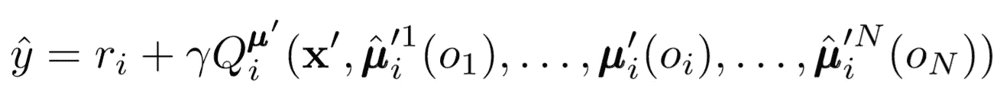
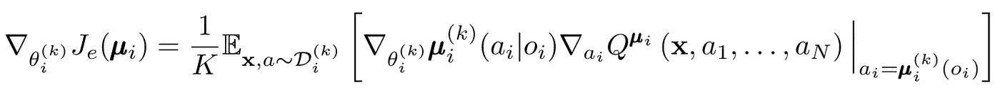
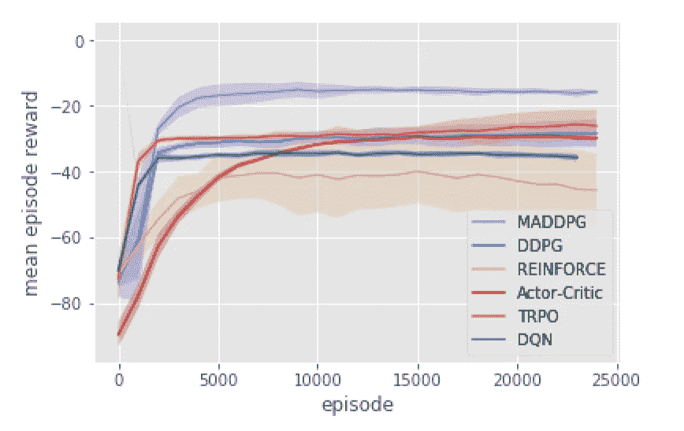

# OpenAI 的 MADDPG 算法

> 原文：<https://towardsdatascience.com/openais-multi-agent-deep-deterministic-policy-gradients-maddpg-9d2dad34c82?source=collection_archive---------24----------------------->

## 多主体 RL 问题的行动者批评方法

萨法尔·萨法罗夫在 [Unsplash](https://unsplash.com?utm_source=medium&utm_medium=referral) 上拍摄的照片

# 新方法

多主体强化学习是一个正在进行的、内容丰富的研究领域。然而，在多智能体环境中天真地应用单智能体算法“使我们陷入困境”由于许多原因，学习变得困难，尤其是由于:

*   独立主体间的非平稳性
*   状态和动作空间的指数增长

研究人员提出了许多方法来减轻这些挑战的影响。这些方法的一个大子集属于“集中计划，分散执行”的范畴

## 集中规划

每个代理只能直接访问本地观测。这些观察可以是许多事情:环境的图像、与地标的相对位置、或者甚至其他代理的相对位置。此外，在学习过程中，所有代理都由一个集中的模块或评论家指导**。**

尽管每个代理只有本地信息和本地策略需要训练，但是有一个实体可以忽略整个代理系统，建议他们如何更新策略。这降低了非平稳性的影响。所有代理都在具有全局信息的模块的帮助下学习。

## 分散执行

然后，在测试期间，集中的模块被移除，只留下代理、它们的策略和本地观察。这减少了增加状态和动作空间的不利影响，因为*联合*策略从未被明确学习。相反，我们希望中央模块已经给出了足够的信息来指导*本地*策略培训，以便一旦测试时间到来，它对于整个系统是最优的。

## OpenAI

OpenAI、加州大学伯克利分校和麦吉尔大学的研究人员介绍了一种使用多代理深度确定性策略梯度的多代理设置的新方法。受其单一代理对手 DDPG 的启发，这种方法使用演员-评论家风格的学习，并显示出有希望的结果。

照片由 [Alina Grubnyak](https://unsplash.com/@alinnnaaaa?utm_source=medium&utm_medium=referral) 在 [Unsplash](https://unsplash.com?utm_source=medium&utm_medium=referral) 上拍摄

# 体系结构

我们假设熟悉单代理版本的 MADDPG:深度确定性政策梯度(DDPG)。快速回顾一下， [Chris Yoon](https://medium.com/u/b24112d01863?source=post_page-----9d2dad34c82--------------------------------) 有一篇精彩的文章对此进行了概述:

 [## 解释了深层确定性策略梯度

### 连续动作空间中的强化学习

towardsdatascience.com](/deep-deterministic-policy-gradients-explained-2d94655a9b7b) 

每个智能体都有一个观察空间和**连续行动空间**。此外，每个代理都有三个组件:

*   一个演员网络，使用*本地*观察来进行*确定性*动作
*   用于训练稳定性的具有相同功能的目标演员网络
*   一个使用联合状态动作对来估计 Q 值的批判网络

随着时间的推移，评论家学习*联合* Q 值函数，它向演员发送适当的 Q 值近似值以帮助训练。我们将在下一节看到对这种交互的更深入的研究。

> 请记住，批评家可以是所有 N 个代理之间的共享网络。换句话说，不是训练 N 个估计相同价值的网络，而是简单地训练一个网络，并用它来帮助所有参与者学习。如果代理是同质的，这同样适用于行动者网络。

MADDPG 架构(Lowe，2018 年)

# 学问

首先，MADDPG 使用经验回放进行高效的政策外培训。在每个时间步长，代理存储以下转换:

体验回放过渡

其中存储了联合状态、下一个联合状态、联合行动以及每个代理收到的奖励。然后，我们从体验回放中抽取一批这样的转换来训练我们的代理。

## 评论家更新

为了更新代理的集中评论，我们使用一步前瞻 TD-error:

其中 mu 表示演员。请记住，这是一个*集中式评论器，*意味着它使用联合信息来更新其参数。主要动机是**知道所有代理采取的行动使得环境静止，即使当策略改变时。**

请注意右侧目标 Q 值的计算。尽管我们从未明确存储*下一个联合动作，*我们在更新期间使用每个代理的*目标角色*来计算这个下一个动作，以帮助训练稳定性。目标参与者的参数会定期更新，以匹配代理的参与者参数。

## 演员更新

类似于单代理 DDPG，我们使用确定性策略梯度来更新每个代理的参与者参数。

其中 mu 表示代理的演员。

让我们稍微深入一下这个更新等式。我们使用一个*中心评论家*来指导我们，相对于*演员的参数*进行渐变。要注意的最重要的事情是，即使演员只有局部的观察和动作，我们在训练期间使用一个集中的评论家，为整个系统提供关于其动作的最优性的信息。这减少了非平稳性的影响，同时将策略学习保持在较低的状态空间！

由[拍摄的桑德韦特林](https://unsplash.com/@sanderweeteling?utm_source=medium&utm_medium=referral)在 [Unsplash](https://unsplash.com?utm_source=medium&utm_medium=referral)

# 政策推理和政策集合

我们可以进一步下放权力。在早期的 critic 更新中，我们假设每个代理*自动*知道其他代理的行动。然而，MADDPG 建议**推断其他代理的政策**以使学习更加独立。实际上，每个代理增加了 *N-1* 个网络来估计每个其他代理的真实策略。我们使用一个概率网络，并最大化输出另一个代理的观察行为的对数概率。

其中我们示出了第 I 个代理的损失函数，用熵正则化器估计第 j 个代理的策略。结果，当我们用我们的预测行为替换代理行为时，我们的 Q 值目标变成了一个稍微不同的值！

那么，我们到底做了什么？我们已经排除了所有特工都知道彼此政策的假设。相反，我们试图训练代理人通过一系列观察来正确预测其他政策。实际上，每个代理都是通过*从环境中提取全局信息*来独立训练的，而不是自动将它放在手边。

照片由[蒂姆·莫斯霍尔德](https://unsplash.com/@timmossholder?utm_source=medium&utm_medium=referral)在 [Unsplash](https://unsplash.com?utm_source=medium&utm_medium=referral) 拍摄

# 政策组合

上述方法有一个大问题。在许多多智能体环境中，特别是在竞争环境中，智能体可以制定策略来适应其他智能体的行为。这使得策略变得脆弱、不稳定，并且通常是次优的。为了弥补这一点，MADDPG 为每个代理训练了一组子策略。在每个时间步，代理随机选择一个子策略来选择操作。然后，执行。

政策梯度略有改变。我们对 *K* 子策略进行平均，使用线性期望值，并通过 Q 值函数传播更新。

# 后退一步

这概括了整个算法！在这一点上，重要的是后退一步，内化我们到底做了什么，并直观地理解它为什么有效。本质上，我们做了以下事情:

*   **为仅使用本地观察的代理定义参与者**。这有助于抑制呈指数增长的状态和动作空间的影响。
*   **为每个使用联合信息的代理定义了一个集中的评论家**。这有助于减少非平稳性的影响，并引导参与者使其对全球系统最优
*   **定义策略推理网络**以评估其他代理的策略。这有助于限制代理的相互依赖性，并消除代理对完美信息的需求。
*   **已定义的策略集合**，以减少过度适应其他代理策略的影响和可能性。

该算法的每个组件都服务于一个特定的委托目的。这就是 MADDPG 成为强大算法的原因:它的各种组件都经过精心设计，可以克服多智能体系统通常会遇到的巨大障碍。接下来，我们来看看算法的性能。

照片由[反推](https://unsplash.com/@retrosupply?utm_source=medium&utm_medium=referral)在[去飞溅](https://unsplash.com?utm_source=medium&utm_medium=referral)上拍摄

# 结果

MADDPG 在许多环境中进行了测试。有关其性能的完整概述，请随意查阅本文[1]。这里我们只讨论*协同通信*任务。

## 环境概述

这里有两个代理:一个说话者和一个听者。在每一次迭代中，听者会得到一个彩色的路标，并得到与路标距离成反比的奖励。这里有个问题:听者只知道它的相对位置和所有地标的颜色。它不知道应该去哪个地标。另一方面，说话者知道这一集的正确地标的颜色。因此，两个代理必须进行通信和协作来解决任务。

## 比较

在这项任务中，该论文将 MADDPG 与最先进的单代理方法进行了对比。通过使用 MADDPG，我们可以看到显著的改进。

还表明，即使策略并不完美，策略推断也能获得与使用真实策略观察相同的成功率。更好的是，收敛速度没有明显放缓。

最后，政策组合显示了有希望的结果。论文[1]测试了竞争环境中的群体效应，并证明了比只有一种策略的代理人明显更好的性能。

# 结束语

就是这样！在这里，我们综述了一种新的方法来解决多代理强化学习问题。当然，在“MARL 保护伞”下有无穷无尽的方法，但是 MADDPG 为解决多代理系统的最大问题的方法提供了一个强有力的起点。

# 参考

[1] R. Lowe，Y. Wu，A. Tamar，J. Harb，P. Abbeel，I. Mordatch，[混合合作竞争环境下的多主体行动者-批评家](https://arxiv.org/pdf/1706.02275.pdf) (2018)。

> 从经典到最新，这里有讨论多代理和单代理强化学习的相关文章:

 [## DeepMind 的虚幻算法解释

### 最佳深度强化学习

towardsdatascience.com](/how-deepminds-unreal-agent-performed-9-times-better-than-experts-on-atari-9c6ee538404e)  [## 分层强化学习:封建网络

### 让电脑看到更大的画面

towardsdatascience.com](/hierarchical-reinforcement-learning-feudal-networks-44e2657526d7)