# OpenCV:用代码掌握计算机视觉基础的完全初学者指南！

> 原文：<https://towardsdatascience.com/opencv-complete-beginners-guide-to-master-the-basics-of-computer-vision-with-code-4a1cd0c687f9?source=collection_archive---------3----------------------->

## [入门](https://towardsdatascience.com/tagged/getting-started)

## 包含代码的教程指南，用于掌握计算机视觉的所有重要概念，以及如何使用 OpenCV 实现它们


图片由 [Gerd Altmann](https://pixabay.com/users/geralt-9301/?utm_source=link-attribution&utm_medium=referral&utm_campaign=image&utm_content=1307227) 从 [Pixabay](https://pixabay.com/?utm_source=link-attribution&utm_medium=referral&utm_campaign=image&utm_content=1307227) 拍摄

计算机视觉可能是人工智能中最有趣、最迷人的概念。计算机视觉是一个跨学科的领域，研究计算机或任何软件如何学习对周围环境可视化的高级理解。获得这个概念透视图后，自动化任务或执行所需的操作会很有用。

对人脑来说显而易见的任务对计算机来说并不那么直观，因为它们需要经过专门的训练才能产生有效的结果。这个过程涉及复杂的步骤，例如从现实世界中获取数据，以合适的格式处理获取的数据，分析处理后的图像，最后教导和训练模型以非常高的精度执行复杂的任务。

为了更直观地理解计算机视觉，让我们考虑一个例子。假设你必须教一台计算机区分各种颜色。考虑一下，你有三个颜色的物体，即红色、蓝色和绿色，你想相应地区分这些颜色。这项工作对于人脑来说是一项极其简单的任务，但对于计算机来说却是一项相当复杂的任务。

上面提到的任务是使用计算机视觉可以执行的最基本的动作之一。我们将了解数字世界中的图像是如何工作的，并试图理解图像以及这些堆叠的层到底是如何工作的。。我们还将深入了解 open-cv 模块的基础知识。最后，我们也将使用这个库实现一些基本级别的项目。因此，事不宜迟，让我们深入了解掌握基本计算机视觉技能所需的所有方面。

# 处理图像:

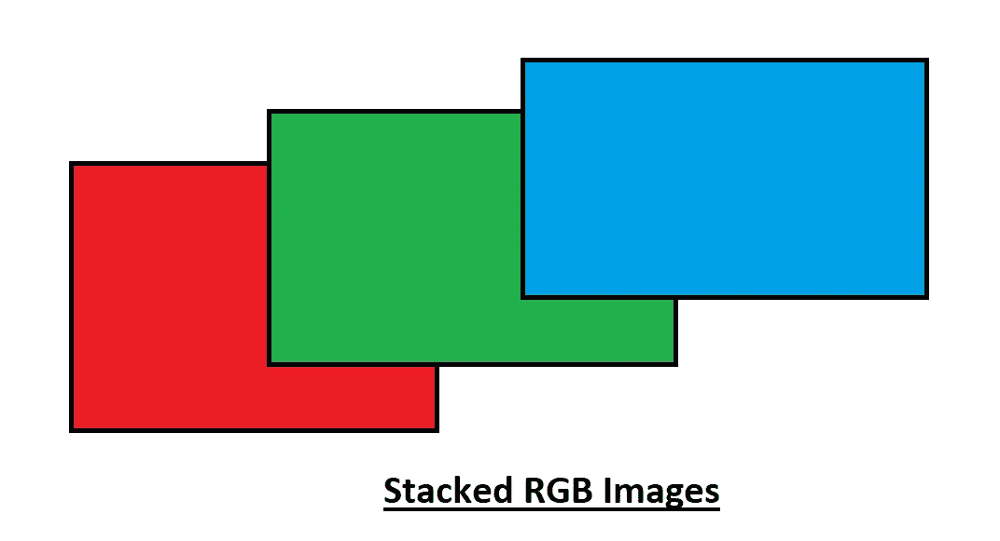

作者截图

这三种颜色，即红色、绿色和蓝色的组合可以用来组合几乎任何其他颜色。将它们以正确的比例混合，我们就可以设计出任何其他想要的颜色。这个概念从几十年前的阴极射线电视就存在了。那么这到底是怎么回事呢？

每种颜色都有一个 8 位的整数值。这意味着这些矩阵的范围可以从 0 到 255。这是因为 2⁸是 256，0–255 由 256 个值组成。这些颜色中的每一种都有一个这个范围的值，因为我们有一个三维图像，我们可以将这些颜色相互叠加。这可能是一个稍微复杂的例子，所以让我们切换到灰度图像，它只包含黑色和白色，这将更容易理解。下面是灰度表示。


作者截图

上面显示的灰度表示应该是更好地理解图像在计算机视觉中如何工作的概念的良好起点。下图显示了当我们从第 0 个标记移动到第 255 个标记时，等级变化是如何开始发生的。经过 256 级的变化，我们从全黑的阴影变成全白的阴影。

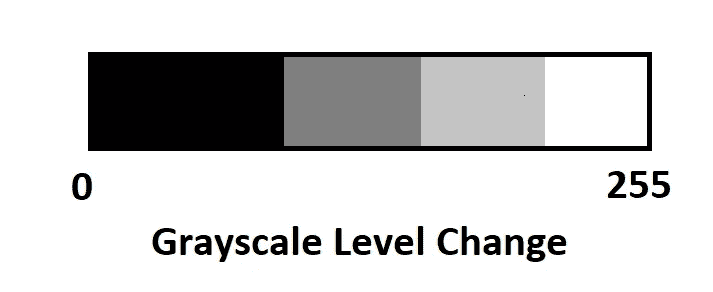

作者截图

这只是一种颜色。灰度图像在 0 处的值为黑色，在 255 处的值为白色。仅使用通道数= 1 的灰度图像模式，我们能够获得如下所示的复杂图像。


作者修改的截图。原始来源[维基](https://en.wikipedia.org/wiki/File:Lenna_(test_image).png)

即使只有一个频道，我们也能够实现如此酷的画面。现在想象一下，你有三种颜色，分别是红色、绿色和蓝色，你把它们一个叠在另一个上面，你就能得到理想的 RGB 颜色的完美图像。让我们看看用三个通道得到的图像，注意到颜色图案的显著增加。


图片来自[维基](https://en.wikipedia.org/wiki/File:Lenna_(test_image).png)

上面的图像是当所有三个通道堆叠在一起。请注意，上面的图片有一个红色、绿色和蓝色的图像，它们都被放置在一个三维矩阵中，这给了我们上面所需的图像。我希望这个解释能让你对如何在计算机视觉中处理图像有一个简单的概念。有了对图像工作原理的简单理解，你就可以相应地理解我们接下来遇到的几个模型。现在，让我们深入 python 中的开放 cv 模块，执行一些计算机视觉任务。

# 使用 OpenCV 和计算机视觉

现在我们已经简单了解了图像是如何工作的，我们可以进一步学习 openCV 库，以及如何利用这个模块来执行计算机视觉任务。OpenCV 模块是迄今为止执行复杂机器学习、深度学习和计算机视觉任务的最佳模块。它为正在构建的模型的分析和性能提供了简单性和高标准。它是一个开源库，可以与 NumPy 等其他 python 模块集成，以完成复杂的实时应用程序。它被广泛的编程语言所支持，并且可以在大多数平台上运行，比如 Windows、Linux 和 MacOS。

opencv 模块的安装过程非常简单。我提到了安装 openCV for python 以及在 anaconda 虚拟环境中构建模块的两种方法。请随意选择最适合你的方法。

## 安装:

openCV 的简单安装过程可以通过在命令提示符下使用以下命令来完成。

```
pip install opencv-python
```

如果您正在使用 anaconda 环境，那么您也可以选择使用下面的安装过程在您的虚拟环境中构建库 opencv 模块。在 anaconda 命令终端中键入下面的命令。

```
conda install -c conda-forge/label/cf202003 opencv
```

一旦我们完成了安装过程，我们可以专注于一些编码。今天，我们将主要讨论计算机视觉的三个基本方面，即:

1.  阅读、书写和查看图像。
2.  用 openCV 绘图
3.  访问网络摄像头

所以，事不宜迟，让我们从这三个基本概念开始。

## 1.读取、写入和查看图像:

我们将连续执行这三项任务。图像的读取、显示和写入是计算机视觉的重要组成部分，因为你必须始终如一地处理图像。除了前面提到的优点之外，opencv 最大的优点是它还允许您访问各种图像格式。因此，我们可以处理所有这些图像格式，而不会面临任何重大问题。在本节的剩余部分，我将使用 lena.png 图像格式。

您可以随意下载相同的图像并跟随。下载图像并将其放在与 python 文件相同的文件夹或目录中。这将有助于我们直接访问图像，而无需不断提及查看各个图像的路径。一旦您将图像放在与 python 文件相同的位置，我们就可以开始访问它们，并使用 opencv 模块提供的各种功能。让我们从相应地导入和读取图像开始。

*   **读取并显示图像:**

在任何计算机视觉任务中，最重要的事情显然是知道如何阅读图像并恰当地显示它。

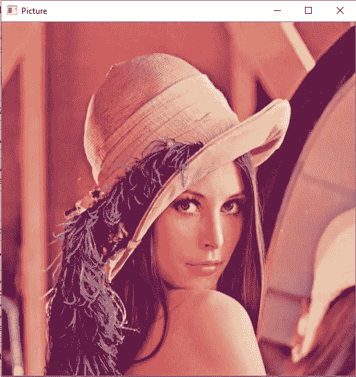

作者截图。原始来源[维基](https://en.wikipedia.org/wiki/File:Lenna_(test_image).png)

这里的第一步是导入 cv2 模块。这是检查安装是否成功的方法。一旦导入了 cv2 模块，运行上面的程序，使用相应的代码行来读取图像。cv2.imread 执行 pillow 模块的类似任务，您可以使用 open()来读取您选择的图像。一旦你阅读了图像，你需要一些方法来显示下面的图像。完成这项任务主要有两种方法。

第一种方法是使用 cv2.imshow()命令，如上面的代码块所示。必须给出 waitKey()命令，以确保在传递 cv2.imshow()命令时打开的 cv2 窗口保持不变。waitKey()中的数字表示图像显示的时间。使用的时间段以毫秒为单位。处理上述图像分析的第二种方法是利用 matplotlib 库模块。使用 matplotlib 库模块中的 pyplot 函数，我们可以使用 plt.imshow()函数直接显示 jupyter 笔记本中的图像，而不必显示使用 cv2.imshow()时出现的 cv2 图形窗口。然而，你必须确保将其转换为 RGB 图像，因为 cv2 出于某种原因使用了 BGR 格式。我将在同一节的后续主题中探讨这个概念。

让我们通过使用 image.shape 属性来分析我们正在处理的图像的主要特征。利用这一点，我们可以计算出图像显示的所有维度和通道数。以下是存储在您的目录中的我们的 lena.png 图像的特征—

```
Height of the Image = 512Width of the Image = 512Number of channels = 3
```

图像的高度和宽度为 512 像素。上面图像的通道数量显然是三个，因为我们主要使用三种颜色，即红色、蓝色和绿色。分析完我们的图像和尺寸后，我们可以进入本节的下一个主题，处理图像的书写。

*   **写图像:**

在这一节中，我们将看看如何编写图像，并将其保存到我们的桌面。我将展示的例子很简单，我将重写我们阅读时的相同图像。不过，你可以随意绘制自己的图像，用文件格式书写，并适当地保存它们。下面显示的代码行准确地展示了如何将图像写入桌面并保存。

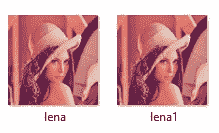

作者截图

以上图片取自我各自的文件夹/目录，你可以看到那里有两张图片。一个是原始的 Lena 图像，另一个是我们编写的图像，即 lena1 图像。您也可以指定您想要写入和保存图像的路径。现在，我们已经了解了如何执行读取图像、显示图像以及写入和保存图像的基本操作，我们可以进入下一个主题，学习如何操作这些图像。

*   **调整图像大小:**

现在，我们已经对计算机视觉的基本操作有了一个简单的了解，让我们继续了解我们可以处理图像的方式。这对于需要有效执行的特定任务非常有用和重要。调整大小功能帮助我们将图像调整到不同的维度。我们可以选择让它变大或变小，这完全取决于用户，也高度依赖于正在执行的任务。下面是代表调整图像大小的代码块。我已经将原始图像的尺寸减半，以得到一个只有原始图像一半大的新图像。

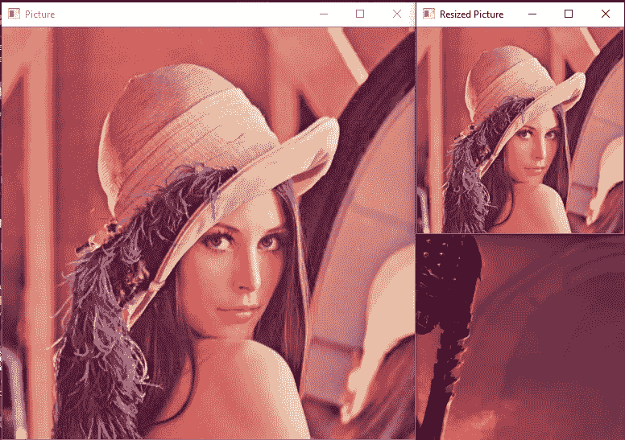

作者修改的截图。原始来源[维基](https://en.wikipedia.org/wiki/File:Lenna_(test_image).png)

上面的图片展示了我们如何成功地处理现有的图片，并将其缩放至更大或更小的维度。这在需要特定尺寸的图像以更有效地执行任务的各种应用中非常有用。这方面的一个例子可以是我们建立的迁移学习深度神经网络模型。

*   **转换成灰度图像:**

处理图像功能的下一个方法是将它们转换成灰度图像。这有时是一个极其重要的步骤，因为它有助于减少正在训练的模型的负荷。与处理 RGB 图像相比，处理灰度图像相对简单。对于不具有用于处理和计算 RGB 图像的有效资源的模型，可以增加计算强度。将 RGB 图像惯例转换为灰度图像惯例的步骤正如下面的代码块中所引用的。cv 模块有一个内置系统，可以有效地将这些彩色图像计算为灰度图像。

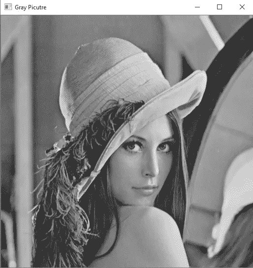

作者修改的截图。原始来源[维基](https://en.wikipedia.org/wiki/File:Lenna_(test_image).png)

OpenCV 使用 BGR，而不是标准的 RGB 约定，所以不要对将 RGB 图像转换为灰度图像时使用的这一特定概念感到困惑。这在前面的章节中也有提及。当您试图在 opencv 读取图像上实现 matplotlib 库时，您可能会将它读取为 BGR 图像格式，而不是 RGB 格式。这个问题可以通过使用计算机视觉模块提供的简单转换颜色操作来解决。

*   **模糊图像:**

在这一部分，我们要研究的最后一个任务是图像的模糊化。模糊图像的主要原因是为了消除影响实际图像性能的外部噪声，并帮助平滑图像。这就像使用基于内核的滤波技术来处理图像中的不均匀性和整体噪声分布。低强度边缘也被去除，这对于更好的处理和提高图像的整体质量是非常有用的。出于安全目的或隐私问题，它也可用于隐藏数据。以下代码块可用于通过 opencv 模块激活模糊操作。类似于灰度和重新缩放操作的模糊操作广泛用于处理各种计算机视觉任务。

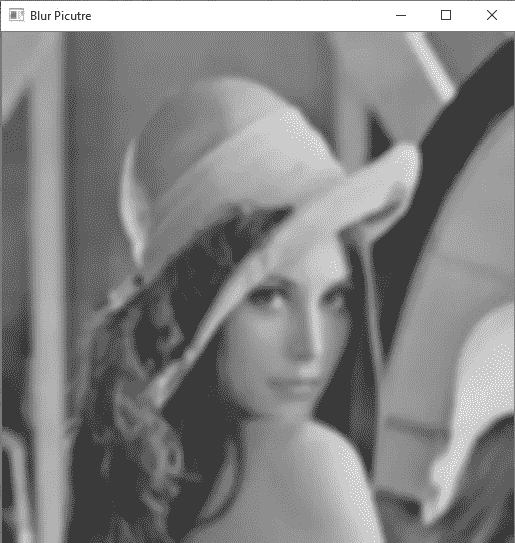

作者修改的截图。原始来源[维基](https://en.wikipedia.org/wiki/File:Lenna_(test_image).png)

高斯模糊是图形软件中广泛使用的效果，通常用于减少图像噪声和细节。在应用于机器学习或深度学习模型之前，它也用作预处理阶段。(19，19)是我用来在现有图片上获得更模糊图像的内核大小。确保只使用奇数个内核，而不是偶数个。您可以更改和编辑(19，19)的内核大小，使其更适合您的目的。

这就完成了处理图像的第一部分。下一步是看看我们如何使用 opencv 模块来绘图。这个概念是掌握计算机视觉的下一个重要课题。让我们继续下一节，学习如何画一些重要的图表。

## 2.使用 OpenCV 绘图:

接下来是一些显而易见的绘图方法，可以使用 opencv 模块来使用和实现。因此，我们将更快地了解每一个，并直观地理解它们。让我们从使用这个库画一条简单的线开始。

*   **画线:**

下面的代码块是用于在 cv2 图形窗口中绘制简单线条的方法。第一个命令是确保显示的整个图像是黑色的，以获得更好的视觉效果。如果更适合你，你可以选择使用传统的白色背景方法。然后，我们定义一条要绘制的线，如下所示:

1.  应该绘制线条的图像。
2.  具有 x 和 y 坐标的起点。
3.  具有 x 和 y 坐标的终点。
4.  在下一个属性中，我们将为线条分配颜色。这里的格式是 BGR。利用我使用的方法，我们可以得到一条蓝线。
5.  属性的最后一个槽定义了线条的粗细。

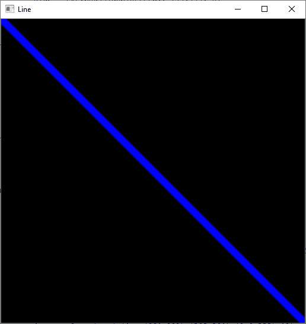

作者截图

上图是一条对角线穿过整个图形窗口的示意图。您可以使用首选的起点和终点坐标来可视化和显示线。

*   **画矩形:**

opencv 模块允许我们执行的下一个操作是绘制矩形。这可以通过使用下面的代码块有效地完成。我不会对此解释太多，因为它与之前提到的画线非常相似。在这里，您还可以定义一个起点和终点，如果定义的点符合要绘制的矩形，那么操作将成功执行。

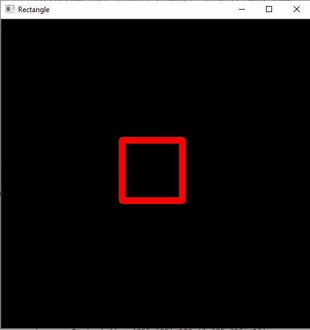

作者截图

上图是在图形窗口中心绘制的一个矩形。您可以在任何方向和维度渲染图像，也可以改变颜色。

*   **画圆:**

opencv 库也允许我们以类似于直线和矩形的方式画一个圆。然而，在画圆的时候有一个关键的区别。您需要给出一个中心位置点，并给出 x 和 y 中心坐标点。在这一步之后，您可以指定圆的半径。圆的半径将决定圆的大小，你也可以根据自己的喜好调整颜色和粗细。下面的代码块显示了如何在 opencv 模块的帮助下绘制一个圆的精确表示。

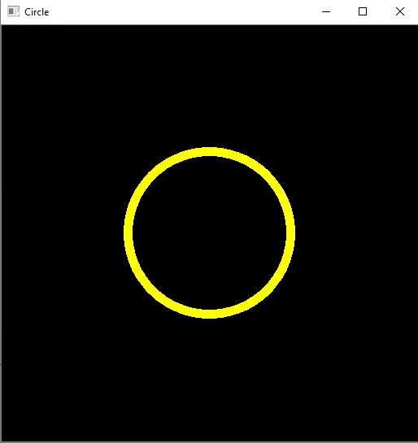

作者截图

从中心绘制的黄色圆的图像。像往常一样，您可以使用各自的坐标、颜色和可变厚度的半径来渲染您的圆。

*   **插入文字:**

我们已经完成了大部分的绘图，但是在某些时候，向显示的图像添加一些文本也变得很重要。幸运的是，opencv 允许我们访问 putText()命令，该命令可用于在图形窗口中添加文本可视化。下面的代码块精确地描述了如何执行这项任务。我在这个代码块中使用了 Hershey Simplex 字体，但是我强烈建议你们查看 opencv 中的各种字体选项，并根据自己的喜好选择一种。选择要以正确的尺寸、字体、所用字体的比例、颜色、粗细和可选线型显示的图像和文本。我还建议观众深入了解各种可用的线型选项。

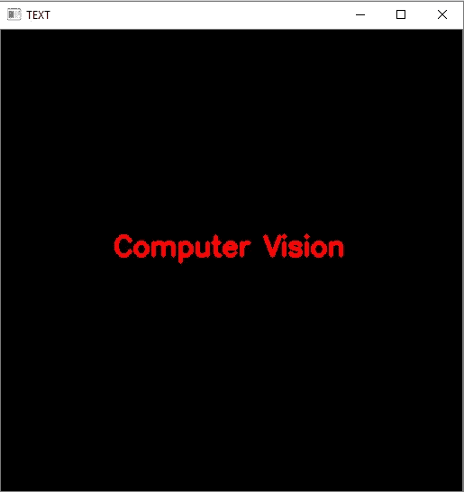

作者截图

图像显示文本**计算机视觉**显示在中心。我为我的文本选择了红色，厚度为 3。请根据您的喜好随意尝试各种选项，并探索更多信息。只有通过探索和实践，才能真正掌握计算机视觉和人工智能。

*   **绘制多边形:**

在进入下一个主题之前，这是我们将在本节中执行的最后一个绘图操作。opencv 模块中的折线函数可以用来绘制任何你想要的东西。从下面的代码块可以看出这个函数的主要方法。我正在下图中构建一个六边形。我已经提到了一个由 6 个点组成的数组，包含了正在设计的六边形的各个位置。一旦数组设计成功，我们有了所有必要的点，我们就把它重新塑造成一个多边形曲线数组。我们确保它是一个封闭的多边形图像，最后定义颜色属性来用它各自的颜色表示多边形。

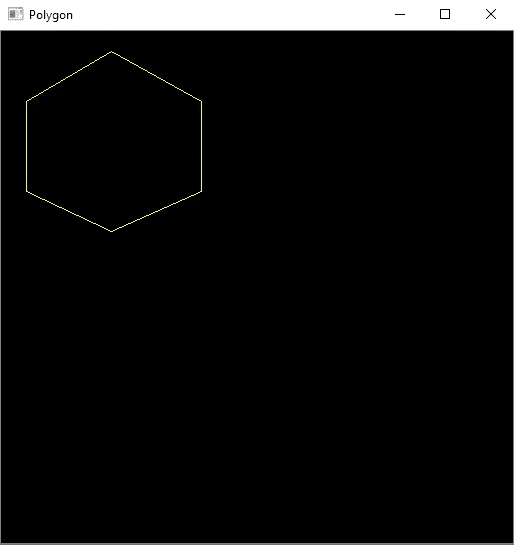

作者截图

以上表示属于六边形。不用说，通过使用折线方法，您可以使用此方法来绘制任何其他多边形大小的图像。我们也可以用这种方法画三角形、正方形和长方形。只要确保你定义了正确的坐标数，并且它们都排列在正确的位置上。

我们已经成功地完成了计算机视觉模块中涉及的所有绘画基础知识。在我们进入最后一个话题之前，我想重申实践和探索是计算机视觉成功的关键。有了这些计算机视觉的基础知识，你可以尝试 opencv 中的绘图功能来设计一些非常酷的东西。如果你对这个项目感兴趣，那么请给我发你设计的截图。我很想看看你们设计的东西。

让我们转到本节的最后一个主题，我们将讨论如何访问网络摄像头的所有复杂细节，这对计算实时和现实生活场景非常有用。因此，让我们进入下一部分，更详细地理解这个主题。

## 3.访问网络摄像头:

我们已经到了本节的最后一部分，即访问您的网络摄像头进行实时以及实时图像或视频分析。这种访问对于实时对象检测、人脸识别、视频监控以及许多其他应用非常有用。Opencv 允许您访问外部摄像机，并为您提供选择您想要选择的摄像机的选项。与我们查看图像的方式相比，同样的选项也可以用于以类似的方式查看图像。访问您的网络摄像头的步骤可以通过以下方式完成:

让我们从概念上详细理解上面代码块中的每一行。cap 变量用于捕获和访问网络摄像头。当网络摄像头捕捉视频存在时，我们将在此过程中显示的外部 cv2 图形窗口中逐个图像地读取相应的视频图像。我们将给出前面章节中指定的 waitKey 命令。如果在视频运行期间按下按钮“q ”,则程序会立即退出图形窗口，无法执行其他操作。cap.release()命令用于释放网络摄像头，而 destroy all windows 命令用于退出并销毁基于 cv2 的图形窗口。

如果你想播放文件夹中保存的视频，这也很容易做到。如果您选择指定视频文件的播放位置，而不是指定要使用的外部网络摄像头选项，那么您将能够获得类似的结果。您可以成功播放您想要的视频。只是为了确保我们都在同一页上，您不会被本段中的陈述所混淆，请遵循下面的代码行，以便执行和播放您选择的视频。

```
Video = cv2.VideoCapture(“your path”) # Read The Video
```

至此我们已经结束了处理计算机视觉问题语句的基本概念，以及如何有效地使用 opencv 模块来成功地实现期望的任务。然而，这并不是结束，因为我们仍然需要知道这些知识将如何帮助我们解决更复杂的计算机任务，以及我们需要执行的这些任务到底是什么。为了对此有一个更具战略性的理解，让我们在本文的下一部分详细看看计算机视觉的应用。


照片由来自[佩克斯](https://www.pexels.com/photo/adult-african-american-woman-business-city-1181341/?utm_content=attributionCopyText&utm_medium=referral&utm_source=pexels)的[克里斯蒂娜·莫里洛](https://www.pexels.com/@divinetechygirl?utm_content=attributionCopyText&utm_medium=referral&utm_source=pexels)拍摄

# 计算机视觉的应用

除了本文前面讨论的所有内容之外，还有数十亿个项目可供您选择。我将提到其中的几个项目和它们背后的方法论，如果你觉得舒服的话，你也可以尝试一下。在这一节的最后，我还会给你们提供一个有用的链接来帮助你们，并指导你们完成五个计算机视觉项目。让我们深入研究计算机视觉的应用。

1.  人脸检测和人脸识别项目是一些最受欢迎的计算机视觉项目。人脸识别是对人脸以及用户授权姓名的程序性识别。人脸检测是一个更简单的任务，可以被认为是一个初级水平的项目。人脸检测是人脸识别的必要步骤之一。人脸检测是一种将人脸与身体的其他部分和背景区分开的方法，而人脸识别执行包围人脸并识别特定人是谁的任务。
2.  对象检测和对象跟踪是计算机视觉项目的其他流行选择。对象检测是一种计算机视觉技术，它允许我们在图像或视频中识别和定位对象。通过这种识别和定位，可以使用对象检测来计数场景中的对象，并确定和跟踪它们的精确位置，同时准确标记它们。对象跟踪是识别特定对象并在整个视频中或实时跟踪已经识别的对象的任务。
3.  图像分割任务对于协调和可视化周围环境以及训练程序执行特定任务非常有用。经过训练的模型能够在基于内容的图像检索、交通控制和分析系统、视频监控和生物医学领域等任务上取得良好的结果，用于不同的预定目的。图像分割的任务是对特定帧或图像中具有固定名称的每个对象进行分类，并根据颜色、图案或某些固定特征对它们进行相应的计算。
4.  光学字符识别——这是另一个最适合初学者的基础项目。光学字符识别是通过使用电子或机械设备将二维文本数据转换成机器编码的文本形式。你使用计算机视觉来阅读图像或文本文件。读取图像后，使用 python 的 pytesseract 模块读取图像或 PDF 中的文本数据，然后将它们转换为可以在 python 中显示的数据字符串。光学字符识别在数据输入、帐单细节、OCR 接收器和 OCR 客户端、任务等方面有各种应用。，以及许多其他使用案例。
5.  情绪或手势识别是另一个令人惊叹的计算机视觉应用，它使用深度学习技术和计算机视觉来执行高度复杂的任务，如情绪和手势识别。根据相对于特定面部的情绪显示的情绪来检测和分类各种面部。这些模型不仅对情绪进行分类，而且还相应地对所识别的手指的不同手势进行检测和分类。在区分人的情绪或姿势之后，由训练的模型分别提供对人的情绪或姿势的准确预测的声音响应。这是一项稍微复杂的任务，需要许多步骤才能成功完成。关于如何从头开始开发这些项目的更多链接，请参考结论部分。你可以按照我的指导，自己从头开始实现这些项目。

如果你有兴趣更深入地研究计算机视觉这个令人惊奇的课题，想从概念上更好地理解与之相关的所有方面，那么从事各种各样的项目是一个不错的选择。我强烈推荐你们看看下面链接中我以前的一篇文章，看看你们可以尝试的五个很棒的计算机视觉项目。它们都有参考链接来帮助你，指导你努力完成你选择的项目。

[](/5-awesome-computer-vision-project-ideas-with-python-machine-learning-and-deep-learning-721425fa7905) [## 5 个关于 Python、机器学习和深度学习的超棒的计算机视觉项目创意！

### 讨论 5 个很酷的计算机视觉项目，学习新的技能，增强你的简历

towardsdatascience.com](/5-awesome-computer-vision-project-ideas-with-python-machine-learning-and-deep-learning-721425fa7905) 

照片由 [Cookie 在](https://unsplash.com/@cookiethepom?utm_source=medium&utm_medium=referral) [Unsplash](https://unsplash.com?utm_source=medium&utm_medium=referral) 上的 Pom 拍摄

# 结论:

计算机视觉教程到此结束。我希望这个指南对你们所有人有所帮助，帮助你们巩固基础知识，理解这个难以置信的跨学科领域的重要方面。理解事物的内部工作方式在计算机视觉中至关重要，因为这有助于你弄清楚计算机究竟是如何分析和处理数据的，以及欣赏其方法背后的美。

我希望这些带有详细解释的例子能帮助你们更直观地理解 open-cv 的概念。如果您有任何疑问、问题或与此相关的问题，请随时打电话给我，让我知道您不明白的地方。我会尽力给你解释，帮你从概念上解决。在下一篇教程中，我将详细介绍人脸检测，以及它是如何从头开始工作的。敬请关注！

对于一些更棒的计算机视觉项目，请查看下面的链接。这些包括面部识别、情感和手势检测。我将在未来发布更多的计算机视觉项目，所以请关注即将到来的文章。

[](/smart-face-lock-system-6c5a77aa5d30) [## 智能面部锁定系统

### 建立高精度人脸识别模型

towardsdatascience.com](/smart-face-lock-system-6c5a77aa5d30) [](/human-emotion-and-gesture-detector-using-deep-learning-part-1-d0023008d0eb) [## 使用深度学习的人类情感和手势检测器:第 1 部分

### 了解如何从零开始构建具有深度学习的人类情感和手势检测器。

towardsdatascience.com](/human-emotion-and-gesture-detector-using-deep-learning-part-1-d0023008d0eb) [](/human-emotion-and-gesture-detector-using-deep-learning-part-2-471724f7a023) [## 使用深度学习的人类情感和手势检测器:第 2 部分

### 深入探究人类情感和手势识别

towardsdatascience.com](/human-emotion-and-gesture-detector-using-deep-learning-part-2-471724f7a023) 

从下面的链接查看我最近的两篇表现良好的文章:

[](/lost-in-a-dense-forest-intuition-on-sparsity-in-machine-learning-with-simple-code-2b44ea7b07b0) [## 迷失在密林中:用简单的代码对机器学习中稀疏性的直觉！

### 为什么 ML 需要稀疏性？理解稀疏性的核心概念。

towardsdatascience.com](/lost-in-a-dense-forest-intuition-on-sparsity-in-machine-learning-with-simple-code-2b44ea7b07b0) [](/neural-networks-made-fun-with-tensorflow-playground-4e681a0c4529) [## 神经网络拿 TensorFlow 游乐场开玩笑！

### 使用 TensorFlow Playground 探索神经网络并从中获得乐趣

towardsdatascience.com](/neural-networks-made-fun-with-tensorflow-playground-4e681a0c4529) 

谢谢你们坚持到最后。我希望你们都喜欢这本书，并学习了计算机视觉的基础知识。再次感谢你们，我希望你们都有美好的一天！