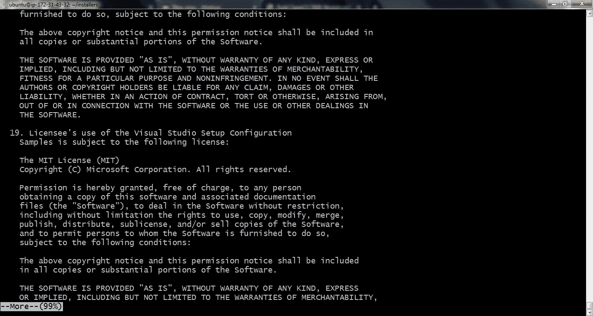
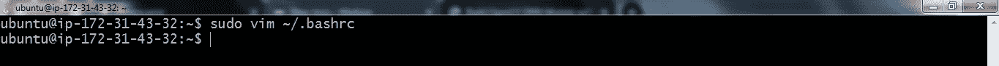
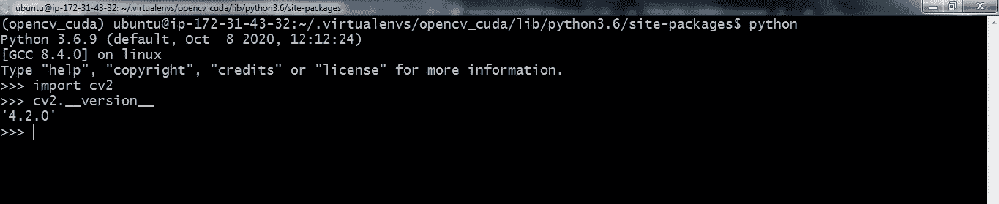
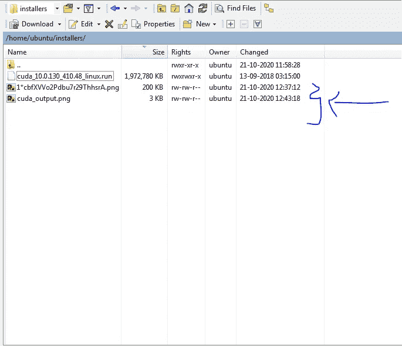

# OpenCV + CUDA + AWS EC2 +(不再流泪)

> 原文：<https://towardsdatascience.com/opencv-cuda-aws-ec2-no-more-tears-60af2b751c46?source=collection_archive---------3----------------------->

## 将 OpenCV 库与 CUDA 驱动程序绑定以支持对 OpenCV 代码进行 GPU 处理的逐步说明。


克里斯蒂安·威迪格在 [Unsplash](https://unsplash.com?utm_source=medium&utm_medium=referral) 上拍摄的照片

默认情况下，不需要为 GPU 处理启用 OpenCV 和 CUDA，但在生产过程中，当您需要对图像/视频文件进行大量 OpenCV 操作时，我们可以利用 OpenCV CUDA 库来使这些操作在 GPU 而不是 CPU 上运行，这样可以节省大量时间。

据说连接 OpenCV 库使其与 CUDA 兼容并不容易，我不得不经历一周的痛苦过程来正确地建立连接，这也是一个既费时又费钱的过程。所以这次我想记录下整个过程，为了我的未来，也为了别人。

为了进行演示，我在 AWS 中租用了一个 EC2 实例和一个 p3.8xlarge 实例，它有 4 个 Nvidia GPUs。


来源— [AWS EC2 定价](https://aws.amazon.com/ec2/pricing/on-demand/)

因此，如果你在第一次启动 EC2 实例时需要任何帮助，你可以参考我以前关于在 AWS 中逐步创建 EC2 实例的文章[，并通过 Putty & WinSCP](https://medium.com/towards-artificial-intelligence/step-by-step-creation-of-an-ec2-instance-in-aws-and-access-it-via-putty-winscp-a6c28f2022be) 访问它，在此过程中选择你需要的 GPU 实例。

现在，在进入实例之后，在我们进入流程之前，我们需要安装许多包来准备好环境。

> 注意:我已经合并了我从头到尾运行的所有命令，并将它们添加在底部。如果你更好奇的话，可以在这个 [**链接**](https://gist.github.com/bala-codes/a3d5d79d3066ed39dfb6eabc587cdd7b) 中找到它们，然后跟着一起走。

在您的实例上一个接一个地运行下面的命令，并且我已经证实了截图，将输出与我的进行比较。

> 下文使用的所有截图均来源于作者。

# **目录:**

1.  [安装 OpenCV 依赖、Nvidia CUDA 驱动、CUDA 工具包](#361e)
2.  [下载 OpenCV 源代码](#48e0)
3.  [配置 Python 虚拟环境](#9a44)
4.  [确定你的 CUDA 架构版本](#2438)
5.  [配置支持 Nvidia GPU 的 OpenCV](#c388)
6.  [编译 OpenCV 并创建一个符号链接](#8486)
7.  [参考文献](#2716)
8.  [命令历史](#66e7)

# 第一步:安装 OpenCV 依赖，Nvidia CUDA 驱动，CUDA 工具包。

```
sudo apt-get update
sudo apt-get upgrade
sudo apt-get install build-essential cmake unzip pkg-config
sudo apt-get install gcc-6 g++-6
sudo apt-get install screen
sudo apt-get install libxmu-dev libxi-dev libglu1-mesa libglu1-mesa-devsudo apt-get install libjpeg-dev libpng-dev libtiff-dev
sudo apt-get install libavcodec-dev libavformat-dev libswscale-dev libv4l-devsudo apt-get install libxvidcore-dev libx264-dev
sudo apt-get install libopenblas-dev libatlas-base-dev liblapack-dev gfortransudo apt-get install libhdf5-serial-dev
sudo apt-get install python3-dev python3-tk python-imaging-tk
sudo apt-get install libgtk-3-dev
sudo add-apt-repository ppa:graphics-drivers/ppa
sudo apt-get update
sudo apt-get install nvidia-driver-418
sudo reboot
```


安装完成后，重新启动系统。一旦你的系统启动，键入`nvidia-smi`，它应该会给出类似的输出，正如你在下面的代码片段中看到的，我用 4 个特斯拉 v100 GPUs 供电。


```
mkdir installers
cd installers/
wget [https://developer.nvidia.com/compute/cuda/10.0/Prod/local_installers/cuda_10.0.130_410.48_linux](https://developer.nvidia.com/compute/cuda/10.0/Prod/local_installers/cuda_10.0.130_410.48_linux)mv cuda_10.0.130_410.48_linux cuda_10.0.130_410.48_linux.run
chmod +x cuda_10.0.130_410.48_linux.run
sudo ./cuda_10.0.130_410.48_linux.run --override
```



这是所有步骤中最重要的一步，我在网上找到的大多数文章中都没有详细说明，并且花了一天多的时间来解决这个难题。

在您阅读并接受 EULA 协议后，有一些是(y)/否(n)命令，并根据下面的回答填写。


现在，在你成功地安装之后，你将被提供需要被添加到 bashrc 文件的路径，并且以后来源它。


```
sudo vim ~/.bashrc
source ~/.bashrc
nvcc -V
```


记下#NVIDIA CUDA Toolkit 下的命令，并根据您在之前的命令中获得的路径添加它们。

```
# NVIDIA CUDA Toolkit
export PATH=/usr/local/cuda-10.0/bin:$PATH
export LD_LIBRARY_PATH=/usr/local/cuda-10.0/lib64:$LD_LIBRARY_PATH
```


现在找到它，保存更改并在以后安装一些依赖项。


```
sudo apt-get update
sudo apt-get upgrade
sudo apt-get install build-essential cmake unzip pkg-config
sudo apt-get install libjpeg-dev libpng-dev libtiff-dev
sudo apt-get install libavcodec-dev libavformat-dev libswscale-dev
sudo apt-get install libgtk-3-dev
```


# 第 2 步:下载 OpenCV 源代码

现在我们需要下载 OpenCV & OpenCV contrib 并手动运行它们的安装文件。这里我使用的是 OpenCV 包的 4.2.0 版本。

```
cd ~
wget -O opencv_contrib.zip [https://github.com/opencv/opencv_contrib/archive/4.2.0.zip](https://github.com/opencv/opencv_contrib/archive/4.2.0.zip)wget -O opencv.zip [https://github.com/opencv/opencv/archive/4.2.0.zip](https://github.com/opencv/opencv/archive/4.2.0.zip)unzip opencv.zip
unzip opencv_contrib.zip
mv opencv-4.2.0 opencv
mv opencv_contrib-4.2.0 opencv_contrib
```


# 步骤 3:配置 Python 虚拟环境

在这里，我们使用一个虚拟环境，并将在此后的环境中构建 OpenCV CUDA 的绑定。

在这一部分，我将使用`virtualenv`和`virtualenvwrapper`作为虚拟环境。

```
wget [https://bootstrap.pypa.io/get-pip.py](https://bootstrap.pypa.io/get-pip.py)
sudo python3 get-pip.py
sudo pip install virtualenv virtualenvwrapper
sudo rm -rf ~/get-pip.py ~/.cache/pip
```


安装完这些包后，您需要在`~/.bashrc`中添加这些行，以便让 bash 在每次终端启动时加载 virtualenv 和 virtualenvwrapper:

```
sudo vim ~/.bashrc
```



```
# Add them inside bashrc# virtualenv and virtualenv wrapper
export WORKON_HOME=$HOME/.virtualenvs
export VIRTUALENVWRAPPER_PYTHON=/usr/bin/python3
source /usr/local/bin/virtualenvwrapper.sh
```


现在在添加之后，来源它。现在跑`source ~/.bashrc`


```
# Create a virtual environment. The first step is to create a virtual environment:mkvirtualenv opencv_cuda -p python3
pip install numpy
nvidia-smicd ~/opencv
mkdir build
cd build
```


在这里，我在虚拟环境中安装 Numpy 库。


# 步骤 4:确定您的 CUDA 架构版本

要找到架构，运行`nvidia-smi`并记下您被分配到的 Nvidia GPU 的名称。对我来说，我有特斯拉 v100

作为一名经验丰富的 CUDA 程序员，确定 CUDA 架构版本是一项必需的实践，因为它让编译器在您的 GPU 上生成更高效的代码。此外，设置不包括 Nvidia GPU 架构的架构参数会让您的程序在执行时无法工作。

我们可以用`nvidia-smi`算出你的 Nvidia GPU 是什么型号:


获得 Nvidia GPU 模型后，您可以使用此页面找到您的 CUDA 架构:

> [https://developer.nvidia.com/cuda-gpus](https://developer.nvidia.com/cuda-gpus)

向下滚动到“您的 GPU 计算能力”段落。由于我使用的是 Nvidia Tesla v100，我将点击“[支持 CUDA 的 Tesla 产品](https://developer.nvidia.com/cuda-gpus#collapseOne)”部分。

检查后，我意识到我的 Nvidia GPU 架构版本是`7.0`。提醒一下，您的 GPU 架构版本可能会有所不同。

一旦你得到了 GPU 架构版本，*请记下它*，因为我们将在下一步使用它。


来源— [Nvidia 的开发者网站](https://developer.nvidia.com/cuda-gpus)

# 步骤 5:用 Nvidia GPU 支持配置 OpenCV

OpenCV 使用 CMake 来配置和生成构建。首先，激活`opencv_cuda`虚拟环境，如果之前没有启用的话。

同样在 CMake 命令中，在参数 CUDA_ARCH_BIN=x.x 中，将它替换为您在上一步中获得的计算容量版本。这里我用的是 7.0，请换成你的版本。

```
cmake -D CMAKE_BUILD_TYPE=RELEASE -D CMAKE_INSTALL_PREFIX=/usr/local -D INSTALL_PYTHON_EXAMPLES=ON -D INSTALL_C_EXAMPLES=OFF -D OPENCV_ENABLE_NONFREE=ON -D WITH_CUDA=ON -D WITH_CUDNN=OFF -D OPENCV_DNN_CUDA=ON -D ENABLE_FAST_MATH=1 -D CUDA_FAST_MATH=1 -D CUDA_ARCH_BIN=7.0 -D WITH_CUBLAS=1 -D OPENCV_EXTRA_MODULES_PATH=~/opencv_contrib/modules -D HAVE_opencv_python3=ON -D PYTHON_EXECUTABLE=~/.virtualenvs/opencv_cuda/bin/python -D BUILD_EXAMPLES=ON ..
```


还有一点，检查 CMake 输出的`Python 3`部分的`install path`。我们将使用`install path`它。**所以请留下**T5 的备注。


# 步骤 6:编译 OpenCV 并创建一个符号链接

如果`cmake`没有错误地退出，那么用下面的命令编译 OpenCV。

需要注意的是，在运行下一个命令之前，最少需要 45 分钟，最多需要 5 个小时，请确保 ssh 连接没有超时，如果您通过 putty 访问它，请每隔 15 分钟按一次 Enter 键。

```
make -j$(nproc)
sudo make install
sudo ldconfig
```


```
ls -l /usr/local/lib/python3.6/site-packages/cv2/python-3.6cd ~/.virtualenvs/opencv_cuda/lib/python3.6/site-packages/ ##Next, create a sym-link to your virtual environment: ##ln -s /usr/local/lib/python3.6/site-packages/cv2/python-3.6/cv2.cpython-36m-x86_64-linux-gnu.so cv2.so
```

然后，我们将创建一个符号链接，将 OpenCV Python 绑定到您的 Python 虚拟环境中。如前一步所述，我们知道`install path`就是`/usr/local/lib/python3.6/site-packages/cv2/python-3.6`。

要确认，您可以使用`ls`命令:

您可以看到我的 OpenCV Python 绑定的名称是`cv2.cpython-36m-x86_64-linux-gnu.so`(您自己构建的绑定可能有一个类似的名称)。


接下来，创建一个指向虚拟环境的符号链接:


记得花点时间检查你的文件路径，因为如果 OpenCV 绑定的路径不正确的话，`ln`会让*无声地失败*。

# 验证安装— OpenCV Python



运行 OpenCV + CUDA 启用的代码，而不是 OpenCV 代码，这一次，它似乎工作。

因此，大多数 OpenCV 函数都可以用 CUDA 包装，要查看可用的函数，请在 Python IDE 中运行命令。

```
## To check the supported methods for opencv in CUDA ##
import cv2print(dir(cv2.cuda))
```


检查它在与我的实例连接的 WinSCP 中的相应输出。



OpenCV CUDA 启用代码的输出，其中我调整了颜色通道的大小并将其转换为灰色。


因此，当您下次登录到您的实例并希望进入 OpenCV CUDA 环境时，请使用该命令。

这里我的虚拟环境的名字是“opencv_cuda”。

```
source ~/.virtualenvs/opencv_cuda/bin/activate
```


恭喜你，如果你已经在文章和实现中达到了这一点，现在你可以在 OpenCV CUDA 支持下部署生产级应用了。

# 参考

## 如果没有我在网上找到的这些惊人的参考资料，这对我来说是不可能的。

要了解更多细节，你可以访问其中任何一个。

[https://github . com/spmallick/learnopencv/tree/master/Getting-Started-OpenCV-CUDA-Module](https://github.com/spmallick/learnopencv/tree/master/Getting-Started-OpenCV-CUDA-Module)

[https://github . com/codecentric/computer-vision-drone/blob/master/_ posts/2017-02-18-install-opencv-on-AWS-with-cuda . MD](https://github.com/codecentric/computer-vision-drone/blob/master/_posts/2017-02-18-install-opencv-on-aws-with-cuda.md)

[https://gist . github . com/Raul qf/f42c 718 a 658 cddc 16 f 9 df 07 ECC 627 be 7](https://gist.github.com/raulqf/f42c718a658cddc16f9df07ecc627be7)

[https://developer.nvidia.com/cuda-10.2-download-archive?target _ OS = Linux&target _ arch = x86 _ 64&target _ distro = Ubuntu&target _ version = 1804&target _ type = runfile local](https://developer.nvidia.com/cuda-10.2-download-archive?target_os=Linux&target_arch=x86_64&target_distro=Ubuntu&target_version=1804&target_type=runfilelocal)

[https://medium . com/@ sb . jaduniv/how-to-install-opencv-4-2-0-with-cuda-10-1-on-Ubuntu-20-04-lts-focal-fossa-BDC 034109 df3](https://medium.com/@sb.jaduniv/how-to-install-opencv-4-2-0-with-cuda-10-1-on-ubuntu-20-04-lts-focal-fossa-bdc034109df3)

[https://medium.com/@Linh.NG/installing-opencv-3-3-0-on-Ubuntu-16-04-lts-7db 376 f 93961](https://medium.com/@Linh.NG/installing-opencv-3-3-0-on-ubuntu-16-04-lts-7db376f93961)

[https://cuda-Chen . github . io/image % 20 processing/programming/2020/02/22/build-opencv-dnn-module-with-NVIDIA-GPU-support-on-Ubuntu-1804 . html](https://cuda-chen.github.io/image%20processing/programming/2020/02/22/build-opencv-dnn-module-with-nvidia-gpu-support-on-ubuntu-1804.html)

[https://www . pyimagesearch . com/2020/02/03/how-to-use-open CVS-dnn-module-with-NVIDIA-GPU-cuda-and-cud nn/](https://www.pyimagesearch.com/2020/02/03/how-to-use-opencvs-dnn-module-with-nvidia-gpus-cuda-and-cudnn/)

[](https://www.pyimagesearch.com/2016/07/11/compiling-opencv-with-cuda-support/) [## 使用 CUDA 支持编译 OpenCV-PyImageSearch

### light，这样您就在支持 GPU 的系统上安装了 NVIDIA CUDA Toolkit 和 cuDNN 库。接下来呢？让我们…

www.pyimagesearch.com](https://www.pyimagesearch.com/2016/07/11/compiling-opencv-with-cuda-support/) 

# 命令的历史记录:

正如我所说的，我正在添加合并的代码，我已经运行了很长时间，你可以按照上面相应的截图进行操作。

最后，作为一个预防措施，它花费了我 48 美元来制作这个帖子，还花费了我以前的实例破损的杂项费用，因为我以前由于不正确的绑定不得不终止多个实例。

确保根据您的使用情况使用相应的 GPU 实例。

在那之前，下次见。

**文章作者:**

**BALAKRISHNAKUMAR V**