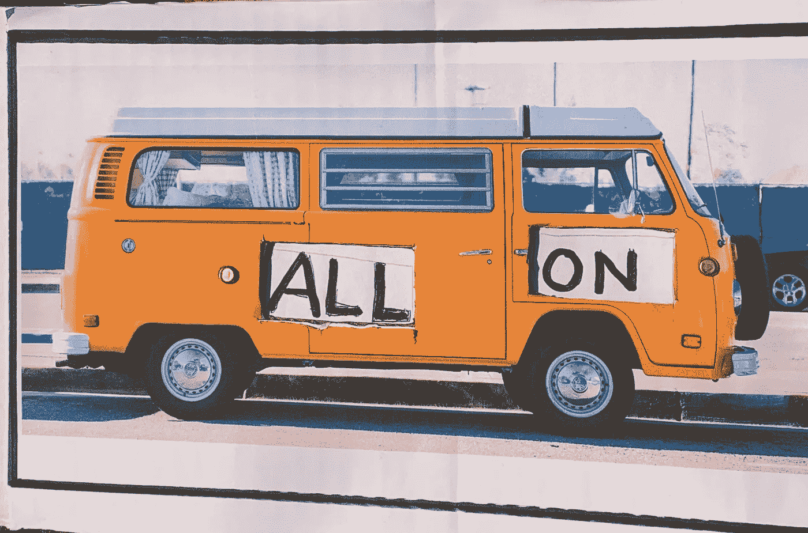
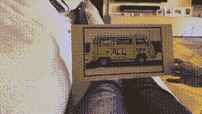
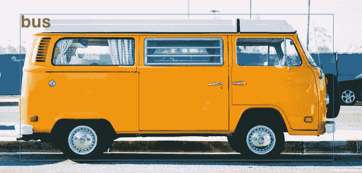
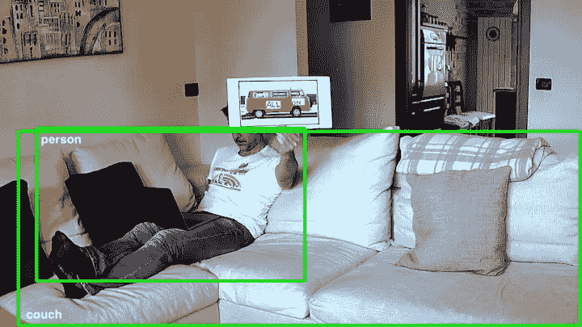
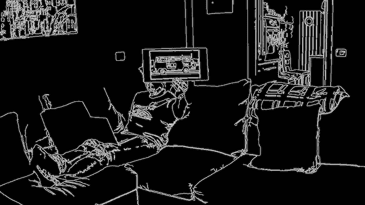
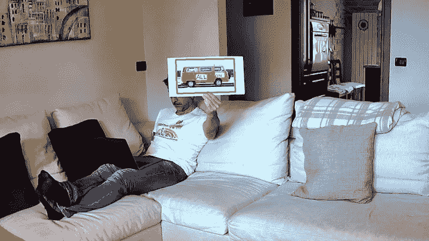
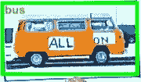
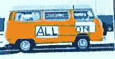

# OpenCV & AWS Rekognition:把一块纸板变成物联网智能开关

> 原文：<https://towardsdatascience.com/opencv-rekognition-an-iot-smart-switch-with-a-piece-of-cardboard-3f3a64df18d6?source=collection_archive---------29----------------------->



我的物联网交换机

你有没有试过让 Alexa 打开被一大群尖叫的孩子包围的客厅的灯？难吗？那么在深夜，你会冒着吵醒孩子的风险，让 Alexa 关掉经常被遗忘的浴室灯吗？没错:你得从沙发上站起来。

在这些和许多其他情况下，最合适和可持续的智能开关是一张漂亮的纸板！你不相信吗？我带你去看。



它是如何工作的

# 没有诡计

几天前，我问自己如何使用安装在我家内外的安全摄像头，让它变得更加智能。

> ***嗯！一个无声的 Alexa 替代品会很方便！***

因此，我试图找到使用相机图像来生成事件的方法，例如打开或关闭灯泡。主要的想法是:识别一个容易识别的物体并阅读它上面的文字，简而言之就是一个标志！一个可以用来给我们的物联网设备下命令的标志。

# 目标检测

我使用树莓 PI4 来分析我的相机的视频流，并通过 CV2 库、其 DDN(深度神经网络)模块和 mobilenessd V2 可可模型来识别物体。

在浏览模型识别的物体类别时，一辆漂亮的“巴士”立刻吸引了我的目光。完美！一个很容易辨认的物体，而且几乎不在我的客厅里，只是为了避免引起假阳性。我选择用来装饰我的标志的图像立刻被模特认出是一辆公共汽车。太好了！



照片由[赫森·罗德里格兹](https://unsplash.com/@hero?utm_source=unsplash&utm_medium=referral&utm_content=creditCopyText)在 [Unsplash](https://unsplash.com/s/photos/van-volkswagen?utm_source=unsplash&utm_medium=referral&utm_content=creditCopyText) 拍摄

然而，在不同的背景下使用该图像，结果并不乐观。其他已识别对象(人和沙发)的存在以及与整个图像相比我的公交车的尺寸减小，都影响了它的正确识别。



未检测到货车

# 寻找轮廓

我要放弃吗？不会吧！我们的标志是一个漂亮的长方形。为什么不检测图像中的矩形，提取其内容并将其用于对象检测？



边缘检测

去分析轮廓并寻找那些大约有 4 条边的轮廓，嘣！找到了！



矩形检测

现在，我可以将矩形中包含的图像提交给对象检测模型，是的！它被正确地识别为总线。



裁剪图像:检测到货车

# 文本识别

我对自己说:我们的总线是“激活图像”，就像“Alexa”这个词在 Echo 设备附近发音时是“激活词”。我只需要将图像提交给文本识别系统来识别命令并采取相应的行动。

我选择了云解决方案，使用 Amazon Rekognition。当在图像中识别出一辆公共汽车(或卡车或汽车)时，它就被转移到一个 S3 桶中，接受文本识别算法的处理。结果？非常好。



正确检测到文本

```
Detected text:ALL ON 
Confidence: 98.95% 
Id: 0 
Type:LINE
```

# 结论

现在，我只需根据 Amazon Rekognition 返回的文本运行命令。在我的情况下，我限制自己打开直接连接到 PI4 的几个 led，但这个限制是幻想！

**完整的** [**源代码在这里**](https://gist.github.com/vittorio-nardone/8514bf2ba86576466a4e40782becebb4) 。

# 在幕后

关于实现同一个项目的一些提示:分辨率和相机的位置是非常重要的，需要调整以获得良好的效果。在 Raspberry PI4 上不要使用非常大的图像分辨率:有必要在文本识别系统所要求的质量和为其精心制作所请求的资源之间找到一个折衷。

要在 Raspberry 上安装 OpenCV，请检查这个[链接](https://gist.github.com/willprice/abe456f5f74aa95d7e0bb81d5a710b60)。无缓冲视频捕捉类来自[本帖](https://stackoverflow.com/questions/54460797/how-to-disable-buffer-in-opencv-camera)。盒子识别是从[这个页面](https://www.pyimagesearch.com/2014/04/21/building-pokedex-python-finding-game-boy-screen-step-4-6/)开始的。

*原载于 2020 年 1 月 16 日*[*https://www . vittorionardone . it*](https://www.vittorionardone.it/en/2020/01/16/this-is-a-real-smart-switch/)*。*