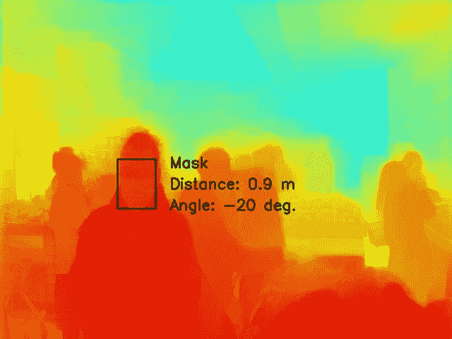
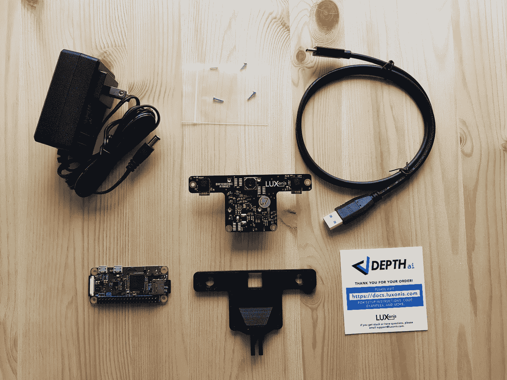
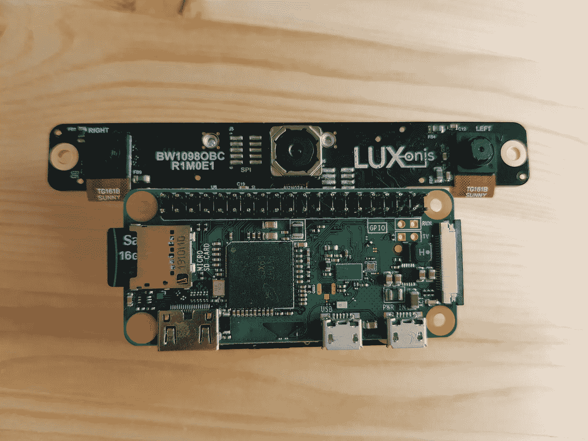
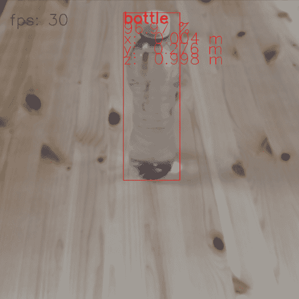
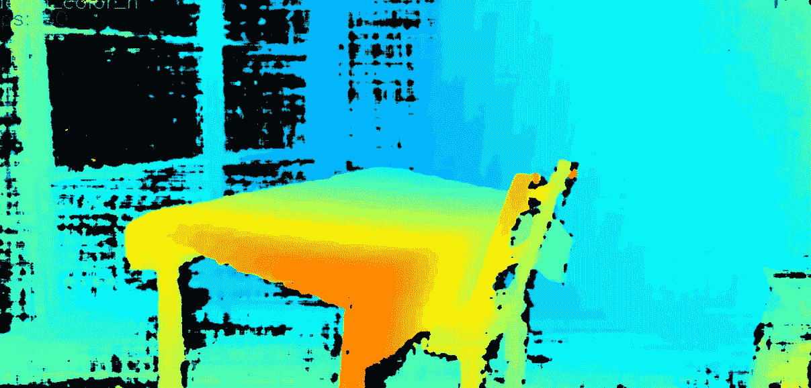
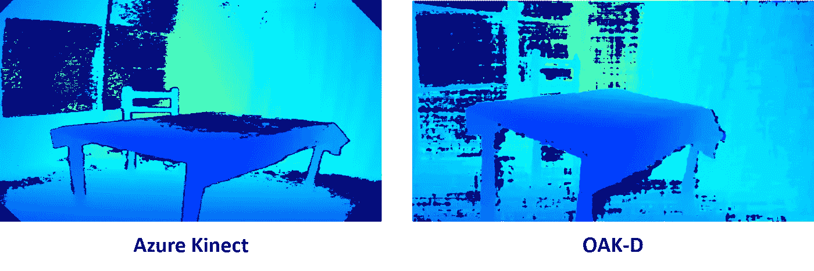

# 第 1 部分—初始设置+深度(OpenCV 空间人工智能竞赛之旅)

> 原文：<https://towardsdatascience.com/opencv-spatial-ai-competition-journey-part-1-e76593d456fe?source=collection_archive---------12----------------------->


罗伯特·诺顿在 [Unsplash](https://unsplash.com/photos/CO45mW7uMIU?utm_source=unsplash&utm_medium=referral&utm_content=creditCopyText) 上的照片

## 作为 OpenCV 空间竞赛一部分的盲人社交距离反馈系统开发之旅

*更新:这篇文章是系列文章的一部分，我将记录我在 OpenCV 空间竞赛中为盲人开发社交距离反馈系统的旅程。查看完整系列:* [***第一部***](/opencv-spatial-ai-competition-journey-part-1-e76593d456fe) ***，*** [***第二部***](https://medium.com/@ibaiGorordo/part-2-yet-another-face-mask-detector-opencv-spatial-ai-competition-journey-91dfaf96c6e8) *。*

# **OpenCV 空间人工智能竞赛**

最近，OpenCV 的人发起了由 Intel 赞助的 [**OpenCV 空间 AI 竞赛，作为 OpenCV 20 周年庆典的一部分。竞赛的主要目标是开发受益于全新**](https://opencv.org/opencv-spatial-ai-competition/)**[**OpenCV AI Kit with Depth(OAK-D)**](https://www.kickstarter.com/projects/opencv/opencv-ai-kit)特性的应用。比赛分为两个阶段，第一阶段的获胜者可以免费获得一台 OAK-D 来开发他们的应用程序，第二阶段的获胜者将获得高达 3，000 美元的现金奖励。**

OAK-D 包含一个用于深度神经推理的 12 MP RGB 摄像头和一个使用英特尔 Myriad X Vision 处理器(VPU)进行实时深度估计的立体摄像头。

如果你想了解更多关于 OAK-D 的信息，请务必查看 Ritesh Kanjee 对 Brandon Gilles*的采访，他是 OpenCV AI 套件的首席架构师。作为他们拥有 4000 多名支持者的 Kickstarter 活动的一部分，该工具包已经筹集了 80 多万美元。如果你有兴趣，你也可以在 Luxoni 的社区 slack 频道([https://luxonis-community.slack.com/](https://luxonis-community.slack.com/))找到更多关于这个套件的信息*

*由于 OAK-D 的有趣特性，我决定申请 OpenCV 空间 AI 竞赛，并有幸被选为第一期的获胜者之一。您还可以在此 查看第一阶段剩余获奖者的项目 [**。**](https://opencv.org/announcing-the-opencv-spatial-ai-competition-sponsored-by-intel-phase-1-winners/)*

*这篇文章是一系列文章的一部分，在这些文章中，我将描述作为我的竞赛项目的一部分，我与新 OAK-D 一起发展的旅程。*

# *拟议系统*

**

*所提出的系统的输出如何能够检测戴面具的人以及他们与用户的距离的图示。*

*我的提案题目是“ ***视障人士使用可穿戴相机的社交距离反馈*** ”。由于目前新冠肺炎病毒在世界范围内的爆发，社交距离已经成为一种新的社会规范，作为防止疫情传播的一种措施。*

*然而，视力受损的人正在努力在新的社会距离常态中保持独立。对于盲人来说，不容易确认他们是否与周围的人保持着社会距离。例如，皇家国家盲人研究所(RNIB)推特账户 中的一个 [**视频展示了由于社会距离，盲人在日常生活中遇到的困难。**](https://twitter.com/RNIB/status/1260969309771304960?s=0)*

*此外，常见的盲人解决方案(如白手杖或狗)无法帮助盲人保持社交距离。更糟糕的是，盲人无法知道他们身边的人是否戴着口罩，因此他们遭受感染的风险更高。*

*出于这些原因，我的项目的目标是为盲人开发一个反馈系统，告知周围其他人的距离以及某人是否没有戴面具。*

*对于这类项目，深度和人工智能需要实时结合，OAK-D 是理想的系统。如 德泰实验的一个例子所示，OAK-D 能够实时检测图像中人脸的位置，以及他们是否戴着面具。通过将该信息与从立体相机获得的深度信息相结合，可以估计用户周围的人的位置以及某人是否没有戴面具。*

*然后，该系统将使用连接到 OAK-D 板上的五个触觉电机通知用户与周围人的距离。触觉电机将与 5 个方向角相关:-40 度，-20 度，0 度，20 度和 40 度。例如，如果系统检测到有人在-20 度角附近(如上图所示)，那么左边第二个电机将会振动。此外，为了告知人有多近，马达的强度将随着被检测的人越来越近而变化。最后，如果系统检测到有人没有戴面罩，系统将通过改变振动模式来通知用户。*

# ***Windows 安装和初始测试***

*本周我收到了 OpenCV AI 套件。如下图所示，该套件包含一个 OAK-D，一个 USB-C 电缆，一个 5V (3A)壁式充电器和一个 3D 打印的 GoPro 底座。*

**

*OAK-D. **的组成部分注:**树莓 Pi Zero 不包含在套件中，仅用于比较尺寸。*

*OAK-D 的尺寸较小(46 x 100 毫米),呈 T 形。实际上，板的下部与 Raspberry Pi Zero 的宽度相匹配，因此将两块板组合在一起的系统可以具有紧凑的尺寸，如下图所示。*

**

*为了连接 OAK-D，Luxonis 的人开发了[**DepthAI Python API**](https://docs.luxonis.com/api/)。DepthAI API 是开源的，可以在不同的操作系统上运行。查看官方安装网站了解如何安装:[https://docs.luxonis.com/projects/api/en/latest/install/](https://docs.luxonis.com/projects/api/en/latest/install/)*

*i̶n̶c̶l̶u̶d̶i̶n̶g̶̶u̶b̶u̶n̶t̶u̶,̶̶r̶a̶s̶p̶b̶i̶a̶n̶̶a̶n̶d̶̶m̶a̶c̶o̶s̶.̶̶i̶n̶̶t̶h̶e̶̶c̶a̶s̶e̶̶o̶f̶̶w̶i̶n̶d̶o̶w̶s̶̶1̶0̶,̶̶a̶s̶̶o̶f̶̶t̶o̶d̶a̶y̶̶(̶a̶u̶g̶u̶s̶t̶̶8̶,̶̶2̶0̶2̶0̶)̶̶i̶t̶̶i̶s̶̶s̶t̶i̶l̶l̶̶e̶x̶p̶e̶r̶i̶m̶e̶n̶t̶a̶l̶.̶̶h̶o̶w̶e̶v̶e̶r̶,̶̶f̶o̶l̶l̶o̶w̶i̶n̶g̶̶t̶h̶e̶̶i̶n̶s̶t̶r̶u̶c̶t̶i̶o̶n̶s̶̶d̶e̶s̶c̶i̶b̶e̶d̶̶i̶n̶̶h̶e̶r̶e̶,̶̶t̶h̶e̶̶p̶r̶o̶c̶e̶s̶s̶̶w̶a̶s̶̶q̶u̶i̶t̶e̶̶e̶a̶s̶y̶.̶̶o̶n̶e̶̶i̶m̶p̶o̶r̶t̶a̶n̶t̶̶n̶o̶t̶e̶,̶̶i̶f̶̶y̶o̶u̶̶d̶o̶̶n̶o̶t̶̶w̶a̶n̶t̶̶t̶o̶̶h̶a̶v̶e̶̶t̶o̶̶c̶o̶m̶p̶i̶l̶e̶̶t̶h̶e̶̶a̶p̶i̶,̶̶m̶a̶k̶e̶̶s̶u̶r̶e̶̶t̶o̶̶u̶s̶e̶̶t̶h̶e̶̶p̶y̶t̶h̶o̶n̶̶3̶.̶7̶̶(̶3̶2̶̶b̶i̶t̶)̶.̶̶i̶̶t̶r̶i̶e̶d̶̶t̶o̶̶u̶s̶e̶̶t̶h̶e̶̶p̶y̶t̶h̶o̶n̶̶3̶.̶8̶̶(̶3̶2̶̶b̶i̶t̶)̶̶b̶u̶t̶̶i̶t̶̶d̶i̶d̶̶n̶o̶t̶̶w̶o̶r̶k̶̶c̶o̶r̶r̶e̶c̶t̶l̶y̶,̶̶s̶o̶̶m̶a̶k̶e̶̶s̶u̶r̶e̶̶y̶o̶u̶̶a̶r̶e̶̶u̶s̶i̶n̶g̶̶t̶h̶e̶̶c̶o̶r̶r̶e̶c̶t̶̶p̶y̶t̶h̶o̶n̶̶v̶e̶r̶s̶i̶o̶n̶.̶*

*一旦我安装了 depthAI API 及其依赖项，我就可以通过运行以下命令来运行默认演示程序(确保位于 depthAI 文件夹中):*

```
*python depthai.py*
```

*默认情况下，该演示运行 **MobileNet SSD** 对象检测模型，该模型可以检测图像中 20 种不同类型的对象(自行车、汽车、猫……)。此外，该演示将被检测对象的边界框与立体相机的深度信息相结合，以提供每个被检测对象的 3D 位置。作为一个例子，下面，我展示了检测水瓶的演示输出，这是可以检测默认演示模型的类之一。*

**

*演示能够以 30 fps 的速度跟踪物体并计算深度，没有任何问题。通过查看 **depthai.py** 脚本的 Python 代码，我看到在运行演示时，可以通过添加参数将演示配置为其他模式。例如，运行下面的代码有可能获得彩色化的深度(**注:只对 Windows 10 的重构版本有效**，在原来的存储库中配置已经改变):*

```
*python depthai.py --streams depth_color_h*
```

**

*使用 OAK-D 的深度输出。*

*总的来说，在背景的左边有一些黑色区域，深度看起来相当不错。然而，该区域包含玻璃面板，并且可能立体相机系统不能从中提取许多特征，因此没有为这些区域提供深度。*

# *深度估计:OAK-D 与 Azure Kinect DK*

*尽管 OAK-D 的深度估计不是它的主要功能，但我想将 OAK-D 的深度估计与最新的 Azure Kinect DK 进行比较。为此，我编写了一个小的 Python 脚本( **hello_depth.py** )，它读取原始深度值并像在 Azure Kinect 中一样显示深度。*

*至于 Azure Kinect，我使用了 Azure Kinect SDK 的 [**my Python 库中的深度估计示例程序。在下图中，比较了两种设备的估计深度。**](https://github.com/ibaiGorordo/pyKinectAzure)*

**

*Azure Kinect 和 OAK-D 的深度估计比较。*

*可以看到，尽管 OAK-D 使用了 estereo 相机，但效果非常好。特别是在桌子的情况下，OAK-D 能够正确地估计深度，而 Azure Kinect 中的 TOF 传感器却失败了。*

*这是第一部分的全部内容，在下一部分中，我将使用 OAK-D 测试[面具检测示例](https://github.com/luxonis/depthai-experiments/tree/master/coronamask)，我还将在我的库[https://github.com/ibaiGorordo/Social-Distance-Feedback](https://github.com/ibaiGorordo/Social-Distance-Feedback)中上传该项目的所有脚本。*

# *参考*

*[1]:格斯·亚历克西乌。(2020 年 6 月 7 日)。*盲人的社交距离噩梦随着封锁的缓解而加剧，*[https://medium . com/@ arinbasu/you-can-use-footnotes-that-babus % C2 % B9-6c 485 C4 eff 1e](https://www.forbes.com/sites/gusalexiou/2020/06/07/new-normal-of-social-distancing-could-become-a-new-nightmare-for-blind-people/)*

*【2】:BBC 新闻。(2020 年 6 月 24 日)。*社交距离视觉障碍者的“斗争”，*[https://medium . com/@ arinbasu/you-can-use-footnote s-that-babus % C2 % B9-6c 485 C4 eff 1e](https://www.bbc.com/news/uk-england-shropshire-53151554)*