# 在 Windows 上使用 GStreamer 和 QT 的 OpenCV

> 原文：<https://towardsdatascience.com/opencv-with-gstreamer-and-qt-on-windows-6f0fdb075993?source=collection_archive---------14----------------------->

## 使用 OpenCV 的 GStreamer 管道的分步指南和实例


作者图片:颜色反映组件之美，OpenCV，GStreamer，Qt，CMake，Visual Studio

OpenCV 是一个开源的计算机视觉库，主要面向实时系统。它基于 C++，为不同平台的视觉处理提供优化的代码，如 Windows、Linux、FreeBSD、macOS 等。由于开发人员和研究人员的活跃社区，代码很容易用于成像管道的不同步骤；从图像/视频捕获、校准、预处理、特征提取开始，到分类。虽然是用 C++编写的，但 OpenCV 有针对 python 和 Java 等不同语言的绑定。

**GStreamer** 是一个多媒体框架，支持不同的媒体处理组件，如音频、视频、录制和流媒体等。它通过让用户创建不同的管道和无缝集成不同的插件来提供高度的模块化。
既有图书馆；OpenCV 和 GStreamer 可以单独使用，但是两者的结合为处理多媒体流和数据提供了更大的灵活性。

与 Windows 相比，在 Linux 环境下使用 GStreamer 构建 OpenCV 更加简单，因为可以获得更好的在线支持和安装过程。然而，对于快速原型开发，人们可能觉得需要在 windows 环境下使用 OpenCV 和 GStreamer 以及 QT 配置。

在本文中，一步一步地介绍了如何使用 GStreamer、QT、OpenCV contrib 和 CUDA 包从源代码构建 OpenCV。在本教程的最后，我们将使用 OpenCV 开发一个 GStreamer 管道，将网络摄像头流式传输到本地主机，接收数据并使用 GStreamer-CLI 显示该流。在下一节中，我们将下载源文件并安装使用 GStreamer 构建 OpenCV 所需的工具。

## 下载源文件、安装程序和安装

1.  从 OpenCV GitHub [库](https://github.com/opencv/opencv/releases)下载源文件；建议下载最新版本。本实验基于 OpenCV 4.3.0

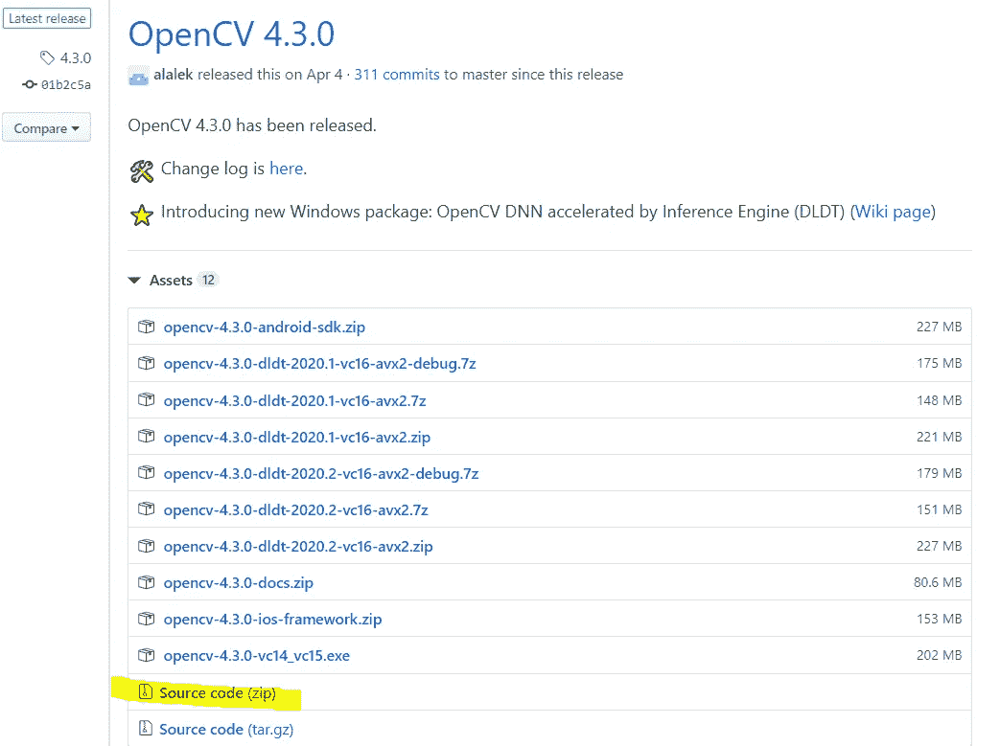

作者图片:来自 OpenCV Github 库的快照

2.从与主 OpenCV 相同的发布标签下载 OpenCV contrib 文件。在这种情况下，它是 4.3.0

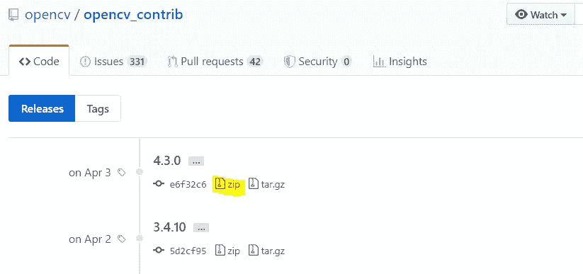

图片由作者提供:来自 OpenCV contribute 资源库的快照

3.下载并安装 [CMake](https://cmake.org/download/) 。我已经下载了 3.17.2。

4.下载并安装用于 MSVC 64 位(VS 2019)的 GStreamer 开发包和运行时安装程序

*   1.16.2 运行程序所需的运行时安装程序
*   [1.16.2 开发安装程序](https://gstreamer.freedesktop.org/data/pkg/windows/1.16.2/gstreamer-1.0-devel-msvc-x86_64-1.16.2.msi)，构建过程所需

5.下载并安装 [Visual Studio 社区【2017 版或 2019 版。我已经用 MSVC 64 位编译器安装了 2017。](https://visualstudio.microsoft.com/vs/older-downloads/)

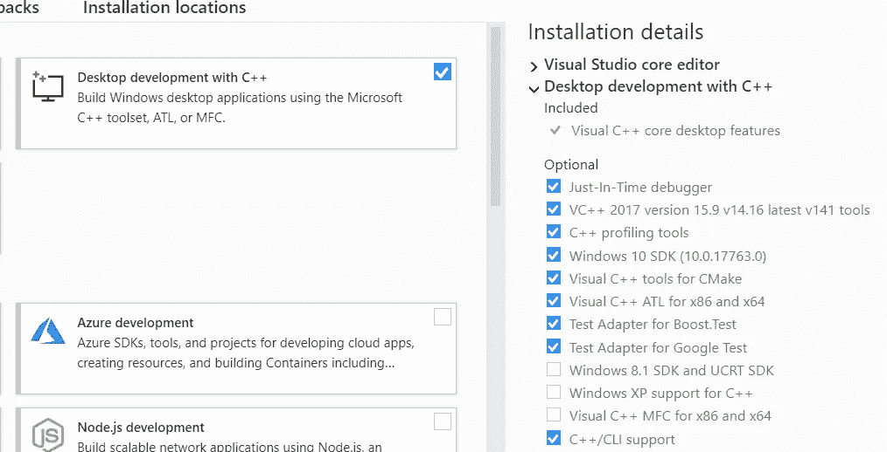

作者图片:在 VS 安装程序中选择的选项

> 微软 C++ [构建工具](https://visualstudio.microsoft.com/visual-cpp-build-tools/)包含在[Visual Studio 安装过程中](https://devblogs.microsoft.com/cppblog/visual-studio-build-tools-now-include-the-vs2017-and-vs2015-msvc-toolsets/)，但出于某种原因，我不得不单独下载。

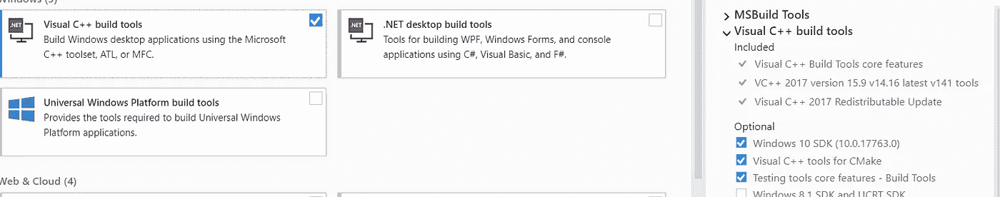

图片由作者提供:从 Microsoft C++构建工具中选择的选项

6.使用 [QT 在线安装程序](https://www.qt.io/download-open-source?hsCtaTracking=9f6a2170-a938-42df-a8e2-a9f0b1d6cdce%7C6cb0de4f-9bb5-4778-ab02-bfb62735f3e5)下载并安装 QT Creator 开源版。我已经下载了 QT Creator 4.12.0。

# 配置 OpenCV、GStreamer、QT 和 CUDA

提取 OpenCV、OpenCV contrib 和 GSreamter，并开始配置构建过程。

1.  配置设置

*   创建一个构建文件夹，并使用 CMake 指向它，如下图所示。此外，在 OpenCV_EXTRA_modules_PATH 字段中给出“MODULES”文件夹的路径。

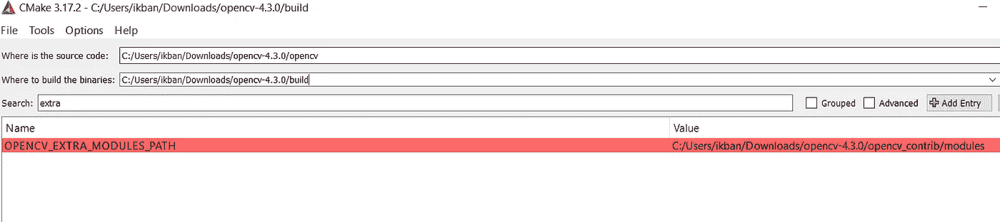

作者图片

*   勾选 OPENCV_DNN_CUDA 的复选框

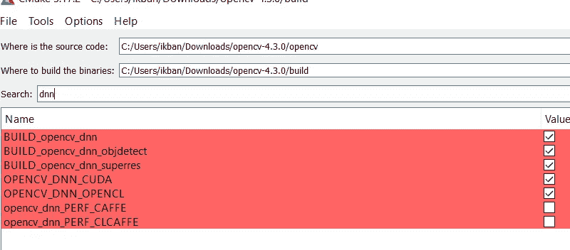

作者图片:CMake 源和构建文件夹路径

*   选中 QT 框

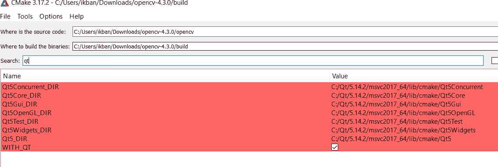

图片作者:QT 打勾

*   选中 WITH_GSTREMER 的复选框，并在 CMake 值中给出 GStreamer 开发包的路径。记住要仔细配置这个步骤。

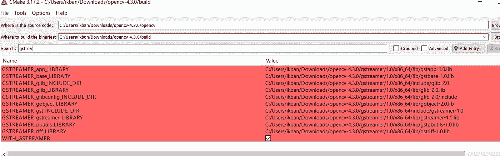

GStreamer 库路径

下面提供了参考路径。请根据您的设置进行更改。

```
C:/gstreamer/1.0/x86_64/lib/gstapp-1.0.lib
C:/gstreamer/1.0/x86_64/lib/gstbase-1.0.lib
C:/gstreamer/1.0/x86_64/include/glib-2.0
C:/gstreamer/1.0/x86_64/lib/glib-2.0.lib
C:/gstreamer/1.0/x86_64/lib/glib-2.0/include
C:/gstreamer/1.0/x86_64/lib/gobject-2.0.lib
C:/gstreamer/1.0/x86_64/include/gstreamer-1.0
C:/gstreamer/1.0/x86_64/lib/gstreamer-1.0.lib
C:/gstreamer/1.0/x86_64/lib/gstpbutils-1.0.lib
C:/gstreamer/1.0/x86_64/lib/gstriff-1.0.lib
```

*   在可选平台中配置编译器并选择 x64。在前面的一个步骤中，我们已经选择了 x64 位。

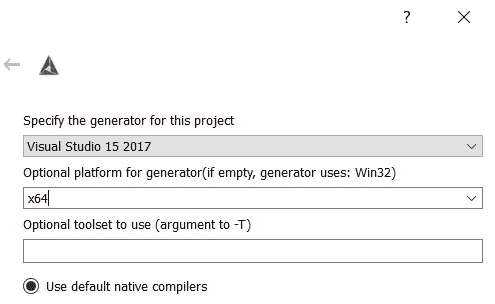

图片作者:记得选择平台。

*   按下 configure 选项并检查输出，查看 GStreamer 和 QT 是否已正确配置。

```
QT: YES (ver 5.14.2)
GStreamer: YES (1.16.2)
```

*   现在按下生成按钮

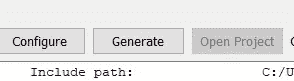

*   您的文件已经为构建和安装步骤做好了准备。

# 构建 OpenCV 并安装

1.  在发布模式下构建 OpenCV。首先将构建过程更改为 x64 模式。右键单击 ALL_BUILD，然后按 BUILD。

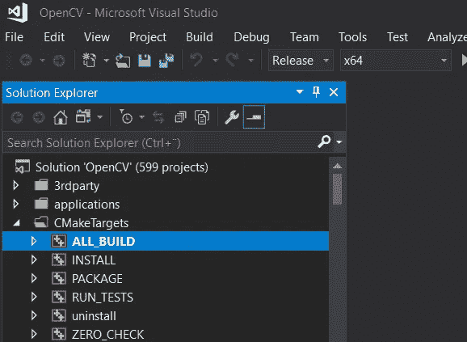

图片由作者提供:右键单击 ALL_BUILD 并按 BUILD

2.在发布模式下安装文件。右键单击“安装”,然后按“构建”。

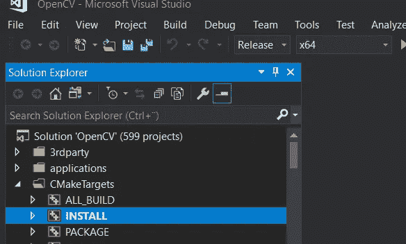

图片由作者提供。右键单击安装，然后按构建

3.如果您还想在调试模式下构建，请重复以上两个步骤进行调试。

4.您的文件已经可以在带有 GStreamer 的 QT creator 中使用了。下一步，我们需要 x64 文件夹中的 include 文件夹、bin 等和 lib 文件夹。

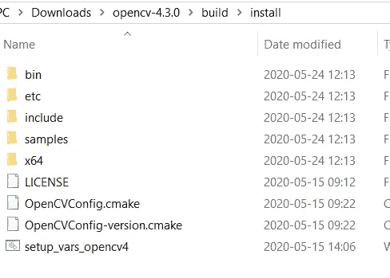

图片作者:构建 OpenCV 文件。

5.创建一个文件夹 Opencv34，并复制步骤 4 中的 include folder、bin 等文件夹和 lib 文件夹。

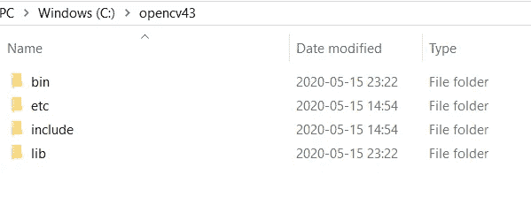

图片由作者提供:环境变量中给出了 bin 文件夹路径，QT 中给出了 include 和 lib 路径。专业文件

# 编辑 OpenCV 和 GStreamer 的环境变量

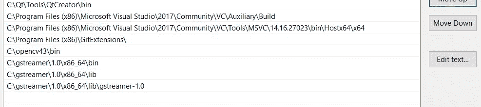

图片由作者提供:根据您的设置更改 Visual Studio 路径

# 示例:使用 OpenCV 的 GStreamer 管道

我们将使用端口号为 50050 的 localhost (127.0.0.1)在同一台计算机上测试发送方和接收方 GStreamer 管道。一些制作自己的 GStreamer 管道的好参考[ [link](https://stackoverflow.com/questions/46219454/how-to-open-a-gstreamer-pipeline-from-opencv-with-videowriter) ] [ [link](https://github.com/simondlevy/OpenCV_GStreamer) 。GStreamer 直播摄像机流管道在下面作为 OpenCV 代码给出，而接收管道作为 GStreamer-CLI 给出。

*   GStreamer 使用 OpenCV 的直播摄像机流管道可以从[库](https://github.com/imranmu/GStreamerOpenCV)访问
*   使用命令行接口(CLI)给出了用于接收摄像机流的 GStreamer 管道。在 CLI 中键入给定的命令。**挑战；**在 OpenCV 中实现这个 GStreamer-CLI 管道，并作为响应共享您的 GitHub 存储库作为注释。

```
gst-launch-1.0 udpsrc port=50050 caps=application/x-rtp ! rtpjpegdepay ! jpegparse ! jpegdec ! videoconvert ! autovideosink
```

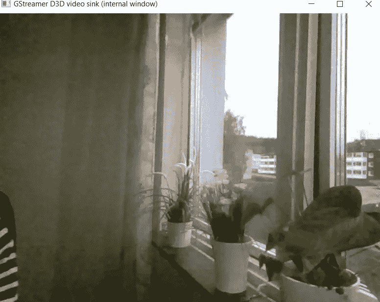

GStreamer 管道的输出窗口

# 参考

1.  [https://fun vision . blogspot . com/2020/03/compile-opencv-4-for-visual-studio-2019 . html](https://funvision.blogspot.com/2020/03/compile-opencv-4-for-visual-studio-2019.html)

# 相关文章

[](/nvidia-jetson-nano-vs-google-coral-vs-intel-ncs-a-comparison-9f950ee88f0d) [## NVIDIA Jetson Nano vs Google Coral vs Intel NCS。比较

### 用于计算机视觉和机器学习的边缘人工智能硬件加速器

towardsdatascience.com](/nvidia-jetson-nano-vs-google-coral-vs-intel-ncs-a-comparison-9f950ee88f0d) [](/getting-started-nvidia-jetson-nano-object-detection-and-classification-161ad566d594) [## 入门:Nvidia Jetson Nano，对象检测和分类

### 边缘计算的未来

towardsdatascience.com](/getting-started-nvidia-jetson-nano-object-detection-and-classification-161ad566d594)