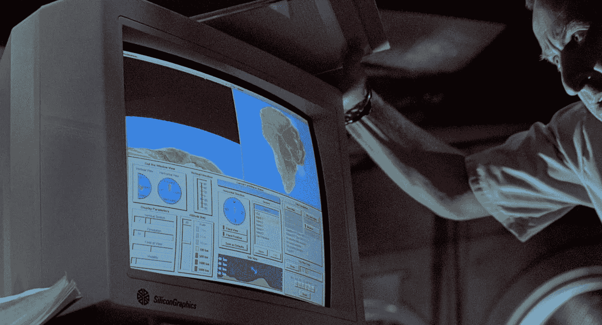
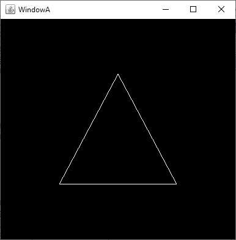

# Java 中的 OpenGL:如何使用硬件加速

> 原文：<https://towardsdatascience.com/opengl-in-java-how-to-use-hardware-acceleration-676334f18f11?source=collection_archive---------15----------------------->

## 2D 图形教程:介绍和第一个“你好世界”计划



Silicon Graphics 作为高端 2D/3D 图形硬件加速渲染工作站大放异彩。他们引入了 IrisGL API(被认为是 OpenGL 的直接始祖),并在 90 年代广泛应用于电影和电视行业。照片中，一个来自《侏罗纪公园》的胶片框。在电影和恐龙建模和渲染过程中都使用了硅图形工作站。

# 介绍

硬件加速通常被视为游戏开发的利基解决方案，但还有许多其他图形应用程序可以受益于这项技术，尤其是那些涉及数据可视化的应用程序，如专业的数据科学工具或显示实时数据的软件。传统的制图工具和库对于这项任务来说不够快，因此需要定制的图形编程。

硬件加速曾经是专用计算机的高端功能，如 20 世纪 90 年代在电影和电视行业广泛使用的 Silicon Graphics UNIX 工作站，但现在它是过去 15 或 20 年间制造的每台计算机的常见功能。虽然有些显卡比其他显卡性能更强、功能更多，但几乎所有现代设备都有一套基本的 2D 和 3D 加速功能。

这是通过专门的 CPU(称为 GPU — *图形处理单元* —)来实现的。GPU 是一种专用 CPU，提供浮点和矩阵处理功能，通常用于 2D 和 3D 渲染。它基本上允许软件绘制复杂的图形处理用户坐标，缩放，平移，缩放，旋转和纹理渲染，在 2D 和三维。

通过提供接近实际光栅化输出设备的这种功能，减少了 CPU 使用和 I/O 总线带宽，这有效地使得能够在 2D 和 3D 中进行复杂的渲染和动画制作。依靠主 CPU 来完成这些任务意味着只能完成不太复杂的渲染，而且会浪费大量 CPU 时间来处理图形例程。

在这篇文章中，我将简要介绍 OpenGL 及其在 Java 中的用法，包括一个介绍性但非常有用的教程。该教程涵盖了 2D，但它实际上是对 OpenGL 的一个很好的介绍，所以如果你对 3D 感兴趣，它仍然是一个很好的介绍材料，因为 2D 和 3D 的概念非常相似。

# OpenGL 是什么？

在 2D 和 3D 加速中有两个主要的竞争标准:DirectX 和 OpenGL。理解 OpenGL 和 DirectX 是硬件加速标准是很重要的，它们定义了哪些 API 应该由图形卡公开。从这个意义上说，它与任何其他计算标准(如 POSIX 或 C++11 标准)完全相同。在标准之外，将会有实现它们的库，因为 DirectX 库是由微软直接提供的，并且在 OpenGL 的情况下，有许多开源解决方案。

主要的图形卡制造商决定他们的硬件设备是否支持一种技术或另一种技术，或者两者都支持(这是通常的情况)。

DirectX 和 OpenGL 并不是唯一提供 2D 和 3D 渲染功能的标准/API。还有其他的，主要是 Vulkan 和 Metal。不过 DirectX 和 OpenGL 基本上都是应用最广泛的。Metal 专注于苹果设备，Vulkan 打算对 OpenGL 进行改进。我还没有评估这些，因为我不认为他们对我的需求感兴趣。

DirectX (Direct2D 和 Direct3D)是微软创建的一组 API，在 Windows 中实现。DirectX 不仅包括图形，还包括音频和输入。虽然它们是标准，理论上可以在任何操作系统架构中实现，但现实是 DirectX 仅用于 Microsoft Windows(以及 XBOX，以防有人发现该信息相关)。所以基本上 DirectX 是微软生态系统的标准解决方案。

相反，OpenGL 旨在成为一种跨平台语言，可以在发布的所有主流操作系统中使用。它实际上是旧的硅图形平台的直接后代，早在 1991 年就将 IrisGL 定义为提供专业 2D 和 3D 渲染功能的硬件 API。

几乎每一款现代显卡(我说的现代是指最近 15 年)都将提供与 DirectX 和/或 OpenGL 的给定版本的兼容性，因此它的使用不再是一件奇怪的事情，并且您有可能不再操作任何没有硬件加速功能的计算机。

理解这些 API 旨在提供渲染功能而不是用户界面是很重要的。一些窗口小部件/框架已经建立在 OpenGL 和 Direct2D 之上以满足这种需求，尽管它们没有像没有明确的硬件加速使用的常规框架那样被广泛使用。这背后的原因是硬件加速通常与游戏开发(不需要标准用户界面)和专门的图形应用程序有关。

# 为什么选择 OpenGL 和 Java？

我评估了一些关于硬件加速的组合。主要的有 Direct2D、C++和 OpenGL，使用 C++或 Java。在我看来，哪种组合更好并没有明确的答案。

如果你不需要跨平台(所以你基本上是为 Windows 开发)*和*你也不需要开发复杂的用户界面，我会说 Direct2D 是正确的选择。它更容易，它在 Windows 中得到很好的支持，可以满足所有的需求。

然而，如果你对其他操作系统感兴趣，那么 OpenGL 无疑是一个不错的选择。开箱即用，它将支持所有主要的操作系统。

关于使用 Java 还是 C++，我个人选择了 Java，因为它允许更容易地与现有的用户界面框架(特别是 Java Swing)集成。我的需求包括图形加速和用户界面，所以我使用 OpenGL 的方法可能与你在互联网上找到的大部分材料略有不同，这些材料通常专注于游戏开发。这解释了为什么每种语言和用户界面框架如何与 OpenGL 交互对我如此重要。

对于 Windows 和 Direct2D 下的 C++来说，如何在 C++之上实现用户界面没有直接的答案。如果你愿意用。NET 中有像 Win2D 这样的东西，它支持在。NET 框架(从而无缝地访问所有用户界面框架)，同时受益于 Direct2D 硬件加速。然而，这并不是一个广泛使用的解决方案，所以这意味着你没有使用主流技术/库，在我看来，这在支持、文档和未来维护方面总是一个有风险的提议。

如前所述，C++用户界面开发不像使用。NET 框架。你可以混合 C++和。NET framework，方法是使用 C++/CLI 来访问 WinForms(这不是主流解决方案),或者您可以依赖传统的 ATL/MFC 类，尽管它们被视为传统技术，但仍然得到了正确的维护。MFC 也迫使你处理许多样板文件，包括许多微软特有的详细类，这些类现在已经被 C++标准模板库所取代。你最终会写出与微软紧密结合的代码，以至于它不再被认为是可移植的 C++。

最重要的是，有可能使用其他跨平台的小部件框架(如 wxWidgets 或 Qt)，我个人不喜欢这种方法，因为我认为如果你需要跨平台，Java 是最简单的途径，如果你想专注于 Windows，使用微软主流工具是最安全的方式。

无论如何，所有这些解决方案都包含一定程度的样板文件(有时它们实际上实现起来相当复杂)。Windows APIs 从未在可用性和简单性方面大放异彩。而。NET 改变了这种模式，现在用 C#或 VB 构建应用程序相当容易，它仍然更侧重于性能不是问题的生产力应用程序。

在我看来，如果你需要硬件加速，一个中等复杂的用户界面和一个跨平台的解决方案，没有什么比带有 Swing 和 OpenGL 的 Java 更容易的了。许多人认为 Java Swing 已经过时了，但事实是它仍然为桌面应用程序带来了相当现代的界面，它非常轻量级，而且功能强大，足以提供良好的用户界面体验。除非你正在寻找一个尖端的 UI 设计，Java Swing 将会完成这项工作。对于可用性和功能性比界面外观和感觉更重要的利基应用程序来说尤其如此。

我回顾了 OpenGL 的所有 Java 替代方案，最终选择了 JOGL。原因是 JOGL 是通用的 OpenGL 实现，不像其他库(如 LWJGL)那样只专注于游戏。它可以与 AWT 和 Swing 集成，因此您可以同时拥有两个世界:自定义硬件加速图形和通过 Swing 轻松开发和实现用户界面。

使用 Java/Swing/OpenGL 的这种组合还有一个好处，那就是你的软件可以在 Linux/UNIX 和 Windows 系统中运行而不需要任何改变。作为一个权衡，如果你的软件需要低级别的数据处理，Java 有时比 C++稍差一点，而且可能会稍微慢一点。

也有建立在 OpenGL 之上的替代框架。运行用户界面不需要其他任何东西，但是根据我的研究，没有一个界面成熟到可以被认为是安全的。他们也倾向于只为特定的 OpenGL 实现工作，他们也依赖于其他库，所以最终仍然有一些外部依赖。这些框架的绑定通常只为 C++提供。

# 你好，Java 中的 OpenGL 世界

不再拖延，让我们编码我们的第一个 OpenGL 程序。我将使用 Netbeans 8.2 和 Oracle JDK 8。

你可以从其主要网站[https://jogamp.org](https://jogamp.org)下载 JOGL，你需要将 *gluegen* 和 *jogl* 库整合到你的 IDE 中。关于如何做到这一点的具体说明很容易找到，所以我不会在这里重复它们，特别是因为它们将取决于您正在安装的特定版本和您正在使用的 IDE。我只想说，您可以从 JOGL 的主网站上下载 jar 文件，放在 *Build/Downloads — Zip* 下。下载“所有平台”。并将它们安装到您的项目中。您将得到类似这样的结果:


IDE 中要包含的基本库，以便在 Java 项目中使用 JOGL OpenGL。

首先，我们将实现一个扩展 JFrame 的类，这样它将基本上定义一个窗口，我们可以在其中使用 OpenGL 绘图。

这门课:

1.  扩展 *JFrame* ，因为我们想要一个独立的窗口，我们可以在那里绘图。这与 OpenGL 无关，只是一种在 Java Swing 中创建窗口的方式。
2.  实现 *GLEventListener* 接口，这是 JOGL 实现 OpenGL 的一个要求。这个接口需要实现四个方法:*显示*、*整形*、*初始化*和*处理*。
3.  在这个例子中，实际上只实现了*显示*方法。在这里，我们将执行实际的绘图(稍后将详细介绍)。
4.  我们需要一个 *GLProfile* 和一个 *GLCapabilities* 对象，它们定义了哪个特定的 OpenGL 版本和哪些功能正在被实现。
5.  我们需要一个 *GLCanvas* 对象，基本上就是实现 OpenGL 的 Canvas 对象。这将被添加到一个实现了 *GLEventListener* 接口的类中，在我们的例子中是我们的 *JFrame* 类。这可能通过简单地检查在源代码中创建 *GLCanvas* 对象的三行代码来更好地理解。

概括地说，我们基本上是在创建一个 *JFrame* 类，它实现了 *GLEventListener* 接口并包含了一个 *GLCanvas* 对象。这允许我们在 *GLCanvas* 对象上使用 OpenGL。

有了所有这些步骤，我们就可以开始绘制了，这是通过实现 *display* 方法来实现的。

第一个 OpenGL 示例

在这种情况下，*显示*方法非常简单。它接收一个 *GLDrawable* 对象作为参数。从这个对象中，我们可以得到一个 *GL2* 对象，这就是我们用来绘制的对象。

要划清界限，我们只需:

```
gl.glBegin(GL2.GL_LINES);
gl.glVertex3f(-0.50f, -0.50f, 0);
gl.glVertex3f(0.50f, -0.50f, 0);
gl.glEnd();
```

我们附上我们在 *glBegin* 和 *glEnd* 定义之间的图纸。作为 *glBegin* 参数，我们提供 *GL2。GL_LINES* 告诉 OpenGL 我们正在画一条线。因为我们正在画一条线，所以我们知道我们需要提供两个点(OpenGL 也希望如此)。因此，我们定义了两个顶点(点),在这种情况下是在 3D 中定义的。这两点是定义这条线的点。

基本思想是，我们开始绘图，并提供必要的信息(在本例中，绘制一条线需要两个点)，GPU 需要这些信息将它绘制到画布对象上。其他绘图图元需要 *glBegin* 和 *glEnd* 之间的其他信息。

为了完成我们的三角形，我们只需画三段。



OpenGL 中的 Hello World 程序

最后，为了显示窗口，JFrame 需要像 Java Swing 中的任何 JFrame 一样被调用。我们的主类就像这个一样简单:

我们的主类只是调用扩展的 JFrame 类

这就完成了我们的第一个 Java OpenGL 程序。相比之下，用 Java 比用 C++更容易得到一个工作示例，因为 Java Swing 比微软现有的 API 更容易编码。在下一个系列中，我们将继续编写 OpenGL。