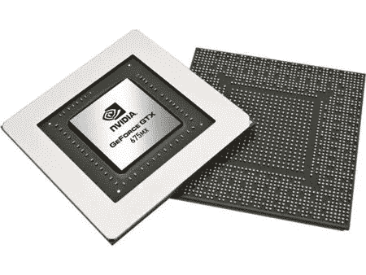
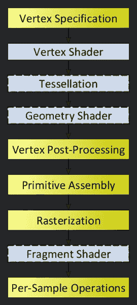
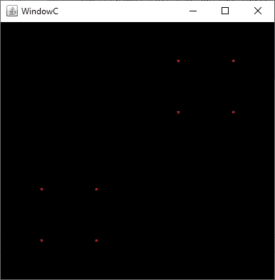
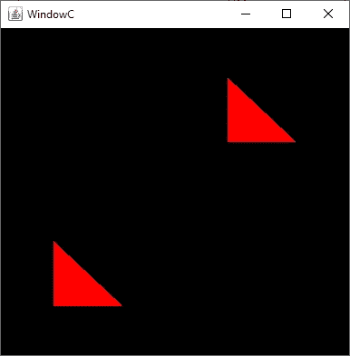

# Java 中的 OpenGL:管道和着色器

> 原文：<https://towardsdatascience.com/opengl-in-java-pipelines-shaders-907f137c5bd5?source=collection_archive---------21----------------------->

## 2D 图形教程(二):现代 OpenGL——顶点、管道和着色器

在[的另一篇文章](https://link.medium.com/mK7fHn3YS3)中，我介绍了 OpenGL，并简单讨论了我为什么选择 Java、OpenGL 和 JOGL。我还展示了一个 Java 工作示例，它相当于第一个“Hello World”程序。预期的例子是使用旧的 OpenGL 语法，这很容易理解，但没有优化。它在 OpenGL 中被称为“即时”模式，在这种模式下，绘图命令被直接提交给包含在 *glBegin* 和 *glEnd* 块中的 GPU。

从 OpenGL 3.3 开始，推荐使用所谓的*核心*语言对 OpenGL 进行编程。在这种模式下，通过被称为*着色器*的已编译 GLSL 程序来使用 OpenGL。那些*着色器*是*流水线*，所以我们有一个链接的软件流来渲染我们的图形。GLSL 程序需要编译，通常存储在我们源代码的单独文件中，因为它们本身就是一种单独的编程语言。

> 当编写 OpenGL 时，我们为并行运行的 GPU 编写流水线代码。这意味着我们编码的方式不同于常规程序。例程需要简洁和无状态，因为执行顺序是未知的。每个管道阶段的操作不能依赖于同一阶段的其他操作。代码也必须编译并下载到 GPU，这是在运行时完成的。

在本文中，我们将简要解释这个管道是如何工作的，着色器是如何编码的，以及顶点坐标是如何使用的。我们将使用这些概念按照完整的过程画一个正方形。虽然这个例子很简单，但是这个过程反映了 OpenGL 是如何编程的。

请记住，这不是一个解释每一个 OpenGL 概念的详尽教程，而是我收集的解释我在学习 OpenGL 时发现更复杂的步骤的材料。重点是做基本但完整的例子，说明如何使用 OpenGL 的 2D 数据可视化应用。如果您不确定某些 OpenGL 关键字的范围，请不要担心，重点是了解着色器和管道如何工作的总体想法，这将使学习补充材料更加容易。准备这些例子也是为了填补我在最推荐的学习材料中发现的空白(我将在本系列教程的最后重新讨论这些内容),并强调我花了更多时间来解决的领域。

# 管道和着色器

OpenGL 就是渲染由顶点定义的基本形状。如果你想建立一个 3D 恐龙模型，它很可能是用非常小的三角形来塑造的，小到在人类的边缘看起来是一个连续的纹理。

因此，OpenGL 将把顶点集转换成实际的渲染图像，并且它将使用所谓的*着色器*来完成这项工作。对 2D 来说，也是一样，我们只是一直在 *z=0* 平面上绘图。

简单地说，事情是这样的:

1.  应用程序(例如 Java 或 C++)将为要绘制的每个形状/图元定义要使用的点。这只是一个顶点列表，所以如果你想画一个三角形，每个三角形图元需要三个顶点。
2.  顶点着色器程序将为每个顶点执行一次，它将定义顶点位置和要绘制的基本形状/图元/对象。顶点着色器用于对每个顶点进行缩放和平移等操作。
3.  可选地，几何着色器将顶点转换成形状。通过这样做，将有可能把正方形的中心传递给程序，并让几何着色器推断正方形的四个顶点。
4.  片段着色器程序将为每个要绘制的像素执行一次，并定义像素的颜色。

使用 GLSL 语言为图形卡 GPU 定义和编译(在运行时)所有着色器。

*镶嵌着色器*是 OpenGL 4 中引入的可选着色器，允许定义和操作由大量三角形组成的网格。它已被纳入 OpenGL 第 4 版，旨在建立像三维景观的东西。

在这个例子中，我们将使用一个*顶点着色器*，一个*几何着色器*和一个*片段着色器*。这个想法是，应用程序给定一组坐标(顶点)，我们的 GPU 将绘制以这些坐标为中心的正方形，并根据它们在窗口中的位置将它们着色。这是一个非常有效的例子，完美地说明了如何使用“核心”模式编程 OpenGL。

OpenGL 管道包括生成光栅化图像的几个连锁步骤。图片来源:Khronos 集团财团。

对我来说，一件新奇的事情是着色器无状态的概念。着色器背后的想法是它们可以以任何顺序并发执行。这有效地使 GPU 能够并行执行大量着色器(每个着色器处理一个顶点/像素)。这就是为什么即使在高清显示器上也能实现快速响应和渲染而不影响 CPU 的原因。作为一个权衡，我们编码的每个着色器必须是无状态的，不能依赖于其他着色器。这意味着我们编码着色器的方式与我们习惯的方式略有不同。

# 使用着色器和 GLSL 绘制像素

## 顶点着色器

让我们准备一个程序，使用*顶点着色器*和*片段着色器*绘制一个像素。我们将首先定义将在一个单独的文件中分配的源代码，这可能是您想要做的。

我们的顶点着色器什么都不做，它只是将顶点传递给下一个着色器，但它仍然是必需的。

我们的第一个顶点着色器只定义了一个正方形的顶点。

让我们详细分析一下源代码。

第一行声明我们正在使用 OpenGL 3.3 核心。即使在撰写本文时，OpenGL 已经达到了 4.6 版本，我们也将为 3.3 编码。这样做的原因是 3.3 是第一个执行核心编程的版本，这样我们就可以使用旧的显卡。

第二行声明我们将使用一个输入布局变量，我们将其命名为 *squareCenterPosition* ，这样命名的原因是在下一个例子中我们将使用它作为一个正方形的中心。现在，请记住这只是单个像素的位置。

*布局*子句允许指定*限定符*，这在上下文中定义了我们在顶点矩阵中使用的位置。关于*布局限定符*做什么的完整规范可以在 OpenGL 规范页面上阅读[。随时准备检查规范，以澄清对代码示例的疑问。](https://www.khronos.org/opengl/wiki/Layout_Qualifier_(GLSL)#Vertex_shader_attribute_index)

vec2 类型的变量定义了一个双浮点向量。当我们面对 2D 时，我们只需要两点。如果需要，可以提供更多的数据。

第二块是主函数。OpenGL 在许多方面类似于 C 语法，所以着色器总是有一个“主”函数。在这个函数中，我们定义了在 OpenGL 中有特殊含义的变量 *gl_Position* 。它定义了顶点的最终位置。在这种情况下，我们定义一个 4 浮点向量，它包括 3D 坐标和一个用于投影的值。在我们的例子中，Z 坐标是 0，投影值被硬编码为 1。

这就是我们在顶点着色器中所要做的，将 x/y 位置转换成一个合适的 4 浮点向量。

## 几何着色器

下一个着色器是几何着色器。该着色器可以操纵顶点和计算图元。理解 GPU 处理基本图元是很重要的:点、线和三角形。仅此而已。

作为一个例子，我们将首先提供一个几何着色器，它只在顶点周围生成 4 个点:

我们的第一个几何着色器接收一个输入顶点，并从中生成 4 个顶点。把它想象成一个从中心点出发的正方形生成器。

对于几何着色器，我们为着色器的输入和输出数据定义了布局子句。在我们的着色器中，我们定义了接收到的每个点都有 4 个点。这可能是不同的情况(我们将在后面看到一个例子)，我们可以为每个点传递一个三角形。

*gl_Position* 是用于定义顶点位置的 OpenGL 变量。在这种情况下，我们定义它四次，每个生成的顶点一次。请注意我们是如何获得输入值( *gl_in[0]* )并用偏移量 *0.2* 对其进行转换，以构建我们的假想正方形的每个点。对于每个点，我们调用 *EmitVertex()* 和 *EndPrimitive()* ，因为我们生成 4 个图元，每个图元 1 个顶点(一个点仍然是一个*图元*)。稍后，我们将在每个位置生成四个三角形，以进一步说明几何着色器的工作方式。

## 片段着色器

现在我们已经有了顶点着色器定义的像素，我们将编码我们的片段着色器，这也是一个愚蠢的例程，它只是用红色绘制像素( *RGB 1，0，0* )。代码如下:

片段着色器，它只画一个红色像素。

## VBA 和 vbo

在进入实际的 JOGL 实现代码之前，让我们回顾一下 OpenGL 中的 VAOs 和 VBOs 是什么。VBO(顶点缓冲对象)是存储在图形卡内存中的缓冲区，其中包含着色器要操作的数据。在显卡内部分配和存储数据，比从 CPU 来回移动数据要快得多。这个想法是，我们用渲染数据加载这些缓冲区，然后由 GPU 处理这些缓冲区。每个 VBO 通常包含与一个实体相关的数据。VBO 可以包含与恐龙的 3D 模型相关的所有信息，例如，在 2D，每个 VBO 可以包含顶点和必要的信息，以在 EDA(电子设计自动化)CAD 程序中绘制逻辑门或晶体管。

VAO 是维也纳组织的超集，这意味着我们至少需要一个 VAO。VAO 使用的一个潜在示例是将 VAO 中某个游戏级别的所有渲染 vbo 分组。通过这样做，主程序更容易管理需要加载哪些缓冲区。这是一种将可能同时需要的缓冲区分组的方法。基本的 2D 应用程序只需要一个 VAO 就可以工作。对于复杂的应用程序，它的使用可能会提供一些优势，尤其是当您不能同时将所有信息放入内存时。

## OpenGL Java 类

我们将创建一个名为 Window C 的新类，它包含三个着色器。我们将定义一个 VAO 和两个 VBOs，每个将包含一个 2D x，y 坐标。我们将处理这两个 VBOs，最终将在屏幕上绘制两个假想的正方形。

OpenGL 类扩展 JFrame 并实现 GLEventListener。它定义了一个 VAO，两个仅包含一个(x，y) vec2 的 vbo。这些 vec2 通过顶点、几何和片段着色器来获得围绕这些坐标绘制的虚拟正方形。

我们还需要我们的主类:

Main 类，它只是调用 WindowsC JFrame 对象。

正如所料，我们得到的结果是两个假想正方形的顶点，分别位于(0.5，0.5)和(-0.5，-0.5)周围。

使用着色器的第一个程序输出。请注意，所有工作都已在 GPU 上完成。应用层只是定义了我们想象的正方形的中心。

# 画三角形而不是点

在结束这个例子之前，让我们想象一下，我们想要在每个点上画一个三角形，而不是一个假想正方形的顶点。为此，我们只需使用 *triangle_strip* 而不是点作为*输出*来修改我们的几何着色器。在调用 *EndPrimitive()* 之前需要定义三个顶点。

修改了几何着色器代码，以在每个点绘制三角形。

带有修改的几何着色器的程序的输出。

# 摘要

虽然这个例子很简单，但它说明了使用 OpenGL 的硬件加速程序的基本工作流程。它使用渲染程序中使用的三个主要步骤:顶点着色器、几何着色器和片段着色器。它说明了 OpenGL 程序是如何简洁并且不容易理解，但同时为软件提供了强大的计算能力，因为所有的图形绘制工作都是由 GPU 交付的。这释放了我们的应用程序和 CPU，有效地简化了代码并提高了性能。

我有意忽略了任何其他会使 OpenGL 中使用的基本工作流程复杂化的方面。请记住，我们已经定义了一些坐标，每个坐标都存储在一个 VBO 中，两个 vbo 都包含在一个 VAO 中，GPU 已经编码为使用顶点、几何图形和片段着色器，并且我们已经渲染了形状。

在接下来的文章中，我们将继续讨论缩放、平移和调试(至少是错误检查)。