# 用石灰打开黑盒模型——美女与野兽

> 原文：<https://towardsdatascience.com/opening-black-box-models-with-lime-beauty-and-the-beast-9daaf02f584a?source=collection_archive---------34----------------------->

## 一个简单的分步指南(带 Python 代码)真正解释了什么是 LIME，它是如何工作的，以及一些潜在的陷阱。

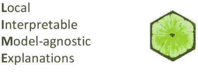

来自 [Slideshare](https://www.slideshare.net/0xdata/interpretable-machine-learning-using-lime-framework-kasia-kulma-phd-data-scientist) 上 [Kasia Kulma](https://github.com/kkulma) 的照片

尽管机器学习在做出关键决策方面得到了蓬勃发展，但许多机器学习模型仍然是黑箱。在这里，使用机器学习做决策的信任和伦理挑战就出现了。因为错误预测的现实后果可能会很昂贵。2017 年，对三家负责设计和开发自动化计算机系统的美国公司提起诉讼，该系统被密歇根州政府失业机构使用，并提出了 2 万项虚假欺诈指控。一个好的老板还会质疑他的数据团队，为什么公司应该做出这些关键的商业决策。为了不盲目信任机器学习模型，理解模型的行为、它做出的决策以及任何相关的潜在陷阱的需要是议程上的优先事项。

# 模型可解释性——事后解释技术

数据科学界和文献中普遍接受的现象(Johansson，Ulf 等人，2011；Choi，Edward 等人，2016 等。)是在模型准确性和可解释性之间存在权衡。有时
当你有一个非常大的潜在复杂的数据集时，使用复杂的模型，如深度神经网络和随机森林，通常可以实现更高的性能，但可解释性较低。相比之下，更简单的模型，如线性或逻辑回归，仅举几例，往往提供较低的性能，但更高的可解释性。这就是**事后解释技术**出现并成为机器学习文献中游戏规则改变者的地方。

传统的统计方法使用假设驱动的方法，这意味着我们通过训练模型来构建假设和验证假设。相反，事后技术是“事后”应用的设置技术**——在模型训练**之后。所以人们想出的主意是首先建立复杂的决策模型，然后用更简单的模型来解释它们。换句话说，先建立复杂的模型，然后才是假设。事后解释技术的一些例子包括莱姆，SHAP，锚，缪斯等等。我在本文中讨论的重点将是解释什么是 LIME，如何使用 Python 代码一步一步地指导它的工作，以及与 LIME 相关的好与不好。

得到💬任何数据科学或编程问题的 GPT 式答案。为成千上万的人生成摘要和学习笔记📚只需一次点击即可获得学习资源。👉

[](https://aigents.co/learn) [## 面向数据科学家和开发人员的免费学习资源。精选的博客、教程、书籍和…

### 机器学习和人工智能工程师的培训课程、黑客马拉松、活动和工作

aigents.co](https://aigents.co/learn) 

# 那么石灰到底是什么，它是如何工作的？

LIME 是局部可解释模型不可知解释的缩写。本质上，LIME 是模型不可知的，这意味着它可以基于每个复杂模型都是黑盒的假设而应用于任何模型。通过可解释的方式，它意味着 LIME 将能够解释模型如何表现，它选取了哪些特征，以及它们之间发生了什么样的相互作用来驱动预测。最后但同样重要的是，LIME 是特定于观察的，这意味着它试图理解影响感兴趣的单个实例周围的黑盒模型的特性。LIME 背后的基本原理是，由于全局模型的可解释性在现实中很难实现，所以通过简单的局部模型来近似黑盒模型要简单得多。

在实践中，黑盒模型的决策边界可能看起来非常复杂。在下图中，黑盒模型的决策边界由蓝粉色背景表示，这似乎太复杂了，无法用线性模型精确地近似。

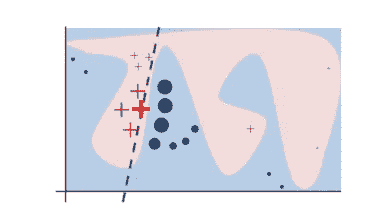

图一。黑箱模型的决策边界。[来源](https://arxiv.org/pdf/1602.04938.pdf)

然而，研究(Baehrens、David 等人(2010 年)、Laugel 等人(2018 年)等。)已经表明，当你放大并观察一个足够小的**邻域**(请耐心等待，我将在下一次会议中讨论它意味着什么)时，无论模型在全局水平上有多复杂，局部邻域的决策边界都可以简单得多，事实上甚至可以是线性的。例如，某人患癌症的概率可能与他的年龄成非线性关系。但是，如果你只关注一小部分 70 岁以上的人，那么对于这部分人群来说，患癌症的风险可能与年龄增长呈线性相关。

也就是说，LIME 所做的是在一个非常局部的水平上前进，并到达一个点，在这个点上，它变得如此局部，以至于一个**线性模型足够强大，可以解释原始黑盒模型在局部水平**上的行为，并且在该局部上(在我们想要解释的观察的邻域中)它将是高度准确的。在这个例子中(图 1)，红色的粗体叉是正在解释的实例。LIME 将通过对所选实例周围的邻域进行采样来生成新的实例，对该邻域应用原始黑盒模型来生成相应的预测，并根据这些生成的实例到被解释实例的距离对它们进行加权。

在这个获得的数据集中(包括生成的实例、相应的预测和权重)，LIME 训练一个可解释的模型(例如加权线性模型、决策树)，该模型捕获该邻域中复杂模型的行为。该局部线性模型的系数将充当解释器，并告诉我们哪些特征以这种或那种方式驱动预测。在图 1 中，虚线是黑盒模型在特定位置的行为，这可以通过线性模型来解释，并且该解释在该位置被认为是可信的。

# 石灰的完整配方，一步一步的指南(和 Python 代码)

```
import pandas as pd
import numpy as np
import matplotlib.pyplot as plt
from sklearn.ensemble import RandomForestClassifier
from sklearn.preprocessing import StandardScaler
import seaborn as sns
```

**第一部分。加载数据并训练随机森林模型。**

LIME 可以应用于所有类型的数据。本文中开发的示例将仅限于分析表格数据。我在 Hackereath 上使用[这个贷款违约的数据集](https://www.hackerearth.com/problem/machine-learning/bank-fears-loanliness/)。在[我的 GitHub](https://github.com/lanchuhuong/LIME-explanation/blob/master/Default_model_Lime_explanation.ipynb) 上可以找到完整的笔记本。因为它是一个非常大的数据集，所以在这个例子中，我只使用训练集作为我的完整数据集。基本上，我有一个贷款违约数据集，其大小超过 500.000 个观察值，在该数据集中的特征中，我挑选了 3 个与目标变量(违约或非违约)具有最高相关性的特征(贷款金额、借款人年收入和 member_ID)。您可以找到所用数据的摘要，并遵循下面提供的代码所采取的步骤。

```
#About the data
#Loan_status: Current status of the loan 0: default, 1: non-default #annual_inc: The reported annual income provided by the borrower 
#loan_amnt: The listed amount of the loan applied for by the borrower.
#member_id: A unique assigned ID for customers.**#Loading dataset**df = pd.read_csv("credit_default.csv")#Plotting and doing some data **# Exploratory data analysis**ax1=df['annual_inc'].plot.hist()
ax1.set_xlabel('annual_inc')
df.boxplot(column=['annual_inc', 'funded_amnt','member_id'])**#Removing outliers for annual_income**Q1 = df['annual_inc'].quantile(0.25)
Q3 = df['annual_inc'].quantile(0.75)
IQR = Q3 - Q1
print(IQR)
df_outliers = df[(df['annual_inc'] < (Q1 - 1.5 * IQR)) | (df['annual_inc'] > (Q3 + 1.5 * IQR)) ] 
df_clean = df[(df['annual_inc'] > (Q1 - 1.5 * IQR)) & (df['annual_inc'] < (Q3 + 1.5 * IQR)) ]**#Correlation matrix**sns.heatmap(data = df_clean.corr(),annot=True, linewidths=1.5, fmt='.1g',cmap=plt.cm.Reds)**# Picking up features for the model**
features = ['member_id', 'annual_inc', 'funded_amnt']
tmp=df_clean[features]**#Standardization**X = StandardScaler().fit_transform(tmp)**#Training the model**from sklearn.model_selection import train_test_split
X_train,X_test,y_train,y_test=train_test_split(X,y,test_size = 0.33)
X_train.shape[0] == y_train.shape[0]from sklearn.ensemble import RandomForestClassifier
Model = RandomForestClassifier()**#Predicting using the test set and get accuracy, recall and precision score**Model.fit(X_train, y_train)y_predicted = Model.predict(X_test)
metrics.accuracy_score(y_test, y_predicted)
tn, fp, fn, tp = metrics.confusion_matrix(y_test,y_predicted).ravel()
recall = tp/(tp+fn)
precision = tp/(tp+fp)

print("accuracy = **{acc:0.3f}**,**\n**recall = **{recal:0.3f}**,**\n**precision = **{precision:0.3f}**".format( acc=accuracy, recal=recall,precision=precision))
```

在训练了一个 Randome 森林模型后，我的准确率为 0.80，精确率为 0.61，召回率为 0.44。好吧，让我们继续莱姆的解释。

**第二部分。石灰说明**

**第一步。**在您的原始数据集中选择感兴趣的实例(Xi ),您需要为其解释黑盒模型。

```
Xi = np.array([ -0.71247975, -0.04996247, -1.02083371])
```

鉴于我已在上一步中对数据进行了标准化，在此，我将通过对 Xi 周围的正态分布和训练数据集中的解释变量的标准偏差进行采样，来生成新的实例(在被解释的实例的邻域-Xi)。

```
num =750 # number of perturbations generated
sigma = 1 # Standard deviation
X_perturb = np.random.normal(Xi,sigma,size=(num,Xi.shape[0]))
```

如果您还没有标准化数据，LIME 将在内部为您完成。需要注意的是，默认情况下(看看 [LIME 在 Python](https://github.com/marcotcr/lime/blob/master/lime/lime_tabular.py) 中的实现)，LIME 样本取自特征数据的平均值，代表全局解释。但是，您可以选择在感兴趣的实例周围进行数据采样，这是一种更加局部驱动的解释。在这种情况下，如前所述，我选择围绕所选实例(Xi)进行采样。如果围绕要素的平均值进行采样，可能会生成远离您想要解释的实例的实例。这是有问题的，因为您在生成的数据集上得到的解释可能与正在解释的实例的解释不同。

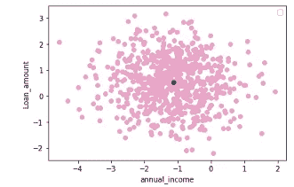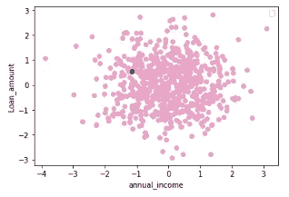

图二。围绕被解释的实例进行采样(蓝色)(左)和围绕要素数据的平均值进行采样(右)-按作者进行可视化

**第三步。**使用复杂的原始黑箱模型对受扰动的实例进行预测

```
y_perturb = Model.predict(X_perturb)
```

**第四步。**

根据生成的样本到我们想要解释的实例的距离对它们进行加权。权重由核函数确定，该核函数将欧几里德距离和核宽度作为输入，并输出每个生成实例的重要性分数(权重)。

```
distances = np.sum((Xi - X_perturb)**2,axis=1)#euclidean distance
kernel_width = 0.9 # I select a kernel width myself. By default in LIME, kernel width = 0.75 * sqrt(number of features)
weights = np.sqrt(np.exp(-(distances**2)/(kernel_width**2))) #Kernel function
```

LIME 使用欧几里德距离作为生成的实例和正在解释的实例之间的相似性度量。下图是否让你想起了数学课上的勾股定理？

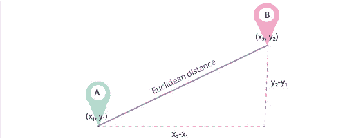

对于 n 维数据，欧几里德距离的公式如下:

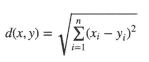

关于核宽度，默认情况下， [LIME 的实现](https://github.com/marcotcr/lime/blob/master/lime/lime_tabular.py)使用指数核，其中核宽度被设置为等于训练数据集中特征数量(N)的平方根的 0.75 倍。您可能想知道这个 sqrt(N)来自哪里。现在假设向量σ = [σ1，σ2，σ3]是向量特征 X [X1，X2，X3 ]的标准差。sqrt(N)是被解释的实例和生成的实例之间的均方根距离。如果我们有一个单一的特征，我们生成一个新的实例，从一个正态分布，均方根距离你期望将等于西格玛(标准偏差)。更正式地说，这个距离由均方根偏差给出。对于统计上独立的 N 个特征，每个特征都来自正态分布，均方可以相等地相加，因此均方根偏差为 sqrt(N)。或者在公式中:

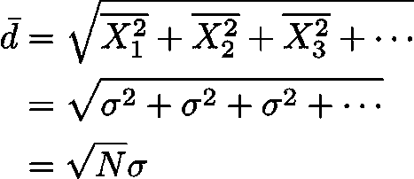

**第五步。**

使用所生成的实例(X_perturb)、黑盒模型对所生成的实例的相应预测(y_perturb)和权重(在步骤 4 中)来训练可解释的局部模型(在这种情况下是线性模型),以导出用作对黑盒模型在该局部的行为的解释的系数。局部(线性)模型的系数将告诉你哪些特征驱动黑盒模型的预测。

```
from sklearn.linear_model import LinearRegression
local_model = LinearRegression() 
local_model.fit(X_perturb, y_perturb, sample_weight=weights)
y_linmodel = local_model.predict(X_perturb)
local_model.coef_
```

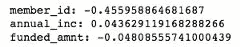

局部线性模型系数—作者计算

本地模型的系数表明，融资额(贷款额)的增加会将预测推向违约类别(y = 0)，同时年收入的增加会将预测推向非违约类别(y =1)。图 3 说明了本地模型的三维决策边界。

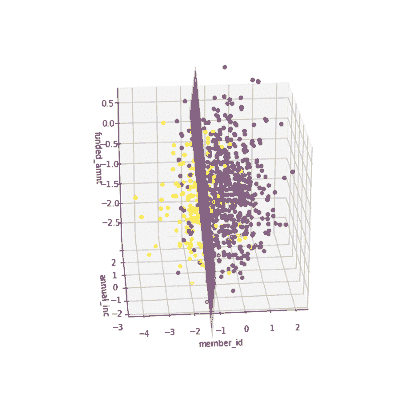

图 3。绘制局部模型的 3D 决策边界。作者可视化。

# 什么是有意义的邻里？

和其他案件一样，细节决定成败。实现一个有意义的地方绝非易事。有目的的邻域需要足够小以实现局部线性。此外，使用大的邻域会带来产生局部模型的风险，该局部模型产生的解释不符合局部情况。原因是，当你创建一个大的邻域时，你会冒有实例远离的风险，因此与你想要解释的实例不同。这意味着对那些远距离实例的黑盒模型的解释可能不同于对所选实例的解释，并且您的解释偏向于全局级别。同时，过小的邻域意味着只将高权重分配给非常接近的实例，这表明您面临欠采样的威胁，并且局部模型的系数在周围的邻域中将是不稳定的。

如果你还记得第四步(如果没有，请回来)，权重是由所谓的内核宽度决定的。这里事情变得棘手，因为内核宽度决定了邻域的大小。一个小的内核宽度意味着你分配更多的权重给生成的实例，这些实例靠近正在解释其预测的实例。同时，大的核宽度意味着无论扰动的实例离原始实例有多近/多远，它们仍然会对局部模型产生一定的影响。在图 4 中，圆圈的大小代表重量。

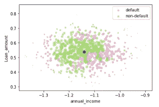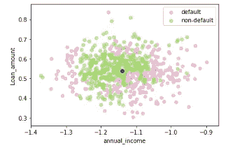

图 4。选择较小的内核宽度(左)和较大的内核宽度(右)—作者可视化

为了查看内核宽度对局部解释的影响，在图 5 中，我说明了内核宽度的变化将如何导致局部模型系数的变化。虚线表示内核宽度的默认值(0.75 乘以特征数量的平方根)。显然，值为 0.5 的核大小将很好地解释黑盒模型在该局部的行为，因为从该阈值上升，局部系数达到稳定。然而，如果我们将内核宽度减小到 0.3 或更低，则局部模型的所有三个系数都会发生剧烈变化，这表明从阈值 0.3 开始，内核大小的减小会降低系数的稳定性。

```
widths = np.linspace(0.01, sigma*np.sqrt(3), 1000)
 alist = []
 blist = []
 clist = []
 sigma = 1
 for width in widths:
     X_perturb, y_perturb, weights = make_perturbations(Xi, sigma=sigma, num=num_perturb, kernel_width = width, seed=8 )
     a,c = get_local_coeffs(X_perturb, y_perturb, weights)
     alist.append(a[0])
     blist.append(a[1])
     clist.append(a[2])
 miny, maxy = np.min([alist,blist,clist]), np.max([alist,blist,clist])
 plt.figure()
 plt.plot(widths, alist, label = "coef1", c = 'yellow')
 plt.plot(widths, blist, label = "coef2", c = 'purple')
 plt.plot(widths, clist, label = "coef3", c = 'green')
 plt.plot([0.75*sigma*np.sqrt(3), 0.75*sigma*np.sqrt(3)], [miny, maxy], c='black', ls=':')
 plt.ylim([miny,maxy])
 plt.xlabel("Kernel width")
 plt.ylabel("Regression coefficient")plt.legend()
 plt.show()
```

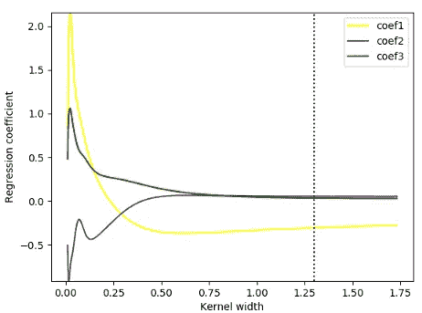

图 5。不同核宽度的局部模型系数——作者举例说明

为了进一步证实，我展示了 100 个不同模型的系数的均值和置信区间，这些模型具有我的黑盒模型中 3 个特征的不同核宽度。三条实线(紫色、蓝色和橙色)代表 100 个不同模型的相应平均系数。阴影(紫色、蓝色和橙色)区域表示每个特征的 95%置信区间。正如所观察到的，随着内核宽度大于 0.3，平均系数变得不那么分散(由较小的 CI 表示)。同时，小于 0.3 的核宽度将导致所有特征的系数不稳定。显然，在系数稳定性和内核宽度(作为局部性级别的度量)之间有一个折衷。本质上，**为了识别一个最优的邻域，你的目标是获得最小的核宽度，其中线性模型的系数保持稳定。**这个问题 Alvarez-Melis，d .，& Jaakkola，T. S. (2018)和 Thomas，a .等人，(2020)已经做了充分的分析和讨论，你可以看看进一步的了解。

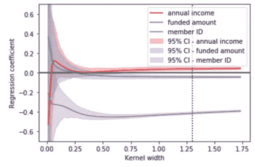

图 6。不同内核宽度的 100 个不同局部模型的系数—作者可视化

# 美女与野兽

那么当我有高精度模型时，我还需要石灰吗？问题是，在不知道模型选择哪些症状来做决定的情况下，你不知道模型是否能为错误的原因给出正确的答案。由于 LIME 能够根据它的解释找到本地模型，您可以与领域专家交流并询问这是否有意义。因此，LIME 还可以提供关于黑盒模型如何以及为什么做出错误预测的见解。

我能信任莱姆吗？一些想法:首先，LIME 解释是不稳定的，因为它依赖于你生成的假实例的数量和你选择的内核宽度，正如上面讨论的。在某些情况下，你可以通过改变内核宽度来完全改变解释的方向(如图 5，6 中系数的变化所示)。

其次，LIME 是一种基于事物在局部水平上具有线性关系的假设的事后技术。这是一个非常大的假设。有时，当你的黑盒模型非常复杂，而模型又不是局部线性的，那么使用线性模型的局部解释就不够好了。也就是说，当模型过于复杂时，我们必须非常小心，并相应地调整内核宽度。我高度怀疑莱姆可以用来解释**任何**复杂的模型。

简而言之，LIME 将能够给出一个好的局部解释——只要实现了正确的邻域和局部线性。但是由于上面提到的潜在隐患，石灰应该同时非常小心地使用。

感谢您的阅读。希望这对学习有帮助。

# 参考

[1] Alvarez-Melis，d .，& Jaakkola，T. S. (2018)。论可解释性方法的稳健性。 *arXiv 预印本 arXiv:1806.08049* 。 *9*

[2] Baehrens，d .，Schroeter，t .，Harmeling，s .，Kawanabe，M .，Hansen，k .，和 M ' ller，K. R. (2010 年)。如何解释个人分类决策？*机器学习研究杂志*，*11*(6 月)，1803–1831 年。

[3]莫尔纳尔，C. (2019)。*可解释的机器学习*。露露。com。

[4]里贝罗，M. T .，辛格，s .，& Guestrin，C. (2016 年 8 月)。“我为什么要相信你？”解释任何分类器的预测。第 22 届 ACM SIGKDD 知识发现和数据挖掘国际会议论文集(第 1135-1144 页)。

[5] Thomas，a .等人，可解释的机器学习方法的局限性(2020 年)

[6] [媒体博客上的石灰](/understanding-model-predictions-with-lime-a582fdff3a3b)由 Lar

[7]使用 LIME 框架的可解释机器学习— Kasia Kulma(博士)，数据科学家，Aviva — H2O.ai

# 确认

感谢罗伯特的讨论，并帮助我与一个很好的三维绘图。