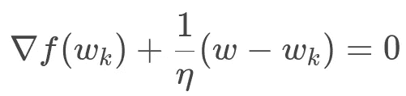
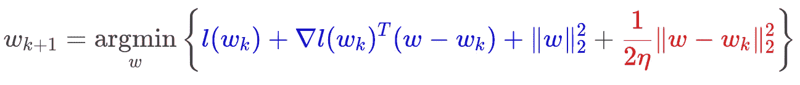

# 打开黑匣子——超越梯度下降

> 原文：<https://towardsdatascience.com/opening-the-black-box-beyond-gradient-descent-439596fce294?source=collection_archive---------44----------------------->

## 梯度下降近似视图介绍

当训练模型时，我们试图最小化训练样本上模型损失函数的平均值:

对于以上总和中的每个 *i* ， *f_i* ，是 iᵗʰ训练样本所遭受的损失，作为模型的参数向量 *w* 的函数。对于损失最小化任务，我们采用随机梯度方法的变体:在步骤 *k* ，我们从{ *f_1* ，…， *f_n* }中随机选择一个函数 *f* ，并计算:

梯度步长

该方法存在许多变体，如 mini-batching、Ada-Grad 和 Adam，但有一点是所有这些方法共有的:每个损失 *f* 都作为“黑箱”给出——除了计算其梯度的能力之外，没有任何假设。

黑盒方法有其优点，例如，我们可以很容易地改变损失函数，而不改变训练算法。但是这种方法有一个主要缺点——我们没有利用任何关于 *f* 的知识，如果利用这些知识，可能会导致更有效的算法，并大大减少训练我们的模型所需的计算资源。

# 热身——近视图

梯度步骤通常被教导为“在负梯度方向上迈出一小步”。但是还有一种替代观点，即*近端*观点:

梯度法的近视图。蓝色——在 *w_k 处的切线。红色——靠近* w_k *。*

让我们简化上面的“多毛”公式。蓝色项是切线，或在 *w_k* 处的一阶近似，而红色项是对 *w_k.* 的近似度量。因此，根据近似视图，

> 在每次迭代中，我们最小化一个在沿切线下降和保持接近 w_k *之间平衡的函数。*

两个冲突力之间的平衡由 1 */η —* 邻近项的权重决定。正切和邻近项之和在 *w_k* 处产生一条‘正切抛物线’，其最小值是下一次迭代。

因此，直观地说，近端视图将梯度步长解释为正切抛物线的最小值，其局部近似我们的损失函数，如下所示。 *η* 越大，抛物线越“平”，因此我们离当前迭代 *w_k* 越远。

黑色曲线——损失函数 f .橙色曲线——局部近似正切抛物线。我们计算梯度步长，作为正切抛物线的最小值。

形式上，要说服自己上面的公式确实是变相的梯度步长，我们来解决最小化问题。取 *argmin* 内的项的梯度 w.r.t *w* 并使其等于零，得到:

两边乘以 *η* 并提取 *w* ，恢复梯度步长。

**备注**:梯度法的近似观点在优化领域已经广为人知很久了，可以在 Boris Polyak 1987 年出版的《优化导论》一书中找到。

# 变暖—正规化

切线当然是我们一无所知的函数的合理近似。但是如果我们**知道些什么呢？我们可以用更好的近似值代替蓝色部分(切线)吗？**

我们来看一个具体的例子。假设每个损失都被*正则化*，即，

其中 *lᵢ* 是(可能加权的)‘原始’损失，我们在其上添加一个正则化项。在这种情况下，我们可以用切线来近似 *lᵢ* ，同时保持正则项不变。为什么我们要？因为以下直觉的经验法则:

> 我们逼近得越少，关于损失函数的信息被保留和利用得越多，从而获得更好的算法。

在我们的例子中，原来的梯度步骤被替换为

看看能否得到一个 *w_{k+1}* 的显式公式。取梯度 w.r.t *w* ，等于零，结果为:

提取 *w* ，我们得到

我们得到了一个全新的算法，它与直接应用于损失的随机梯度法有本质的不同。根据我们的新算法，在每次迭代中，我们将随机梯度步骤应用于“原始”损失 *l* ，然后将结果除以(2 *η* +1)。

# 超越 L2 正则化

如果正则项不是平方欧几里德范数，而是其他函数 *g* 会发生什么？明确地写，损失是

最近的问题变成了

我们获得了众所周知的[近端梯度](https://en.wikipedia.org/wiki/Proximal_gradient_method)阶梯。为了在实践中实现，我们需要一个显式的公式来进行下一次迭代 *w_{k+1}。*

在前面的例子中， *g* 是平方欧几里德范数，在这种情况下，我们可以很容易地获得一个显式公式。一般来说，推导这样一个公式并不总是可能的，当它是可能的时候，它取决于函数 *g* 。每个 *g* 导致不同的定制更新步骤，因此该方法不再是“黑盒”——我们*为每个 *g* 定制*它。

因此， *g* 应该足够“简单”,这样就可以得到一个简单的显式公式，因此这个方案只适用于这种“简单”的函数 *g* 。

# 更多主题

*   不同的近似值而不是正切值导致*稳定的*学习——它对步长的选择不太敏感，为我们节省了昂贵的步长调整。参见[1]中的示例。
*   超越切线抛物线—考虑非二次邻近项。例子包括众所周知的镜像下降算法[2]的随机变体，这对于许多问题类别是有利的。

# 参考

[1]:希拉勒·阿西，约翰·杜奇(2019 年 7 月)。随机(近似)邻近点方法:收敛性、最优性和适应性。[https://arxiv.org/abs/1810.05633](https://arxiv.org/abs/1810.05633)

[2]:阿米尔·贝克、马克·特布尔(2003)。*凸优化的镜像下降和非线性投影次梯度方法。*[https://www . science direct . com/science/article/ABS/pii/s 0167637702002316](https://www.sciencedirect.com/science/article/abs/pii/S0167637702002316)