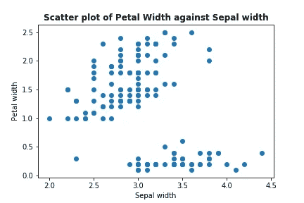
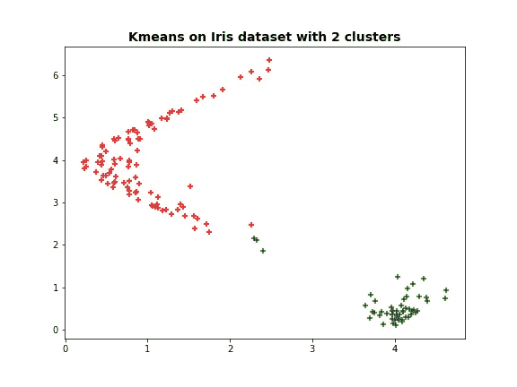
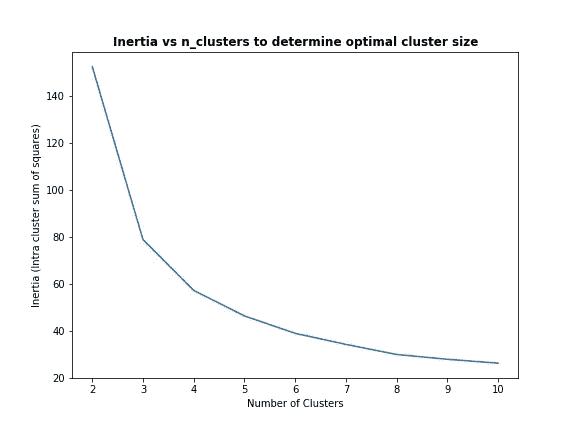
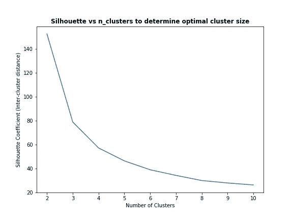
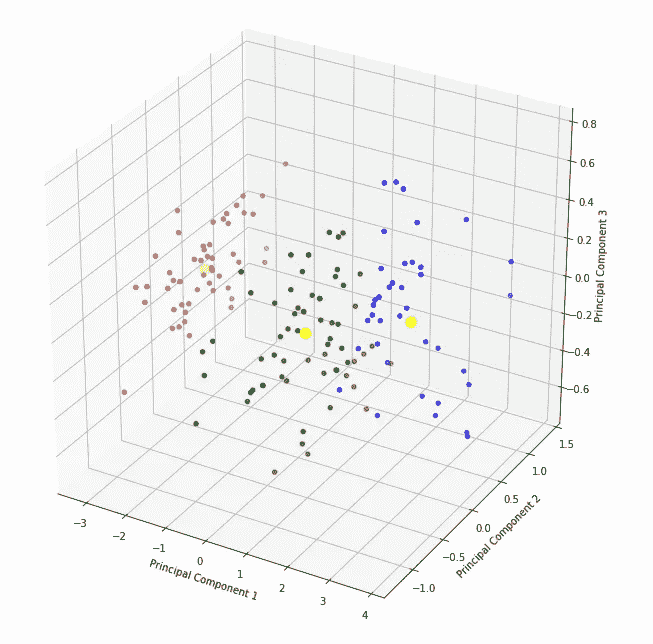

# 打开集群的黑匣子— KMeans

> 原文：<https://towardsdatascience.com/opening-the-black-box-of-clustering-kmeans-e970062ff415?source=collection_archive---------29----------------------->

## 无监督学习系列的第一部分


Brian Kostiuk 在 [Unsplash](https://unsplash.com?utm_source=medium&utm_medium=referral) 上拍摄的照片

这是聚类的三部分系列的第一部分，其中我将介绍一些最流行的聚类算法，包括 **K-Means** 、**凝聚聚类**和**高斯混合模型**。这些是分别基于分区/距离、层次和密度的不同聚类方法。

本文专门介绍 K-Means 聚类。

> “无监督学习是未来大多数人的学习方式。你脑子里有这个世界如何运转的模型，你正在对它进行提炼，以预测你认为未来会发生什么。”— **马克·扎克伯格**

无监督学习形成了机器学习的一个非常小众的部分，只是因为大多数任务都有一个标签(*监督*)。然而，在我们缺少这些标记为*的*数据的情况下，聚类方法可以通过对数据集进行推断来帮助我们找到模式。应用聚类的常见领域包括客户细分(针对广告定位)、人口分析(了解人口统计数据)以及异常检测。

一些人认为无监督学习是机器学习中的一个灰色区域，因为有时很难解释算法输出的聚类类型，因为没有单一的“度量”可以告诉我们这些预测的聚类有多有意义。

# k 均值

K-means 聚类是一种基于*距离的*聚类方法，用于在一组未标记的数据中寻找聚类和聚类中心。这是一个久经考验的方法，可以使用 *sci-kit learn* 轻松实现。

K-Means 的目标相当简单——将“相似”(基于距离)的点分组在一起。这是通过将数据点的中心视为相应聚类(质心)的中心来实现的。

核心思想是这样的:通过迭代计算更新聚类质心，迭代过程将继续，直到满足某些收敛标准。

## 工作原理:

1.  首先，选择期望的集群数量，比如说 *K* 。
2.  从数据集中选择 K 个随机点作为聚类质心。
3.  在每一步，选择一个未分配的数据点，并检查哪个质心最接近它。亲密度的定义通常由距离度量来衡量，通常以欧几里德距离的形式。
4.  为每个点分配一个聚类后，使用同一聚类内数据点的*平均值*重新计算新的聚类质心。这用于优化群集质心的位置。
5.  重复步骤 3 和 4，直到 **a)** 质心已经稳定(不超过阈值)或者 **b)** 已经达到期望的迭代次数。

注意，质心实际上不是数据集中的实际数据点。

## 使用虹膜数据集的示例

对于那些不熟悉这个数据集的人来说，它包含了*鸢尾*花的变异数据，特征包括`sepal_length`、`sepal_width`、`petal_length`和`petal_width`。由于这是一个无人监督的问题，我不会透露有多少种不同类型的虹膜(*要了解更多关于数据集的信息，请访问此* [*链接*](https://scikit-learn.org/stable/auto_examples/datasets/plot_iris_dataset.html) )。

我们将使用`iris`数据集来展示 K-Means 如何工作。让我们首先导入数据并将其可视化。

```
import numpy as np
from sklearn import datasets, cluster
import matplotlib.pyplot as plt
%matplotlib inlineiris = datasets.load_iris()
x = iris.data[:, [1,3]] # takes the 2nd and 4th column of the data
plt.scatter(x[:,0], x[:,1])
plt.xlabel('Sepal width')
plt.ylabel('Petal width')
plt.show()
```



上述代码块的输出

从上面的形象化来看，似乎有两个不同的星团。现在，让我们使用 sci-kit learn 的 K-Means 算法。

```
from sklearn.cluster import KMeansx_ = iris.data # Note that in we use all 4 columns here
random_state = 2020kmeans = KMeans(n_clusters=2, init='k-means++', random_state=random_state)
kmeans.fit_transform(x_)
label = kmeans.labels_
color = ['red','green','blue']plt.figure(figsize=(8, 6))
plt.scatter(x_fit[:,0], x_fit[:,1], c=[color[i] for i in label], marker='+')
plt.title('Kmeans on Iris dataset with 2 clusters', fontweight='bold', fontsize=14)
plt.show()
```



虹膜数据集上的 k-均值算法

看起来使用`n_clusters = 2`的分离产生了相当不错的结果，除了少量可能被错误聚类的数据点(中间的绿色数据点应该是红色的)。

从上面，我们通过视觉检查数据(使用两个特征)来确定集群的数量`n_clusters`。很明显，确定最优的`n_clusters`是聚类中非常重要的一步，尤其是 K-Means，这个数字必须在算法中预先指定。通过使用两个特征来直观地检查数据显然是不够的，因为如果我们的数据是高维的，可能会有额外的聚类，并且我们的人类判断可能会失败(特别是对于任何更三维的数据)。

## 如何确定最佳聚类数

**方法 1:** 弯头绘图

该方法使用 sklearn 的`inertia_`方法计算总的**类内误差平方和** (SSE)。肘部扭结的点(梯度急剧变化)表明收益递减，我们通常希望在这种情况发生之前采取`n_clusters`。直觉上，我们想要一个最小化 SSE 的数字`k`，但同时增加的`k`会自然地将 SSE 减少到零(其中每个数据点都是它自己的聚类)。在下面的例子中，`n_clusters = 3`似乎是最理想的。

```
elbow = []
kmax = 10for k in range(2, kmax+1):
    kmeans = KMeans(n_clusters = k).fit(x_)
    elbow.append(kmeans.inertia_)

plt.figure(figsize=(8,6))
plt.plot(np.arange(2,11), elbow)
plt.xlabel('Number of Clusters')
plt.ylabel('Inertia (Intra cluster sum of squares)')
plt.title('Inertia vs n_clusters to determine optimal cluster size', fontweight='bold')
plt.show()
```



利用惯性确定最佳 n _ 簇

但是，当数据不是很集中时，这种方法可能不太适用。因此，用我们的下一个方法做交叉检查可能更好。

**方法 2:** 剪影图

轮廓系数本质上就是我们所说的*簇间*距离。一般来说，聚类旨在最小化类内距离，同时最大化类间距离。使用这两种方法将确保`n_clusters`被更好地定义。

```
from sklearn.metrics import silhouette_score
sil = []
kmax = 10for k in range(2, kmax+1):
    kmeans = KMeans(n_clusters = k).fit(x_)
    labels = kmeans.labels_
    sil.append(silhouette_score(x_, labels, metric = 'euclidean'))

plt.figure(figsize=(8,6))
plt.plot(np.arange(2,11), elbow)
plt.xlabel('Number of Clusters')
plt.ylabel('Silhouette Coefficient (Inter-cluster distance)')
plt.title('Silhouette vs n_clusters to determine optimal cluster size', fontweight='bold')
plt.show()
```



利用剪影系数确定最佳 n 簇

理想情况下，我们希望轮廓系数尽可能高(即最大化聚类间距离)。在这种情况下，`n_clusters = 2`似乎是最理想的。

**协调肘部和轮廓之间的差异**

既然手肘图提示`n_clusters = 3`而侧影图提示`n_clusters = 2`我们该怎么办？

**方法一:**尽量把数据可视化！在这种方法中，我们使用主成分分析(PCA ),以便我们可以绘制数据的三维图。因为这个主题是关于聚类的，所以我不会深究 PCA 的细节(如果你们想了解它，请在评论中告诉我！).

```
from sklearn import decomposition
from mpl_toolkits.mplot3d import Axes3Dx_full = iris.datapca = decomposition.PCA()
xr = pca.fit_transform(x_full)kmeans = cluster.KMeans(n_clusters=3, init='k-means++', random_state=random_state)
kmeans.fit(xr)
label = kmeans.labels_
color = ['red', 'green', 'blue']plt.figure(figsize=(12, 12))
fig = plt.subplot(1, 1, 1, projection='3d')
fig.scatter(xr[:,0], xr[:,1], xr[:,2], c=[color[i] for i in label])
fig.scatter(kmeans.cluster_centers_[:,0], kmeans.cluster_centers_[:,1], c='yellow', s=100)
fig.set_xlabel('Principal Component 1')
fig.set_ylabel('Principal Component 2')
fig.set_zlabel('Principal Component 3')
plt.show()
```



虹膜数据集的三维图(PCA 后)

从上面的三维图来看，似乎确实有三个不同的集群——尽管不能完全确定，因为集群间的距离并不高。

**方法 2:** 使用描述性统计来理解聚类

描述性统计涉及使用平均值、最大值、最小值和中值等度量来找出聚类之间的差异。在无监督学习中，手头的问题没有“正确”的答案，大多数时候，找到最佳数量的聚类需要查看这些聚类的结果(即，比较这些不同聚类的描述性统计数据)。

(*然而，在这种情况下，如果我们想要“作弊”，我们确实知道在数据集中实际上有 3 种不同类型的虹膜变体(因为它被标记了！)*

## K 均值评估

*优点*:

*   易于使用和理解
*   适用于聚类之间的层次关系易于检测的数据集
*   相对较低的时间复杂度和较高的计算效率，从而带来较高的可扩展性

*缺点*:

*   不适合非凸数据
*   对聚类质心的初始化高度敏感——值得调整超参数，如`n_init`和`init='random'`,以确保获得一致的聚类结果
*   对异常值高度敏感——K-Means 中的*表示*表示异常值会显著扭曲聚类质心——其他使用众数或中位数的算法不太容易出现异常值
*   容易陷入局部最优
*   聚类结果对聚类数很敏感

## 最后的想法和结束语

对于任何聚类问题，K-Means 都是一个很好的入门模型，因为它能够适应高维数据。但是，重要的是要知道正在使用哪种距离度量、模型对异常值的敏感度，以及最重要的是，使用领域知识来相应地调整模型。

在这个 3 部分系列的第二部分中，我将探索一个不同的数据集，并使用**凝聚聚类**(层次聚类的两种变体之一)进行分析。我还将通过一些方法来获得模型所产生的集群的描述性统计数据。

***专业提示*** *:解释生成的聚类与获取聚类本身同等重要(如果不是更重要的话)！*

请继续关注这个聚类系列剩下的两个部分——**凝聚聚类**和**高斯混合模型**！