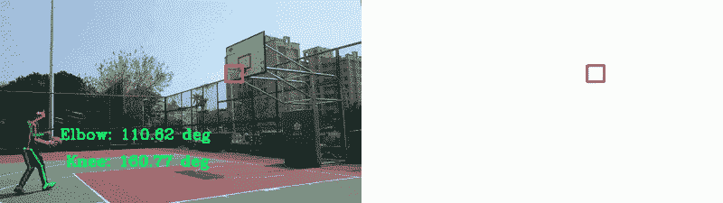
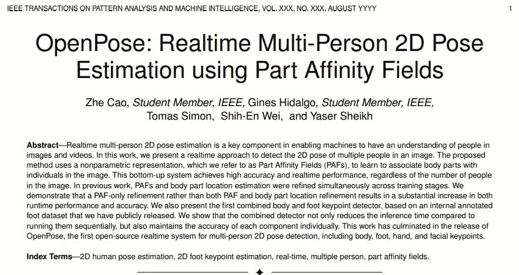
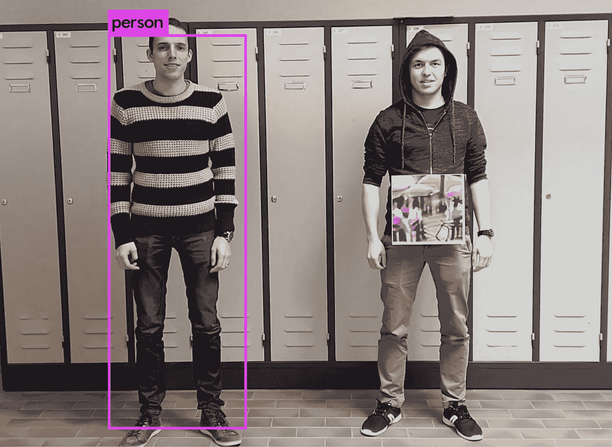
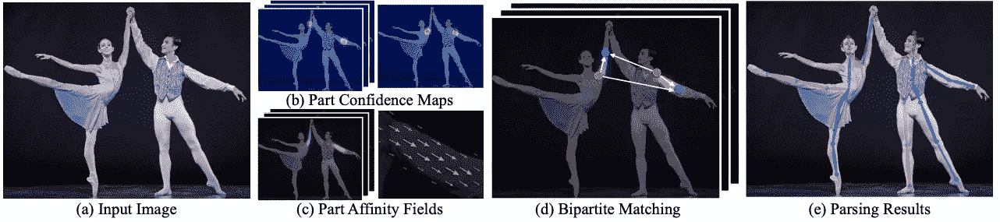
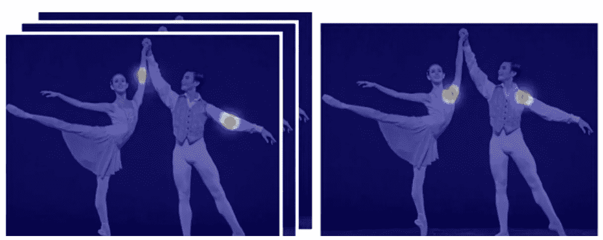
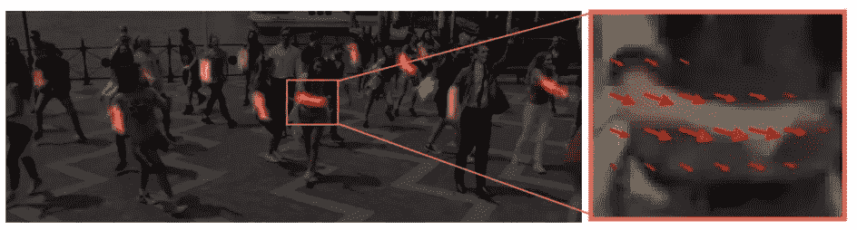
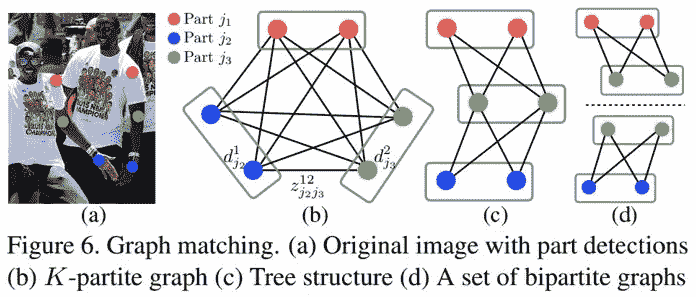
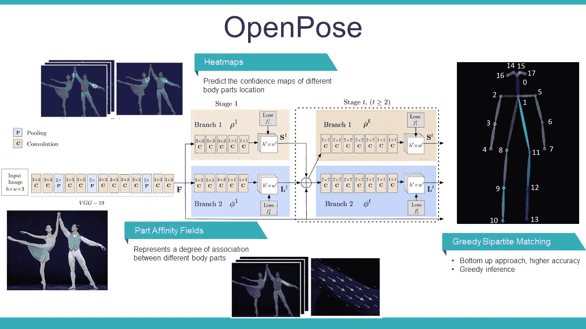
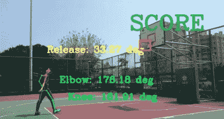

# OpenPose 研究论文摘要:具有深度学习的多人 2D 姿态估计

> 原文：<https://towardsdatascience.com/openpose-research-paper-summary-realtime-multi-person-2d-pose-estimation-3563a4d7e66?source=collection_archive---------21----------------------->

## 机器理解人类的姿势。



AI 篮球分析。图片由 Chonyy 提供。

# 介绍

这篇论文总结会让你很好的理解 OpenPose 的**高层**概念。由于我们将重点放在他们的创造性管道和结构上，所以在这个总结中不会有困难的数学或理论。

我想先谈谈为什么我想分享我从这篇精彩的论文中学到的东西。我已经在我的[***AI 篮球分析***](https://github.com/chonyy/AI-basketball-analysis) 项目中实现了 OpenPose 库。在我构建这个项目的时候，我只知道 OpenPose 的基本概念。我花了大部分时间研究代码实现，并试图找出将 OpenPose 与我最初的篮球投篮检测相结合的最佳方式。


来源:[https://github.com/CMU-Perceptual-Computing-Lab/openpose](https://github.com/CMU-Perceptual-Computing-Lab/openpose)

现在，正如你在 GIF 中看到的，这个项目已经基本完成了。我在搭建了这个项目之后，对 OpenPose 的实现有了充分的掌握。为了更好地了解我一直在处理的事情，我想现在是我更深入地看看 [***研究论文***](https://arxiv.org/pdf/1812.08008.pdf) 的时候了。



图像取自“使用部分亲和场的实时多人 2D 姿势估计”。

# 概观

> 在这项工作中，我们提出了一种实时方法来检测图像中多人的 2D 姿态。

> 所提出的方法使用非参数表示，我们称之为部分亲和场(PAF)，以学习将身体部分与图像中的个体相关联。这种自下而上的系统实现了高精度和实时性能，而不管图像中有多少人。

## 为什么难？

让我们先来谈谈是什么让估算图像中多人的姿势变得如此困难。这里列出了一些困难。

*   人数不详
*   人们可以以任何姿势或比例出现
*   人的接触和重叠
*   运行时的复杂性随着人数的增加而增加

## 通用方法

OpenPose 绝对不是第一个面临这个挑战的团队。那么其他团队是如何解决这些问题的呢？



来源:[https://medium . com/synced review/now-you-see-me-now-you-don-folling-a-person-detector-aa 100715 e 396](https://github.com/Vinayak96/people_detection)

> 一种常见的方法是采用一个人检测器，并为每次检测执行单人姿势估计。

这种**自上而下**的方法，听起来真的很直观简单。然而，这种方法有一些隐藏的陷阱。

*   早期承诺:当人员探测器出现故障时，没有资源进行恢复
*   运行时间与人数成正比
*   即使人检测器失败，也执行姿态估计

## 最初的自下而上方法

> 如果自顶向下的方法听起来不是最好的方法。那我们为什么不试试自下而上呢？

毫不奇怪，OpenPose 并不是第一个提出自下而上方法的团队。其他一些团队也尝试了**自下而上**的方法。然而，他们仍然面临着一些问题。

*   在最终解析时需要昂贵的全局推理
*   没有保留效率上的收益
*   每幅图像需要几分钟

# 开放式管道



整体管道。图像取自“使用部分亲和场的实时多人 2D 姿势估计”。

```
(a) Take the entire image as the input for a CNN
(b) Predict confidence maps for body parts detection
(c) Predict PAFs for part association
(d) Perform a set of bipartite matching
(e) Assemble into a full body pose 
```

## 置信图

置信图是特定身体部位可以被定位的信念的 2D 表示。单个身体部位将被表示在单个地图上。因此，地图的数量与身体部位的总数相同。



右图只用于检测左肩。图像取自“使用部分亲和场的实时多人 2D 姿势估计”。

## 阵发性心房颤动

> 部分亲合场(PAF)，一组 2D 矢量场，对图像域上肢体的位置和方向进行编码。



图像取自“使用部分亲和场的实时多人 2D 姿势估计”。

## 二分匹配



图像取自“使用部分亲和场的实时多人 2D 姿势估计”。

> 在寻找多人的全身姿态时，确定 Z 是一个 K 维匹配问题。这个问题是 NP 难的，存在许多松弛问题。在这项工作中，我们添加了两个针对我们领域的优化放松。

*   松弛 1:选择最小数量的边来获得生成树骨架。
*   松弛 2:将匹配问题进一步分解为一组二部匹配子问题。独立确定相邻树节点中的匹配。

# 结构

## 原结构



图片由 Chonyy 提供。

原来的结构是**分裂成两个分支**。

*   米色分支:预测置信图
*   蓝色分支:预测 PAF

这两个分支都被组织为迭代预测架构。来自前一阶段的预测与原始特征 F 连接，以产生更精确的预测。

## 新结构


图像取自“使用部分亲和场的实时多人 2D 姿势估计”。

> 第一组阶段预测 PAFs L t，而最后一组预测置信图 st。每个阶段的预测和它们相应的图像特征被连接用于每个后续阶段。

与他们以前的出版物相比，他们取得了重大突破，提出了一种新的结构。从上面的结构可以看出，置信图预测是在最精确的 PAF 预测之上运行的。

为什么？原因其实真的很简单。

> 我凭直觉，如果我们看一下 PAF 通道的输出，身体部位的位置就能猜到。

# 其他图书馆呢？

越来越多的计算机视觉和机器学习应用需要 2D 人体姿态估计作为其系统的输入。OpenPose 的团队绝对不是唯一做这项研究的人。那么，为什么我们总是想到 OpenPose 当谈到**姿态估计**而不是阿尔法姿态？以下是其他图书馆的一些问题。

*   要求用户实现大部分管道
*   用户必须构建他们自己的框架阅读器
*   面部和身体关键点检测器没有组合

# 人工智能篮球分析

我在这个 [***AI 篮球分析***](https://github.com/chonyy/AI-basketball-analysis) 项目中实现了 **OpenPose** 。一开始我只有一个想法，就是想分析射手的射击姿势，但是完全不知道怎么做！幸运的是，我遇到了 OpenPose，它给了我想要的一切。



图片由 Chonyy 提供。

虽然安装过程有点麻烦，但实际的代码实现相当简单。它们的功能以一帧作为输入，输出人体坐标。更好的是，它还可以在框架上显示检测覆盖图！代码实现的简单性是他们的 [repo](https://github.com/CMU-Perceptual-Computing-Lab/openpose) 能够在 GitHub 上获得 **18.6k+ stars** 的主要原因。

我的项目在下面，可以随意查看！

[](https://github.com/chonyy/AI-basketball-analysis) [## chonyy/AI-篮球-分析

### 🏀用机器学习分析篮球投篮和投篮姿势！这是一个人工智能应用…

github.com](https://github.com/chonyy/AI-basketball-analysis) 

# 参考

[1]曹哲，学生会员，IEEE，吉恩斯·伊达尔戈，学生会员，IEEE，托马斯·西蒙，施-韦恩，亚塞尔·谢赫，“OpenPose:使用部分亲和场的实时多人 2D 姿势估计”，CVPR，2019。