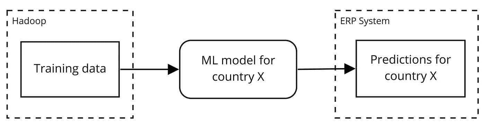
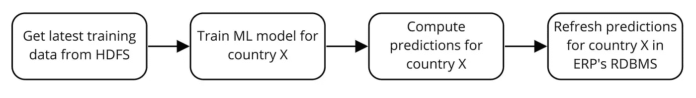
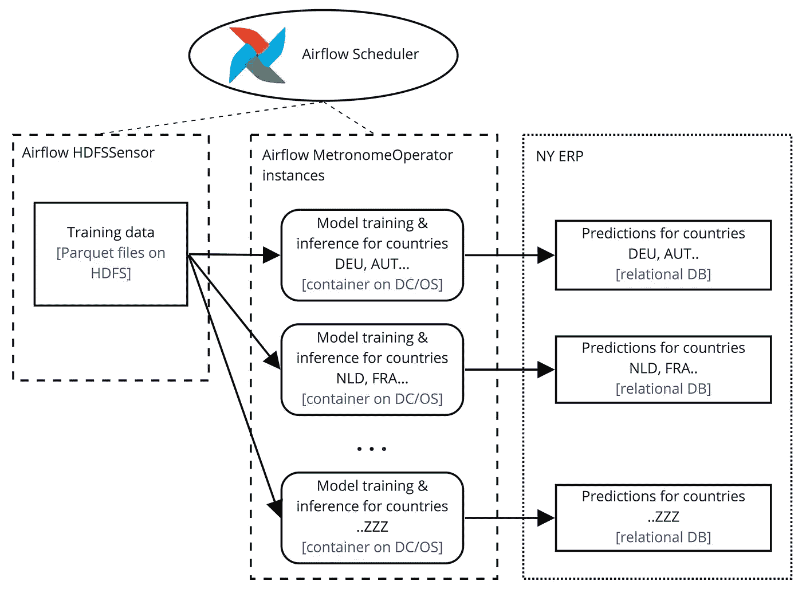
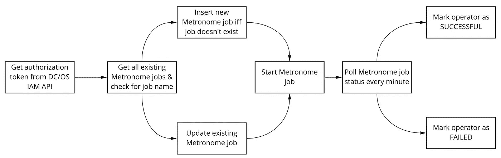

# 使用气流在 Apache Mesos 和 Hadoop 上操作 ML 管道

> 原文：<https://towardsdatascience.com/operationalization-of-ml-pipelines-on-apache-mesos-and-hadoop-using-airflow-8c1d89e0ad3b?source=collection_archive---------55----------------------->

## **在《纽约客》将 ML 模型投入生产的架构**

*这篇博文最初出现在《纽约客》科技博客*[](https://www.newyorker.ai/operationalization-of-machine-learning-pipelines-on-apache-mesos-and-hadoop-using-airflow/)**上。**

**

*西蒙·米加吉在 [Unsplash](https://unsplash.com/?utm_source=unsplash&utm_medium=referral&utm_content=creditCopyText) 上拍摄的照片*

*零售公司中对机器学习影响最大的用例之一是降价。作为欧洲最大的时装零售商之一，纽约客为我们在 45 个国家的 1100 家商店出售的每件商品设定了初始价格。价格在一系列降价中逐渐降低，直到商品售完。目标是预测何时以及如何降价，以便整个存货以尽可能高的价格出售。从而使公司收益最大化。*

*解决这个用例涉及两个任务:创建一个提供准确预测的模型，并在我们当前的基础设施上将它投入生产流水线。*

*在本文中，我们将重点关注后一项任务，并介绍一种使用气流在 Apache Mesos 和 Hadoop 上编制生产中的机器学习管道的架构。我们从机器学习模型的需求以及我们当前的基础设施和数据工程架构提出的需求开始。然后，我们提出了一个满足这些要求的架构，包括容器化、流水线流程编排、性能考虑和简化的 DAG 代码。最后是总结和对未来工作的展望。*

# *要求*

*让我们从我们希望实施的模型的需求开始，以及从我们当前的基础设施和数据工程架构中产生的需求。*

**

*模型的**训练数据作为 Parquet 文件存储在我们的 Hadoop 集群中的 HDFS 上。它们是使用 Spark 进行大量前期批量数据处理的结果，包括数据清理、汇总和必要的插补。这个遗留的 ETL 还没有与 Airflow 进行编排，它使用 Luigi 进行工作流管理，使用 Cron 作业进行调度。***

***模型**是用 Python 写的，采用的机器学习框架应该由我们的数据科学家来选择。目前使用的是 LightGBM。训练和推理是在每个国家的基础上完成的，这一特性我们可以在以后的并行化中利用。GPU 支持很重要，因为我们的数据科学家也在考虑深度学习方法，这将从中受益。*

*模型的结果**预测需要写入我们的 ERP 系统的持久层——一个关系数据库。这些预测为我们的定价部门提供指导，定价部门通过 ERP 的用户界面检查这些预测的合理性，并在其认为合适的时间和地点应用建议的降价。由于预测变化非常缓慢，因此需要在每周初刷新一次。***

*除了前面提到的 Hadoop 集群，我们还在基础设施中部署了一个[DC/操作系统集群](https://www.newyorker.ai/a-brief-introduction-to-d2iq-dc-os/)。它为我们提供了基于 Apache Mesos 的**容器编排和资源调度**。GPU 可以通过[马拉松应用](https://www.newyorker.ai/anatomy-of-a-marathon-application-definition/)和[节拍器作业](https://www.newyorker.ai/anatomy-of-a-metronome-job-definition/)定义用于长时间和短时间运行的应用。我们有一个在 DC 操作系统上运行的集装箱化气流装置，用于编排我们的大部分数据管道。*

# *体系结构*

*为了满足上述要求，我们提出了以下架构。*

# *集装箱化*

*我们已经决定将模型训练和推理计算容器化，并使用 DC/OS 来运行它。这有两个好处。首先，它保留了我们的数据科学家选择的机器学习框架的独立性。其次，我们可以利用 DC/OS 集群上现有的 GPU 来加速未来的深度学习方法。*

*如果我们选择在 Hadoop 上使用 SparkML 或使用 Spark 并行化另一个 ML 框架，我们将不得不将现有的 LightGBM 模型迁移到这种方法。这样我们就基本上锁定了所采用的 ML 框架。此外，为了方便 GPU 的使用，我们需要在 Hadoop 集群上安装 GPU，或者将它们从 DC/操作系统集群移动到 Hadoop 集群。还需要将 Hadoop 版本从目前的 2.x 升级到 3.x。所有这些都不是小事，而且非常耗时。*

*容器本身具有以下工作流程:*

**

*开始时，它从 HDFS 下载训练数据。然后，它在此基础上训练模型，并计算给定国家的预测。最后，预测在 ERP 的底层关系数据库中被刷新。*

*预测的刷新在单个事务中完成，即，它删除单个国家所有项目的旧预测，并写入新预测。我们在这里不使用更新，因为预测集会随着时间而变化。这样，ERP 的用户将总是在 UI 中看到对所选项目集的预测，而不会停机。*

*我们已经对容器进行了参数化，因此它不仅可以计算和刷新单个国家的预测，还可以计算和刷新特定国家组的预测。*

# *管道编排*

*有了用于模型训练和推理的参数化容器，我们现在可以继续部署和编排它的多个实例，以在气流的帮助下形成适当的管道:*

**

*对于短期运行的应用程序，如作业，DC 操作系统在 Mesos 上提供 Metronome 作为任务调度器。由于我们的容器本质上是短暂的，我们可以使用 Metronome 将其部署在 DC/OS 集群上。我们使用 MetronomeOperator 从气流中实现这一点，稍后我们将对此进行更深入的介绍。*

*我们为国家组启动 MetronomeOperator 的多个实例，以便覆盖所有 45 个国家，从而有效地并行化工作。*

*由于传统的 ETL——在 Hadoop 上处理所需的训练数据——还没有与气流协调，我们采用了一个经过修改的 HDFS 传感器来触发 MetronomeOperator 实例的启动。最初的气流 HDFS 传感器只能在 Python 2 中使用。我们做了一些小的改动，以便它可以与我们在集装箱式气流安装中使用的 Python 3 版本一起工作。*

*它的代码可以在这里找到:
[https://github . com/new Yorker data/ny-public-air flow-operators](https://github.com/NewYorkerData/ny-public-airflow-operators#hdfs-sensor-python-3-compatible)*

*我们安排管道与 Hadoop 上的遗留 ETL 同时启动。HDFS 传感器将持续轮询成功文件，并在找到文件时触发 DAG 中的其余操作员。*

***注意:**作为生产管道的一部分，我们也将预测写给 HDFS，供将来分析。在计算过程中，我们记录了所有的弹性搜索步骤。我们已经部署了 Kibana 仪表板，目前使用 [elastalert](https://github.com/Yelp/elastalert) 来监控异常情况并发出警报，例如，预测数量比上次运行时减少了 10%。
在促进生产变更之前，我们使用 [Neptune](https://neptune.ai/) 作为测试管道的一部分，以跟踪和评估各种变更对模型本身的影响。*

# *节拍器气流操作器*

*据我们所知，在项目开始时，没有节拍器操作员负责气流。所以我们创造了一个。*

*它将 [Metronome 作业定义](https://www.newyorker.ai/anatomy-of-a-metronome-job-definition/)作为 JSON 参数，如下图所示工作:*

**

*首先，我们从 [IAM REST API](https://docs.d2iq.com/mesosphere/dcos/1.13/security/ent/iam-api/) 获得一个授权令牌，以便能够在 DC/OS 集群上部署容器。其次，我们通过 [Metronome REST API](https://dcos.github.io/metronome/docs/generated/api.html) 检查作业是否存在。根据响应，我们向上插入作业定义。然后我们开始工作。最后，我们轮询作业状态，根据响应，将气流操作员的状态更改为*成功*或*失败*。*

*操作员的代码可以在这里找到:
[https://github . com/new Yorker data/ny-public-air flow-operators](https://github.com/NewYorkerData/ny-public-airflow-operators#metronome-operator)*

# *性能考虑因素*

*在 Metronome 作业定义中，我们可以为容器指定 CPU、RAM 和 GPU 的使用。因此，我们可以纵向扩展。关于横向扩展，我们通过并行化国家组的模型训练和推断来实现。然而，并行度并不是无限的，而是受到可用集群资源的限制。为了不耗尽所有资源，我们使用气流资源池特性来限制并发运行的容器数量。资源池名称在所有 MetronomeOperator 实例中设置，我们将在下面的 DAG 代码中看到。因此，资源池的大小等于并行度。*

# *实施为气流 DAG*

*下面你可以找到简化版的气流 DAG:*

```
*default_args = {
    "owner": "ny-data-science",
    "start_date": datetime(2020, 1, 1),
    "provide_context": True
}dag = DAG(
    "markdown-pricing-dag",
    schedule_interval="0 8 * * 1", # every Monday at 8am
    dagrun_timeout=timedelta(days=1),
    default_args=default_args,
    max_active_runs=1,
    catchup=True
)# Example list of countries for the model training and inference
COUNTRY_LIST = ["DEU", "AUT", "NLD", "FRA", "ESP", "ITA"]# Job template we will use in the MetronomeOperator
METRONOME_JOB_TEMPLATE = """
{{
  "id": "{}",
  "description": "Markdown Pricing ML Job",
  "run": {{
    "cpus": 4,
    "mem":  32768,
    "gpus": 0,
    "disk": 0,
    "ucr": {{
      "image": {{
       "id": "registry-dns-address:1234/markdown-pricing:latest-master",
       "forcePull": true
        }}
     }},
     "env": {{
        "COUNTRY_GROUP": "{}",
        "DB_USER": "{}",
        "DB_PASSWORD": "{}"
     }}
   }}
}}
"""# Creates a Metronome job on DC/OS by instantiating the MetronomeOperator with the job template above
# and setting the country group and other environment variables
def create_metronome_job_for_country_group(country_group, index):
    return MetronomeOperator(
        task_id=f"metronome_operator_{index}",
        metronome_job_json=
        	METRONOME_JOB_TEMPLATE.format(f"markdown-job-{index}",
                                          country_group,
                                         Variable.get("markdown_erp_db_user"),                                          Variable.get("markdown_erp_db_pwd")),
        dcos_http_conn_id="dcos_master",
        dcos_robot_user_name=Variable.get("robot_user_name_dcos"),
        dcos_robot_user_pwd=Variable.get("robot_user_pwd_dcos"),
        dag=dag,
        pool="markdown_metronome_job_pool",
        retries=3
    )# Get the resource pool size (in slots) for the MetronomeOperator instances from Airflow configuration
metronome_job_pool_size = get_pool_size(pool_name="markdown_metronome_job_pool")# Split the country list into groups into N parts of approximately equal length for parallelization purposes.
# N is here the size of the Metronome job pool.
# Given the COUNTRY_LIST defined above and N = 3, the function will return: [["DEU","AUT"], ["NLD","FRA"], ["ESP","ITA"]]
country_groups = split_country_list(COUNTRY_LIST, metronome_job_pool_size)# Iterates through the country groups and creates a Metronome job for each of those groups
metronome_countries_jobs = [create_metronome_job_for_country_group(country_group=country_group, index=index) for
                            index, country_group in enumerate(country_groups)]# HDFS sensor on the latest training data
training_data_sensor = NYHDFSSensor(
    task_id="training_data_sensor",
    filepaths=[f"/data/production/markdown_training_data/{get_current_date()}/_SUCCESS"],
    hdfs_conn_id="hdfs_conn_default",
    retries=1440,
    retry_delay=timedelta(minutes=1),
    timeout=0,
    dag=dag)# Create DAG
training_data_sensor >> metronome_countries_jobs*
```

# *结论和未来步骤*

*我们展示了一种架构，它允许我们在混合的 Mesos 和 Hadoop 集群环境中使用 Airflow 轻松编排机器学习管道。我们利用 Mesos 的容器编排和资源调度来水平和垂直扩展模型训练和推理，同时能够利用 GPU 提供的可用硬件加速。我们采用 Airflow 的强大功能，如传感器和动态 Dag，来跨集群有效地管理整个工作流。*

*未来我们仍有许多需要改进的地方。
例如，将 Hadoop 上的传统 ETL 从 Luigi/Cron 迁移到 Airflow 将允许我们弃用 HDFS 传感器，并通过使用 Airflow 的管道互依特性来简化 DAG。
我们也知道有些计算在所有国家都很普遍。这个步骤可以在一个单独的阶段中提取，所有进一步的阶段都将依赖于这个阶段，从而可能提高性能。*

*最后，我们正在准备将我们的集群从 Mesos 迁移到 Kubernetes。短期内，我们需要调整我们所有的机器学习管道。这在理论上应该相对容易实现，例如在 Dag 中使用 *KubernetesOperator* 而不是*节拍器 Operator* 。从长远来看，Kubernetes 在机器学习操作化方法方面开辟了一个新的可能性世界，如 Kubeflow。*