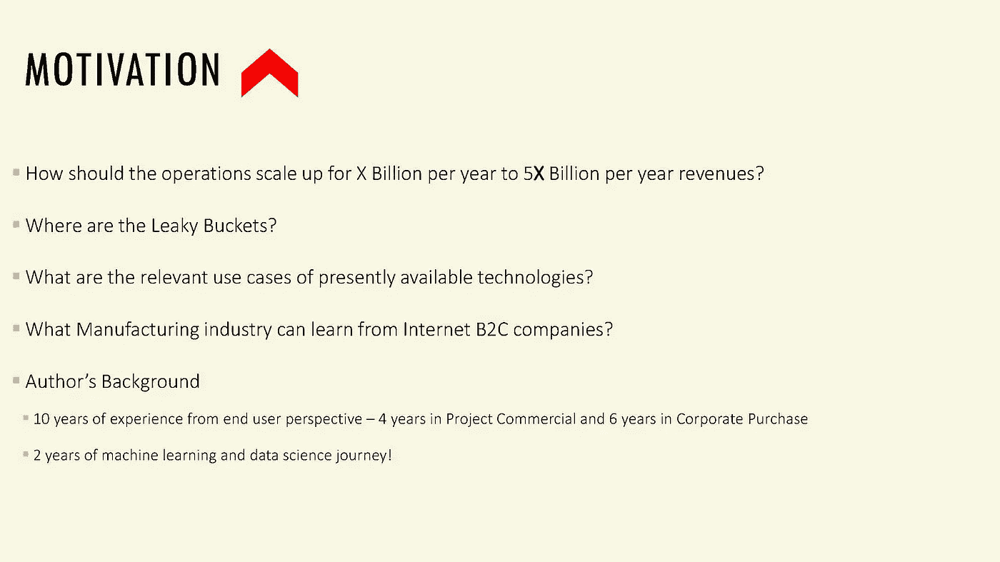
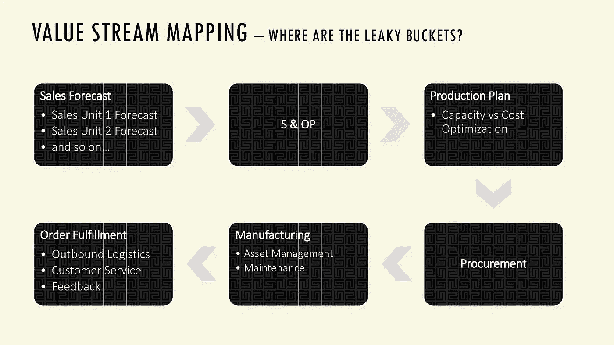
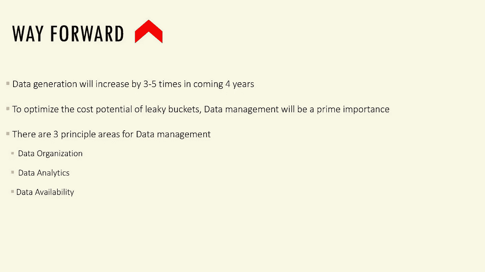
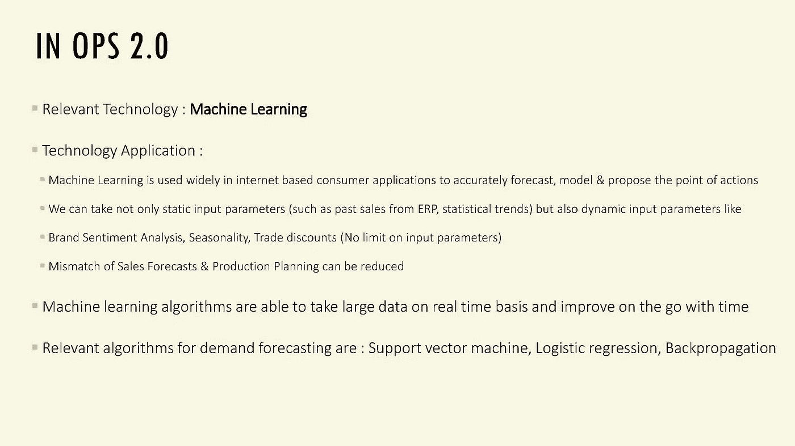
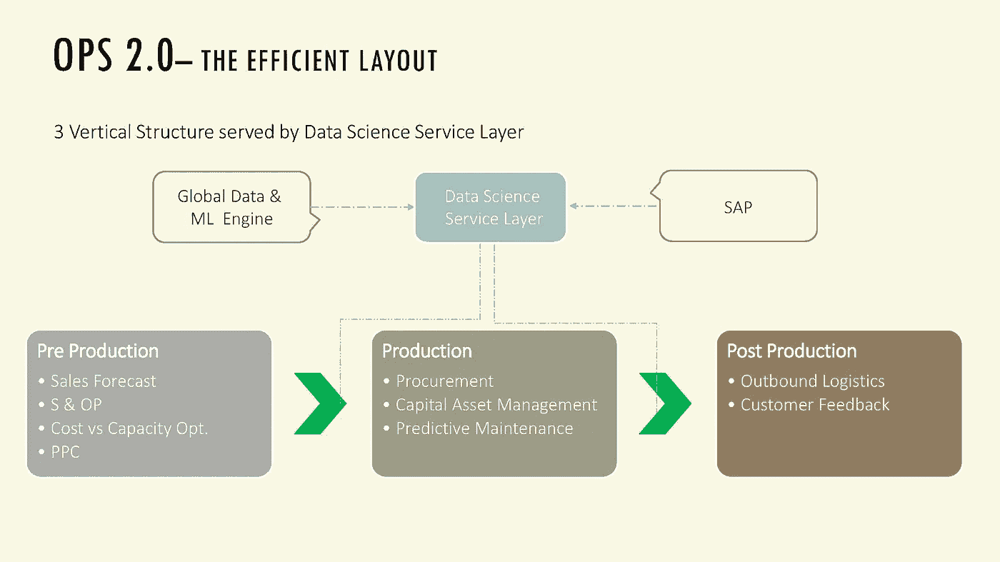

# 2022 年制造业运营的漏桶和数据管道

> 原文：<https://towardsdatascience.com/operations-in-year-2022-7c01716ef382?source=collection_archive---------56----------------------->

我被 2022 年制造运营和采购行业将如何发展的愿景所激励。对我来说，2017 年就已经为 2022 年有效的首席采购官和首席运营官的角色奠定了新的基础。拥有采购和供应链运作的核心领域知识是先决条件。但是，对业务场景中的数据科学和自动化有实际的理解是 cxo 的战略方向所在。

本文总结了我在供应链运营和采购行业长达十年的经验，以及我在数据科学和机器学习领域的两年历程。

根据 2016 年安永的数据，仅在印度就有 630 亿美元的库存过剩。除了现金对现金之外，周期数字显示了印度和世界其他地区营运资本周期的一个关键对比。例如，根据安永 2016 年的数据，印度食品生产商的 C2C 为 57 天，高于美国和欧洲的 34 天和 28 天。与 C2C 为 25、24 和 33 天的日本、欧洲和美国相比，印度电力公用事业部门的 C2C 为 70 天，表现不佳。

所以，以下是我写这篇文章的动机:

*作者图片*

首先，我想画一张制造组织运作过程的价值流图。这是一个由 6 个主要垂直市场组成的安排。从销售预测活动到订单执行。

*作者图片*

所有这些垂直市场都有各自的商业环境变量和多个利益相关者。例如，销售预测通常是分销网络中每个销售办公室或单位的综合需求汇总报表。

销售和运营计划(也称为 S&OP)是一项优化活动，其中 SKU 生产成本、交付周期等是要优化的目标。

重要的是要知道，这些垂直行业之间的有效互动对公司的底线极其重要。高效的交互意味着清晰、具体和准确需求的无缝传递。我多么希望是这样。在我看来，需求预测和 S&OP 仍然是“漏桶”现象的起点。“漏桶”是我对低效率运营的比喻，在这种运营中，由于执行质量差而导致成本流失。

让我们找出之前绘制的价值流中的漏桶。

*作者图片*

因此，我提议优先考虑 5 个漏桶。首席运营官必须开发自己的一套性能指标来衡量这些漏桶的健康状况。从表面上看，我认为从数据科学的角度来看，这些问题是这样的。

虽然图表是不言自明的，但如果您想从数据科学的角度来看这 3 个关键问题，它们是

1.)数据预测

2.)数据可用性

3.)数据优化

在提出解决方案之前，我认为对我来说，解释“现状”场景(即目前的实践)是非常重要的。

**销售预测**

让我们以销售预测为例。我们都知道供应链中的牛鞭效应。但是，它是如何开始的呢？答案是不准确的销售预测。

分销网络中的每个销售单位对其每月销售的每台 SKU 进行预测。然后，来自所有销售单位的数据被整合到一个 Excel 文件中(印度 80%的中小型制造公司都是如此)。然后，按照管理层建议的方向，在所有 SKU 中应用平均缩放/标准化功能。够公平吗？不，不是的。我觉得这种方法很懒惰。

这个过程本身存在固有的问题。单独的过去数据不足以产生准确的销售预测。一个好的销售预测应该考虑到

1.)不同 SKU 销售之间的相关性，以识别同类相食。这可以在每个区域进行。

2.)销售季节性因素

3.)因促销和折扣带来的销售增长

4.)我最喜欢的参数是考虑到由于没有存货而造成的销售损失。这是大多数 ERP 软件难以解决的问题，更不用说超越预测了。你如何对由于需求低而导致销售为零的情况和缺货的情况进行建模？

目前，印度制造业一个月的需求预测准确率为 65%。此外，S&OP 依赖这些预测来制定生产计划。从销售预测到生产计划的典型周期为 3-4 周。

这意味着预测中的任何修正在 3-4 周之前都不会被考虑在内。祝那些未售出的存货好运！这引发了一系列事件，导致印度库存过剩 630 亿美元。

**采购**

如果糟糕的销售预测会影响公司的收入，那么被动的采购方式会影响公司的收入。我非常详细地研究了一些领先制造商的采购方法。如果我必须概括目前的“现状”,它看起来像下面这样

*作者图片*

我希望您只用两个词来描述目前的采购行业。

1.)反应

2.)费力

大多数首席采购官都认为，在线平台是解决这一棘手问题的答案。我不同意。大多数在线平台仅仅是数据输入用户界面。此外，在此类在线平台的开发阶段，所有权成为一个问题。要么是内部 it 团队的，要么是外部咨询机构的。将你的问题外包给不同的团队并不能解决问题。这是懒惰。ERP 爱好者将会提出一个与今天的 MRP/MRP 模块相反的叙述，但是我对垃圾输入和垃圾输出是否适合今天所有的 ERP 套件持怀疑态度。

世界正快速从统计学转向微积分。ERP 软件实施的大部分是基于统计的，如果他们选择不进行过渡，到 2022 年将变得无关紧要。

大多数工具/分析是采购职能仍然在 Excel 中使用短期测量工具完成的，如条形图、加权平均值、成本指数和份额。如我所说，这是被动反应。

**前进的道路**

2022 年的运营前景看起来与今天截然不同。数据科学和机器学习将成为采购和运营经理的必备技能。是的，每个人都需要学习计算机编程的基础知识。以下是我在上述变化背景下的思考。

*作者图片*

2022 年的运营将被塑造成自主的、数据驱动的、最重要的可靠活动。只有目标的定义将由经理决定，其余的一切将自动运行。这就是我的 OPS 2.0。

**那么，如何开始这段旅程呢？**

在我看来，制造业运营可以从互联网 B2C 公司学到很多东西。他们已经开始了迈向 Ops 2.0 的旅程。他们的回答？**机器学习**。

*作者图片*

**OPS 2.0:高效布局**

从“漏桶”结构来看，OPS 2.0 将有 3 个简单的垂直市场。

1.)预生产

2.)生产

3.)后期制作

连接这三个垂直领域的将是数据引擎的服务层。

*作者图片*

如果您还记得上面的幻灯片，我们已经强调了数据管理之旅的 3 个主要领域

1.)数据组织

2.)数据分析

3.)数据可用性

数据组织是指将所有不同的数据源整合到一个数据库中。随着团队的多样化，这是最耗费时间的操作。

多个 Excel 文件、不同格式的相同信息、针对同一组问题的不同假设集、多个利益相关方，这些都是给 OPS 2.0 之旅带来巨大压力的几个因素。

简而言之，合作是第一步。是的，在线平台是向前迈出的一大步。我在许多在线平台实施后的学习是专注于消除冗余信息。

**“每个利益相关者都能一次性获得正确的信息**”是我们应该采纳的座右铭。

然后，第 2 步需要 CPO、业务经理、采购经理和运营经理的核心领域知识。商业分析将由机器学习算法驱动。没有完美的算法，即使使用标准算法，也必须根据业务环境选择超参数。

机器学习就是优化。但是，它必须由目标或数据科学家定义的术语来指导:成本函数必须优化或分类。

**如果你指望你的 IT 团队实现一个尺寸适合所有机器学习算法，准备失望吧。**

在这三个垂直领域中的每一个领域，都有专门的数据科学家团队进行算法开发+业务经理亲自操作 python 和最小编码+ IT 团队使信息可访问。

这就是 OPS2.0 将由数据层即服务部署驱动的地方。

以下是我实施 OPS 2.0 的蓝图

*作者图片*

祝你 OPS2.0 之旅一切顺利！

如果您热衷于讨论更多内容，请随时联系我！我喜欢有用。

你可以免费使用这些内容。

问候

高拉夫·夏尔马