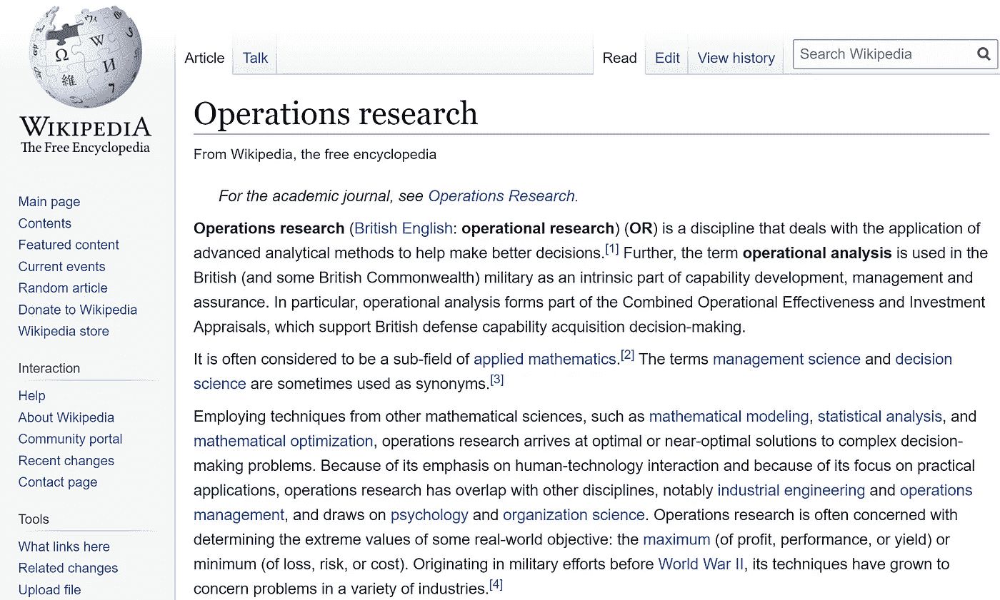
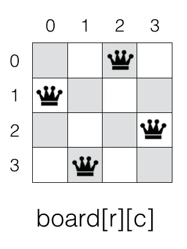
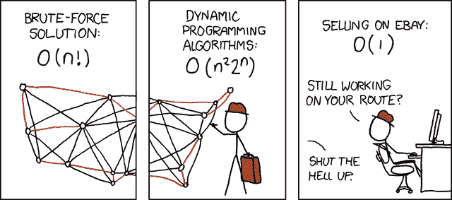
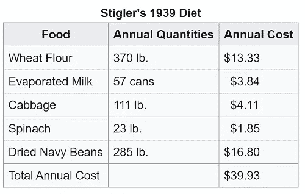

# 运筹学——内容、时间和方法

> 原文：<https://towardsdatascience.com/operations-research-what-when-and-how-6dc56c48fed7?source=collection_archive---------2----------------------->

## 范围、示例和职业

“运筹学”这个(有些模糊的)术语是在第一次世界大战期间创造的。英国军方召集了一群科学家来分配不足的资源——例如，食物、医务人员、武器、部队等。—以最有效的方式应对不同的军事**行动**。所以“*作战*这个术语就是来源于“*军事作战*”。成功地进行军事行动是一件大事，在 40 年代，运筹学在大学里成为了一门独立的学科。



运筹学维基百科页面

当你在谷歌上搜索“运筹学”时，你会得到一篇很长的维基百科文章，然而，解释却有点杂乱无章，说实话，也过时了。所以我想我应该给这个我在研究生院学习的主题一个小小的更新。

以下是我的观点:

# 1.运筹学一个词:优化。

假设我们正在做一个决定。如果我们必须做出可能的最佳决策，我们该怎么做？

你通过权衡每个选项的利弊来评估每个可能的选项。

例如，为了让优步有一个**主路线计划**，它必须决定**哪个司机应该被送到哪里，何时，以及他们应该向客户收取多少费用**。这些决策必须在优化使用可用资源的同时做出。

我不知道优步的目标函数是什么，但是他们正试图通过派遣车手来达到最大化。假设是收益。此外，每次派送都会产生相关成本，路线计划应符合优步政策的具体限制。

## 运筹学一句话:在约束下把事情做得最好。

用数学术语来说，上面的问题可以写成:

```
 **Maximize F(X1, X2, …, Xn)****Such that it meets the constraints C1, C2, …, Cm.** 
```

这种类型的公式化称为**最优化**或**数学规划**。

有一个**目标函数**要被最大化(即利润)或最小化(即成本、损失、某些不良事件的风险等)。) **X** 是**决策变量**。它们是我们可以调整的东西。比如每个 **X** 都可以是一个驱动。 **X_i=1** 表示驱动程序 I 被选中，并将发送给客户。 **X_i=0** 表示他没有被选中。 **C 的**是**约束**。例如，每辆车与潜在客户之间都有一个**距离**。司机一天只能开这么多小时。每条路都有限速，每辆车都有最大载客量。

这是运筹学最常见的例子。

# 2.OR 中的三个主要问题类别

或中的大多数问题都属于三个问题类别之一。

## Ⅰ.最佳化

*   **数学规划**:和上面优步的例子一样，我们选择*决策变量* (司机调度)*目标函数*(利润最大化)和一组(物理、技术、经济、环境、法律、社会等)。)*约束*。然后，我们用数学方法解决它们。
*   数值优化:数值优化可以是基于梯度的，也可以是非梯度的。[梯度下降](/difference-between-batch-gradient-descent-and-stochastic-gradient-descent-1187f1291aa1)，机器学习中最流行的优化算法之一，是一种基于**梯度的**(顾名思义)优化。还有很多**非梯度**算法(无导数优化)以及[贝叶斯优化、](https://en.wikipedia.org/wiki/Bayesian_optimization) [布谷鸟搜索](https://en.wikipedia.org/wiki/Cuckoo_search)、[遗传算法](https://en.wikipedia.org/wiki/Genetic_algorithm)等。当目标函数不光滑或者目标函数的封闭形式不可用时，使用非梯度算法。

机器学习与优化密切相关。许多 **ML 问题被公式化为一些损失函数**的最小化。在训练过程中，优化算法使训练集上的损失**最小化。**然而，最大似然的最终目标是最小化不可见数据的损失。**因此，机器学习是**一个以“泛化”为目标的优化问题**。**

## Ⅱ.概率建模

概率模型**输出概率分布**，而确定性模型输出事件的单一可能结果。

众所周知的概率模型之一是**交叉熵**，我们经常使用它来**预测目标**上的概率分布 **。[贝叶斯推理和最大后验概率(MAP)](https://medium.com/@aerinykim/bayesian-inference-intuition-and-example-148fd8fb95d6) 也是概率模型的重要应用。**

## Ⅲ.模拟

当推导一个概率分布不方便时，模拟用于近似一个概率分布。它使用重复随机抽样并获得数值结果。这个想法是利用随机性来解决本质上可能是确定性的问题。模拟有多种用途；例如，从不同的概率分布中生成抽奖、数值积分、强化学习、期权定价等。

# 3.现实生活中的应用

运筹学被应用到许多真实世界的用例中。

*   **指派**(指派优步司机给客户)
*   **时间安排**(将多个电视节目安排在一起，以获得尽可能多的观看次数)
*   **金融工程**(资产配置、风险管理、衍生品定价、投资组合管理等。)
*   **智能竞价**在 Youtube 上，算法广告的自动竞价系统(确定一个特定的印象可以带来多少增量价值，以及我们应该为此支付多少钱。)
*   **定价科学**(机票定价)
*   **路线**(主规划公交车路线，使需要的公交车尽可能少)
*   **设施位置**(决定仓库、工厂或消防站等新设施的最合适位置)
*   **网络优化**(数据包路由)

## 最后但同样重要的是…脑筋急转弯(科技面试)！

这些脑筋急转弯在科技面试中非常常见，至少在 [FAAMG](https://www.investopedia.com/terms/f/faamg-stocks.asp) 中是如此。我个人被问了下面三个中的两个。

*   **N 皇后问题**:如何将 N 个皇后放置在 N×N 的棋盘上，使得其中没有两个互相攻击。两个皇后不应在同一行、列或对角线上。



解决方案:[https://www . geeks forgeeks . org/n-queen-problem-backtracking-3/](https://www.geeksforgeeks.org/n-queen-problem-backtracking-3/)

*   **旅行推销员问题:**OR 中的经典问题。一名销售人员将在不同的城市会见许多客户。最短的往返旅程是什么时候？用数学术语来说，给定一个有向的边加权图，图中每个节点恰好经过一次的最短循环路径是什么？



[https://xkcd.com/399](https://xkcd.com/399/)

解:[https://www . geeks forgeeks . org/traveling-salesman-problem-set-1](https://www.geeksforgeeks.org/travelling-salesman-problem-set-1/)

*   斯蒂格勒饮食法 :以诺贝尔经济学奖获得者乔治斯蒂格勒命名，他计算出一种廉价的方法来满足给定一套食物的基本营养需求。这是一个经典的线性优化问题。我们如何选择一套食物，以最低的成本满足一套日常营养需求？



解决方案:[https://developers . Google . com/optimization/LP/glop . html # stigler](https://developers.google.com/optimization/lp/glop.html#stigler)

# 4.你将学习的科目，如果你选择学习或。

我在哥伦比亚大学攻读了运筹学硕士学位，毕业时有四门必修课。

## 一.概率论

您将学习描述性统计、如何构建统计模型、推断性统计，例如寻找最大似然估计量和构建置信区间。还会学习联合分布、[条件独立](/conditional-independence-the-backbone-of-bayesian-networks-85710f1b35b)、[独立随机变量之和](/sum-of-exponential-random-variables-b023b61f0c0f)、[矩母函数](/moment-generating-function-explained-27821a739035)、大数定律、中心极限定理、无限可分定律等。

## 二。确定性模型

使用确定性模型，无论重新运行模型多少次，对于特定的输入，您都会得到完全相同的结果。换句话说，确定性模型中不包含随机性，这在现实世界中不太可能发生。在这堂课中，你将学习问题公式化、线性规划、单纯形算法、动态规划、对偶理论、灵敏度理论等。

## 三。随机性模型

你将学习运筹学中的随机建模技术，如马尔可夫链、生灭过程、[泊松过程、](/poisson-distribution-intuition-and-derivation-1059aeab90d)、[赌徒的破产问题、](https://github.com/dennybritz/reinforcement-learning/blob/master/DP/Gamblers%20Problem%20Solution.ipynb)、布朗运动等。对我来说，这是我的课程中最有趣也是最具挑战性的一门课。

你可以将这些技术应用于强化学习(随机过程探索)、金融工程(看涨/看跌/一揽子期权定价、保险风险测量等)。)、排队/可靠性/库存建模等。

与确定性模型不同，随机模型考虑了随机性。因此，具有相同参数的相同模型可能会输出不同的结果。

## 四。模拟

您将学习如何从不同的分布中生成随机变量，蒙特卡罗，分层抽样，接受-拒绝方法，使模拟更有效的方差减少技术，马尔可夫链蒙特卡罗(MCMC)，吉布斯采样器，验证模拟模型的统计验证技术，如何分析模拟输出等。

你也可以选修很多课程:博弈论、机器学习(数据挖掘)、高级优化、非线性优化、随机控制、实数分析、金融工程、资产配置、定价模型、金融风险管理、信用风险建模、结构化和混合产品、深度学习、供应链管理、物流等。

# 5.职业

如果我追踪曾经和我在同一个项目中的朋友现在在哪里，他们无处不在。

很多都是金融行业的。可能因为我的学校离华尔街很近。他们在不同的团队工作，如**风险管理、交易、量化研究，甚至在销售或投资银行**。

他们中的许多人也成为了科技公司的数据/应用科学家。Azure 和 AWS 广泛雇用数据科学家，以便**优化他们的云停机时间，分配计算能力，估计实时需求**等。此外，按需服务公司(优步、Lyft、AmazonPrimeNow、Doordash 等)的**定价**团队和**调度**团队。)专门寻找运筹学专业的科学家角色。社交媒体公司(Twitter、脸书、YouTube 等)的算法竞价(Adtech)团队(T7)。)对广告竞价定价、受众定位、用户参与度预测模型等方面有很多需求。

就我个人而言，我刚毕业就开始在一家金融服务公司工作，做外汇衍生品交易商。然后我加入了一家 adtech 初创公司，担任数据科学家。现在我在微软做研究工程师，研究问题回答(NLP)问题。

如果你对应用数学的运筹学有扎实的掌握，你可以选择的行业范围是非常广泛的。

补充几点:

1.  根据“[搜索没有免费的午餐定理](http://www.no-free-lunch.org/)”，没有一个特定的优化算法对每个问题都是最好的。

*“我们证明，当对所有可能的成本函数进行平均时，搜索成本函数极值的所有算法的性能完全相同。特别是，* ***如果算法 A 在某些成本函数上优于算法 B，那么粗略地说，一定存在同样多的其他函数 B 优于算法 A***

*因此，选择您将使用的优化算法应该取决于问题。例如，当我训练深度学习 NLP 模型时，我的 go-to 算法是 ADAM，因为它效果好，速度快。我从来没有真正使用 L-BFGS，即使理论上它收敛更快，因为根据我的经验， [SGD](/difference-between-batch-gradient-descent-and-stochastic-gradient-descent-1187f1291aa1) 在训练时间和最终结果方面与二阶算法一样好。然而，当 L-BFGS 提供比 SGD 更好的性能时，会有一些问题。这是郭乐的论文(它发表于 2011 年，所以有点旧了)“关于深度学习优化方法的”指出 L-BFGS 击败了 SGD:*

**“我们的实验结果反映了不同优化方法的不同优缺点。在我们考虑的问题中，* ***L-BFGS 对于低维问题，尤其是卷积模型，具有很强的竞争力，有时甚至优于***[***SGDs***](/difference-between-batch-gradient-descent-and-stochastic-gradient-descent-1187f1291aa1)***/CG。*** ***对于高维问题，CG 更具竞争力，通常表现优于 L-BFGS 和 SGDs。*** *此外，通过 SGD 使用大型迷你批处理和线搜索可以提高性能"**

*2.谷歌有一个很好的开源工具或者工具*

*   *约束编程*
*   *线性和混合整数规划*
*   *装箱和背包算法*
*   *旅行推销员问题的算法*
*   *车辆路径问题*
*   *图形算法(最短路径、最小费用流、最大流、线性和分配)等。*

*[](https://developers.google.com/optimization) [## 或者-工具|谷歌开发者

developers.google.com](https://developers.google.com/optimization)*