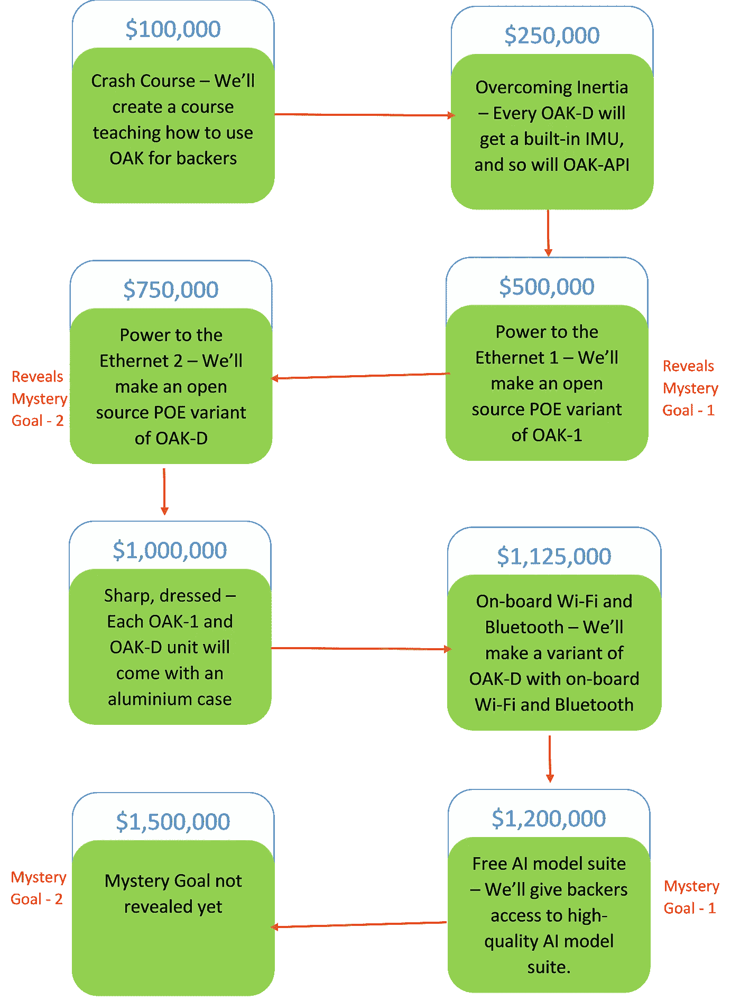

# 围绕 OpenCV AI kit 的炒作值得吗？

> 原文：<https://towardsdatascience.com/opinion-26190c7fed1b?source=collection_archive---------31----------------------->

## 意见

## 如果你是一个有抱负的计算机视觉爱好者，OpenCV OAK-1 和 OAK-D 套件到处都是新闻。但是值得吗？

迈克尔·泽兹奇在 [Unsplash](https://unsplash.com?utm_source=medium&utm_medium=referral) 上的照片

OpenCV 逐渐成为最好的计算机视觉库之一。它开始于在 OpenCV 3.3 版本中添加 DNN 模块，现在它的大多数更新都是关于复杂模块的，比如最近在 OpenCV 4.4 中添加的 YOLOv4 和 EfficientDet 模块。现在，随着两个硬件模块即 OAK-1 和 OAK-D 的推出，它在行业中产生了进一步的影响，它们之间的区别是普通相机和立体相机。

我将从一个学生的角度写这篇文章，这是一篇观点文章。你可能会有不同的观点，所以请在评论中告诉我。那么值得买吗？为了找到答案，我们先来看看这款设备及其功能。

# 特性和功能

它由 OpenCV 和 [Luxonis](https://luxonis.com/) 联合创建，配备了人工智能芯片 Myriad-X，可以执行计算机视觉应用。它是完全开源的，拥有麻省理工学院许可的硬件。它支持 OpenVINO 支持的所有操作系统，因此它支持 Windows，Linux 和 Mac-OS 没有任何问题。这些设备将带有兼容 Python 和 OpenCV 的 OAK-API。人工智能处理是在硬件本身上完成的，这意味着它不会给它所连接的系统带来任何额外的负载，也不需要任何基于云的服务。这也意味着数据可以保持安全，因为它是在本地处理的。

正如在其 [Kickstarter 页面](https://www.kickstarter.com/projects/opencv/opencv-ai-kit)上看到的那样，它可以用来检测和跟踪物体，执行分割，以 30FPS 的速度播放 4K 视频，还支持定制的神经网络。有了 OAK-D 套件，live depth 可以与被视为作弊代码的 AI 相结合，以改善结果。他们声称，它只需要 30 秒的设置和功能如下所示。

## 在 [Kickstarter 页面](https://www.kickstarter.com/projects/opencv/opencv-ai-kit)上给出的完整功能列表

1.  神经推理——对象检测、图像分类、语义分割等。
2.  Warp/Dewarp —支持鱼眼应用的附加镜头
3.  对象跟踪—最多 20 个具有唯一 id 的对象
4.  Apriltags——结构化导航(April tag 是一种视觉基准系统，可用于多种任务，包括增强现实、机器人和摄像机校准)
5.  H.264 和 H.265 编码(HEVC、1080P 和 4K 视频)—4K 视频 3.125 MB/s，Pi Zero 可以用它录制 4K/30FPS 视频！
6.  特征跟踪——光学和视觉惯性导航。
7.  JPEG 编码— 12MP 静止图像
8.  运动估计—允许实时背景减除
9.  MJPEG 编码——用于简单的网络流等。
10.  边缘检测哈里斯滤波。

**OAK-1 的具体特征**

1.  基于运动的自动无损变焦:

*   12 倍无损变焦，720p 输出
*   6 倍无损变焦，1080 输出
*   1.5 倍无损变焦，4K 输出

**OAK-D 的特异功能**

1.  立体深度(包括中值滤波)—扩展的视差和亚像素可实现更宽的动态范围。
2.  3D 对象定位-具有立体视差深度的单目人工智能和用于小对象/特征支持的立体人工智能(即立体神经推理)
3.  3D 空间中的对象跟踪—实时 3D 轨迹，并支持以米为单位的运动统计。

# 摄像机规格

以下是两种 OAK 设备的摄像头规格。

## 橡木色摄像机规格:

*   图像传感器:IMX378
*   最大帧速率:60fps
*   H.265 帧速率:30fps
*   分辨率:12 百万像素(4056 x 3040 像素)
*   视野:DFOV 81°—HFOV 68.8°
*   镜头尺寸:1/2.3 英寸
*   自动对焦:8 厘米
*   光圈数:2.0

## OAK-D 立体摄像机规格:

*   同步全局快门
*   图像传感器:OV9282
*   最大帧速率:120fps
*   像素大小:3um x 3um
*   分辨率:1280 x 800 像素
*   视野:DFOV 81°—HFOV 71.8°
*   镜头尺寸:1/2.3 英寸
*   焦距(固定):19.6 厘米— ∞
*   光圈数:2.2

# Kickstarter 活动带来的其他好处

Kickstarter 受益于承诺的总金额

他们能够在活动开始的前 20 分钟内达到目标！在编写本报告时，还有 18 天时间，已经筹集到 544，058 美元。因此，即使 Kickstarter 现在结束，支持者也会获得一门免费课程，教他们如何使用这些设备。除此之外，OAK-D 设备还将配备惯性测量单元(IMU)传感器，通过使用加速度计和陀螺仪以及通常的磁力计来测量和报告方向、速度和重力。

所以直到现在，我只是谈论了这些设备的一般功能，在这些基础上，我觉得围绕这些模块的宣传是完全合理的。学生可能会觉得 OAK-1 和 OAK-D 的 100 美元和 150 美元的价格有点高，但这个价格现在是 50%的折扣，在 Kickstarter 于 8 月 13 日结束后，价格将会翻倍。此外，没有其他类似的硬件模块可用，从单独的组件组装一个意味着更庞大和昂贵的解决方案。正如 PyImageSearch 上的这篇[文章](https://www.pyimagesearch.com/2020/07/20/an-interview-with-brandon-gilles-creator-of-the-opencv-ai-kit-oak/)所指出的，更多关于使用它的文章即将到来，所以使用它的难度不会成为问题。

这些以人工智能为动力的空间套件为学生和研究人员提供了执行现实世界项目的机会，而不是只处理可用的数据库，并报告测试精度，但从未看到它在现实世界中工作。这些相机提供了在生产环境中测试模型的途径，而不需要任何其他外部硬件。

所以，总之，我觉得如果一个人是一个有抱负的计算机视觉学生，这当然是值得的。很多开发将会在它上面发生，它可能会像 Raspberry Pi 为业余硬件爱好者所做的那样为计算机视觉做些什么。