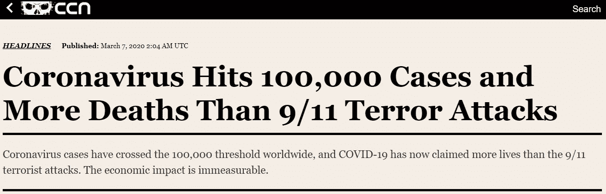
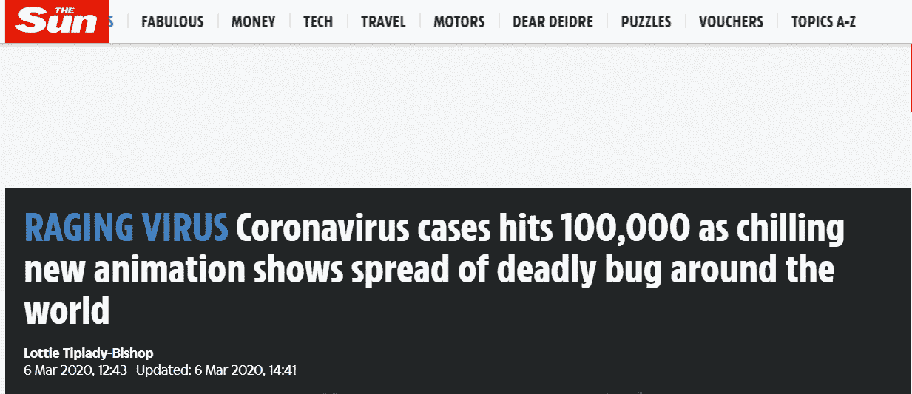
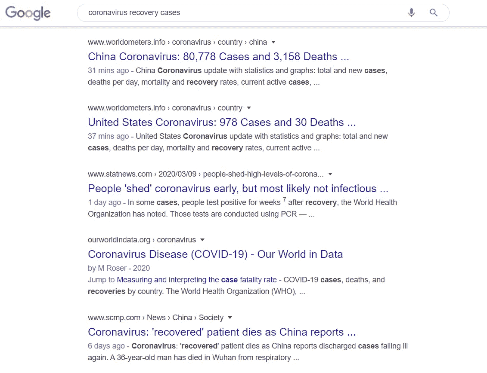
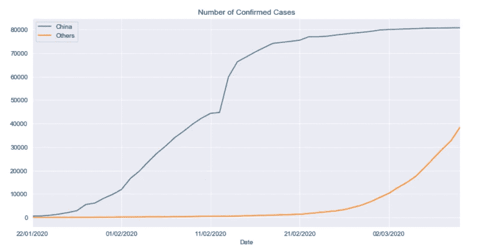
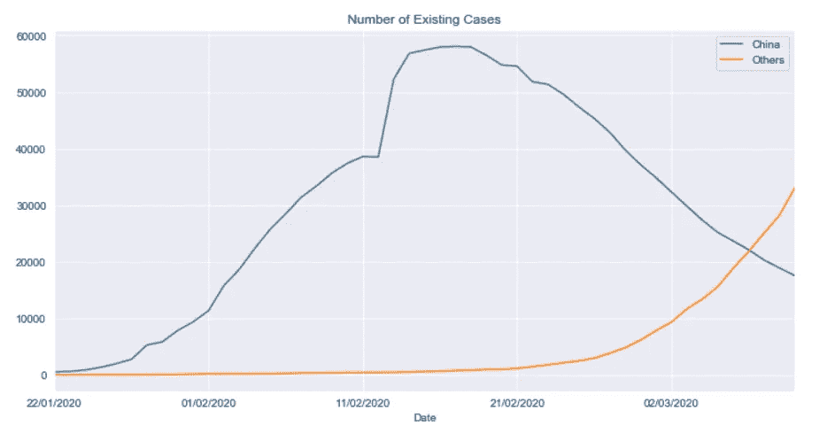
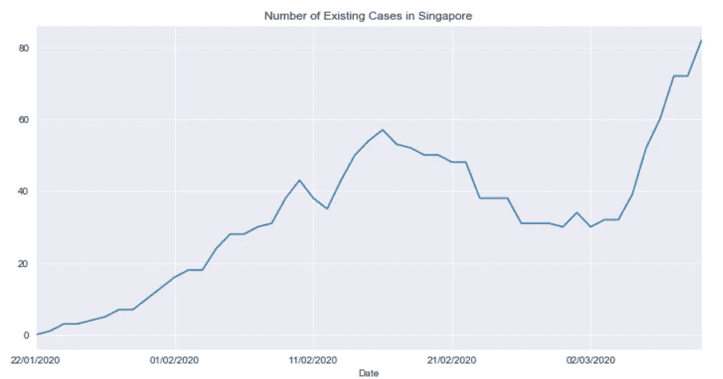
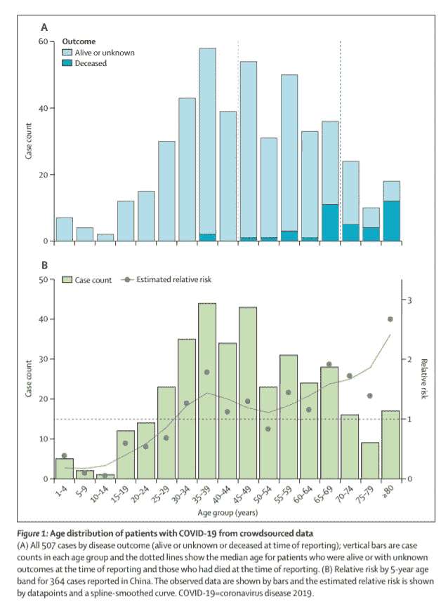

# 观点:我们应该对冠状病毒有多担心？

> 原文：<https://towardsdatascience.com/opinion-how-worried-should-we-be-of-the-coronavirus-71bc987453c8?source=collection_archive---------9----------------------->

## 关于小说《新冠肺炎》的数据驱动观点

照片由[葡萄牙重力](https://unsplash.com/@portuguesegravity?utm_source=medium&utm_medium=referral)在 [Unsplash](https://unsplash.com?utm_source=medium&utm_medium=referral) 上拍摄

***免责声明:*** *本文使用的原始数据是从约翰·霍普斯金怀汀工程学院的* ***Github 知识库*** *中检索的，这些数据是从诸如世卫组织、CDC 和其他卫生政府网站等值得注意的来源中提取的，我绝不是基于主观性来操纵它们的数字。数据是从 2020 年 1 月 22 日至 2020 年 3 月 11 日收集的，必须记住，随着时间的推移，这些数字将继续变化。*

此外，我做出的许多推论包含我自己的观点，可能有偏见。每个人都应该有权发表自己的意见，如果你需要额外的信息来源，你应该经常与外部参考进行交叉核对。

# 利用数字传播恐惧

在写这篇文章的时候，冠状病毒(新冠肺炎)已经席卷全球。大多数媒体所描绘的似乎是致命的疾病，在许多公民和网民中有着非法的恐惧和非理性。

一个普通的新闻媒体利用恐惧来获得点击量(来源: [CCN](https://www.ccn.com/coronavirus-hits-100000-cases-and-more-deaths-than-9-11-terror-attacks/)

来源:[太阳](https://www.thesun.co.uk/news/11112954/coronavirus-cases-hits-100000/)

在这一点上，冠状病毒不仅仅是一种流行病，它也是一种数字游戏。全球新闻媒体正在等待这些数字达到一个里程碑，并用引人注目的标题来增添趣味，这样人们就会点击并阅读他们的文章。因为更多的读者给了他们更多的收入，对吗？

这并不是说这些媒体应该立即被指控为假新闻。相反，大多数记者都受过报道事实的训练，但这并不意味着他们不能在文章中加入一点感情色彩。

以上述头条为例。对他们来说，10 万个案例是一个值得报道和吸引读者注意力的里程碑。接下来的这些文章可能只是最高的这个和最高的那个的附加数字。

> “……从那里，病毒像野火一样蔓延，在中国肆虐，1 月 11 日出现了第一例死亡。
> 
> 自从病毒在全球爆发以来，已经有 3383 人死于这种致命病毒。
> 
> 这是因为世界各地的政府都害怕一个全球性的疫情…”([The Sun UK](https://www.thesun.co.uk/news/11112954/coronavirus-cases-hits-100000/)

## 好吧，那康复案例呢？

有，但是**被举报**的可能性要小得多。许多记者利用了一种被称为 ***厌恶损失*** 的常见心理现象。他们知道大多数人对负面新闻更敏感，这可能会导致更高的点击率。

> “……厌恶的反应反映了负面情绪(焦虑和恐惧)对损失的关键作用(Rick，2011)。换句话说，厌恶损失是恐惧的一种表现。这解释了为什么我们倾向于关注挫折而不是进步。负面情绪，比如受到批评，比正面情绪，比如受到表扬，有更强的影响……”([今日心理学](https://www.psychologytoday.com/sg/blog/science-choice/201803/what-is-loss-aversion))

## 恐惧对健康的影响

我不会深究恐惧的方方面面。否则，我可能会偏离本文的主题。然而，我想谈谈恐惧对健康的影响，特别是对我们免疫系统的影响，因为这是我们接触病毒后抵御病毒的唯一方法。

我们知道有很多人因为冠状病毒而生活在恐惧中。不，我说的不是那种战斗或逃跑反应的恐惧。我说的是日常生活中的压力或由于潜在暴露于冠状病毒而产生的恐惧。下面是苏珊·C 和格雷戈里·E 进行的一项科学研究的摘录:

> “具有人类进化祖先面临的战斗或逃跑情况的时间参数的紧张性刺激引发了免疫系统的潜在有益变化。然而，压力越是偏离这些参数，变得越是慢性，免疫系统就有越多的成分受到潜在的有害影响。"([苏珊娜 C 和格雷戈里 E](https://www.ncbi.nlm.nih.gov/pmc/articles/PMC1361287/) )

现在我们都知道，任何类型的流感都无法治愈，只有疫苗作为预防普通流感的一种形式。击退病毒的唯一方法是确保你的免疫系统在对抗病毒时是有效的，同时很少得到缓解症状药物的帮助。

我们中的许多人也知道，佩戴外科口罩很少或根本不能防止感染病毒，尽管它们确实有助于防止病毒的传播。

然而，总会有一群人打安全牌，在外出和处理日常事务时佩戴安全牌。如果恐惧是他们选择的主要原因，我会说虚假的安全感仍然比生活在恐惧中要好，知道持续的压力会抑制我们的免疫系统。

不服气？看看这段视频，从迈克医生的角度看媒体对冠状病毒的看法:

# 使用原始数据作为可靠的信息来源

我写这篇文章的目的和 Mike 博士一样:**通过展示许多媒体来源很少报道的数据的某些方面来教育和减轻我的读者朋友们的恐惧**。

为此，我求助于由*约翰·霍普斯金·怀汀工程学院*在其 **Github 知识库**中发布的公开数据集。

 [## CSSEGISandData/新冠肺炎

### 这是由约翰·霍普金斯大学运营的 2019 年新型冠状病毒视觉仪表板的数据存储库…

github.com](https://github.com/CSSEGISandData/COVID-19) 

这并不是说他们提供了 100%准确的数据，只是因为他们整理了全球政府卫生网站和当地媒体的所有数据。由于在早期阶段无症状，感染病毒的未报告病例必然会发生。由于缺乏症状，一些医生甚至不检查他们的病人。

 [## 观点|一周三次急诊，了解我是否有冠状病毒

### 以为我有症状，我看到了令人不安的纽约市混乱和自相矛盾的方法…

www.nytimes.com](https://www.nytimes.com/2020/03/09/opinion/coronavirus-testing-new-york.html) 

## 对这个问题的量化风险有基本的了解

对于这篇文章的标题，可能有人有自己的答案。对一些人来说，只要病毒存在，不管有多少人被感染，只要他们走出家门，就被认为是有风险的。就我个人而言，我将其分为 3 个不同的类别，以评估感染病毒的风险和疾病的严重程度:

1.  案件总数
2.  当地病例数
3.  个人年龄范围

## 1.案件总数

确诊病例将永远是新闻媒体喜欢挑剔的目标数字，因为**它们只会不断增加**。但是什么是确诊病例呢？确诊病例是记录在案并用于追踪接触者的报告病例。这个数字包括康复和死亡病例。

*“X 人冠状病毒痊愈出院”，*说几乎没有标题过。

*“X 确诊病例和 Y 死亡病例来自冠状病毒”，*表示一些 clickbait 标题。

甚至在谷歌上搜索冠状病毒恢复案例也没有帮助:

通过一些清理和处理，将原始数据插入 Python，我们可以直观地看到确诊病例的数量。这是大多数媒体喜欢放在标题中的数字:

从确诊病例中减去康复病例和死亡病例后，我们得到下图:

从这张图表中，我们可以看到中国城市中现有病例的数量正在减少。

这是否意味着中国比世界其他地方做得更好？

不一定对。请记住，这种病毒源自中国，在它传播到全球之前，感染很早就在中国开始并传播。自 1 月份以来，现有病例的指数式增长与世界其他地区 2 月中旬现有病例的指数式增长是同义的。虽然中国的许多人由于早期接触病毒已经康复，但世界其他地区的许多人仍然在指定的医疗保健区受到监护或隔离。

那么，为什么病例总数被认为是一种风险呢？因为旅行还没有完全被限制。不管是空运、陆运还是海运。一个无症状的携带者可能会不知不觉地侵入一个地区，并在当地开始传播。

## 2.当地病例数

并非世界上每个国家都受到冠状病毒的困扰。如果你玩过瘟疫公司，一个流行病模拟器游戏，玩家知道选择格陵兰岛作为爆发的开始，由于其相对较低的人口和人口密度，就像在硬核模式下玩一样。巧合的是，截至 2020 年 3 月 11 日撰写本文时，格陵兰尚未报告任何冠状病毒病例。

当考虑感染该病毒的风险时，你应该考虑贵国现有病例与当前人口的比例。

让我们以新加坡为例，因为它是最早遭受冠状病毒袭击的国家之一，并且在 2020 年 2 月初保持着最高确诊病例数的第二名位置:

从 2 月中旬到 3 月初，失业率似乎在稳步下降，这是因为一些人即使生病也继续参加社交活动和上班。

> 麦国强卫生部医疗服务主任周二表示，接触者追踪目前在控制病毒爆发方面仍有作用，即使存在广泛的社区感染，它也将继续“有意义”。
> 
> 这是因为受感染的个人继续从事社会活动和工作的放大效应，[导致进一步的暴露和感染](https://www.straitstimes.com/singapore/health/coronavirus-81-afraid-of-infection-but-35-would-still-attend-events-even-with-mild)。”——([海峡时报](https://www.straitstimes.com/singapore/coronavirus-6-new-cases-confirmed-3-linked-to-safra-jurong-cluster-12-in-critical)

但是让我们把注意力放在数字上。截至撰写本文时，现有 82 例感染患者全部处于隔离状态。总会有感染者四处游荡，但我们不知道具体数字。

虽然我不知道有多少未被发现的病例，但新加坡是一个今天拥有超过 580 万人口的国家，这使得感染这种病毒的可能性极低。

就我个人而言，我把现有的病例作为我在日常通勤中被感染的可能性的衡量标准。由于现有病例数量每天都在数十例上下波动，这感觉就像是中了彩票才能接触到这种疾病。

考虑到这一点，我只需要保持警惕，但我并不焦虑。

## 3.个人年龄范围

由*孙开元等人* 完成的一项早期[流行病学研究在受感染个体中建立了年龄和死亡之间的相关性。](https://www.thelancet.com/journals/landig/article/PIIS2589-7500(20)30026-1/fulltext)

来源:[开元孙等人。艾尔](https://www.thelancet.com/journals/landig/article/PIIS2589-7500(20)30026-1/fulltext)

这加强了我之前的观点，即个人的免疫系统对他们自己的康复负有主要责任。Beata Berent-Maoz 等人在下面的研究中描述了随着年龄增长免疫力下降的相关性。艾尔:

 [## 免疫系统老化的原因、后果和逆转

### 衰老对免疫系统的影响表现在多个层面，包括 B 细胞和 T 细胞的减少。

www.ncbi.nlm.nih.gov](https://www.ncbi.nlm.nih.gov/pmc/articles/PMC3582124/) 

由于年轻人通常具有较高的免疫力和较低的死亡率，他们不必太担心死亡，即使他们不可避免地会感染病毒。正确饮食，保持身体健康和水分充足是增强对冠状病毒免疫力的最常见方法之一。

# 流行病学背后的数学

任何人都很容易认为，随着病毒在人与人之间传播，它将遵循指数曲线。一开始是这样，如果各个国家的预防措施不到位，这种情况肯定会加剧。但在某些时候，我们需要明白，正如逻辑增长曲线所示，利差最终会放缓。这里有一段视频，清楚地解释了这种流行病学背后的数学原理:

# 回到问题:你应该有多担心？

我们已经够害怕这个世界了。事实证明，传播恐惧和非理性比冠状病毒本身要快得多。

从恐慌性抢购甚至 [**争抢卫生纸**](https://www.independent.co.uk/news/world/australasia/toilet-paper-fight-sydney-supermarket-panic-buy-coronavirus-australia-a9385156.html) 、短期股市崩盘以及健康时因恐惧而戴上外科口罩，我们开始看到人性阴暗面的表面。

基于您的地理位置，您应该能够粗略地评估实际感染病毒的可能性。如果你住在一个发病率很高的地方，尽你所能，远离人群密集的地方，努力保持个人卫生。这尤其适用于已经存在健康问题的人，如果你感染了病毒，这些问题肯定会加剧。

在我看来，保持身体健康和采取预防措施远比担心感染病毒更重要。阅读最有可能引发额外恐惧的新闻可能会导致恐慌和错误的决定。你能做的最糟糕的事情就是开始在社交媒体上传播假新闻和错误信息。

尽你的责任，保持安全，保持警惕，不要惊慌！

如果您需要冠状病毒情况的额外可视化，这里有一个仪表板的链接，该仪表板利用原始数据为桌面用户提供连续的实时更新:

 [## 约翰霍普金斯冠状病毒资源中心

### 约翰霍普金斯大学全球公共卫生、传染病和应急准备方面的专家一直在…

coronavirus.jhu.edu](https://coronavirus.jhu.edu/map.html) 

以下链接适用于移动用户:

 [## ArcGIS 的操作仪表板

### 编辑描述

arcgis.com](https://arcgis.com/apps/opsdashboard/index.html#/85320e2ea5424dfaaa75ae62e5c06e61) 

用于创建简单图表的代码可以在我的 Github [**这里**](https://github.com/bobbymuls/covid-19-analysis) **找到。**

如果你喜欢这篇文章，可以考虑通过下面的链接在我的个人网站上看看我的其他作品:

 [## 鲍比·马尔乔诺

### 数据分析师

www.bobbymuljono.com](https://www.bobbymuljono.com/)