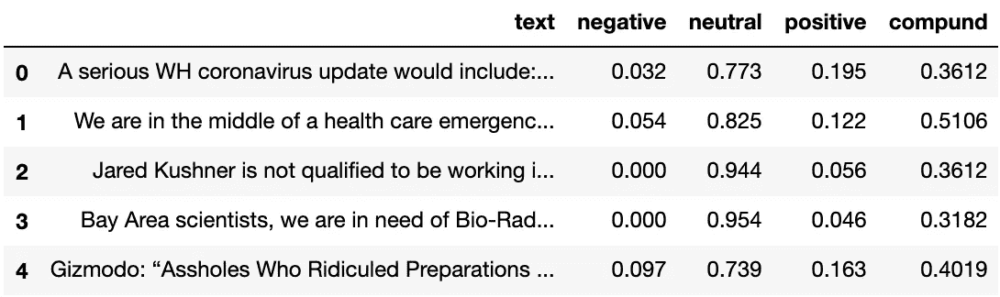
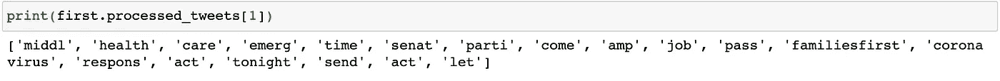
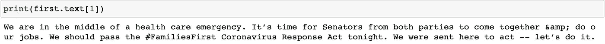
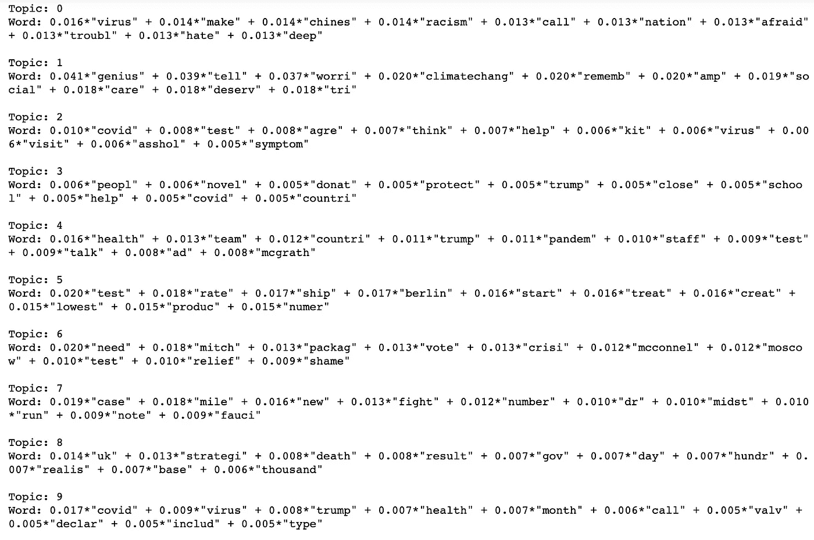
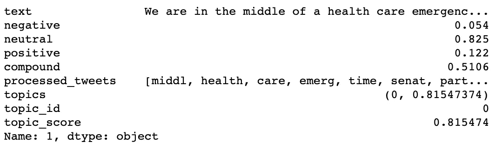
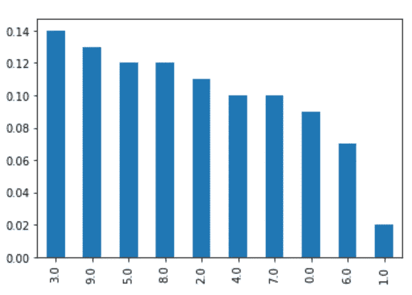
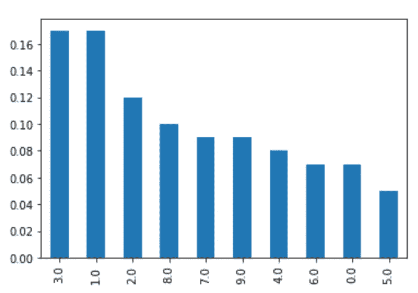
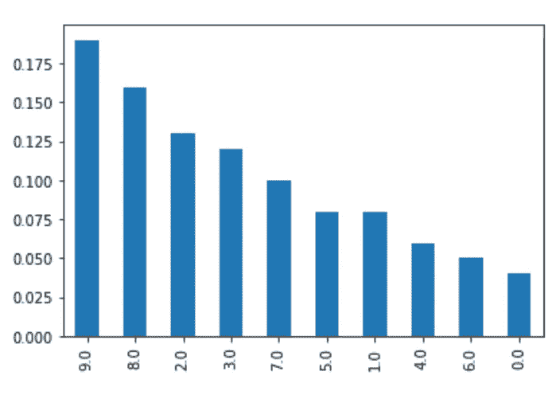

# 基于 VADER 和 gensim 的潜在狄利克雷分配法的 Twitter 意见挖掘

> 原文：<https://towardsdatascience.com/opinion-mining-in-twitter-using-vader-and-gensims-latent-dirichlect-allocation-lda-a834c2a936?source=collection_archive---------37----------------------->

Viktor Forgacs 在 [Unsplash](https://unsplash.com/s/photos/vader?utm_source=unsplash&utm_medium=referral&utm_content=creditCopyText) 上拍摄的照片

## 人们如何在网上对新冠肺炎做出反应，他们在社交网络中的互动告诉我们他们对该病毒及其威胁的立场是什么？

> 这很重要，因为…
> 
> 想象一下，在全球疫情期间，你是一名卫生政策决策者。你不想知道人们对这个问题的看法吗？

# 数据

我再次转向 Twitter 寻求答案。原始材料无缝地流入我的数据库，我看到自己拥有来自世界各地的 100 万条推文，都包含通用词，如“冠状病毒”和“新冠肺炎”，包括它们的每一个可能的版本。

为了掌握网络的内部结构，我用 [Gephi](https://gephi.org/) 绘制了数据。选择的算法是 [OpenOrd](https://www.researchgate.net/publication/253087985_OpenOrd_An_Open-Source_Toolbox_for_Large_Graph_Layout) ，这是在大型网络中可视化底层子社区的理想算法。我能够识别出至少 15 个社区，其中两个最大的社区几乎占了现有节点的 25%。总而言之，该网络看起来像一个巨大的、彩色的斑点，最大的社区由大约 70k 个节点组成，因此被选来进行分析。去朱庇特！

> *笔记本，。gephi 文件，而数据集都在我的*[*github repo*](https://github.com/estebanvillaturek/covid19)*上。*

# 方法学

我的目标是在第一个社区的推文文本中进行意见挖掘，这样我就可以从总体上评估该社区对疫情冠状病毒主题的感受和互动。幸运的是，这 72k 条推文中的自然交流语言是英语。

经过大量研究，我决定使用 [VADER](http://comp.social.gatech.edu/papers/icwsm14.vader.hutto.pdf) (效价感知词典和情感推理器)情感强度分析器(在 NLTK 中实现)，这是一种情感感知词典方法，用于分析社交媒体文本中的情感。它建立在现有的词汇基础上，但被社交媒体中存在的丰富因素所丰富，如表情符号、大写字母(通常用于表示强调)和缩写(omg！)，等等。

VADER 的 SIA 的结果是一个指标及其相应分数的字典，拆分成一个数据框后看起来像这样。

推文及其 VADER 情感评分。

前三个分数与落入每个类别的单词的比例相关，因此总计为 1。它们对于多维情感分析很有用。“复合”度量是对词典中的所有词价分数计算的加权和归一化的综合分数。这是最有用的一维情绪得分，就像我现在感兴趣的那个。根据 [VADER 的文档](https://github.com/cjhutto/vaderSentiment)，小于-0.05 的复合分数是负的，大于 0.05 是正的，中间的范围是中性的，这意味着-1 和 1 的值分别对应于极度负面和极度正面的情绪分类。

在对推文进行了意见挖掘之后，我接着进行了 NLP 分析，特别是识别人们在谈论什么。我决定执行潜在狄利克雷分配(Latent Dirichlet Allocation)或 LDA，这是一种生成概率机器学习技术，它允许我们将观察结果(文档中的单词)建模为潜在概率分布(主题)的未观察集合的可能表示。换句话说，LDA 获取文档中的单词，并计算潜在的主题分布，这些主题分布很可能是观察到的文本(在这种情况下是我们的推文)中讨论的主题的来源。

我的 LDA 实现很大程度上受到了 Susan Li 的文章的启发，并依赖于 NLTK 的预处理工具箱和 [gensim](https://radimrehurek.com/gensim/about.html) 的开源 LDA 语义建模方法。

分析的预处理部分包括移除 URL、标记化、停用词(最常见的词)移除、词干化和词条化，所有这些都是为了尽可能地从词汇和句法上减少推文。看看这个经过处理的推文及其原始表示的例子:

已处理的推文。

原创推文。

然后，我创建了一个术语字典，以及它们在推文中的相应频率，之后，我挑出最常见的，出现在至少一半推文中的，以及最罕见的，出现在不到 50 条推文中的，以获得包含最频繁的 10 万个术语的最终字典。然后，通过 gensim 的 doc2bow 方法将结果转化为语料库，稍后将该语料库传递给 TF-IDF 训练的模型，以获得整个语料库中每个术语的权重。术语频率-逆文档频率(TF-IDF)是一种计算每个术语相对于语料库的权重的模型，因此当术语出现在文档中时，权重增加，但当语料库中的其他文档也以该术语为特征时，权重减少。在实践中，最常用的单词权重会降低，从而生成更加规范化的语料库。

现在，LDA 模型已经准备好接受训练，返回十个不同的潜在主题，这些主题最终被认为是推文的主题。返回的主题如下:

LDA 确定的 10 个主题。

从确定的可能主题列表中，我们可以很好地掌握每个主题的内容。例如，主题 0 可能涉及种族主义和仇恨的各个方面，可能是在仇外心理和民族主义的框架内，同时又害怕病毒。或者主题 2，最有可能是关于测试套件的讨论；或者关于医务人员和急救人员的主题 4。你明白了。

准备好主题列表后，我可以计算每条推文中最有可能的主题的比例，显示最有可能来自该主题的单词的比例。举个例子，让我们看看上面的推文:

推文的主题和概率得分。该推文很可能属于主题 0。

最后，我根据 VADER 的综合得分(负的 0.05，中性的>-0.05 和< 0.05)，将社区划分为包含消极、中性和积极情绪的推文。

# 调查的结果

结果分为三类。首先，那些对新冠肺炎持“负面”看法的人。该群组包括 33000 多条推文，最常见的主题是主题 3 (14%)、主题 9 (13%)、主题 5 (12%)和主题 8 (12%)。

负面推特主要是关于什么的。

作为复习，主题 3 涉及诸如人、小说、捐赠、保护、王牌、关闭、学校、帮助、covid 和国家等术语。这里的推特用户可能在请求总统的帮助和更精确的政策来保护人们免受病毒的侵害，例如关闭学校。

主题 9 包含术语 covid、病毒、trump、健康、月份、呼叫、阀门、声明、包含和类型。

主题 5 包含测试、费率、装运、柏林、开始、处理、创建、最低、产品和编号。可能是指在传染率和治疗需求不断上升的情况下，迫切需要获得快速检测方法。

主题 8 涉及诸如英国、策略、死亡、结果、政府、日、百、现实主义者、基地和千等术语。

“正面”推文的主题。

现在，“积极的”推特用户数量减少了，大约有 2.9 万条。最常出现的主题是主题 3 和 1，共占 34%。

和以前一样，主题 3 涉及的术语有:人、小说、捐赠、保护、王牌、关闭、学校、帮助、covid 和国家。也许在这种情况下，推文不是批评政府的立场，而是捍卫它(可能是为了不使国家经济不必要地放缓)。

主题 1 包含天才、告诉、担忧、气候变化、记忆、社会、关怀、沙漠和热带雨林等术语。这里的推文很可能暗示了气候变化中经济放缓的积极结果，或者通过记住关心他人来呼吁更多的社会责任。

中性推特的话题。

最后，更多的“中性”推文占所有推文的 9800 条，主要涉及主题 9 (18%)、8 (15%)和 2 (13%)。

主题 9 包含术语 covid、病毒、trump、健康、月份、呼叫、阀门、声明、包含和类型；主题 8 涉及诸如英国、策略、死亡、结果、政府、日、百、现实主义者、基地和千等术语；主题 2 涉及 covid、测试、同意、思考、帮助、工具包、病毒、访问、屁眼和症状。

这里的主题解释有些困难，因为我们没有它们应该有的可能的“方向”或意义(消极或积极)，所以我将让你来辨别。

# 结论

毕竟，这有什么关系？

想象一下，在全球疫情期间，你是一名卫生政策制定者。你不想知道人们对这个问题的看法吗？

如果你试图让人们呆在家里来拉平曲线，你可能不需要在那些已经同意你的观点并敦促他们的社区帮忙和呆在家里的人身上浪费沟通资源。相反，如果你能直接瞄准那些否认手头问题严重性的代理人(想想一些带有“负面”观点的推文)，或者还没有决定怎么想的代理人，你很可能在危机时刻更有效率。

后者是最重要的群体，因为想一想:仅仅通过了解他们对问题的看法和他们的感受，说服这 10，000 名男性和女性支持讨论的任何一方有多容易？犹豫不决的人可能只差一个广告就要采取额外的步骤去关心(或决定不关心)。

# 限制和结尾

*   这种解决方案的真正力量是建立一个数据管道，允许推文直接进入处理和分类。人们的观点突变几乎和病毒本身一样快。
*   此分析旨在作为概念的简单证明。在同一个数据集中，有 20 多个社区准备好在全球范围内进行分析**，尽管实现需要语言检测和多功能多语言 NLP 库。**
*   **确定情感极性得分的更精确的方法是实现所谓的基于方面的情感分析(或基于方面的意见挖掘)，就像这个由 [Peter Min](https://medium.com/@pmin91/aspect-based-opinion-mining-nlp-with-python-a53eb4752800) 完成的漂亮的实现。然而，请注意，这将是一个监督学习模型，需要关于感兴趣主题的多标签注释数据集(类似于 Peter 的餐馆评论)。**
*   **已经采取了这样的方法，并且结果是有趣的。看看最近寨卡疫情前后的这个情绪检测[实施](https://www.ncbi.nlm.nih.gov/pmc/articles/PMC6682293/)。**
*   **从 LDA 模型的输出中解释什么主题是非常困难的，有时甚至是任意的。我绝不试图根据模型的输出对推文的内容做出明确的断言:我只是指出概率和比例，并试图给出合理的解释。**