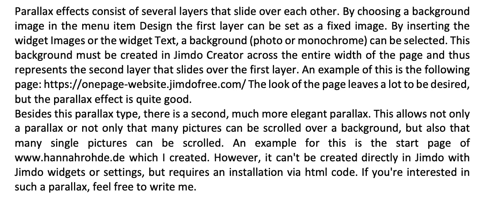
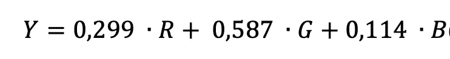
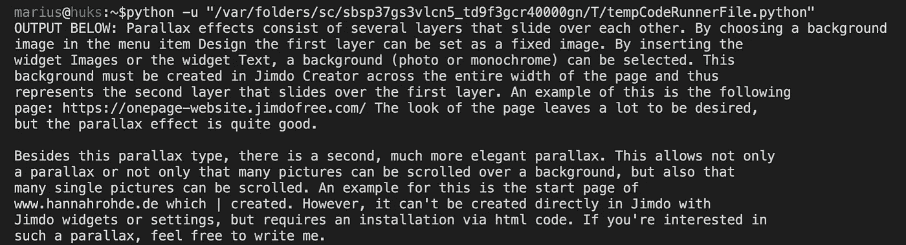

# 使用 Python 的不到 10 行代码的光学字符识别(OCR)

> 原文：<https://towardsdatascience.com/optical-character-recognition-ocr-with-less-than-12-lines-of-code-using-python-48404218cccb?source=collection_archive---------3----------------------->

## 使用 pytesseract 将图像中的文本转换为可编辑的数据


资料来源:Gerd Altmann (pixabay)

> 假设您有一个文档，想要提取它的文本，而不是自己键入整个内容。

本文中的几行代码将会加快这个过程，并真正节省时间。

必须考虑的一些事情是你有什么样的文件或图像，它的质量如何，以及书面内容是手写的还是计算机字体。(显然，计算机字体比手写文本更有可能达到更高的准确度。)

以下几点也可能影响精度:

*   字体太小或者文本通常只占图像的一小部分
*   图像尺寸太小(没有足够的像素来很好地检测字体)
*   图像的光线质量不好
*   字体不能很好地与背景分开
*   字体或文档歪斜或扭曲



输入图像。

你需要的只是几个安装，你的文件和你就可以走了。让我们看看我们需要导入什么(确保您之前安装了 pip):

```
import cv2import pytesseractimport numpy as np
```

# 想看更多这样的故事？每月仅需 4.16 美元。

# [开始使用](https://medium.com/@hucker.marius/membership)

安装后，我们需要使用 openCV 加载映像，openCV 安装在 cv2 下。如果该图像不是仅由黑白像素组成的图像，则需要将其转换为二进制图像(对于二进制图像，您可以跳过存储在 gray 变量中的两行代码)。首先对二进制图像进行灰度化，然后执行算术运算，在这种情况下就是按位非运算。灰度转换采用图像的三个 RGB 值，并使用以下公式进行转换



转换为代表灰色阴影的单个值。每个像素的值在 0 到 255 的范围内，255 是最亮的灰色(白色)，0 是最暗的灰色(黑色)。之后，阈值处理用于决定像素值是低于还是高于某个阈值。下面的所有像素都变成白色像素，上面的所有像素都变成黑色像素，结果是一个二进制图像。由于二值图像具有白色背景和黑色前景，即字母或符号，因此需要反转图像。这是通过*逐位非*运算完成的。每一个为 1 并因此为白色的像素被转变为黑色像素，每一个为 0 并因此为黑色的像素被转变为白色像素。

阅读更多关于灰度、RGB 和数字图像处理的信息[点击这里](https://medium.com/@hucker.marius/understanding-the-basics-of-digital-image-processing-and-computer-vision-using-opencv-8bc0e67243c8)。

```
img = cv2.imread('/Users/marius/Desktop/jimdoo.png')**#Alternatively: can be skipped if you have a Blackwhite image** gray = cv2.cvtColor(img, cv2.COLOR_RGB2GRAY)
gray, img_bin = cv2.threshold(gray,128,255,cv2.THRESH_BINARY | cv2.THRESH_OTSU)
gray = cv2.bitwise_not(img_bin)
```

然后我们需要做一些形态学操作来去除字符周围的噪声。我们使用的两种运算是腐蚀和膨胀。首先，我们定义一个 2×1 像素的内核，它滑过图像并执行操作。腐蚀用于检测内核是包含白色前景像素还是黑色背景像素。如果内核填充有白色像素，则原始图像中的像素将被视为 1，因此是白色的。如果内核包含黑色像素，原始像素将被视为黑色。因此，白线被侵蚀。侵蚀的形态学对应部分是扩张。如果内核下的至少一个像素是白色的，则原始图像的预期像素将被视为白色。因此，白色区域被扩大。在图像预处理中，腐蚀和膨胀经常以所提出的顺序结合起来以去除噪声。

```
kernel = np.ones((2, 1), np.uint8)img = cv2.erode(gray, kernel, iterations=1)img = cv2.dilate(img, kernel, iterations=1)out_below = pytesseract.image_to_string(img)print("OUTPUT:", out_below)
```

结果是下面的文本。请注意，宇宙魔方有几个检测选项，包括不同的语言。所以如果你想把它换成一种不同于英语的语言，你必须对它稍作调整。



输出的图像。

感谢您的阅读，希望您对 OCR 有所了解！
我感谢反馈。

另请阅读[了解数字图像处理和计算机视觉的基础知识。](https://medium.com/@hucker.marius/understanding-the-basics-of-digital-image-processing-and-computer-vision-using-opencv-8bc0e67243c8)

[](https://medium.com/subscribe/@hucker.marius) [## 请继续关注马里乌斯·哈克的新文章

### 请继续关注 Marius Hucker 的新文章。如果您还没有注册，您将创建一个中型帐户…

medium.com](https://medium.com/subscribe/@hucker.marius)