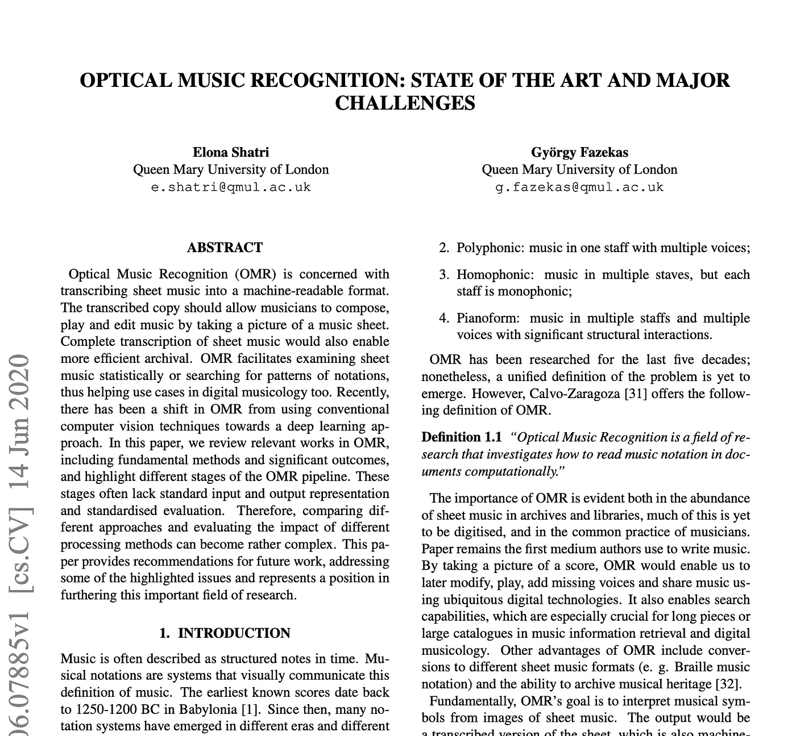
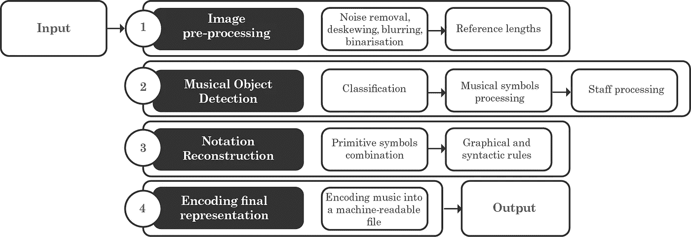
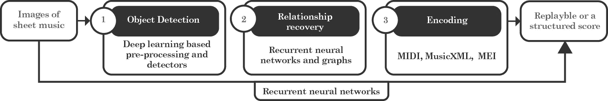

# 光学音乐识别:现状和主要挑战

> 原文：<https://towardsdatascience.com/optical-music-recognition-state-of-the-art-and-major-challenges-aa100923c78d?source=collection_archive---------67----------------------->

## 关于 OMR 的综述文件——范式转变和可能的方向。

最近，我的第一篇论文被 2020 年[国际音乐符号和表现技术会议](https://www.tenor-conference.org/)(男高音)接受。出版的旅程是非常有见地的，它将成为我未来出版的指南。

【https://arxiv.org/abs/2006.07885 

本文总结了以前的工作，并对我的研究课题——光学音乐识别(OMR)领域的进展作了定位。你可以在我的[上一篇文章](https://medium.com/@e.shatri1/what-is-optical-music-recognition-6515d8a53e01)中读到更多关于 OMR 的内容。在我的学术旅程开始时，我听到了发表立场文件的利弊。然而，写这篇论文让我怀疑自己，这总是导致学习更多。

回到论文的实际内容，我试着总结了 OMR 管道的四个主要阶段，在每个阶段发表了各种作品。此外，我试图捕捉 OMR 使用的方法从传统的计算机视觉系统到端到端深度学习网络的范式转变。

整体 OMR 传统管道[13]

最初，OMR 的四个阶段包括图像预处理、音乐对象检测、音乐符号重建以及最终将音乐知识编码到机器可读文件中。在图像预处理阶段，主要应用了增强、去歪斜、模糊、噪声去除和二值化[1，2，3，4，5]。二值化是将图像转换为二值(只有黑白像素)的过程。最初，使用传统技术执行这种处理，例如基于图像的全局直方图选择二值化阈值。例如，稍后使用分段自动编码器完成二值化[6，7]。这些编码器学习二进制化的端到端转换。

转到音乐符号检测，这个阶段有三个子阶段:五线谱处理、音乐符号处理和最后的分类。在五线谱处理中，首先检测五线谱线，然后根据病历报告将其删除。最近，Pacha 等人使用对象检测技术证明，删除五线谱并不能保证更好的性能[8]。

音乐对象检测阶段在很大程度上受益于计算机视觉的最新发展，特别是受益于一般的对象检测。诸如快速 R-CNN、更快 R-CNN、单次检测器(SSD)之类的模型被用于检测音乐对象。他们使用预先训练好的模型，然后在手写乐谱数据集 MUSCIMA++中进行微调[9]。这项工作为在乐谱中使用深度学习进行对象检测绘制了基线。

最复杂的阶段之一是重建音乐符号之间的结构和语义关系。这一步通常使用音乐知识、规则和启发法来完成[10，12]。最近这个阶段也接触了深度学习方法和端到端学习[11]。然而，这里的一个主要问题是找到能够捕捉音乐中结构和语义关系的表达。这是因为音乐具有非常复杂的结构，符号具有空间关系和长期依赖性。这些关系构成了音乐的结构，它们的语义就是音乐本身。因此，找到一种嵌入所有这些信息的表示是非常具有挑战性的。

最终，目标是将所有检索到的关系编码到一个机器可读的文件中。这种格式有很多种。虽然有些格式对乐器、音高、力度和开始部分进行了编码，但这些只能促进可回放性。其他格式可以编码更多的信息，这不仅有助于可再现性，而且有助于近似符号在纸上的外观。

OMR 走向端到端学习[13]

总而言之，OMR 目前面临的主要挑战是缺乏更大的标记数据集、音乐对象和五线谱检测、语义重建，以及缺乏标准化、评估指标和输出表示[13]。

在这里阅读更多:[https://arxiv.org/abs/2006.07885](https://arxiv.org/abs/2006.07885)

参考

1.  I. Fujinaga，“使用投影的光学音乐识别”，博士论文，加拿大蒙特利尔麦吉尔大学，1988 年。
2.  B.Couasnon，P. Brisset，I. Stephan 和 C. P. Brisset，“使用逻辑编程语言进行光学音乐识别”，*第三届 Prolog 实际应用国际会议论文集*。Citeseer，1995 年。
3.  A.Fornes，J. Llados，G. Sanchez 和 H. Bunke，“旧手写乐谱中的作者识别”，2008 年*第八届 IAPR 国际文档分析系统研讨会*。IEEE，2008 年，第 347–353 页。
4.  A.Fornes，J. Llados，G. Sanchez 和 H. Bunke，“在旧手写乐谱中使用纹理特征进行作者识别”，2009 年第十届国际文档分析和识别会议。西班牙巴塞罗那:IEEE，2009 年，第 996-1000 页。【在线】。可用:[http://IEEE explore . IEEE .](http://ieeexplore.ieee.)org/document/5277541/
5.  长度 J. Tardon、S. Sammartino、I. Barbancho、V. Gomez 和 A. Oliver，“用白色音符书写的乐谱的光学音乐识别”， *EURASIP 图像和视频处理杂志*，2009 年第 1 卷，第 843401 页，2009 年。
6.  A.-J. Gallego 和 J. Calvo-Zaragoza，“使用选择式自动编码器去除五线谱”，*专家系统及应用*，第 89 卷，第 138–148 页，2017 年。
7.  J.Calvo-Zaragoza 和 A.-J. Gallego，“一种用于文档图像二值化的选择性自动编码器方法”，*模式识别*，第 86 卷，第 37–47 页，2018。
8.  A.Pacha，K.-Y. Choi，B. Couasnon，Y. Ricquebourg，R. Zanibbi 和 H. Eidenberger，“手写音乐对象检测:公开问题和基线结果”，载于 *2018 年第 13 届 IAPR 国际文档分析系统研讨会*。维也纳:IEEE，2018 年 4 月，第 163–168 页。【在线】。可用:https://IEEE explore . IEEE . org/document/8395189/
9.  Haji、Jan 和 Pavel Pecina。"用于手写光学音乐识别的 MUSCIMA++数据集." *2017 第十四届 IAPR 国际文档分析会议*
10.  页（page 的缩写）d、*结构化文档图像分析*中的“标准刻写乐谱的计算机模式识别”。施普林格，1992 年，第 405-434 页。
11.  A.Pacha，J. Calvo-Zaragoza，J. Hajic jr，“用于全流水线光学音乐识别的学习记谱法图构造”，载于*2019 年第 20 届国际音乐信息检索学会会议*。
12.  D.Bainbridge 和 T. C. Bell，“用于光学音乐识别的音乐符号构建引擎”， *Softw。，Pract。Exper。*，第 33 卷，第 173-200 页，2003 年。
13.  E.Shatri 和 G. Fazekas，“光学音乐识别:技术现状和主要挑战”，arXiv 预印本 [arXiv:2006.07885](https://arxiv.org/abs/2006.07885) ，2020 年