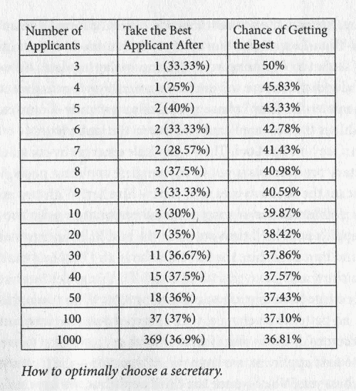
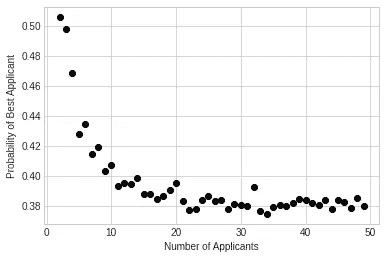

# 基于 Google Colab 的最优停止算法

> 原文：<https://towardsdatascience.com/optimal-stopping-algorithm-with-googles-colab-5b7f9f217e51?source=collection_archive---------40----------------------->

## 将众所周知的问题移植到最新的云计算服务中

图片来源:unsplash.com

谷歌的 Colab 是一个强大的工具，就像你们中的许多人已经习惯了谷歌驱动、文档、表格一样。你可以在远程机器上运行 python 代码，甚至可以访问 GPU/TPU。

最近我对 Brian Christian 和 Tom Griffiths 的书《赖以生存的算法》非常感兴趣，他们讨论了最优停止算法(也称为秘书问题)。网上有许多很好的资源(下面的链接)描述了这个问题，但这里有一个总结:

# 问题总结

假设你想从 N 个助手中雇佣一个助手。这些候选人是随机面试的，你必须在面试后马上做出决定——接受还是拒绝。一旦你拒绝了一个候选人，他们就不能被召回。

当然，在你面试他们的时候，你知道这个候选人有多好，并且能够将他们与之前的候选人(你拒绝了并且无法回忆起来的候选人)进行比较。困难是双重的——你无法回忆起过去的候选人，也不了解未来的候选人。你所能做的就是将你面前的候选人与过去的候选人进行比较。

你什么时候停下来接受一个候选人？

当你停下来的时候，你获得最佳候选人的概率是多少？

# 测试案例

让我们做几个测试案例。

**N = 1(只有一名候选人申请。)**

在这种情况下，你的最佳候选人也是你的最差候选人，所以你得到最佳候选人的概率是 100%(或 1.0)

**N = 2(有两名候选人申请。)**

这就像扔硬币一样。无论你停在第一个还是第二个候选人，你得到最佳候选人的概率是 50% (0.5)

N = 3(三名候选人申请。)

这是第一个必须应用策略的真实例子。排名候选人有 6 种不同的方式展示自己:

候选人可以展示的 6 种不同方式(1 =最好，3 =最差)

如果你停在第一个候选人，你得到最佳候选人的机会是 1/3(见最后两个排列)。

如果你停留在第二个候选人，并且只有在这个候选人比你面试的第一个候选人更好的情况下才选择候选人**，那么你获得最佳候选人的几率是 3/6(见下图)。**

在第一个候选者**之后停止，如果**这个候选者比第一个更好(否则继续)

如果你停在第三个候选人，你的选择是有限的，只有 2/6 的机会你得到最好的候选人。

假设你一直在寻找 N 个候选人，这是你最终应该收敛的(下面的代码将总结你应该选择多少，以及“得到最好的”的机会)

来自:亨利·张伯伦来源:[comicsgrinder.com](https://comicsgrinder.com/2016/05/07/book-review-algorithms-to-live-by-the-computer-science-of-human-decisions/)

# Google Colab

我们可以用谷歌的 Colab 来表示这个算法:

首先导入所需的包并设置样式。我在这里使用了 seaborn-whitegrid。

设置申请人数并创建一个空数组:

循环多次重复(我在这里对每个 N 数重复了 10，000 次，并对结果取平均值)。通过更高的重复次数，您将获得更接近真实概率和最佳选择指数的数字:

最后，创造情节:

我鼓励你通读这些关于最优停止问题的参考资料，你会注意到这个概率收敛到 37%左右。

作者图片

请不要折磨自己试图复制上面的脚本，用我的:

## [谷歌 Colab 脚本](https://colab.research.google.com/drive/1RrQkibROjMDZP12pNvWzdlQywuw62H6J?usp=sharing)

# 参考资料:

[1]希尔，T. [知道什么时候停止](https://www.americanscientist.org/article/knowing-when-to-stop)。(2009)，美国科学家

[2]维基百科:[最优停止](https://en.wikipedia.org/wiki/Optimal_stopping)访问时间:2020 年 10 月

[3]斯旺森，A. [根据《华盛顿邮报》math](https://www.washingtonpost.com/news/wonk/wp/2016/02/16/when-to-stop-dating-and-settle-down-according-to-math/) (2016)