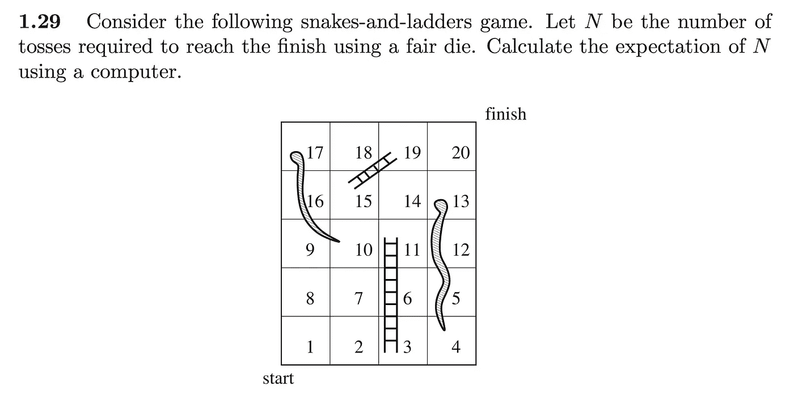

# 最佳停止和 50 个高斯阴影

> 原文：<https://towardsdatascience.com/optimal-stopping-and-50-shades-of-gauss-2ed031faf865?source=collection_archive---------39----------------------->

当我还是个孩子的时候，以色列电视上一个很受欢迎的节目是“谁想成为百万富翁”。对于那些不熟悉这种形式的人来说，参赛者会被问一些选择题形式的琐事问题(在希伯来语中，出于某种原因，这被称为“美国风格”)。如果他是正确的，他的试探性收益会翻倍，但是如果他没有回答正确，他将一无所获。在任何时候，他都可以退出，带着他所拥有的离开。这种直截了当的游戏形式中的主要戏剧是决策——以及对损失一大笔钱的不可避免的遗憾。通常 64k NIS 级别是真正的戏剧开始的地方。

你如何着手模拟这个决策过程，并建议参赛者何时退出？作为建模者，你需要考虑几个问题:

*   这些问题是“公平的”(概率模型)还是“敌对的”，也就是说，在某些时候，产品会试图给你越来越难的问题，这些问题可能针对你的弱点？(然后，在初步问卷中，在你真正擅长的事情上表现很差可能是明智的)

在一个概率模型中，你会假设提升到下一个级别的指标函数来自一个 I . I . d .[伯努利试验](https://en.wikipedia.org/wiki/Bernoulli_distribution)，其中每个参赛选手都有一个不同的 p-强选手的 p 接近 1，而弱选手的 p 接近 0。

对抗模型更适合[在线算法](https://en.wikipedia.org/wiki/Online_algorithm)框架，所以我不会在这里讨论它。

*   参赛选手[是厌恶风险](https://en.wikipedia.org/wiki/Risk_aversion)还是热爱风险？他参加比赛的财务目标是什么？

要想知道如何解决这类问题，让我们转到劳勒的书《随机过程简介》。第 4 章讨论了“最优停止”的问题。这是概率世界中关于决策的一般概率理论，有时也被称为“随机优化”或“随机控制”。他很好地处理了三种不同的场景——普通最优停止、带成本的最优停止和带折扣因子的最优停止。成本意味着你选择留在游戏本身就有一些成本，所以你每多走一步都会有所损失。贴现因子是同一事物的乘法版本——它意味着仅在下一步获得收益的价值可能是现在获得收益的 90%。

让我们来看一个练习——4.8——幸运之轮。在这种设置中，一个有 12 个点的轮子每轮转动一次。它上面有 100 美元到 1100 美元的数字，1 点是破产——如果达到这个数字，您的所有收益都将丢失，游戏结束。问题是什么时候停止是最优的，在这个策略下你的预期收益是多少。

我们的决策规则看起来怎么样？我们只能使用所谓的[停止时间](https://en.wikipedia.org/wiki/Stopping_time)，即只能考虑游戏中目前发生的事情，而不能考虑未来会发生什么的规则。然后，我们需要定义一个从系统的这些状态到我们的决策的映射，在这种情况下，是一个{0，1}变量的退出/继续。可以看出，在我们的例子中，整个历史并不重要——如果你目前有 2000 美元的试探性收益，你的决定不应该受到你是在两轮中获得 1000 美元还是在 20 轮中获得 100 美元的影响。唯一重要的等式是下面的递归关系:

V[n+1] = 11/12 * (600 + V[n])

也就是说，如果在第 n 轮有 V[n]次试探性的收益，在第 n+1 轮，你应该预期以 1/12 的概率获得 0 次收益，以 11/12 的概率获得当前的收益+ 600(这一轮的平均赢款)。每当右侧大于当前 V[n]时，您应该继续，否则退出。这给出了等式

V = 11/12 * (600 + V)

或者干脆 V=6600。因此，6600 美元是阈值，如果你的钱少，你应该继续，如果你有这个数目或更多，你应该退出。

现在给定这个规则，我们可以使用动态规划来计算预期的游戏价值。请注意，游戏的预期价值与您提取的价值并不相同！至于你的策略，你会一直坚持到 6600 年，但这并不意味着宇宙会允许你走这么远。对于我在这个 [github 库](https://github.com/yotam-gafni/simulation_tools)中实现的动态编程过程，我们从 6600 向后传播条件期望。如果我们到达 6600 点，那么我们可以预期 6600 点的增益(或者 X 对于任何 X > 6600 点)。如果我们到达 6500 点，根据停止规则，我们可以预期 11/12 * (600 + 6500)。如果我们到了 6400，我们可以期待 1/12 * v(6500) + 10/12 *(650 + 6400)(为什么？)等等。通过线性期望，我们可以推断出游戏的价值大约是 3134 美元。

我对大多数劳勒最优停止问题的解决方案也在 [github 资源库](https://github.com/yotam-gafni/simulation_tools)中，你可以在尝试自己解决后查看它们——这些都是很好的问题。

让我们来看一个稍微难一点的问题，这次来自 Rubinstein Kroese 关于蒙特卡罗方法和交叉熵的书。

所以提醒一下，每次你碰到“绳子”(“蛇”)的上侧，你就会下到相应的下侧方块，反之亦然。为了计算穿过整个棋盘的预期时间，您可以尝试以动态编程的方式反向传播条件预期的相同方法，但是当您到达方块 16/17 时，您会遇到一个小问题——它们实际上取决于尚未计算其值的方块。但这只是意味着，不要把它当作一个动态规划问题，你需要把它当作一个线性方程组问题，并为每个方块求解由递归关系定义的系统。解决方案在 snakes.py 脚本中，您大约掷出 7.1 次骰子(我假设您从 0 开始，每当越过 20 就结束，但其他常见版本都假设您从 1 开始，只有当您正好落在 20 时才结束，否则您会回到掷骰子时的松弛量。这将改变递归关系，并相应地改变预期时间，可能会更长一点)。

你可以考虑这个问题的优化版本，它与[计划](https://en.wikipedia.org/wiki/Automated_planning_and_scheduling)有关。如何定位蛇和梯子，以便最大限度地增加玩耍时间(对于那些希望孩子在家工作时忙碌的父母来说，这很有用)。如何定位它们，使游戏时间的变化最大化(可以带来更有趣的游戏体验)。在所有可能的游戏配置上，我没有发现比蛮力更好的方法，这在小棋盘上是可行的。这产生了大约 7.67 掷骰子的最大预期游戏时间，但是它在最开始有一个非常清楚的定位梯子的结构(所以有很大的机会完全错过它们)和在最后的绳子，所以看一看是否有更正式的东西可以在总体上解决这个问题是很有趣的。

**高斯 50 度**

现在来点完全不同的。我曾经认为模拟随机变量是一个技术和枯燥的领域，但实际上它非常有趣。计算机编程的艺术第 2 卷第 3 章给出了一个很好的背景，解决了“什么是随机的”这一重要的哲学问题。既然我们生活在现实世界中，你如何确定一个数字序列是“随机”的？32 乘以 0 的序列与 011110011001010000001011011011111101 一样代表 32 次独立的伯努利试验，但不知何故我们认为后者更“随机”。关于[随机模拟](https://www.academia.edu/39637153/Stochastic_Simulation_Algorithms_and_Analysis_-_Asmussen_S._Glynn_P.W)的 Asmussen 书的第 1 章和第 2 章给出了关于如何在计算机系统中实现从概率分布中抽取的更多技术背景。重要的概念是，一旦你知道如何模拟任何概率分布，就有办法通过[反演](https://en.wikipedia.org/wiki/Inverse_transform_sampling)和[重要性抽样](https://en.wikipedia.org/wiki/Importance_sampling)和其他方法将其重塑为任何其他概率分布。练习 2.9 非常好，它要求你用 6 种不同的方法从标准正态分布中提取数据。我做了 9 个。通过对样本执行μ+σ* RES，这可以容易地推广到正态分布的任何参数化(μ，σ)。在这个过程中，我学到了一些关于 python 实现中这个基本操作的警告的重要经验

*   [随机包](https://docs.python.org/3.1/library/random.html)普通变量实现有点慢。它使用[制服比例](https://link.springer.com/chapter/10.1007/978-3-319-72634-2_5)方法，该方法似乎比[箱式研磨机](https://en.wikipedia.org/wiki/Box–Muller_transform)变体更慢。高斯函数更好(使用 box-muller)，但由于它没有要求多个样本的选项，因此它会抛出许多不必要的样本。由于 box-muller 每次运行产生两个样本，如果您要求 random.gauss 产生 100k 个样本，您实际上将丢弃 100k 个其他样本，浪费两倍的时间。
*   numpy 包非常好——特别是因为它使用了 cython，这占了节省时间的大部分(比现在提到的 2 倍因素多得多)。但这只有在你要求一批样品的情况下才适用——如果你一个一个的要求，效率非常低！我很高兴我现在知道它有多重要(对于 100k 样本，它是 0.03 秒和 20 秒之间的差异——660 倍的因子)。

代码在 [github 库](https://github.com/yotam-gafni/simulation_tools)中给出。

