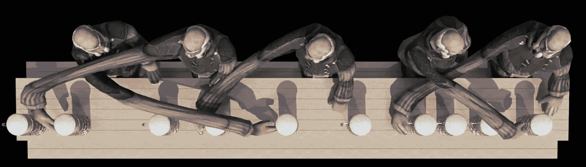
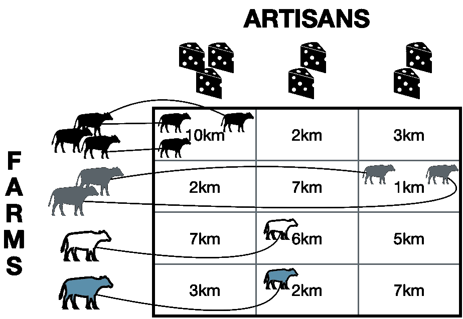
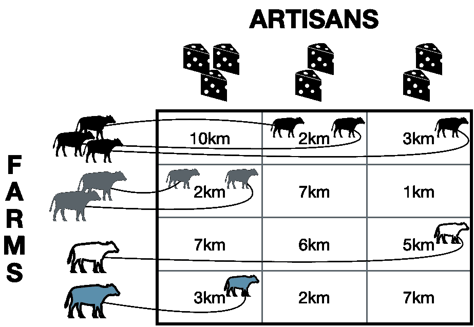
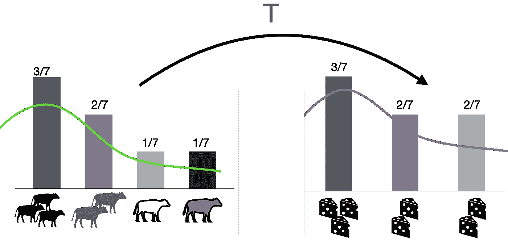
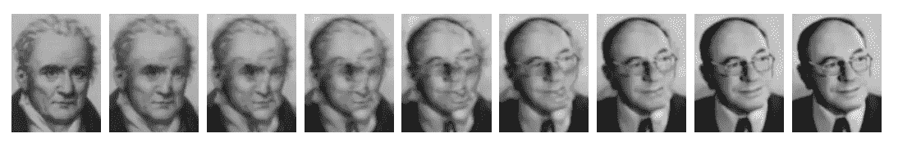
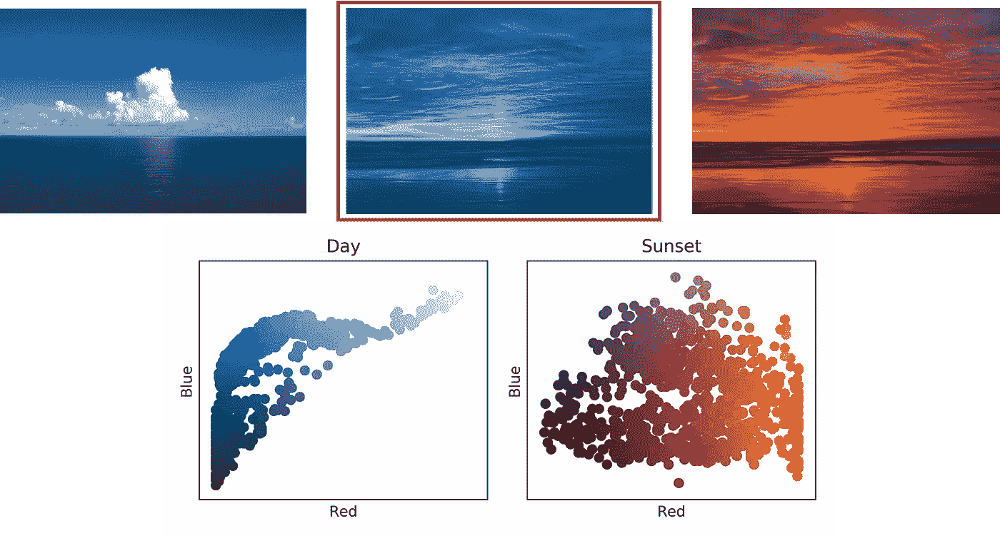

# 最优运输:一颗隐藏的宝石，赋予今天的机器学习以力量

> 原文：<https://towardsdatascience.com/optimal-transport-a-hidden-gem-that-empowers-todays-machine-learning-2609bbf67e59?source=collection_archive---------16----------------------->

## 解释目前机器学习中最新兴的方法之一

来源:[尼古拉斯·邦尼尔](https://perso.liris.cnrs.fr/nicolas.bonneel/spot/)，通过 [Youtube](https://www.youtube.com/watch?time_continue=2&v=KTFn3YWN7b4&feature=emb_logo)

如果我说，对于神经科学中的大脑解码、计算机图形学中的形状重建、计算机视觉中的颜色转换以及神经语言处理中的自动翻译等不同问题，有一种单一的解决方案，你会相信吗？如果我要在这个列表中添加[转移学习](/why-transfer-learning-works-or-fails-27dcb8095670)、图像配准和音乐数据的频谱分解，而事实上我所说的解决方案与深度学习无关呢？好吧，如果你猜不到正确的答案，那么请继续阅读，因为这篇文章是关于最优运输(OT):一个可以追溯到 18 世纪晚期的数学理论，最近在纯数学领域蓬勃发展(在过去的 12 年里获得了 2 个奖！)和机器学习成为目前最热门的话题之一。和我一起走过 OT 跨越过去三个世纪的美丽历史，了解它为什么成为今天机器学习如此重要的一部分。

## 开始

像许多美好的事物一样，这一切都始于 18 世纪晚期路易十六统治下的法国，大约是 1789 年法国大革命的十年前。在那个阳光明媚的日子里，路易十六在和他的国家最杰出的科学家之一加斯帕尔·蒙日讨论一件政府最重要的事情时，看起来很关心。

“你看，加斯帕德，”路易十六说，“我们在法国有三种类型的奶酪认证:完全不需要离开农场制作的费米尔奶酪，工匠用附近农场的牛奶制作的手工奶酪，以及在工厂用同一地区的牛奶制作的莱蒂尔奶酪。问题是，制作手工奶酪的工匠往往会浪费太多时间四处奔波，从太远的农场取奶。加斯帕德，我希望你能帮助我们解决这个问题，弄清楚哪个农场把所有的牛奶都给了哪个工匠，这样奶酪才会丰富，生活才会美好。

“哦！”加斯帕德有点激动地喊道，“就像我最近和我的冶金学家同事们一起研究的矿石和矿井的问题一样。”

“随便吧，加斯帕德，”陛下回答道。“只要奶酪在桌子上，人民高兴。”

假设**一头奶牛的牛奶**足以生产**一块奶酪**，这里的最优 **T** 将是箭头所示的**分配**，总距离为 19 公里。

在与国王的这次谈话后，加斯帕德立即意识到，他正在处理的问题可以用左边的表格来表达。在这里，每个单元格给出了农场和工匠之间的距离，而奶牛和奶酪的数量则表明了它们各自的生产能力和供应需求。目标是找到一个函数 **T，**称为**蒙日图**，通过考虑农场之间的距离和各自的需求，以最佳方式将每个农场分配给一个工匠。

尽管它看起来很简单，但数学家们花了将近 200 年的时间来完全描述这个问题(比著名的费马大定理少了大约 140 年)，直到扬·白来尼在 1991 年表明，它在科学中使用的一些常见距离的一般(连续)情况下承认了一个解决方案。但是，在此之前，发生了以下重要的事情。

## 共产主义意想不到的好处

图书管理员尼娜在 20 世纪 30 年代末的工作就像今天的谷歌搜索一样，她盯着列宁格勒国立图书馆的书架，试图找到夏尔·波德莱尔的书《恶之花》。后者是列昂尼德要的，他是一个年近三十的诗歌爱好者，现在正不耐烦地等在柜台前。

“我们没有夏尔·波德莱尔，坎特罗维奇同志，”她回到工作场所时说。“但这里有一篇关于冶金学的好文章，作为线性编程的发明者和光荣的苏联公民，你可能会感兴趣”。

她提到的那篇好文章是加斯帕尔·蒙日的“*mémoire sur la théOrie des déblais et des remblais”*Leonid Kantorovich 有点失望地接受了这篇文章，并在回家阅读时想出了如何改进的方法。

在 Kantorovich 公式中，我们被允许**在工匠之间分割生产**,以最小化他们所走的距离。

“蒙日问题(T21)的问题是那些君主主义者不分享东西，而我们，苏联人民，彼此分享一切，”列昂尼德自言自语道。“以牛奶为例。我们为什么要关心不让农场在所有工厂之间分配生产呢？”

这让他想到了后来被称为**蒙赫-坎特罗维奇问题**的想法，在这个问题中，与寻求一个函数 **T** 将每个农场分配给一个工匠相反，我们现在希望找到一个(概率)函数**г**，它允许在所有工匠之间分割农场的生产。

与 Monge 的问题相反，这个问题可以被证明:1)在一些关于所用距离的温和假设下总是有解，2)在过去 60 年中，十几个不同的研究人员为此获得了诺贝尔奖、菲尔兹奖和其他杰出的奖项。最后，它暗示了为什么后苏联国家的奶酪尽管以不同的名字出售，味道却是一样的，我的朋友，这是一个伟大的现代谜团，需要加以解释(相信我，我出生在乌克兰)。

## **低级视图**

正如你可能已经猜到的，到目前为止，所有的故事都是为了娱乐而简化的(甚至是虚构的),并提供了一个隐藏在 OT 背后的一般直觉，因为蒙赫和坎特罗维奇所考虑的真正问题要比这复杂得多。

> 事实上，OT 的**真正力量隐藏在其作为一种机制的**的能力中，这种机制以尽可能最低的努力将一个********概率分布转化为另一个**。******

**后一个标准是通过某个函数来测量的，该函数为两个分布中的任何一对点提供了不相似性。**

****

**用直方图表示的离散概率分布和用绿色和紫色线给出的拟合连续近似表示的 Monge 问题。**

**回到我的农场和工匠的例子，我现在可以定义两个离散分布，概率由每个农场的产量(7 头奶牛中的 3 头给我 3/7 的概率)和每个工匠的需求给出。然后，我将获得两个直方图，之前考虑的距离将成为将第一个分布中的点转换为第二个分布中的点的成本。**

**“但这为什么如此重要？”你可能会问。**

> **嗯，主要是因为数据科学从业者**操纵的**大量对象**可以建模为概率分布**。**

**例如，任何图像都可以被视为像素上的分布，概率由它们的强度归一化总和为 1 给出。这同样适用于文本文档，您可以看到单词的离散分布，概率由它们的出现频率给出。这样的例子数不胜数，当您需要比较两个如此复杂的对象时，OT 允许您处理所有的例子。**

**“但是我们通常用距离来比较物体！”你可能会注意到。**

> **好吧，我们再一次讨论了这个问题，因为这个问题的 **Kantorovich 公式**定义了一个关于分布空间的**真实度量**，称为**瓦瑟斯坦距离**，它服从三角不等式，当两个分布相等时消失。**

****

**使用 OT 在蒙日和康托洛维奇肖像之间插值。中间图像显示了将一幅图像转换成另一幅图像的最短路径。**

**此外，当 OT 问题找到将一个分布转换为另一个分布的最有效方法时，您可以使用它的解决方案在它们之间平滑地插值，并沿此路径获得中间转换。为了说明这一点，让我们以加斯帕尔·蒙日和列昂尼德·坎特罗维奇的形象为例，解决他们之间的优选论问题。上图中的结果显示了两幅图像之间的测地线路径，该路径通过最有效的方式(最短路径)将一幅图像逐渐转换为另一幅图像，其几何形状(或本例中像素之间的成对距离)由您使用的成本函数指定。很酷吧。！现在让我们最终回到现代，看看这对机器学习到底意味着什么。**

## **应用程序的预告片**

**下面，我将只介绍 OT 在计算机视觉和神经语言处理中的一些应用，以及用于产生结果的代码，这些代码将在[“Python 最优传输工具箱实践指南:第 2 部分”](/hands-on-guide-to-python-optimal-transport-toolbox-part-2-783029a1f062)中详细介绍。另外，查看本文[“Python 最优传输工具箱实用指南:第 1 部分”](https://medium.com/@aboisbunon/hands-on-guide-to-python-optimal-transport-toolbox-part-1-922a2e82e621)中的 Python 最优传输工具箱介绍。**

****

****顶行** : **左** —原始天空图像；**右** —原始日落天空图像；**中间** —颜色转移的结果。**底行**:蓝色和红色频率点的坐标，突出显示两幅图像的不同颜色风格。读者可以使用[下面的代码](https://pythonot.github.io/auto_examples/domain-adaptation/plot_otda_color_images.html#sphx-glr-auto-examples-domain-adaptation-plot-otda-color-images-py)来重现结果。**

***颜色转移。*在[这个应用](https://arxiv.org/pdf/1307.5551.pdf)中，我们有两幅图像:一幅是海洋上空的蓝天，另一幅是日落。我们的目标是将第一张图像的颜色风格转移到第二张图像，这样日落图像的颜色看起来就和白天的一样。如前所述，我们将两幅图像视为由 RGB 立方体中的三维向量给出的像素概率分布。我们从每幅图像中抽取 1000 个像素，并使用 OT 将它们对齐。最终的结果在左边的中间图像中给出，显示了带有白天颜色的高度真实的日落图像。**

****

**使用[中的代码(此处为](https://github.com/ncourty/PoissonGradient))通过 OT 对泊松图像编辑进行颜色渐变调整的结果。请注意，使用更精确的图像遮罩可以改善最终结果。**

***图像编辑。*对于这个任务，目标是通过使用另一个图像的补丁替换图像的一部分来编辑图像。例如，在左边的图片中，你可以看到我的脸，蒙娜丽莎的脸，以及我的脸无缝复制到她的脸上的结果。这里的最佳传输被应用于两个图像的颜色梯度，然后求解泊松方程以计算编辑的图像。更多这方面的例子，请看[这篇论文](https://papers.nips.cc/paper/6312-mapping-estimation-for-discrete-optimal-transport.pdf)。**

****

**使用 OT 对齐以不同语言编写的文档的嵌入为[自动翻译](https://arxiv.org/pdf/1809.00013.pdf)和[跨语言信息检索](https://arxiv.org/pdf/1805.04437.pdf)提供了最先进的结果。**

***自动翻译*。现在让我们把注意力转向图像以外的东西，并考虑文本语料库。我们的目标是找到两种不同语言中单词和短语的匹配。让我们以下面的一对为例:给定英语命题"*猫坐在垫子上*"及其法语翻译"*le chat est assis sur le tapis*"，我们希望找到一个提供对应关系"*猫* "- " *聊天*"，"*坐在* "- " *assis* "和"*垫子* "-"的匹配你明白我的意思了，是吗？！我将定义每个命题的分布，并将每个单词视为一个点。然后，我将使用它们嵌入之间的距离来匹配 OT 的两个分布。这个匹配的结果可以在左边看到。**

**还有更多 OT 被证明有用的应用，例如包括[形状重建、](https://perso.liris.cnrs.fr/julie.digne/articles/jmiv.pdf)[多标签分类、](https://arxiv.org/pdf/1701.07875.pdf)[大脑解码](https://arxiv.org/pdf/1503.08596.pdf)[图像超分辨率](http://openaccess.thecvf.com/content_cvpr_2015/papers/Kolouri_Transport-Based_Single_Frame_2015_CVPR_paper.pdf)等等。OT 本身就是一个巨大的宇宙，而且它只会不断上升，这一点在顶级机器学习会议上越来越多的研究论文中得到了证实。**

## ****后记****

**这篇文章故意跳过了所有关于蒙日和蒙日-坎特罗维奇问题、对偶理论和最近引入的熵正则化的数学细节，以便即使没有数学背景的读者也能理解。要了解更多的技术细节，读者可以参考许多关于 OT 理论的精彩综述，包括 Gabriel Peyré和 Marco Cuturi 的新书以及 Cédric Villani 的更深入的专著。**