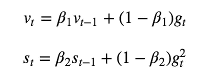
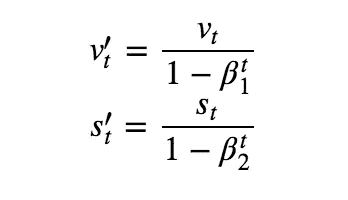
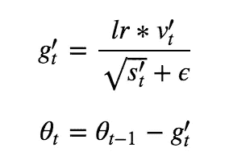
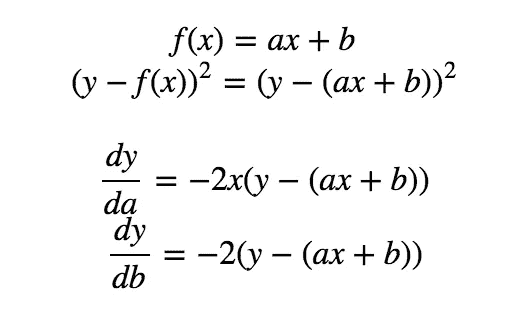
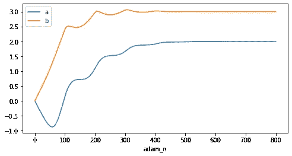

# 优化算法—自适应矩估计(Adam)

> 原文：<https://towardsdatascience.com/optimisation-algorithm-adaptive-moment-estimation-adam-92144d75e232?source=collection_archive---------13----------------------->

## 自动协调机制的实施

如果你曾经使用过任何一种深度学习的包，你一定使用过亚当作为优化者。我记得有一段时间，我有一个想法，每当你试图优化一些东西，就用亚当，仅仅因为它是最好的。在这篇文章中，让我们打开黑盒子，看看是什么让亚当如此特别和强大。


# 圣经》和《古兰经》传统中）亚当（人类第一人的名字

每一种算法都不是凭空出现的，它要么是从另一种算法演化而来，要么是克服了另一种算法的某些不足。这同样适用于亚当。优化算法大致通过以下方式发展:

```
vanilla gradient descent => sgd + momentum => adaptive gradient
```

(解释与实现:[梯度下降](/gradient-descent-explanation-implementation-c74005ff7dd1)、 [SGD+动量](/stochastic-gradient-descent-momentum-explanation-8548a1cd264e)、[自适应梯度](/introduction-and-implementation-of-adagradient-rmsprop-fad64fe4991))

SGD 为梯度下降增加了随机性，momentum 加速了收敛，而 adaptive gradient，顾名思义，适应不同参数的不同学习速率，Adam 在某种程度上集合了其他算法的优点，使之成为一种算法。

> 自适应矩估计(Adam)是另一种计算每个参数的自适应学习率的方法。除了存储过去平方梯度`s`的指数衰减平均值(如 Adadelta 和 rms prop ), Adam 还保存过去梯度`v`的指数衰减平均值，类似于 momentum。动量可以被视为一个沿斜坡向下运行的球，而亚当的行为就像一个有摩擦力的重球，因此更喜欢误差面上平坦的极小值。

我们来看看它的更新过程:



其中`v`是第一时刻，它类似于记录过去标准化梯度的动量。`s`为二阶矩，与自适应梯度下降& RMSprop 中引入的相同。这个术语有助于给出不同参数的不同学习率。

> 由于`v`和`s`被初始化为 0 的向量，Adam 的作者观察到它们偏向于 0，尤其是在初始时间步长期间，尤其是当衰减率较小时。他们通过计算偏差修正的一阶和二阶矩估计来抵消这些偏差:



最后的更新是:



最终的更新过程实际上与自适应梯度下降中引入的公式相同，只是命名器中的梯度被替换为`v`，因此现在应该清楚的是，Adam 结合了其先例的思想，并演变成了更好的版本。

# 履行

为了与之前的介绍保持一致，我们仍将使用相同的优化任务:



我们试图用两个参数`a, b`最小化`y — f(x)`的损失，上面计算了它们的梯度。

样本生成将是:

我们生成了 100 个`x`和`y`的样本，我们将使用它们来找到参数的实际值。

实现将遵循上面的公式:

我们设置`β1 = 0.9, β2 = 0.999`，学习过程会是这样的:



我在这里展示的例子并没有显示 Adam 的明显优势，然而，在更复杂的场景中，Adam 似乎是目前最好的选择。

上面的实现有点冗长，因为我们一直在为每个参数重复相同的过程。下面给出了一个更简洁的实现:

最后，你可以在这里实现[。](https://github.com/MJeremy2017/Machine-Learning-Models/tree/master/Optimisation)

参考:

1.  [https://ruder . io/optimizing-gradient-descent/index . html # stochasticgradientdescence](https://ruder.io/optimizing-gradient-descent/index.html#stochasticgradientdescent)