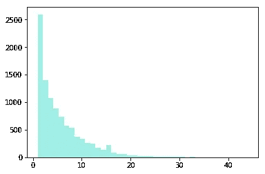
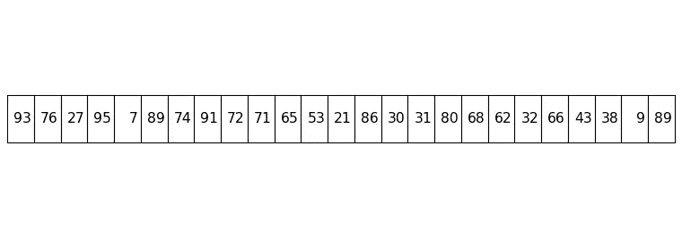
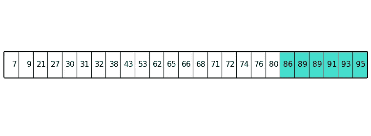
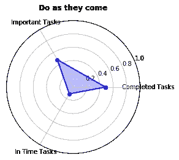
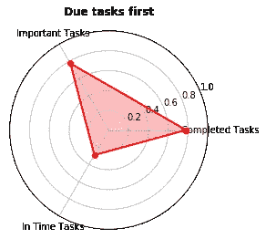
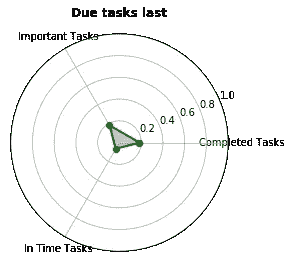
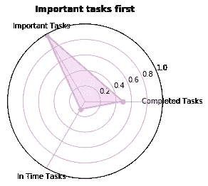
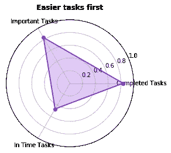
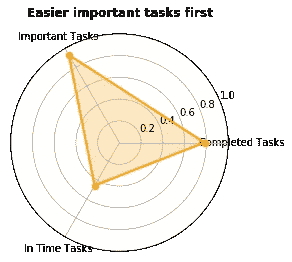
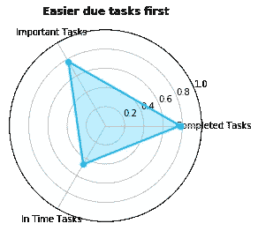

# 使用 Python 中的蒙特卡洛模拟优化您的待办事项列表

> 原文：<https://towardsdatascience.com/optimise-your-todo-list-with-monte-carlo-simulations-in-python-1682a8a5eb84?source=collection_archive---------11----------------------->

## 创建蒙特卡洛模拟，找出管理待办事项列表的最佳策略

从我的假期回到现实世界是相当痛苦的。我怀念没有被闹钟吵醒的日子，怀念没有通勤去办公室的日子，怀念没有一整天排着一个接一个会议的日子。我也怀念没有待办事项的日子，除了清晨和妻子一起在海滩散步。


(鸣谢:张秀雄)

像很多人一样，我的待办事项列表中有很多事情。保存待办事项清单有不同的思想流派——有些人喜欢把它们保存在手机的应用程序中，有些人与他们的电子邮件客户端同步，还有一些人在纸上有一个[系统](https://bulletjournal.com/pages/learn),甚至有一个私人助理来帮助组织它们！不管是哪一种，待办事项列表的想法都是为了帮助你更有效地完成任务。


另一个待办事项列表(鸣谢:[https://www . Flickr . com/photos/robandstephanielevy/4616960925](https://www.flickr.com/photos/robandstephanielevy/4616960925))

这就引出了一个显而易见的问题——如果你的待办事项清单上有多项任务，你应该先做哪一项？单子上的第一个？最容易做的一个？先说重要的？或者你应该有更复杂的方法来解决它们吗？

如果你有有限的时间来完成我们的任务，这一切会变得更有趣。如果你没有足够的时间，你应该先处理哪一个，用什么策略来优化你的时间？

显然，这在很大程度上取决于你想优化什么——你想完成尽可能多的任务吗？还是完成尽可能多的高优先级任务？还是尽可能多的及时完成任务？

# 建模

我喜欢[蒙特卡洛模拟](https://en.wikipedia.org/wiki/Monte_Carlo_method)。我想大多数程序员都是这样。除非你非常擅长数学，否则解决问题的好方法就是简单地对问题建模，生成随机数据，并尽可能多地运行模拟。

就这么想吧。假设你想找出掷出三个骰子得到 4、5 和 6 的[可能性。你可以想出一个数学公式，或者我们可以简单地掷骰子十万次，记录每次掷骰的结果来得到概率。](https://www.thoughtco.com/probabilities-for-rolling-three-dice-3126558)


(鸣谢:张秀雄)

掷骰子十万次是相当乏味的，但是如果你是一个程序员，你将编写一个简单的脚本来生成 1 到 6 之间的两个随机数，然后循环它。

当然，在这个例子中，得出数学公式更容易，因为你可能在小学数学中学过，但对于更复杂、更难解决的问题，这可能是得出答案的一种非常有效的方法。

这就是蒙特卡罗模拟的本质。这就是我们在试图优化待办事项列表时，用来找出最佳策略的方法。我们将使用 Python 3 建立一个蒙特卡洛模拟，在 Jupyter 笔记本上运行。模拟将测试各种策略，我们将通过我们设计的一组指标来衡量它们的有效性。

我们开始吧！

# 模型

我们需要做的第一件事是建立一个模型。这很简单，我们唯一真正需要建模的是任务。

在大多数待办事项列表中，我们都有任务描述、一些注释和截止日期。许多人还对任务设定了优先级。作为任务建模的一部分，我们还需要指出任务花费的时间以及任务完成的日期。

换句话说，我们将使用以下属性对任务进行建模:

*   重要性(权重)
*   到期日
*   复杂性(持续时间)
*   完工日期

对待办事项任务建模

我用`recordtype`来代表`Task`。它就像一种叫做 tuple 的可变类型，并且相对简单。为了创建一个任务`recordtype`，我们需要一个函数来创建任务。

# 创建任务

`create_task`函数获取任务数来创建并返回任务列表。对于每个任务，我需要设置`weight`、`due`日期、`duration`和完成日期(`done`)。

`weight`只是 1 到 100 之间的一个随机数，数字越大，任务越重要。我使用`randint`来生成随机数。它采用了离散的均匀分布，这真的就像是扔一个[有 100 个面的骰子](https://www.skullsplitterdice.com/pages/how-to-use-a-d100)(这个确实存在，我不骗你)。


d100 模具(又称[二面体](https://en.wikipedia.org/wiki/Zocchihedron))(演员表:[https://www.skullsplitterdice.com/pages/how-to-use-a-d100](https://www.skullsplitterdice.com/pages/how-to-use-a-d100))

`due`日期是另一个整数，表示该任务离模拟开始的天数。待办事项列表中的截止日期大多接近当前日期，更远的截止日期并不常见。为了对此建模，我创建了一个[指数分布](https://en.wikipedia.org/wiki/Exponential_distribution)，速率参数( *λ)* 值为 5。然后我从这个分布中随机选择一个值。这样做的目的是让预产期更接近，而不是更晚。



分布= NP . round(NP . random . index(5，10000)) + 1

任务的`duration`参数是完成该任务需要多少时间，这实际上是任务的复杂性。持续时间应该小于截止日期，否则不可能完成任务！为了对此建模，我将持续时间设为 1 到到期日之间的一个随机整数，再次使用`randint`。

最后，当任务被创建时，完成日期或`done`属性被设置为 0，并且一旦任务被完成，它将被设置为一个整数，该整数表示自模拟开始以来已经过去的时间量。

我们还需要一个在运行模拟后统计结果的函数。

# 清点

`tally`函数接受一个已完成任务列表和一个为模拟创建的所有任务列表，并返回一个由 3 个值组成的元组:

1.  已完成的任务数
2.  已经完成的重要任务的数量
3.  及时完成的任务数

这些值也是我们衡量算法有效性的标准。让我们看看我们是如何得出这些值的。

## 完成的任务

为了计算已完成任务的百分比，我们只需计算已完成任务的数量与所有任务的总数之比。

```
completed = len(completed_tasks)/len(all_tasks)
```

## 完成的重要任务

计算出有多少重要任务已经完成是很棘手的。首先，我们如何确定哪些任务是重要的？每个任务有一个值在 1 和 99 之间的`weight`。该值越大，任务越重要。



25 个任务的列表，权重表示任务的重要性

一种方法是画一条线，说如果`weight`大于 75，它将被认为是一个重要的任务。然而，每个模拟的权重都是随机设置的，这意味着我们有可能最终没有重要的任务或者有很多重要的任务。这不是我们想要的。

另一种方法是使用百分比法来确定哪些任务是重要的。首先，我们根据任务的重要性对其进行排序。然后我们使用一个[百分点](https://www.mathsisfun.com/data/percentiles.html)，在这种情况下，重要任务的第 75 个百分点(使用第 75 个百分点是任意的)。例如，如果我们运行一个有 25 个任务的模拟，那么第 75 个百分位数是具有最大`weight`值的前 6 个任务，因此这些任务被认为是该特定模拟的重要任务。

```
percentile = round(0.75 * len(all_tasks))    
important_tasks = sorted(all_tasks, key=lambda x: x.weight)[percentile:len(all_tasks)]
```



对任务进行排序后，前 75%的任务(6)被认为是重要的任务(用颜色表示的任务)

现在我们有了一个重要任务的列表，我们可以检查完成的任务列表中有多少任务(也就是说，有多少重要的任务已经完成)。我们用这个数字除以所有任务的总数来表示完成的重要任务的百分比。

## 及时完成的任务

计算这个很简单。我们只需要检查给定列表中每个已完成的任务，并确保`done`日期小于`due date`。如果是，说明任务及时完成了，否则就不是。我们只是用在模拟中所有任务中按时完成的任务数来表示*按时完成的任务的百分比*。

```
intime = len(intime_tasks)/len(all_tasks)
```

# 模拟

接下来我们来看看模拟。如前所述，如果我们有足够的时间来完成所有的任务，我们可能不需要优化待办事项列表。不幸的是，在现实世界中，我们没有这种奢侈。为了模拟这种时间的缺乏，我们将所有任务的持续时间相加，并取总持续时间的一个百分比。这将是我们的`deadline`。

当我们进行模拟时，我们会跟踪`elapsed time`。我们遍历给定的任务列表，对于每个任务，我们将任务持续时间添加到运行时间中。只要`elapsed_time`没有超过`deadline`，我们就将任务完成日期设置为经过的时间，并将任务添加到已完成任务列表中。

一旦经过的时间超过了最后期限，模拟就结束了，我们最终会得到一个已完成任务的列表。记住，即使任务完成了，也不意味着及时完成了。

# 蒙特卡洛


不是这个蒙特卡洛(来自:[https://en.wikipedia.org/wiki/Monte_Carlo_Casino](https://en.wikipedia.org/wiki/Monte_Carlo_Casino))

如果我们只运行一次模拟，那么它就不是蒙特卡罗模拟。蒙特卡罗模拟就是反复运行模拟来解决一个问题。为此，我们将创建一个名为`run`的函数。

这个函数非常简单。我们按照以下步骤进行多次迭代:

1.  创建模拟任务
2.  使用给定的算法模拟任务的执行
3.  获取结果并将其添加到最终列表中

一旦我们有了最终的数据集，我们将它除以迭代的次数，以获得特定算法的最终结果集。

# 待办事项算法

这是有趣的部分！该模拟旨在测试不同的 todo 策略或算法，以确定它们的有效性。使用 3 个度量来测量算法的有效性(如上所述):

1.  完成了多少任务
2.  完成了多少重要的任务
3.  有多少任务按时完成了

这是我们将要实验的不同算法的列表。对于这些算法中的每一个，我们传入一个任务列表，算法的工作是根据我们希望如何处理它们来排序任务。

# 把所有的放在一起

现在我们已经有了我们需要的所有部件，让我们把它们组装在一起，运行我们的蒙特卡洛模拟！对于我们使用的每个算法，我们还想创建一个结果的雷达图。

对于模拟，我们将使用以下参数:

1.  完成所有任务的最后期限是总时间的 50%
2.  我们将为每个模拟创建 25 个任务
3.  我们将运行模拟 20，000 次

运行蒙特卡洛模拟

您可以在以后运行自己的模拟时更改任何参数，以查看它们如何影响最终结果。

# 结果

这是我们运行的每个算法的结果。

## 照他们来的做

这是默认设置，实际上只是按照任务创建时的顺序执行任务。这根本不需要处理，我们只是简单地返回任务列表！

```
Do as they come
- tasks completed                        : 48.47%
- important tasks completed              : 47.77%
- tasks completed in time                : 11.76%
```



正如预期的那样，由于我们只有 50%的时间来完成任务，我们预计只有大约 50%的任务完成。这也适用于重要的任务。

至于任务的完成时间，事实证明只有 12%左右。这也并不意外——因为我们是按顺序执行任务，而不是并行执行，所以许多任务无法及时完成。

## 先完成到期的任务

在这个算法中，我们希望那些提前到期的任务先被完成。换句话说，我们希望按截止日期进行升序排序。

```
Due tasks first
- tasks completed                        : 78.04%
- important tasks completed              : 77.63%
- tasks completed in time                : 29.13%
```



有了这个算法，我们有了好得多的结果！如果我们先完成到期的任务，我们就完成了大约 78%的重要任务。因为我们首先关注的是截止日期，所以我们自然会设法及时完成更多的任务——所有任务中大约有 29%是及时完成的。

## 做最后到期的任务

只是为了测试模拟，我们想把它翻转过来，先做晚些时候到期的任务。如果我们的模拟有效，我们应该会得到很差的结果。

```
Due tasks last
- tasks completed                        : 18.46%
- important tasks completed              : 18.27%
- tasks completed in time                : 6.68%
```



果然，完成的任务数量相当低，约为 18%,只有 7%左右的任务及时完成。

## 先做重要的任务

在这个算法中，我们希望关注任务的重要性，所以我们根据它们的权重，以降序对它们进行排序。

```
Important tasks first
- tasks completed                        : 48.40%
- important tasks completed              : 99.43%
- tasks completed in time                : 11.74%
```



通过首先关注重要的任务，我们完成了几乎所有的重要任务！记住，我们只有一半的时间去做，所以这是一个相当好的结果。正如预期的那样，完成的任务和及时完成的任务的结果与*随来随做*算法相同。

## 先做简单的任务

对于这个算法，我们想先做比较简单的任务，所以我们按持续时间对任务进行升序排序。

```
Easier tasks first
- tasks completed                        : 83.47%
- important tasks completed              : 83.03%
- tasks completed in time                : 46.66%
```



这里的结果很好，但令人惊讶。

我们完成了大约 83%的重要任务。这是意料之中的，因为我们首先瞄准容易的，这意味着我们可以更快地完成它们，从而完成更多的任务。

然而，令人惊讶的是，大约 47%的任务也能及时完成。这个数字甚至高于*预定任务优先*算法！

然而，从另一个角度来看，如果我们先做简单的任务，这意味着我们最终会做更多的任务，从而缩短完成日期。在这种情况下，我们最终会及时完成更多的任务是有道理的。

## 首先做更简单、更重要的任务

我们以前使用的算法是相当一维的。也就是说，我们只关注重要性、截止日期或复杂性。如果我们使用更二维的算法呢？

对于这个算法，我们先做那些比较容易的重要任务。也就是说，我们用每项任务的重要性来衡量其持续时间，并根据结果进行排序。

```
Easier important tasks first
- tasks completed                        : 78.29%
- important tasks completed              : 93.29%
- tasks completed in time                : 45.69%
```



因为这是一个混合算法，我们应该期望结果介于两者之间。对于已完成的重要任务，正如所料，这是在*简单任务优先*和*重要任务优先*算法之间。同样，对于已完成的任务，我们也有介于*重要任务优先*和*简单任务优先*之间的结果。

对于及时完成的任务，我们实际上得到的结果与*简单任务优先*算法几乎相同！

## 先完成应该完成的简单任务

最后，我们试着先做容易的任务。这意味着我们再次衡量每项任务的持续时间，但这次是根据其截止日期，并根据结果进行排序。

```
Easier due tasks first
- tasks completed                        : 77.73%
- important tasks completed              : 77.28%
- tasks completed in time                : 46.49%
```



这个算法的结果有点令人惊讶。对于所有已完成的重要任务，结果与*到期任务优先*算法大致相同，而及时完成的任务与*较容易任务优先*算法大致相同。

# 下一步是什么？

正如你现在可能意识到的，没有最好的算法，最好的算法是优化你想要的算法。如果你想及时完成尽可能多的任务，那么使用*简单任务优先算法*会做得很好。如果你想完成最重要的任务，那么就用*重要任务优先算法*。

正如老话所说，这只是冰山一角。还有很多需要探索和改进的地方。例如，您可以尝试改进模型:

1.  假设任务是按顺序运行的，而不是并行运行的。在现实世界中，这不一定是真的
2.  任务是相互独立的。同样，在现实世界中，这不太可能是真的
3.  我们只使用 3 个参数来模拟一个任务，当然可以有更多的参数分配给一个任务，然后使用它们来找出如何优化它们

你也可以创建更复杂的算法来优化待办事项列表。例如，我只做了两个简单算法的简单混合，你可以尝试创建一个算法，链接起来的重量，到期日和持续时间参数，甚至更多。

此外，我所有的算法只是对待办事项列表进行排序。你实际上可以定制一个特定的任务序列，最大化所有 3 个指标！事实上，您可以尝试在待办事项列表中创建任务序列的不同排列，并通过模拟运行它们，以找出最佳排列。然而，请注意，这并不一定构成一个特定的算法来优化你的待办事项列表，一个复杂的算法在现实生活中很难实践。

请在此随意查看整个 Jupyter 笔记本，并做出您的更改！让我知道你的结果。

有所有代码的 Jupyter 笔记本

# 模拟很好玩！

我们刚刚经历了一系列不同的策略来优化你的待办事项列表，并通过蒙特卡洛模拟来尝试每一种策略。但是模拟有多逼真呢？

正如[著名统计学家乔治·博克斯](https://en.wikipedia.org/wiki/All_models_are_wrong)所说:

> 所有的模型都是错的，但有些是有用的

然而，模拟帮助我们更好地理解我们正在模拟的真实事物或事件。它允许我们操纵参数和应用不同的策略来测试什么是最好的。归根结底，模拟只是让我们更好地制定战略和计划的工具。

玩得开心！