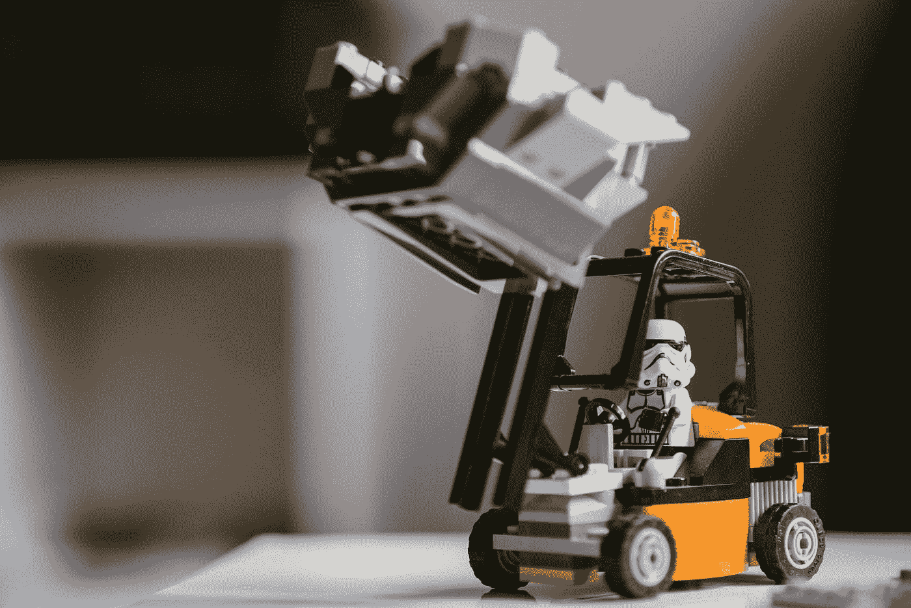
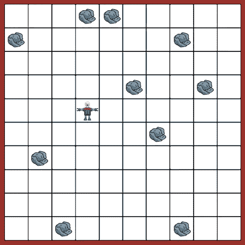
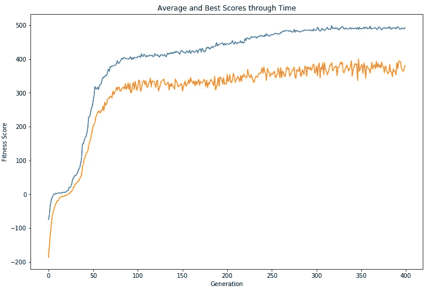
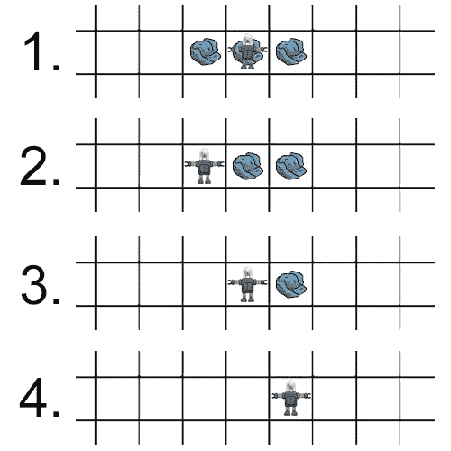

# 用遗传算法优化垃圾收集策略

> 原文：<https://towardsdatascience.com/optimising-a-rubbish-collection-strategy-with-genetic-algorithms-ccf1f4d56c4f?source=collection_archive---------33----------------------->

## 用 Python 从头开始实现遗传算法

遗传算法是一系列优化技术，大致类似于自然界的进化过程。这可能是一个粗略的类比，但如果你眯着眼睛看，达尔文的自然选择确实大致类似于一项优化任务，其目标是制造完全适合其环境的生物体。虽然人类可能花了几千年才发展出相对的拇指和鹰来发展 20/4 的视力，但在本文中，我将展示如何用 Python 实现遗传算法，在几个小时内“进化”出一个垃圾收集机器人。



[张家瑜](https://unsplash.com/@danielkcheung?utm_source=medium&utm_medium=referral)在 [Unsplash](https://unsplash.com?utm_source=medium&utm_medium=referral) 上拍照

# 背景

我遇到的演示遗传算法如何工作的最好例子来自 Melanie Mitchell 的一本关于复杂系统的极好的书，名为“复杂性:导游”(强烈推荐)。在一章中，米切尔介绍了一个名叫 Robby 的机器人，它生活的唯一目的就是捡垃圾，并描述了如何使用遗传算法优化 Robby 的控制策略。下面我将解释我解决这个问题的方法，并展示如何用 Python 实现这个算法。有一些构建这类算法的很棒的包(比如 [DEAP](https://deap.readthedocs.io/en/master/) )，但是在本教程中，我将只使用基本 Python、Numpy 和 TQDM(可选)。

虽然这只是一个玩具示例，但气体在现实世界中有许多应用。作为一名数据科学家，我最常使用它们进行超参数优化和模型选择。虽然它们在计算上可能很昂贵，但 GAs 允许我们并行探索搜索空间的多个区域，并且在计算梯度很困难时是一个很好的选择。

# 问题描述

一个名叫 Robby 的机器人生活在一个充满垃圾、被 4 面墙包围的二维网格世界里(如下图)。这个项目的目的是为 Robby 进化出一个最佳的控制策略，让他能够有效地捡起垃圾，而不会撞到墙上。



作者图片

罗比只能看到他自己的四个方格 NESW 以及他所在的方格，每个方格有 3 个选项；它可以是空的，里面有垃圾或者是一堵墙。因此，罗比可能处于 3⁵ = 243 种不同的场景中。罗比可以执行 7 种不同的动作；移动 NESW，随机移动，捡垃圾或保持不动。因此，Robby 的控制策略可以被编码为 0 到 6 之间的 243 位数字的“DNA”字符串(对应于 Robby 在 243 种可能情况下应该采取的行动)。

# 方法

概括地说，使用任何遗传算法进行优化的步骤如下:

1.  生成问题的随机解决方案的初始“群体”
2.  每个个体的“适应度”是根据它解决问题的能力来评估的
3.  最适合的解决方案是“繁殖”并将“遗传”物质传递给下一代的后代
4.  重复第 2 步和第 3 步，直到我们得到一批优化的解决方案

在我们的任务中，你创建第一代机器人，初始化为随机 DNA 串(对应于随机控制策略)。然后你模拟让这些机器人在随机分配的网格世界里跑来跑去，看看它们表现如何。

## 健康

机器人的适应度是它在 n 次移动中捡了多少垃圾和撞了多少次墙的函数。在我们的例子中，机器人每捡起一件垃圾，我们就给它 10 分，每次撞到墙上就减 5 分。然后，机器人与和它们的健康分数相关的概率“交配”(即捡了很多垃圾的机器人更有可能繁殖后代)，新一代就产生了。

## 交配

有几种不同的方法可以实现“交配”。在米切尔的版本中，她将两个父母 DNA 串随机拼接，然后将它们结合在一起，为下一代创造一个孩子。在我的实现中，我从每个父母那里概率地分配每个基因(即，对于 243 个基因中的每一个，我抛硬币来决定哪个父母将传递他们的基因)。例如，使用我的方法，这里是两个父母和一个可能的孩子的前 10 个基因:

```
Parent 1: 1440623161
Parent 2: 2430661132
Child:    2440621161
```

## 变化

我们用这种算法复制的自然选择的另一个概念是“突变”。虽然孩子的绝大多数基因将从父母那里遗传下来，但我也构建了基因突变的小可能性(即随机分配)。这种突变率让我们有能力控制勘探和开采之间的权衡。

# Python 实现

第一步是导入所需的包，并为此任务设置参数。我选择了这些参数作为起点，但是它们是可以调整的，我鼓励您尝试一下。

接下来，我们为网格世界环境定义一个类。我们用记号‘o’，‘x’和‘w’来代表每一个细胞，分别对应于一个空细胞，一个有垃圾的细胞和一面墙。

接下来，我们创建一个类来表示我们的机器人。本课程包括执行动作、计算适应度和从一对父机器人生成新 DNA 的方法。

最后是运行遗传算法的时候了。在下面的代码中，我们生成了一个机器人初始种群，让自然选择顺其自然。我应该提到，当然有更快的方法来实现这种算法(例如，利用并行化)，但为了本教程的目的，我牺牲了速度的清晰。

虽然最初大多数机器人不捡垃圾，总是撞到墙上，但在几代人的时间内，我们开始看到简单的策略(如“如果与垃圾成直角，捡起来”和“如果靠近墙，不要撞到墙”)在群体中传播。经过几百次迭代，我们只剩下一代不可思议的垃圾收集天才！

# 结果

下图显示了我们能够在 400 代中“进化”出一个成功的垃圾收集策略。



作者图片

为了评估改进的控制策略的质量，我手动创建了一个基准策略，其中包含一些直观的合理规则:

1.  如果垃圾在当前方块中，捡起来
2.  如果垃圾在邻近的方格中可见，移动到那个方格
3.  如果靠近墙壁，向相反的方向移动
4.  否则，向随机方向移动

平均而言，这种基准测试策略获得了 426.9 分(T0)的健康分数(T1)，但这比不上我们最终“进化”的机器人，后者的平均健康分数(T2)为 475.9 分(T3)。

# 策略分析

这种优化方法最酷的一点是，你可以找到反直觉的解决方案。机器人不仅能够学习人类可能设计的合理规则，还能自发地提出人类可能永远不会考虑的策略。出现的一项复杂技术是使用“标记”来克服近视和记忆缺失。例如，如果一个机器人目前在一个有垃圾的方块中，并且可以看到东面和西面方块中的垃圾，一个简单的方法是立即捡起当前方块中的垃圾，然后移动到相邻的一个方块中。这种策略的问题是，一旦机器人移动了(比方说向西)，他就无法记住东边 2 格处有垃圾。为了克服这个问题，我们观察了我们的进化机器人执行以下步骤:

1.  向西移动(留下当前方块中的垃圾作为标记)
2.  捡起垃圾，搬回东边(它可以看到留下的垃圾作为标记)
3.  捡起垃圾，搬到东边去
4.  捡起最后一块垃圾



作者图片

从这种优化中出现的反直觉策略的另一个例子如下所示。OpenAI 使用强化学习(一种更复杂的优化方法)教代理玩捉迷藏。我们看到代理一开始学习“人类”的策略，但最终会学习新的解决方案，如利用 OpenAI 模拟环境的物理特性的“盒子冲浪”。

# 结论

遗传算法以独特的方式结合了生物学和计算机科学，虽然不一定是最快的算法，但在我看来，它们是最漂亮的。本文中的所有代码都可以在 [**my Github**](https://github.com/andrewjkuo/robby-robot-genetic-algorithm) 上找到，还有一个演示笔记本。感谢阅读！