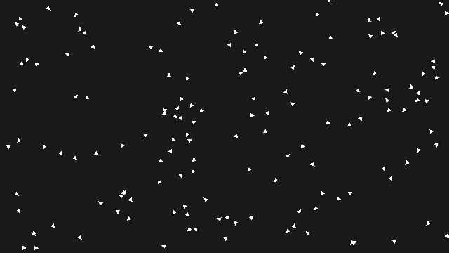
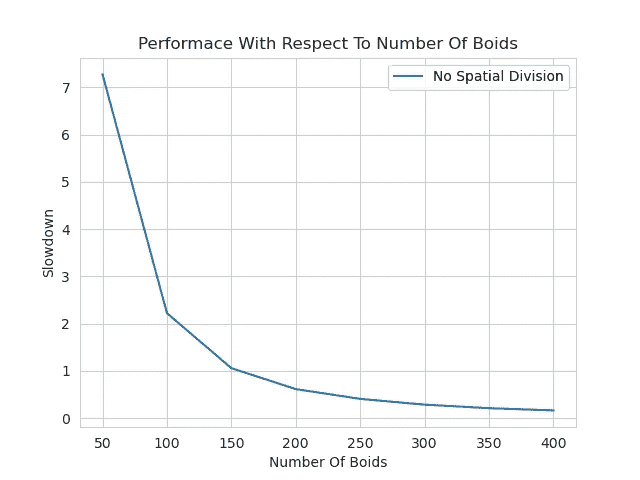
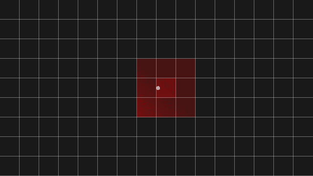
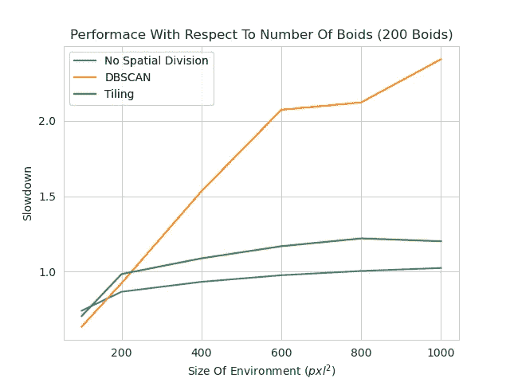
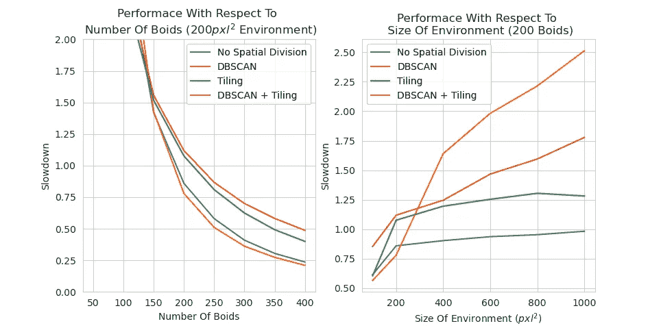

# 利用无监督学习优化 Boids 算法

> 原文：<https://towardsdatascience.com/optimising-boids-algorithm-with-unsupervised-learning-ba464891bdba?source=collection_archive---------37----------------------->

## 利用 DBSCAN 聚类降低算法复杂度。

在群体智能中，许多个体在一个系统中相互作用。这些个体遵循一套简单的规则，通过他们的互动，可以出现更复杂的行为。

> *“整体大于其部分之和”——*[*大概不是亚里士多德*](https://sententiaeantiquae.com/2018/07/06/no-aristotle-didnt-write-a-whole-is-greater-than-the-sum-of-its-parts/)

突现行为的一个著名例子是克雷格·雷诺兹的“Boids”程序。“机器人”最早诞生于 1986 年，模拟了栩栩如生的群体行为:

我实现的 Boids 算法。

整个鸟群的运动看起来很复杂。然而，如果我们考虑个人，我们可以看到复杂的行为来自三个简单的规则:

*   **分离:**机器人移动以避免相互碰撞。
*   **对齐:**机器人转向以匹配其周围机器人的平均方向。
*   **内聚力:**物体向其周围物体的中心移动。

[*趋吉避凶。*](http://www.red3d.com/cwr/boids/)

遵循这些规则的单个 boid 在计算上是廉价的。然而，该算法的基本实现是非常低效的。一个 boid 需要考虑所有其他 boid 来计算其速度更新。因此，在没有额外编程的情况下，boids 算法相对于 boids 的数量具有复杂度 O(n)。随着我们向模拟中添加更多的 boids，我们的工作量会异常增加。

> *快速提示:我们使用名为“减速”的指标来衡量绩效。实质上，减速是创建模拟所需的时间与该模拟的实时持续时间之间的比率。*

*指数级性能下降。*

提高 boids 性能的一种常见方法是使用空间数据结构。在 O(n)算法中，boid 考虑环境中的所有其他 boid。然而，它们的速度更新只受它们靠近的 boids 的影响。空间数据结构根据 boids 的位置来存储它们。这使得只比较存储在一起的 boids，节省了计算。

最著名的空间数据结构之一是切片。平铺通过在环境上放置一组瓷砖来标记 boids 的位置。Boids 只考虑它们的瓷砖和围绕它的瓷砖中的其他 boids。

可视化平铺。

相对于 boids 的数量，平铺可以将 Boids 的效率提高到接近 O(n)。然而，平铺的一个经常被忽视的问题是它在大状态空间中的效率。随着我们所居住的“世界”的大小增加，瓷砖的数量也呈二次方增加。

计算 boid 的速度更新具有复杂度 O(n ),其中 n 是 boid 范围内的 boid 的数量。因此，我们预计在更宽敞(boid 密度更低)的环境中性能会有所提高。不幸的是，因为平铺在状态空间大小上具有指数复杂性，所以它的性能并没有提高多少。

对于这个问题，我提出的解决方案是使用一种相对于环境规模而言复杂度为 O(n)的算法。

[DBSCAN](https://en.wikipedia.org/wiki/DBSCAN) 是一种无监督学习聚类算法，根据点的密度产生聚类。将 DBSCAN 应用于 boids 会创建一组子群，这些子群相距太远，无法相互交互。这些子群中的 boid 和瓷砖中的一样，只需要考虑群中的其他 boid。

*实时 DBSCAN 聚类。*

*相对于环境大小的表现。*

在大的状态空间中，DBSCAN 的性能明显优于平铺。平铺必须在整个环境中放置许多冗余的瓦片，在最极端的情况下会有数千个。DBSCAN 只需要考虑 boids 的位置作为点，这样就可以快速地对它们进行聚类。

DBSCAN 不一定是普遍的改进。在高 boid 密度情况下，DBSCAN Boids 具有与 O(n)实现相当的性能。为了解决这个问题，我将 DBSCAN 与前面讨论的平铺算法结合起来。其结果是，相对于环境的大小而言，这种分块算法的效率要高得多。

红框显示了正在执行切片更新的环境区域。我们可以看到，环境中有一小部分需要在时间步长之间进行更新。这给出了相对于原始平铺方法的近乎普遍的改进，以及在高 boid 密度情况下相对于普通 DBSCAN 的提高的性能。

*boid 划分算法的性能比较。*

尽管我们已经看到了对基本 boids 实现的很好的改进，但我们只处理了改进算法的逻辑。通过优化代码和使用并行编程，可以进一步提高性能。

> 编辑:使用 KD 树的初步结果显示在高 boid 密度环境中比 DBSCAN/Tiling 性能更好。

我为这篇文章编写的代码可以在这里找到。

*最初发布于*[*https://Adam price . io*](https://adamprice.io/blog/boids.html)*。*