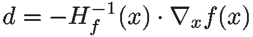

# 优化—下降算法

> 原文：<https://towardsdatascience.com/optimization-descent-algorithms-bf595f069788?source=collection_archive---------6----------------------->

## 在本帖中，我们将看到几种基本的优化算法，您可以在各种数据科学问题中使用它们。


机器学习中使用的许多算法都是基于基本的数学优化方法。由于所有的先决条件，在机器学习的背景下直接发现这些算法可能会令人困惑。因此，我认为，为了更好地理解这些技术，将这些算法脱离任何上下文可能是一个好主意。

# 下降算法

下降算法意味着**最小化**一个给定的函数，就是这样。真的。这些算法不断地进行**迭代**，这意味着它们不断地改进当前的解决方案。你可能会想:

> 如果我想求一个函数的最大值呢？

简单来说，在你的函数前面加一个*减*号，就成了一个“min”问题！

让我们开始吧。这是我们的问题定义:


我们的问题包括寻找一个能使函数 f 最小的向量 x*

你必须知道的一个先决条件是，如果一个点是最小值、最大值或鞍点(意味着两者同时存在)，那么函数的**梯度**在该点为零。


1D 案件

下降算法包括构建一个序列***【x }***，该序列将向***【x *】***(*arg min f(x)*)收敛。该序列按以下方式构建:


为了到达 x*我们试图建立的序列

其中 *k* 为迭代， ***d*** 为向量，大小与 *x* 相同，称为**下降向量**。那么，这就是算法的样子:

```
x = x_init
while ||gradient(f(x))|| > epsilon:
    x = x + d
```

就是这样！我们一直进行更新，直到梯度的范数足够小(因为它应该在某个极值达到零值)。

我们将看到 3 个不同的下降/方向向量:牛顿方向、梯度方向和梯度+最佳步长方向。首先，我们需要定义一个函数，在我们的实验中，我们会尽量使它最小化。

# 罗森布罗克函数

我选择了 Rosenbrock 函数，但你可能会发现许多其他函数，比如这里的。另一个很好的例子是 Himmelblau 函数。


罗森布罗克函数—维基百科


它在 *(x，y)=(a，a )* 处有全局最小值，其中 *f(a，a ) = 0* 。我会用 *a=1，b=100* 这些都是常用值。

我们还需要另外两条信息，函数的[](https://en.wikipedia.org/wiki/Gradient)**，以及 [**黑森**](https://en.wikipedia.org/wiki/Hessian_matrix) 矩阵。**

****

**罗森布罗克函数的梯度**

****

**罗森布罗克函数的海森**

**让我们打开一个文件并启动一个 Python 脚本。我将在 Google Colab 中这样做，本文中使用的所有代码都可以在这里找到:**

**[](https://colab.research.google.com/drive/1jOK_C_pSDV6J98ggV1-uEaWUrPuVm5tu) [## 下降算法

### 奥马尔·阿夫拉克

colab.research.google.com](https://colab.research.google.com/drive/1jOK_C_pSDV6J98ggV1-uEaWUrPuVm5tu) 

这是我们的第一段代码。

从现在开始，我将函数输入向量称为 ***x*** ，类似于前面的问题定义。现在我们准备好了，让我们看看第一个下降向量！

# 牛顿方向

牛顿的方向如下:



牛顿方向

所以更新是:

**

## **快速注释 1**

**你可以通过做*f(****x+d****)*的二阶[泰勒展开](https://en.wikipedia.org/wiki/Taylor_series)找到这个更新的公式，因为我们正在执行的更新是*x _ new =****x+d***。**

****

**我们希望找到 *d* 使得 *f(x + d)* 尽可能低。假设*f″(x)*为正，这个方程是一条有最小值的抛物线。当 *f(x + d)* 的导数为零时，达到该最小值。**

****

**在 n 维中，*f″(x)*成为 hessian 矩阵，*1/f″(x)*表现为 hessian 矩阵的逆。最后， *f'(x)* 将是渐变。**

## **快速注释 n 2**

**我们需要计算海森矩阵的逆矩阵。对于大型矩阵，这是一项计算量非常大的任务。因此，在实践中，我们解决这一点有点不同，但在一个完全等同的方式。**

****

**线性方程**

**代替计算 hessian 矩阵的逆矩阵，我们为 *g* 求解该方程，并使更新规则如下:**

****

**现在让我们编写算法代码:**

**您会注意到与我在开始时介绍的算法有一点不同。我加了一个 *max_iteration* 参数，这样算法不收敛就不会无限期运行。让我们试一试。**

**我们得到这样的结果:**

```
x* = [1\. 1.]
Rosenbrock(x*) = 0.0
Grad Rosenbrock(x*) = [0\. 0.]
Iterations = 2
```

**该算法仅在 **2** 次迭代中收敛！那真的很快。你可能会想:**

> **嘿，初始的 *x* 非常接近目标 *x*，这使得任务很容易！***

**你说得对。尝试使用一些其他值，例如***x _ init =【50，-30】***，算法终止于 **5** 次迭代。**

**这个算法叫做[牛顿法](https://en.wikipedia.org/wiki/Newton%27s_method_in_optimization)所有的下降算法都是这个方法的修改！这是一种母亲配方。它真正快速的原因是它使用了**二阶信息**(黑森矩阵)。**

**使用 hessian 矩阵，即使它是 dope，也是有代价的:效率。计算逆矩阵是一项计算量很大的任务，因此数学家们想出了解决这个问题的方法。主要有:*拟牛顿*方法，和*梯度*方法。拟牛顿法试图用各种技术逼近 hessian 矩阵的逆矩阵，而梯度法只是简单地坚持一阶信息。**

# **渐变的方向**

**如果你做过机器学习，你可能已经看过这个了。渐变方向:**

****

**渐变的方向**

**其中 *α* 称为步长(或以 ML 为单位的学习速率)，是一个在 *[0，1]范围内的实数。***

**如果你一直在做一些机器学习，现在你知道这个公式实际上是一个更大的公式的一部分:牛顿方向，只是我们用一个常数代替了逆 hessian！不管怎样，现在的更新规则是:**

****

**该算法变成:**

**让我们试一试:**

**您可以调整 *alpha* 、 *epsilon* 和 *max_iterations* 的值。为了得到类似牛顿法的结果，我想出了这些方法。这是结果:**

```
x* = [0.99440769 0.98882419]
Rosenbrock(x*) = 3.132439308613923e-05
Grad Rosenbrock(x*) = [-0.00225342 -0.00449072]
Iterations = 5000
```

**哇！梯度下降法需要 5000 次迭代，而牛顿法只需要 2 次！而且算法没有完全达到最小点 *(1，1)* 。**

**与牛顿相比，该算法收敛如此缓慢的主要原因是，我们不仅不再拥有由 *f、*的二阶导数给出的信息，而且我们使用了一个**常数**来代替逆 hessian。**

**想想吧。函数的导数是该函数的变化率。所以黑森给出了梯度变化率的信息。由于寻找最小值必然意味着零梯度，hessian 变得非常有用，因为它告诉你梯度何时上升或下降。**

**ML 中的许多论文只是关于为这个特定的步骤找到一个更好的方法。Momentum、Adagrad 或 Adadelta 就是一些例子。**

# **梯度的方向+最佳步长**

**对经典梯度下降的一个改进是在每次迭代中使用可变步长，而不是常数。这不仅是一个可变的步长，而且也是**可能的最佳步长。****

****

**αk 是迭代 k 时的步长**

**更新是:**

****

**我们如何找到 **α** ？由于我们希望此次更新尽可能高效，即尽可能减少 *f* ，我们正在寻找 **α** ，以便:**

****

**注意，在这一步， ***x*** 和 ***grad(x)*** 是常量。因此，我们可以定义一个新的函数 ***q*** *:***

****

**其中 ***q*** 实际上是一个变量的函数。我们想找到最小化这个函数的 **α** 。嗯……梯度下降？我们可以，但是既然这样，让我们学习一个新方法: [**黄金分割搜索**](https://en.wikipedia.org/wiki/Golden-section_search) 。**

***黄金分割搜索*旨在寻找一个函数在指定区间内的极值(最小值或最大值)。由于我们在[0，1] 范围内使用 **α，这是使用该算法的绝佳机会。****

****

**黄金分割搜索—前 5 次迭代**

**因为这篇文章开始变得很长，所以我不打算深入细节。希望在我花了很长时间制作的精美 GIF 和下面的代码的帮助下，你能够理解这里发生了什么。**

**维基百科实现**

**既然我们能够找到最佳的 **α** ，让我们用最佳步长编码梯度下降！**

**然后，我们可以运行这段代码:**

**我们得到以下结果:**

```
x* = [0.99438271 0.98879563]
Rosenbrock(x*) = 3.155407544747055e-05
Grad Rosenbrock(x*) = [-0.01069628 -0.00027067]
Iterations = 3000
```

**即使在这种情况下，结果没有明显好于纯梯度下降，通常最佳步长执行得更好。例如，我尝试用 Himmelblau 的函数进行同样的比较，最优步长的梯度下降比纯梯度下降快两倍多。**

# **结论**

**本帖到此结束。希望你学到了一些新的东西，触发了你对数学优化的好奇心！还有很多其他有趣的方法。去找他们！不要忘了检查一下 [Google Colab](https://colab.research.google.com/drive/1jOK_C_pSDV6J98ggV1-uEaWUrPuVm5tu) 文件，你会发现所有使用的代码和我们在这里对 Himmelblau 函数做的相同测试。不要犹豫，留下评论，直到下次，和平！:)**