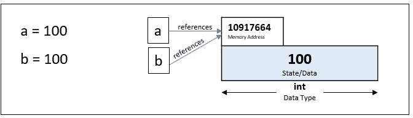
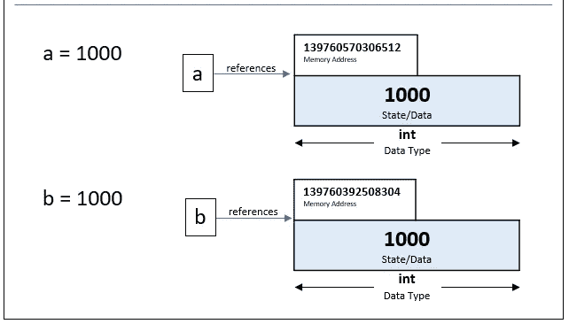
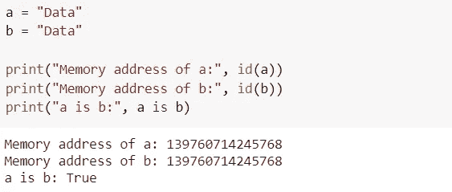
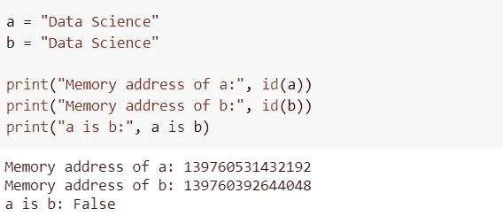

# Python 中的优化—实习

> 原文：<https://towardsdatascience.com/optimization-in-python-interning-805be5e9fd3e?source=collection_archive---------24----------------------->

## 编程，PYTHON

## 了解 Python 的优化技术——实习

乔治·斯图尔特在 [Unsplash](https://unsplash.com/photos/D8gtlT7j1v4) 上拍摄的照片

有不同的 Python 实现，比如 *CPython* 、 *Jython* 、 *IronPython* 等等。本文中我们将要讨论的优化技术与标准 Python 实现 *CPython* 相关。

# 实习生

*实习是按需重用对象*而不是创建新对象。这是什么意思？让我们试着用例子来理解整数和字符串的实习。

> **是** —这个用来比较两个 python 对象的内存位置。
> **id** —返回以 10 为基数的内存位置。

## 整数实习

启动时，Python 将一个整数列表预加载/缓存到内存中。这些都在`-5 to +256`范围内。每当我们试图在这个范围内创建一个整数对象时，Python 会自动引用内存中的这些对象，而不是创建新的整数对象。

这种优化策略背后的原因很简单，即`-5 to 256`中的整数使用频率更高。因此将它们存储在主内存中是有意义的。因此，Python 在启动时将它们预加载到内存中，以便优化速度和内存。

***例 1:***

在这个例子中，`a`和`b`都被赋值为 100。由于在范围`-5 to +256`内，Python 使用了 interning，因此`b`也将引用相同的内存位置，而不是创建另一个值为 100 的整数对象。

作者图片

从下面的代码中我们可以看到，`a`和`b`都引用了内存中的同一个对象。Python 不会创建新的对象，而是引用`a`的内存位置。这都是因为整数实习。

作者图片

***例二:***

在本例中，`a`和`b`都被赋予了值 1000。由于超出了-5 到+256 的范围，Python 将创建两个整数对象。所以 a 和 b 将被存储在内存的不同位置。

作者图片

从下面的代码中我们可以看到，`a`和`b`都存储在内存的不同位置。

作者图片

## 字符串实习

像整数一样，一些字符串也会被保留。通常，任何满足标识符命名约定的字符串都会被保留。有时候会有例外。所以，不要依赖它。

**例 1:**

字符串“Data”是一个有效的标识符，Python 对该字符串进行了整形，因此这两个变量将指向相同的内存位置。

作者图片

***例 2* :**

字符串“数据科学”不是有效的标识符。因此，这里没有应用字符串滞留，所以 a 和 b 都指向两个不同的内存位置。

作者图片

> 上面所有的例子都来自 Google Colab，它有 Python 3 . 6 . 9 版本
> 
> 在 Python 3.6 中，任何长度≤ 20 的有效字符串都将被保留。但是在 Python 3.7 中，这个已经改成了 4096。正如我之前提到的，这些东西会随着不同的 Python 版本而不断变化。

由于不是所有的字符串都被保留，Python 提供了使用`sys.intern()`强制保留字符串的选项。除非有必要，否则不应该使用这种方法。请参考下面的示例代码。

作者图片

# 为什么字符串实习很重要？

让我们假设您有一个应用程序，其中有许多字符串操作正在发生。如果我们使用`equality operator ==`来比较长的字符串，Python 会尝试一个字符一个字符地比较，显然这需要一些时间。但是如果这些长字符串可以被保留，那么我们知道它们指向同一个内存位置。在这种情况下，我们可以使用`is`关键字来比较内存位置，因为这样会快得多。

# 结论

希望你已经理解了 Python 中优化的 *interning* 的概念。

如果你有兴趣学习更多关于优化的知识，请浏览 [**窥视孔优化**](/optimization-in-python-peephole-e9dc84cc184d) 。

 [## Python 中的优化—窥视孔

### Python 的窥视孔优化技术简介

towardsdatascience.com](/optimization-in-python-peephole-e9dc84cc184d) 

要了解 M *的不变性和 Python* 的不变性，请 [**点击这里**](/mutability-immutability-in-python-b698bc592cbc) 阅读文章。

*阅读更多关于 Python 和数据科学的此类有趣文章，* [***订阅***](https://pythonsimplified.com/home/) *到我的博客*[***【www.pythonsimplified.com】***](http://www.pythonsimplified.com/)***。*** 你也可以通过[**LinkedIn**](https://www.linkedin.com/in/chetanambi/)**联系我。**