# 运输问题中的最优化

> 原文：<https://towardsdatascience.com/optimization-in-transportation-problem-f8137044b371?source=collection_archive---------0----------------------->

## 运输问题(TP)及示例(西北角规则、最小费用法、VAM、平衡 TP、非平衡 TP)

照片由[赞·李](https://unsplash.com/@zane4004?utm_source=medium&utm_medium=referral)在 [Unsplash](https://unsplash.com?utm_source=medium&utm_medium=referral) 拍摄

在这个快速发展的世界里，对商品的需求与日俱增。因此，交通的重要性在社会中扮演着重要的角色。将商品从这个国家的一个角落运到另一个角落的公司的利润和财富是由运输决定的。当运输成本和运输时间压倒生产成本和生产时间时，更是如此。如果所有领域的运输都得到专业的处理，如果所涉及的成本都达到最优，那么即使其他因素不变，这个国家的生产率也会提高。

最优[运输](https://en.wikipedia.org/wiki/Transport)和[资源](https://en.wikipedia.org/wiki/Allocation_of_resources)分配的研究是；运输理论或运输理论。法国数学家加斯帕尔·蒙日在 1781 年正式提出了这个问题。第二次世界大战期间，苏联数学家和经济学家 Leonid Kantorovich 在该领域取得了重大进展，因此被称为 Monge-Kantorovich 运输问题。

由[线性规划(LP)](https://en.wikipedia.org/wiki/Linear_programming) 解决的运输问题的一个重要类型是从几个供应中心到需求中心的货物和服务的物理分配领域。换句话说，运输问题处理的是商品从不同的来源到不同的目的地的移动，总的目标是最小化运输成本。运输问题的这种线性规划公式也被称为[希区柯克](https://en.wikipedia.org/wiki/Frank_Lauren_Hitchcock)–[库普曼](https://en.wikipedia.org/wiki/Tjalling_Koopmans)运输问题。

运输模型应用于航空业、研发、旅行推销员、转运等。

**先决条件**

要解决运输问题，必须给出以下信息:

*   m=源的数量。
*   n=目的地的数量。
*   每个来源的可用总量。
*   每个目的地的总需求量。
*   将一件商品从一个来源运输到另一个目的地的成本。

**假设**

在使用任何运输技术之前，做出以下基本假设:

*   所有来源的可用总量等于目的地的需求总量。如果它们彼此不匹配，则添加伪源或伪目的地。
*   从一个起点到一个目的地的单位运输成本是已知和确定的。
*   单位成本与运输的货物数量无关。
*   目标是最小化总运输成本。
*   虽然运输问题可以公式化为一个 LPP，其他更简单的算法被开发出来解决它们。

# 解决运输问题

基本上有 3 个主要步骤

1.LPP 交通模型的建立

2.找到一个基本可行的解决方案(BFS)

3.最优性测试

我们来详细说说

## **1。LPP 交通模式的制定**

在解决一个运筹学问题时，关键在于通过解码问题来建立模型。对于运输问题，通常会以表格形式或矩阵形式给出问题，称为运输表或费用-效益矩阵。

下面我们来看一个例子。

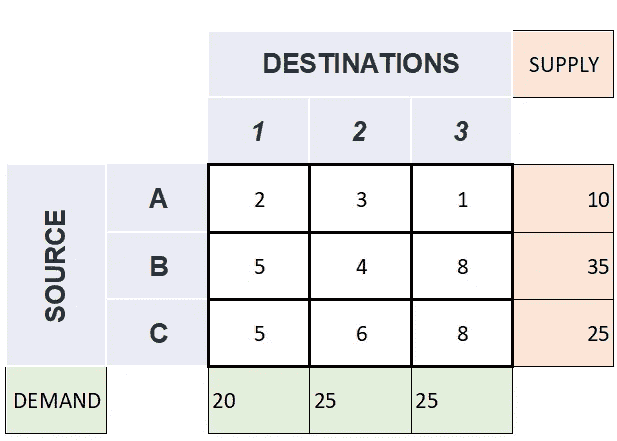

一个运输问题的例子，来源={A，B，C}，总供应量=70，目的地={1，2，3}，总需求= 70*[图片作者提供]*

这里，

Source = {A，B，C}

它们分别代表供应能力为 10、35、25 单位商品的来源(以橙色给出)

因此，总供应量=10+35+25=70

目的地= {1，2，3}

它们分别代表需要 20、25、25 单位商品的目的地(以绿色给出)。

因此，总需求=20+25+25=70

矩阵中表示的元素(白色部分)称为成本。即把单位商品从一个产地运到另一个目的地所涉及的单位成本。

举个例子，

将 1 单位商品从产地 a 运到目的地 1 所产生的成本= ₹2/-

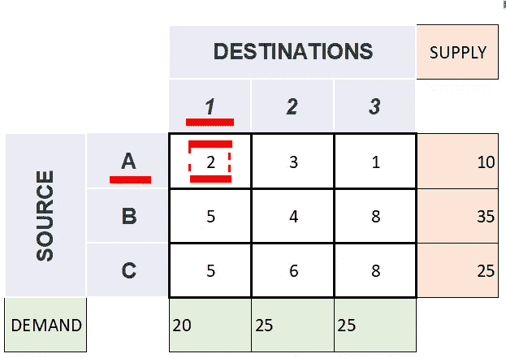

将 1 单位商品从来源 a 移动到目的地 1 所产生的成本= ₹2/-(这里，我们正在查看来源 a 和目的地的横截面 *1* ) *【作者图片】*

同样的，

将一个单位的商品从产地 b 运到目的地 2 所产生的成本= ₹4/-

诸如此类。[这里，我们正在查看来源和目的地的横截面]

**运输问题的类型**

在继续之前，让我们检查不同类型的运输问题。

运输问题基本上有两种类型:

1.平衡运输问题

2.不平衡运输问题

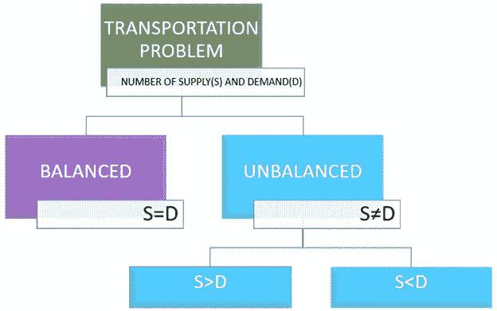

根据可获得的供给和需求，将运输问题分为平衡运输和不平衡运输。*【作者图片】*

让我们窥探一下。

**1。平衡运输问题**

可用总量=需求总量

即总供给=总需求

让我们看看下面的例子。

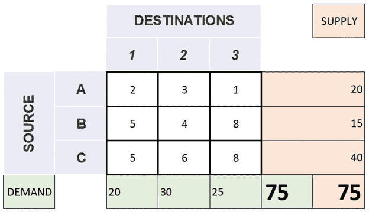

来源={A，B，C}总供应量=75，目的地={1，2，3}总需求=75 的平衡运输问题示例*【作者图片】*

这里，

总供应量=75

总需求=75

因此，总供给=总需求

**2。不平衡运输问题**

可用总量≠需求总量

即总供给≠总需求

> 所有来源的可用总量等于目的地的需求总量。如果它们彼此不匹配，则添加虚拟源或虚拟目的地，使其成为标准运输问题。

有两种情况会导致这种不平衡状态

*(我)。总供给>总需求*

*(二)。总供给<总需求*

***(我)。*** ***总供给>总需求***

即可用总量>需求总量

让我们看看下面的例子。

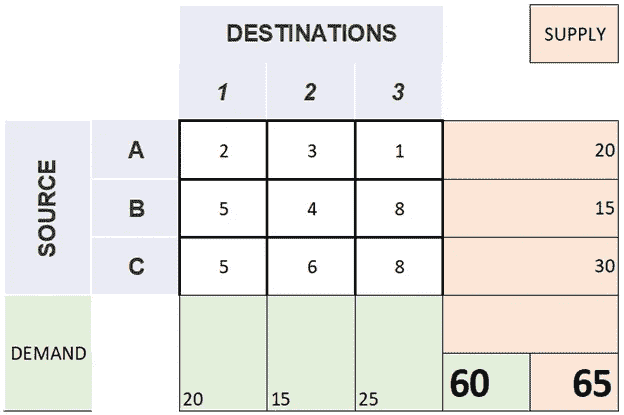

来源={A，B，C}总供给=65，目的地={1，2，3}总需求=60 的不平衡运输问题示例*【作者图片】*

这里，

总供应量=65

总需求=60

因此，总供给大于总需求

在这种情况下，我们添加一个虚拟目的地，给出虚拟需求，每个成本为零(0)，但虚拟目的地的虚拟需求为总供应-总需求。

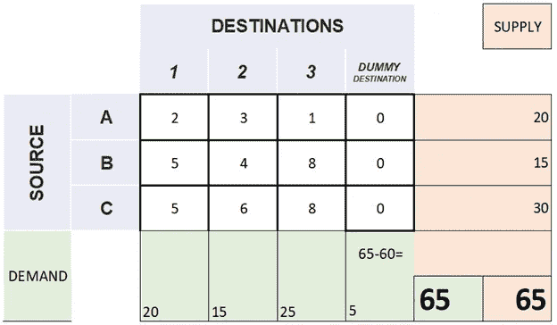

一个不平衡运输问题的例子，来源={A，B，C}，总供给=65，目的地={1，2，3}，虚拟需求=5，总需求= 65*[作者图片]*

在本例中，虚拟需求= 65–60 = 5

因此，总供给=总需求

***(二)。总供给<总需求*总需求**

即可用总量<total quantity="" required=""></total>

Let’s check the example below.

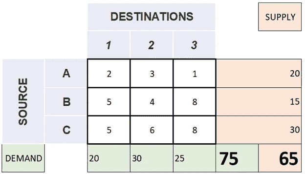

An example unbalanced transportation problem with Source ={A,B,C} with total supply=65 and Destinations={1,2,3} with total demand=75 *【作者图片】*

这里，

总供应量=65

总需求=75

因此，总供应量<total demand=""></total>

In such cases, we add a dummy source giving dummy supply with each cost as zero (0) but dummy supply for the dummy destination as total demand-total supply.

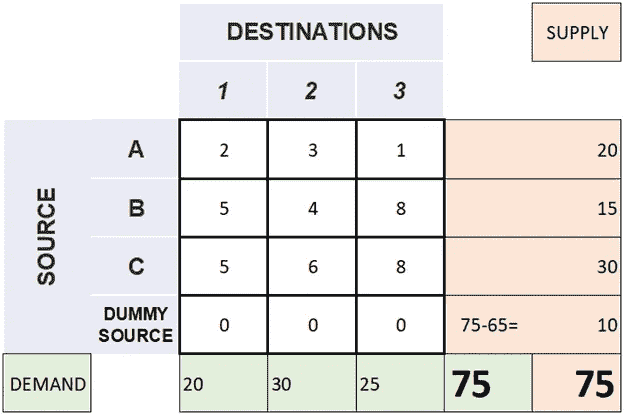

An example unbalanced transportation problem with Source ={A,B,C} with total supply=65 and Destinations={1,2,3} with dummy supply=10 making total supply=75 *【作者图片】*

在本例中，伪电源= 75–65 = 10。

因此，总供给=总需求

> 运输中的每一个问题所寻求的解决方案都是从每一个源头到哪一个目的地的数量，使得所有的需求同时成本保持最小。

为此，我们必须将每个问题转换为标准问题才能走得更远。

## **2。** **基本可行方案(BFS)**

有不同的方法可以获得初始的基本可行解。它们是:

(1).西北角规则

(2).最小费用法(或矩阵最小法)

(3).沃格尔近似法[VAM](或称罚函数法)

让我们深入研究每种方法。

为了更好地理解，让我们考虑一个示例问题。

下面给出问题。

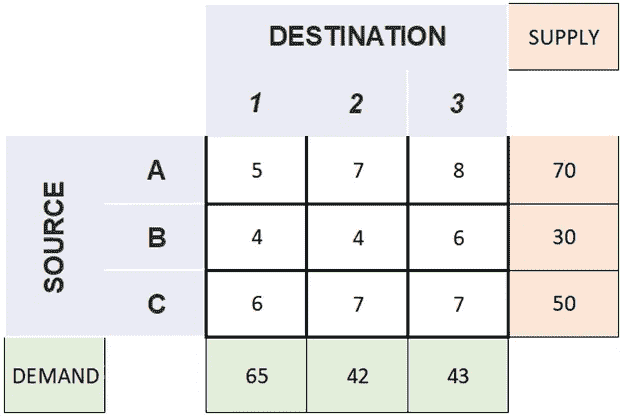

*【作者图片】*

第一步是使它成为一个标准的运输问题。

为此，检查它是平衡运输问题还是不平衡运输问题。

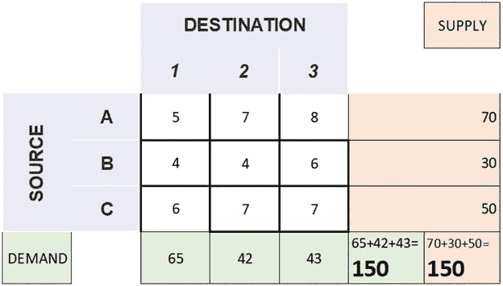

*【作者图片】*

给定的问题是一个平衡运输问题。那么，我们继续吧。

现在，我们必须找到一个基本可行的解决方案。同样，我们有 3 种不同的方法。我们借助这个问题，一个一个来查。

**①。西北角规则**

西北方向*【图片由作者提供】*

选择西北角单元。即第一行和第一列的交点的成本。[此处，5(以蓝色给出)]

比较该细胞的需求和供给。[此处，65 和 70(以红色给出)]

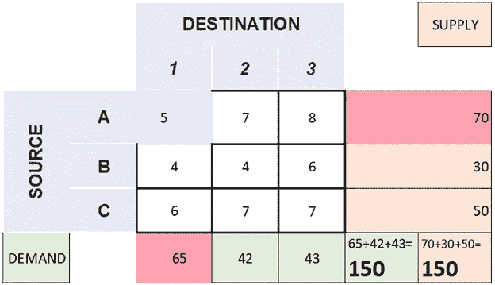

*【作者图片】*

分配具有最小值的单元格[这里是 65(以黄色给出)]

减去具有最小值的排除像元。即分配的小区值。[在这里，70–65 = 5]

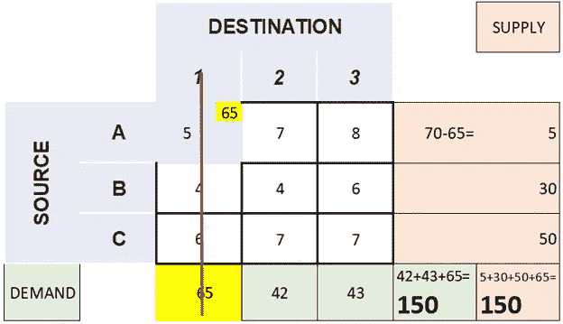

*【作者图片】*

通过划掉相应的列或行来删除它。[此处，目的地为 1 的列(用红线标记)]

> 总需求和总供给总是保持不变。(可以考虑这个方法来验证自己走的路是否正确。)因为我们以总需求和总供给保持不变的方式给单元分配新值。

[即，在这里，42+43+65=150(总需求)和 5+30+50+65=150(总供给)]

现在用剩余的细胞继续这个过程。

再次找到西北(N-W)单元，并执行与上面给出的步骤相同的步骤。

让我们在这个例子中看到同样的情况。

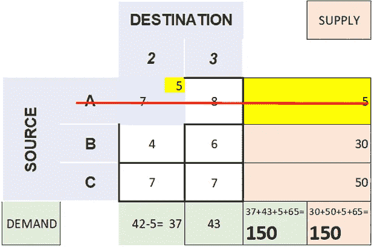

*【作者图片】*

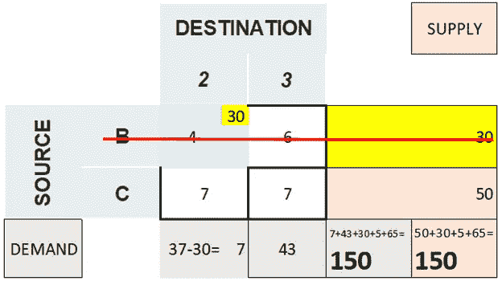

*【作者图片】*

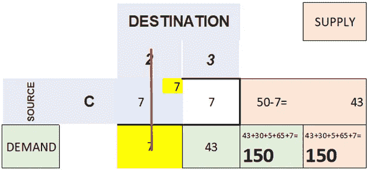

*【作者图片】*

*【作者图片】*

这里，需求和供给将是相同的，这将在剩余的单个单元中进一步分配。【这里，43】(这是验证以上所有步骤是否正确的另一种方法。)

> **验证流程正确性的方法:**
> 
> 总需求和总供给在所有步骤中保持不变。
> 
> 在最后一步中，将为单个单元分配需求或供应中的值，因为两者具有相同的值。
> 
> 如果需求和供给具有相同的值；平局，你可以选择其中任何一个来分配单元格使其他值为零。(决定选哪个，纯属用户选择。👍)

包含所有已分配单元格的最终表格如下所示。

这通过 N-W 拐角方法给出了初始可行解。

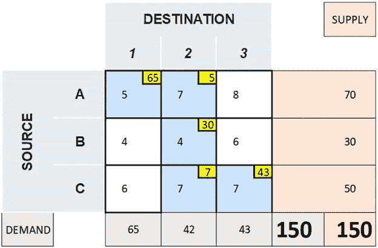

*【作者图片】*

现在让我们来计算与这些分配相关的成本。

要找到相同的结果，请将所有分配的像元值(以黄色给出)和相应像元的成本(以蓝色给出)的所有乘积相加。

即总成本=(65x 5)+(5x 7)+(30x 4)+(7x 7)+(43x 7)

=325+35+120+49+301

=830

现在，让我们了解一下我们发现了什么

₹830-represents 商品运输的总成本。

我们用西北角方法找到的路径用红色箭头表示。

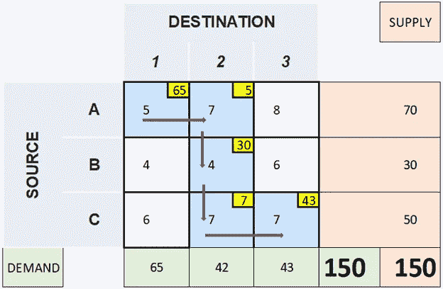

*【作者图片】*

让我们用表格来表示同样的情况

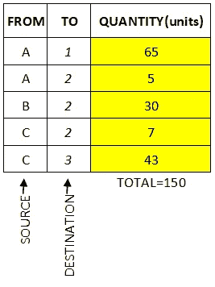

最终方案表*【图片由作者提供】*

> 这可能代表也可能不代表该问题的最佳解决方案，即，可能存在其他分配方式，这些方式可能以较低的总成本给出更好的解决方案。
> 必须进行最优性测试，以测试所获得的答案是否是最优的。如果没有，最优性测试将我们引向一个可能的改进。

**②。最小费用法(或矩阵最小法)**

我们用同一个例子来讨论。

*【作者图片】*

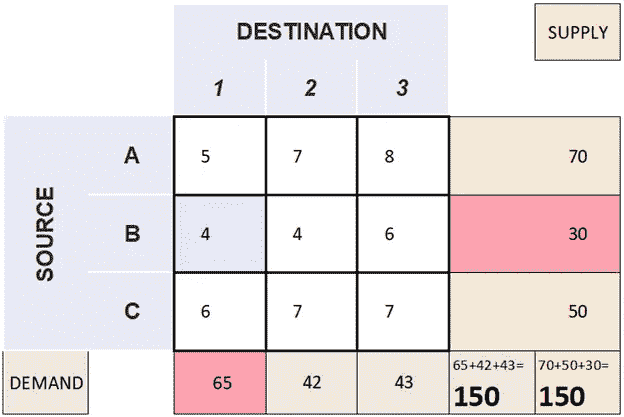

*【作者图片】*

选择所有成本中的最小值(以白色给出)。即最低成本。[此处，4(以蓝色给出)]

这里有两个成本最低的单元。决定选哪个纯粹是用户的选择。

> 如果有 1 个以上的单元具有相同的最小成本；一条领带，你可以选择其中任何一条。(决定选哪个，纯属用户选择。👍)

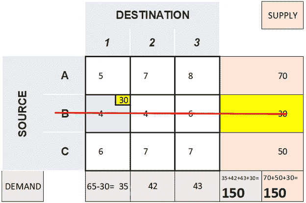

*【作者图片】*

比较该细胞的需求和供给。[这里，30 和 65(以红色给出)]分配具有最小值的单元格[这里，30(以黄色给出)]

减去具有最小值的排除像元。即分配的小区值。[在这里，65–30 = 35]

通过划掉相应的列或行来删除它。[此处，带有源 B 的行(用红线标记)]

> 总需求和总供给总是保持不变。(可以考虑这个方法来验证自己走的路是否正确。)因为我们以总需求和总供给保持不变的方式给单元分配新值。

[即，在这里，35+42+43+30=150(总需求)和 70+50+30=150(总供给)]

现在用剩余的细胞继续这个过程。

同样，找到最小成本的像元，并执行与上述步骤相同的步骤。

让我们在这个例子中看到同样的情况。

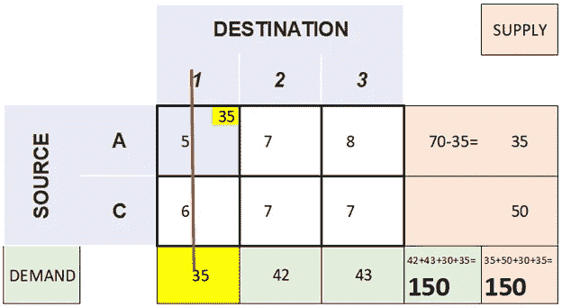

*【作者图片】*

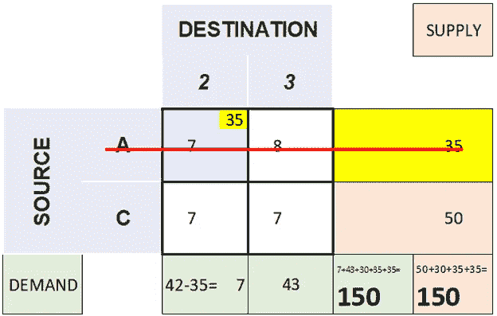

*【作者图片】*

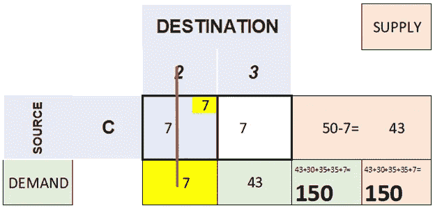

*【作者图片】*

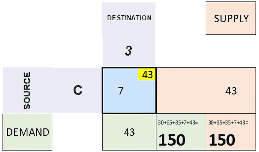

*【作者图片】*

这里，需求和供给将是相同的，这将在剩余的单个单元中进一步分配。【这里，43】(这是验证以上所有步骤是否正确的另一种方法。)

> **验证流程正确性的方法:**
> 
> 通过这些步骤，总需求和总供给将保持不变。
> 
> 在最后一步中，将为单个单元分配需求或供应中的值，因为两者具有相同的值。
> 
> 如果需求和供给具有相同的值；平局，你可以选择其中任何一个来分配单元格使其他值为零。(决定选哪个，纯属用户选择。👍)

包含所有已分配单元格的最终表格如下所示。

这通过最小成本方法给出了最初可行的解决方案。

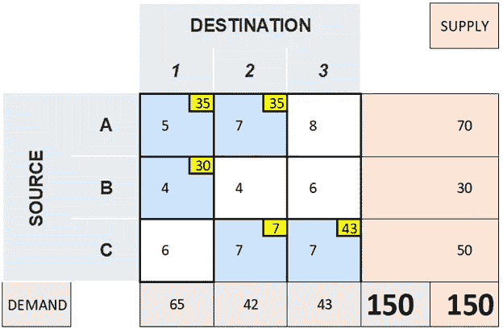

*【作者图片】*

现在让我们来计算与这些分配相关的成本。

要找到相同的结果，请将所有分配的像元值(以黄色给出)和相应像元的成本(以蓝色给出)的所有乘积相加。

即总成本=(35×5)+(30×4)+(35×7)+(7×7)+(43×7)

=175+120+245+49+301

=890

现在，让我们了解一下我们发现了什么

₹890-represents 商品运输的总成本。

我们用最小成本方法找到的路径被红色的箭头标出。

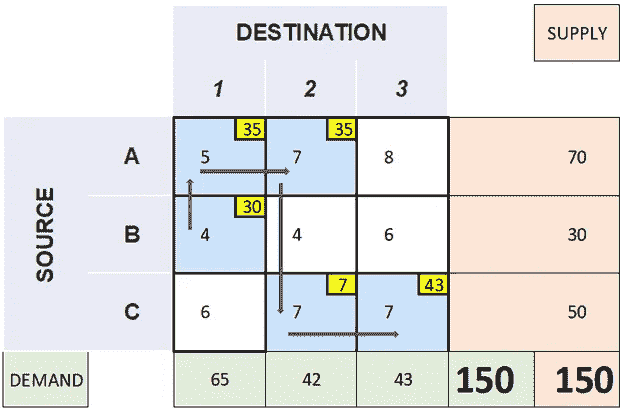

*【作者图片】*

让我们用一个表格来表示。

最终方案表*【图片作者】*

> 这可能代表也可能不代表该问题的最佳解决方案，即可能存在其他分配方式，这些方式可能以较低的总成本给出更好的解决方案
> ，必须执行最优性测试，以测试所获得的答案是否是最佳的。如果没有，最优性测试将我们引向一个可能的改进。

( **3)。沃格尔近似法【VAM】(或称罚函数法)**

我们用同一个例子来讨论。

*【作者图片】*

在 VAM，选择要分配的成本单元并不像我们在西北角方法和最小成本单元方法中讨论的那样容易。(冷静伙计，😎不过，这并没有那么难。😇但是这个过程比以前长了一点。😅)

在 VAM 中，我们首先要在每行和每列中找出两个最低成本之间的差异。这些被称为*罚金/额外成本。*

> 考虑两个最小值之间的差异。

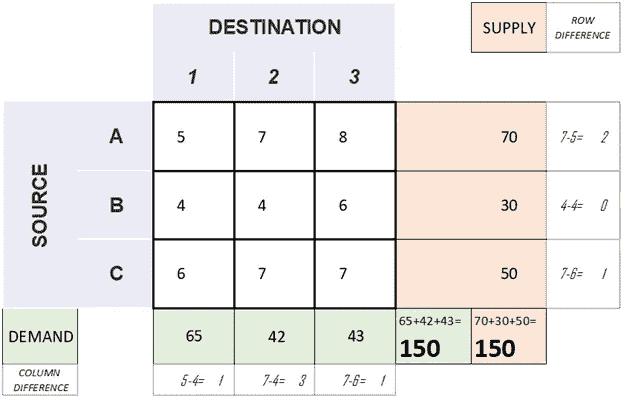

*【作者图片】*

[这里，惩罚= {2，0，1，1，3，1}]

现在，在不考虑行或列的情况下，找出惩罚中的最大值。

[此处，最大(惩罚)=3(以粉红色给出)]

> 如果有平局，选择任何人。(决定选哪个，纯属用户选择。👍)

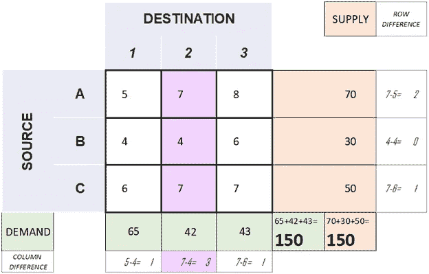

*【作者图片】*

现在，相应地查看相应的行或列。

[此处，该列(以粉红色给出)]

选择所有成本中的最小值(以粉红色给出)。即最低成本。[此处为 4(在下图中以蓝色给出)]

> 如果有 1 个以上的单元具有相同的最小成本；一条领带，你可以选择其中任何一条。(决定选哪个，纯属用户选择。👍)

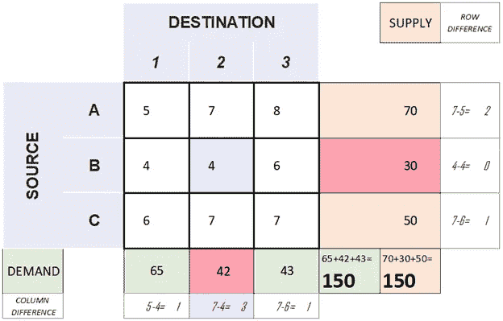

*【作者图片】*

比较该单元格的需求和供应[这里是 30 和 42(用红色表示)]

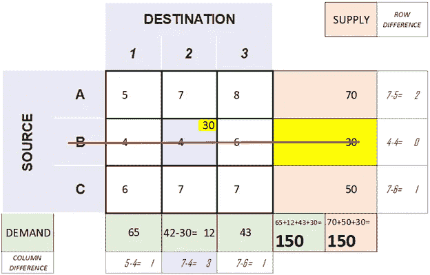

*【作者图片】*

分配具有最小值的单元格[这里，30(以黄色给出)]

减去具有最小值的排除像元。即分配的小区值。[在这里，42–30 = 12]

通过划掉相应的列或行来删除它。[此处，带有源 B 的列(用红线标记)]

> 总需求和总供给总是保持不变。(可以考虑这个方法来验证自己走的路是否正确。)因为我们以总需求和总供给保持不变的方式给单元分配新值。

[即，在这里，65+12+43+30=150(总需求)和 70+50+30=150(总供给)]

现在用剩余的细胞继续这个过程。

再一次，找到罚分，按照上面给出的步骤做同样的事情。

让我们在这个例子中看到同样的情况。

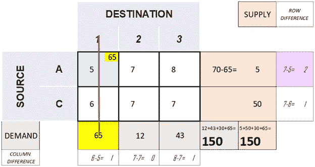

*【作者图片】*

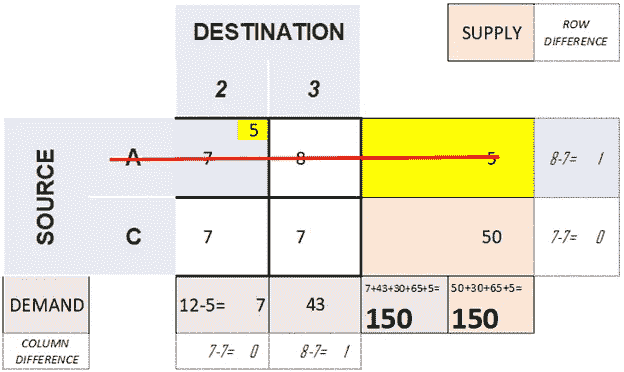

*【作者图片】*

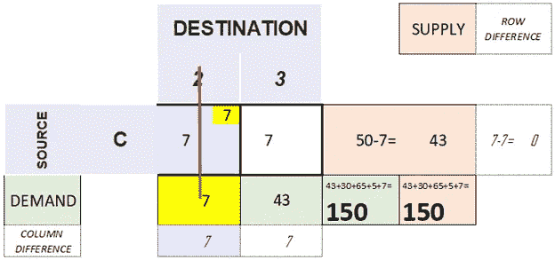

*【作者图片】*

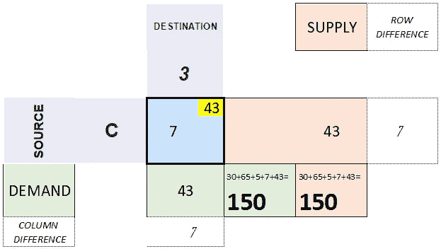

*【作者图片】*

这里，需求和供给将是相同的，这将在剩余的单个单元中进一步分配。【这里，43】(这是验证以上所有步骤是否正确的另一种方法。)

> **验证流程正确性的方法:**
> 
> 通过这些步骤，总需求和总供给将保持不变。
> 
> 在最后一步中，将为单个单元分配需求或供应中的值，因为两者具有相同的值。
> 
> 如果需求和供给具有相同的值；平局，你可以选择其中任何一个来分配单元格使其他值为零。(决定选哪个，纯属用户选择。👍)

包含所有已分配单元格的最终表格如下所示。

这给了 VAM 一个初步可行的解决方案。

*【作者图片】*

现在让我们来计算与这些分配相关的成本。

要找到相同的结果，请将所有分配的像元值(以黄色给出)和相应像元的成本(以蓝色给出)的所有乘积相加。

即总成本=(65x 5)+(5x 7)+(30x 4)+(7x 7)+(43x 7)

=325+35+120+49+301

=830

现在，让我们了解一下我们发现了什么

₹830-represents 商品运输的总成本。

VAM 发现的红色箭头代表了他所走的道路。

*【作者图片】*

让我们用一个表格来表示。

最终方案表*【图片由作者提供】*

> 这可能代表也可能不代表该问题的最佳解决方案，即可能存在其他分配方式，这些方式可能以较低的总成本给出更好的解决方案。
> 必须执行最优性测试，以测试所获得的答案是否是最优的。如果没有，最优性测试将我们引向一个可能的改进。

## 3.最优性测试

虽然基本可行的解决方案可能会考虑到所有的源和位置限制，但它不需要给出成本最低的解决方案。可能有几个基本可行的解决方案，但是最小化总运输成本的方案被认为是最佳方案。在通过上面列出的任何一种方法确定了一个基本可行的解决方案之后，该解决方案将被进一步测试，因为优化测试将验证给定的解决方案是否是最好的，如果不是，它将引导我们找到更好的或最优的解决方案(我会选择一个坏的方案而不是最坏的方案)。😉(我们将在另一篇文章中详细讨论它，因为对我来说这本身似乎太长了。😂)

# **参考**

K. P. Phaneesh 博士，运筹学(2009 年)，Sudha 出版物

# **End-Note**

到目前为止，我们已经讨论了找到一个基本可行的解决方案。我们只能在最优性测试后做出选择正确路径的决定，这将在另一篇文章中讨论。😊

请随意分享你的宝贵想法💭，想法💡甚至怀疑😕😵。