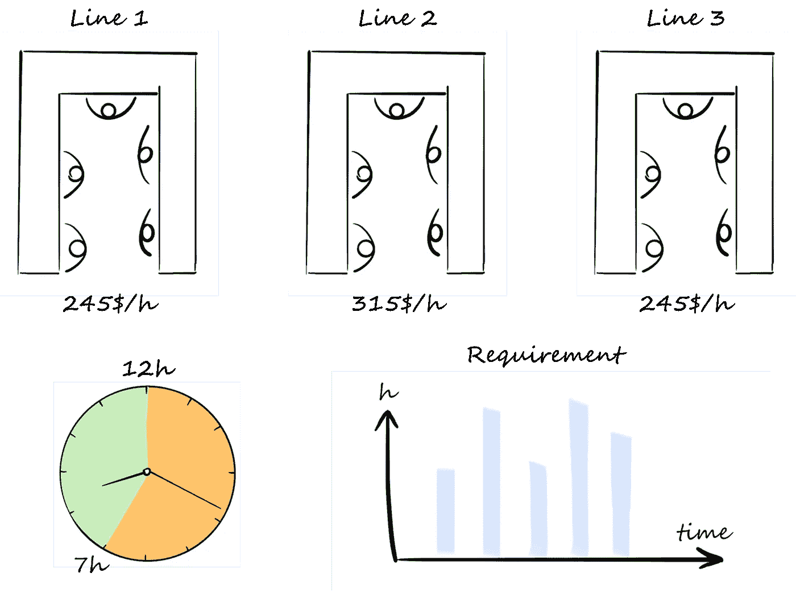
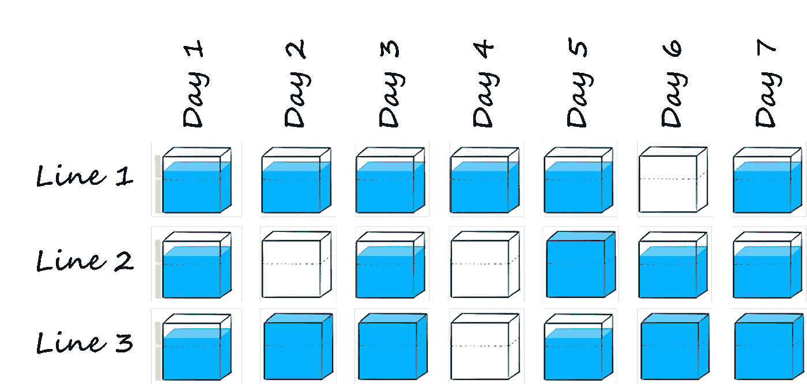
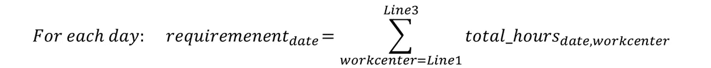
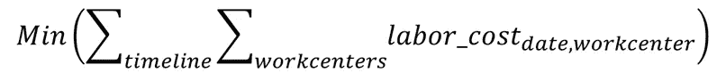

# 用 Python 和 Gurobi 优化周生产计划—第 1 部分

> 原文：<https://towardsdatascience.com/optimization-of-a-weekly-production-plan-with-python-and-gurobi-part-1-d1257ad29a9?source=collection_archive---------12----------------------->

## [实践教程](https://towardsdatascience.com/tagged/hands-on-tutorials)

## 了解如何使用 Python 和数学求解器 Gurobi 解决优化问题

即使在 2020 年，许多制造企业仍在手工进行生产规划，导致不必要的直接成本增加。让我们一起来看看如何使用 Python 和 Gurobi 优化求解器来降低这些成本。

由[莱尼·屈尼](https://unsplash.com/@lennykuhne)在 [Unsplash](https://images.unsplash.com/photo-1567789884554-0b844b597180?) 上拍摄的照片

# 语境

你自豪地拥有一家制造公司，拥有三条生产线。在每一条生产线上，你都可以生产同样的产品，但不幸的是，每条生产线的设计都不一样，每条生产线的小时人工成本也不一样。您希望能够充分利用您的设备，以获得最大的成本效益。

在本文中，我们将了解如何使用 Python 和 Gurobi solver 通过一个简单的模型来优化工作时间，以便熟悉这些工具。在第二部分中，我们将更深入地优化，添加更多的约束并比较结果。

# 问题陈述

如上所述，贵厂拥有三条生产线。1 号线和 3 号线的小时人工成本为 245 美元/小时，2 号线为 315 美元/小时。由于目前的规章制度，你对每天的工作时间有一些限制:一条线每天不能运行少于 7 小时或超过 12 小时。

客户的要求是一周中每天的生产小时数，您希望在需要的那一天安排这些小时，这意味着没有提前或延迟计划。

让我们深入研究一下，看看如何使用 Gurobi solver 来回答这个问题。

问题图解|作者图片

# 一个简单的计划优化模型

## 输入的创建

第一步是定义将用于我们的问题的数据，在问题陈述中描述。我们将创建一些字典和 pandas 数据框，如下所示，其中包含与本周客户需求相关的信息、我们优化计划的时间表、可用生产线列表以及相关的小时成本。

## 启动模型并创建变量

我们现在已经定义了所有的输入；让我们建立我们的模型。我们需要初始化它，并创建将在我们的函数中使用的所有变量。

我们将使用类型提示来获得更干净的代码，并确保变量的类型是正确的。我们函数的输入是我们希望实现计划的时间表、可用工作中心的列表、每天的需求以及每个工作中心的每小时成本。

让我们启动我们的模型并创建决策变量。我们用 *addVars()* 添加变量，并在属性中为每个变量设置大小、边界和类型。

*   ***working_hours*** :我们范围内每天由工作中心索引的整数变量。为了尊重您公司的规章制度，边界下限设置为 7，上限设置为 12。
*   ***line_opening*** :表示每条生产线每天的状态的二进制变量，如果生产线关闭，取值 0；如果生产线正在运行，取值 1。
*   ***total_hours*** :以天数和工作中心为索引的整数变量；它是每条线路的实际营业时间。
*   ***labor_cost*** :一个整数值，衡量每行的每日人工成本。

作者对 total_hours 变量的图解|图片

现在，我们刚刚创建了每个变量，没有指定任何关系。一些变量相互关联，我们现在必须创建一些约束来设置它们的值。

## 设置约束

类似地，让我们用*add consts()*创建约束。如果您只想创建一个约束，您应该使用不带“s”的*add const()*，但是在本例中，我们为每天和每条生产线创建多个约束。

首先，我们需要链接之前创建的变量。总时数的价值是工时和线路开通的乘积，人工成本的价值是总时数和 *wc_reg_cost* 中包含的每个工作中心的小时成本的乘积。

现在，运行我们的模型的一切都准备好了。在解决它之前，我们需要创建最后一个来自我们与客户的协议的约束。事实上，如前所述，每天的需求必须在同一天得到满足。可以翻译如下:

模型完全建立后，我们现在可以定义我们的目标函数并求解它。

## 创建目标函数和解决方案

尽管所有这些都很有趣，但我们不要忘记我们的目标:我们希望通过更好地平衡 3 条生产线上的工作量来最大限度地降低劳动力成本。这是我们的目标函数！

现在，我们刚刚完成的模型可以求解，并将为我们提供最具成本效益的规划。

您可以使用以下代码来可视化您的模型，查看您的所有变量、约束和目标函数，这有助于纠正错误并检查模型是否是您想要的。

当然，在这里，我们的模型是正确的，可以直接运行。我们可以提取溶液，并根据需要将其成型。

## 可视化解决方案

我们现在拿出了最好的生产计划来满足客户的要求；我们需要提取并使其更加可视化。为此，我们将使用 Altair 库的直观界面和我们可以轻松创建的图形设计。由于这不是本文的目的，我不会详细说明我是如何做到这一步的，但您可以在我的 [GitHub](https://github.com/baptistesoulard/Production-plan-optimization/tree/master/Planning_optimization_part1) (Model1.py)上找到它，如果您需要任何解释，请联系我。

我们的优化算法的结果用 Altair 库绘制

正如预期的那样，当 1 号线和 3 号线在开通 2 号线之前达到最大负荷时，我们的生产计划得到优化，因为这条线上的每小时成本更高。我们可以看到，界限是受到尊重的，我们每天不开通少于 7 小时或超过 12 小时的线路。更重要的是，尊重客户的要求，当天满足每天的要求，不提前也不迟到。

# 限制和后续步骤

第一个模型是使用 Gurobi 求解器进行生产计划优化的第一种方法，但存在许多局限性。事实上，我们没有考虑因加班或周末工作而产生的额外成本。此外，需求可能不允许我们在同一天生产它；比如不到 7 个小时，我们就不能开通线路。这就是为什么我们将在第二部分添加更多的约束来考虑这个问题，并且我们将比较结果。

**如果你需要进一步的信息或者想就这个话题交换意见，请随时联系我**。你可以在 [LinkedIn](https://www.linkedin.com/in/baptistesoulard1994/) 上找到我。

# 资源

这个项目在我的 GitHub 上的资源库:[https://GitHub . com/baptistesoulard/Production-plan-optimization/tree/master/Planning _ optimization _ part 1](https://github.com/soulabat/Production-plan-optimization/tree/master/Planning_optimization_part1)

解释 SAP 如何在其计划优化模块中使用线性优化:[http://www . guro bi . com/pdf/user-events/2017-Frankfurt/SAP . pdf](https://www.gurobi.com/pdfs/user-events/2017-frankfurt/SAP.pdf)

Gurobi 文档:[https://www . guro bi . com/documentation/8.0/examples/work force 5 _ py . html](https://www.gurobi.com/documentation/8.0/examples/workforce5_py.html)