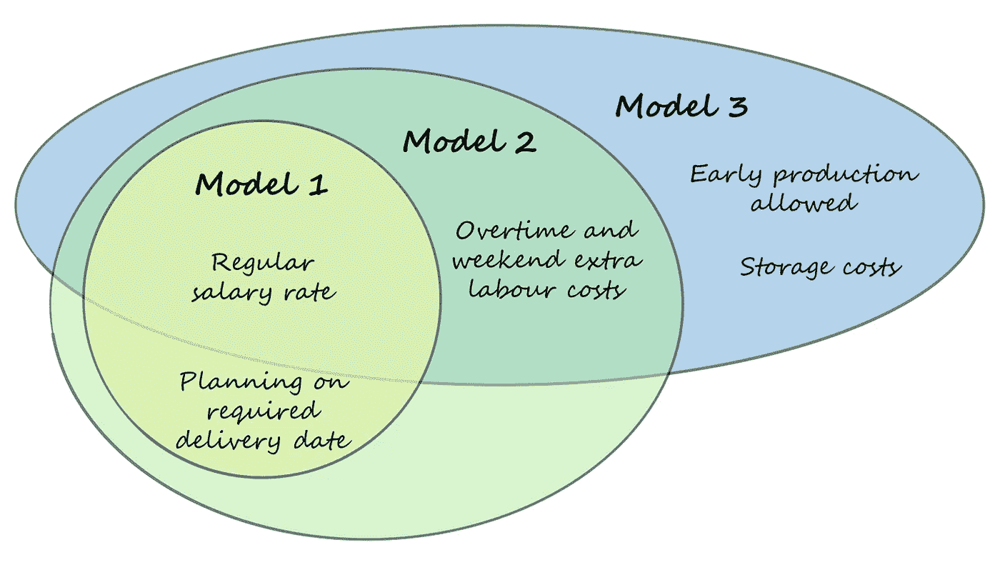
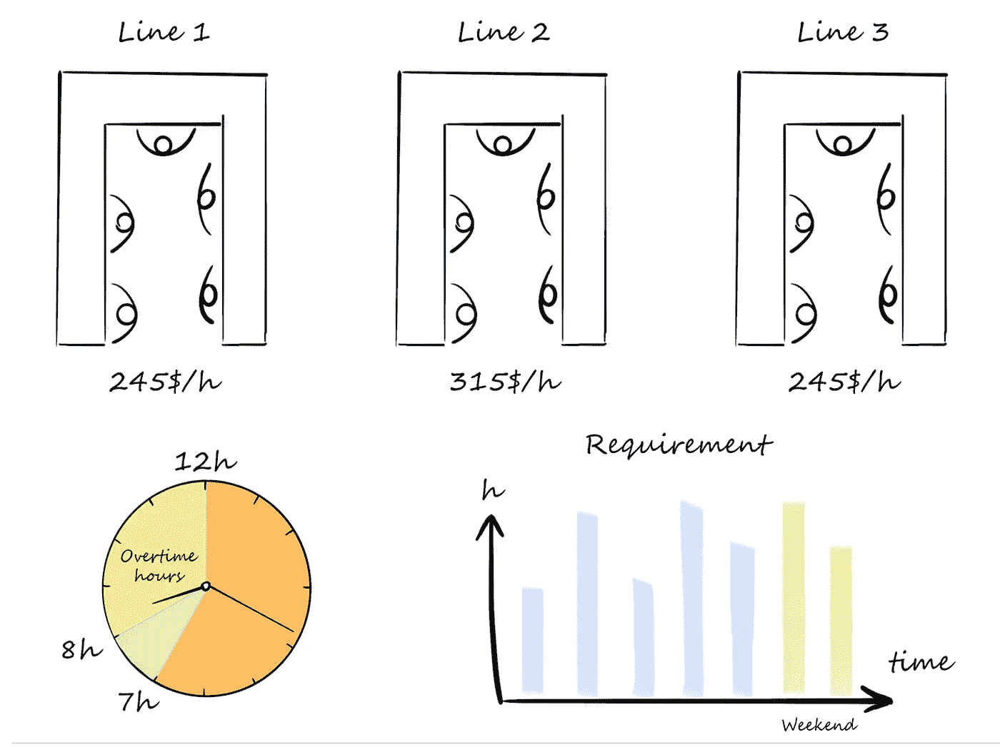
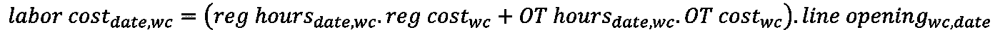
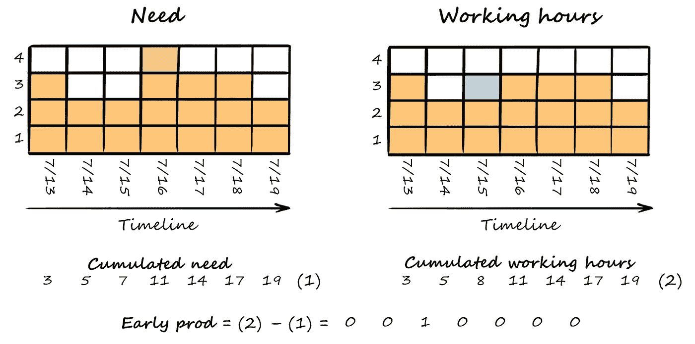
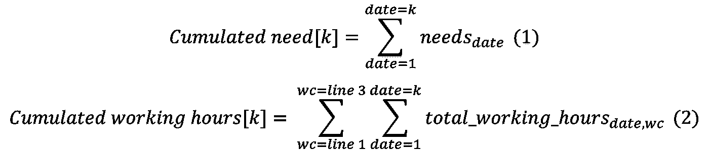
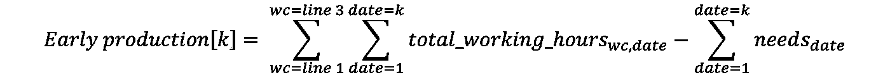
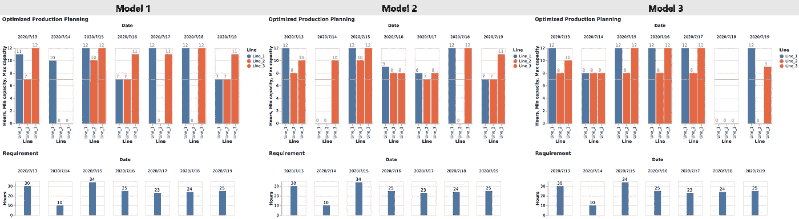

# 用 Python 和 Gurobi 优化周生产计划—第二部分

> 原文：<https://towardsdatascience.com/optimization-of-a-weekly-production-plan-with-python-and-gurobi-part2-6ebcefe85e52?source=collection_archive---------25----------------------->

## [实践教程](https://towardsdatascience.com/tagged/hands-on-tutorials)

## 了解如何使用 Python 和数学求解器 Gurobi 解决优化问题。

本文是关于生产计划优化的系列文章的第二篇，它补充了第一篇文章，增加了更多的约束条件，以便更好地代表实际情况。目标保持不变:优化生产计划以降低直接成本。

为了更好地理解，我强烈建议您阅读本系列的第一篇文章:

 [## 用 Python 和 Gurobi 优化周生产计划—第 1 部分

### 了解如何使用 Python 和数学求解器 Gurobi 解决优化问题。

towardsdatascience.com](/optimization-of-a-weekly-production-plan-with-python-and-gurobi-part-1-d1257ad29a9) 

由[卡洛斯·阿兰达](https://unsplash.com/@carlosaranda)在 [Unsplash](https://unsplash.com/photos/SVUqHTVyn6w) 上拍摄

# 语境

在第一篇文章中，我们学习了如何使用 Python 和数学求解器 Gurobi 来解决一个基本的优化问题。我们看到了如何使用这些工具在几条生产线之间以优化的方式安排来自客户订单的日常需求，从而降低劳动力成本。

现在，我们将看看如何将问题复杂化，使其更加现实。事实上，我们在第一篇文章中开发的模型主要由于以下两点而受到限制:

*   我们没有考虑周末和加班时间的额外劳动力成本。
*   我们将生产线的开放时间限制为最短 7 小时，最长 12 小时。因此，如果需求不在此范围内(例如，如果每日需求为 3 小时)，则不可能解决我们的模型。

在接下来的部分中，我们将看到如何修改我们的第一个模型来处理这些限制。我们不会详细回顾所有的代码，而只是展示对第一个模型所做的更改。你可以在我的 [GitHub](https://github.com/soulabat/Production-plan-optimization/tree/master/Planning_optimization_part2) 上找到完整的代码。

每个模型的不同考虑|作者的图片

# 第 1 部分:让我们在模型中加入加班和周末额外成本

与第一篇文章一样，我们拥有 3 条生产线，每天可以运行 7 小时到 12 小时，我们将了解如何优化生产计划以降低直接成本。下一张图片提醒了我们的背景:

问题图解|作者图片

在现实生活中，不可能无限制地设置操作员的工作时间。的确，劳动力不会免费加班，我们需要在模型中考虑这些额外成本。

例如，在正常工作时间开三条生产线可能比在两条生产线上加班更划算。考虑到这一新的约束条件，这次，我们假设我们的操作员每天工作 8 小时，按固定工资标准支付工资，而加班时间的工资则高出 50%。此外，在周末工作时，操作员的工资是正常工资的两倍。

## 输入

如上所述，正常工作时间、加班时间和周末的每小时成本是不同的。让我们设置这些新的人工成本，加班时间的系数为 1.5，周末时间的系数为 2:

## 变量

与我们之前设置的变量唯一不同的是， ***总工作时间*** 变量是基于两个元素构建的: ***正常工作时间*** 和 ***加班时间*** 。让我们用 ***addVars*** 创建这些变量，并按照上下文演示中提到的那样设置它们的边界。

由于劳动力成本在周末是不同的，我们需要将我们的时间表分成两个列表，一个用于工作日，一个用于周末。我们稍后将分别迭代这两个列表上的约束。

## 限制

至于约束条件，我们需要将****加班时间*** 与 ***总时数*** 联系起来，对于每个工作中心，每天用***【addconsts***。*

*最后，考虑到新的变量，劳动力成本的价值发生了变化。按照本文开头解释的规则，它是针对工作日和周末分别计算的。*

**

*我们现在已经添加了所有新的约束，我们可以解决我们的模型。*

## *形象化*

*与第一种模式相反，这种计划不会最大化 1 号线和 2 号线(较便宜的那条)的工作时间，但会减少加班时间。*

*你可以观察到周末的情况并非如此。这是因为在此期间不存在加班额外成本的概念，该成本是正常人工成本的两倍，但全天保持不变。*

# *第 2 部分:现在让我们允许早期生产，并将库存成本添加到模型中*

*尽管以前的模型非常令人满意，但它们受到一个主要的限制！不可能在要求的交货日期之外的某一天计划生产，这可能导致许多无法解决的情况。*

*除了这一点，我们的直接成本也可以通过在我们的时间线内平衡生产来降低，这在我们以前的模型中是不允许的。*

*为了解决这个问题，我们现在将允许提前生产。但是，早期生产伴随着存储成本，我们需要控制它。*

## *输入*

*大多数投入保持不变，但是，一个新的直接成本产生了:持有成本。持有成本包括组织由于持有存货而产生的所有费用。它包括资本成本、存储成本和风险成本。实际的运输成本会有很大的差异，这取决于你所在的位置、你生产的产品类型以及许多其他因素。然而，根据 APICS，制造业的失业率通常估计在 20%至 30%之间。(1)*

*在我们的问题中，我们正在处理生产时间。我们需要使用的单位持有成本是对一天存储一小时产品的持有成本的估计。我们可以认为它相当于一小时内平均生产库存的 20–30%。在我们的例子中，让我们把它设置为 25 美元。*

## *变量*

*由于有可能在要求的交货日期前制定计划，我们需要提前知道生产的数量。让我们创建变量，稍后我们将设置它的值。*

*为了获得在要求的交货日期之前计划的工时数，我们将计算从第一天到最后一天的累计需求和累计计划工时之间的差异。该矩阵的总和是需求前一天计划的工作小时数。稍后，我们将把这个值乘以单位存储成本，就可以知道早期规划产生的总额外成本。*

*以下是该变量的计算示例:*

**

*早期生产计算插图|作者图片*

*在这个例子中，我们可以看到提前一天计划了一个小时的生产(蓝色方块)。是我们用我们的逻辑计算早期产量时能发现的。以下是用于我们模型的公式:*

**对于时间线中的 k:**

**

**通过减去(1)到(2):**

**

*既然我们已经了解了如何计算早期生产的价值，我们可以创建一个约束来设置它的价值。*

## *限制*

*在以前的模型中，我们设置了一些约束条件，以强制在要求的交货日期进行计划。这一次，我们将取消这一限制，因为我们希望允许早期规划。然而，由于客户满意度是我们的第一要务，我们希望防止规划滞后。要做到这一点，最简单的方法就是简单地将我们的 ***的下界早生产*** 变量限制为零。*

*在定义变量时已经完成了这一步，我们可以删除以前模型中关于准时调度的约束集。*

## *目标函数*

*我们的目标还是一样，降低直接成本。但是这一次，我们的直接成本包含了需要添加到目标函数中的持有成本。这些成本是用单位账面成本乘以 ***前期生产*** 计算出来的。*

## *形象化*

*这一次，我们可以观察到，我们的解决方案倾向于平衡一周内的生产，并最大限度地减少加班时间，甚至减少周末的工作时间。的确，周末的工作时间是最贵的，是正常工作时间的两倍。然而，当我们考虑存储成本时，早期生产被最小化。*

# *三种模式的比较*

**

*最后，这三种优化模型给出了不同的结果。前两个模型的输出是错误的，因为我们没有告知我们的算法额外的成本，并且我们不允许提前计划。由这两个第一模型提出的计划的成本比由第三模型提出的成本高大约 5000 美元。*

***总之，绝对有必要建立广泛的模型，考虑现实生活中发生的所有约束，以便用优化算法得出有意义的结论。***

***如果你需要进一步的信息或者想就这个话题交换意见，请随时联系我**。你可以在 [LinkedIn](https://www.linkedin.com/in/baptistesoulard1994/) 上找到我。*

# *资源*

*1.斯蒂芬·n·查普曼，j·r·托尼·阿诺德，安·k·盖特伍德，劳埃德·m·克莱夫 *物料管理简介。**

*这个项目的资源库可以在我的 [GitHub](https://github.com/soulabat/Production-plan-optimization/tree/master/Planning_optimization_part2) 上找到。*

*关于 SAP 如何在其计划优化模块中使用线性优化的文档[在此](http://www.gurobi.com/pdfs/user-events/2017-frankfurt/SAP.pdf)。*

*Gurobi 文档[此处](https://www.gurobi.com/documentation/8.0/examples/workforce5_py.html)。*

* [## 用 Python 和 Gurobi 优化周生产计划—第 1 部分

### 了解如何使用 Python 和数学求解器 Gurobi 解决优化问题。

towardsdatascience.com](/optimization-of-a-weekly-production-plan-with-python-and-gurobi-part-1-d1257ad29a9)*