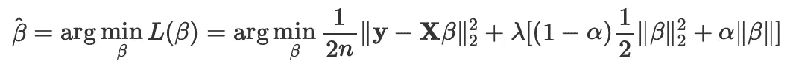
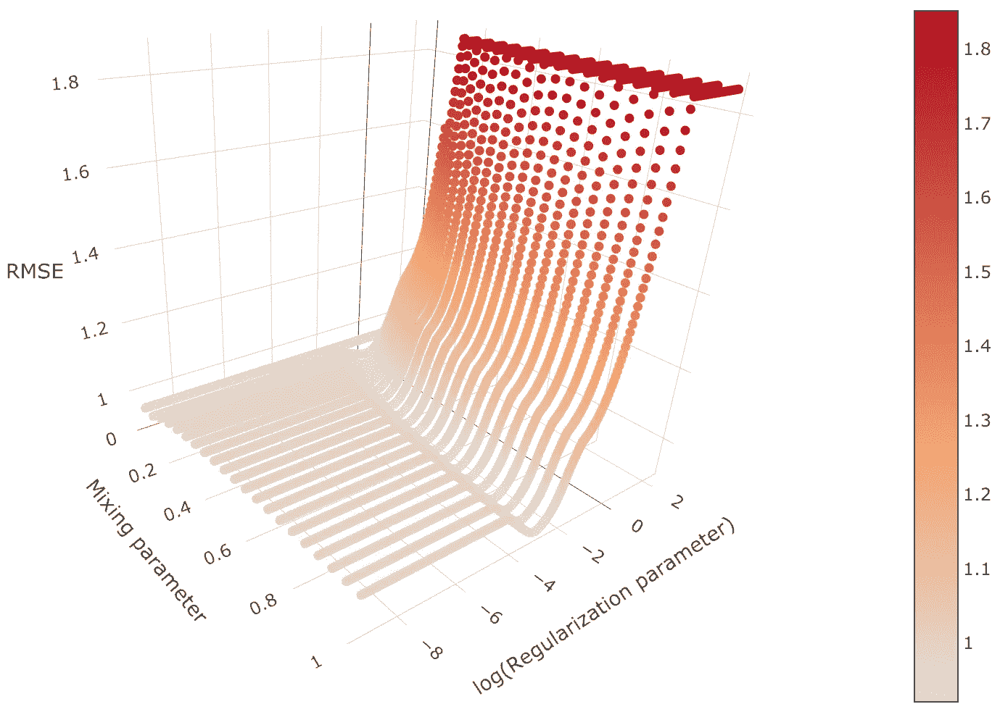

# 预测土壤粘粒含量的弹性网络正则化优化

> 原文：<https://towardsdatascience.com/optimization-of-elastic-net-regularization-for-predicting-soil-clay-content-7df09f6a68f8?source=collection_archive---------55----------------------->

## 建立了基于弹性网的正则化线性回归模型，从数百个 LIBS 光谱数据中预测土壤粘粒含量。

照片由 [Heino Elnionis](https://unsplash.com/@heinoel?utm_source=medium&utm_medium=referral) 拍摄

最近，大量研究致力于检验光谱和机器学习方法预测土壤颗粒大小的潜力——沙子、淤泥和粘土百分比。在这方面，LIBS 被认为是一种有用和有利的分析技术，因为它具有简单、快速、微创等特点，并且可以进行*原位*分析，无需进行土壤取样，而土壤取样通常既耗时又容易出错。在 LIBS，微等离子体是通过将高功率激光束聚焦到材料表面上产生的，以诱导特征原子发射线，从而能够直接确定材料的元素组成。

在本文中，从一个研究区域采集的 300 个土壤样本首先由 LIBS 进行分析，然后随机分为训练集(80%)和测试集(20%)。每个样品都有其相应的粘土含量，该含量是通过标准比重计方法预先确定的。然而，影响 LIBS 光谱数据建模的一个主要问题是“维数灾难”及其推论的多重共线性。为了解决这些问题，基于弹性网算法的正则化回归模型使用重复的双重交叉验证过程来开发。在该过程中，使用训练集进行 100 次重复的 10 重交叉验证，并使用测试集测试所得模型的预测能力。该过程以不同的随机分割重复 5 次。

## 超参数优化

弹性网是岭回归和 lasso 正则化之间的折衷，它最适合对具有大量高度相关预测值的数据进行建模。让我们考虑一个大小为 *n* × *p* 的数据矩阵 **X** 和大小为 *n* × 1 的响应向量 **y** ，其中 *p* 是预测变量的数量， *n* 是观测值的数量，在我们的例子中是 *p* ≫ *n* 弹性网络旨在最小化以下损失函数:

*最小二乘*优化问题。

其中，𝜆是正则化参数，𝛼是混合参数(或百分比)。𝜆参数是非负的，即𝜆 ∈ [0，∞)。当𝜆 = 0 时，正则化不起作用。换句话说，唯一的目标是最小化损失函数。当𝜆接近无穷大时，正则化效应增强，唯一的目标变成保持系数𝛽小，而不是最小化损失函数。而𝛼则是。当𝛼 = 0 时，弹性网与岭回归相同(一组相关预测因子的系数以类似的方式向零收缩)，另一方面，当𝛼 = 1 时，弹性网与 lasso 相同(其中一个相关预测因子的系数较大，而其余的收缩为零)。

对这两个集合的笛卡尔积中的每一对(𝜆，𝛼)进行网格搜索以训练弹性网模型，并评估它们在来自训练集合的交叉验证上的性能，其中每对训练多个模型。最后，网格搜索算法输出在重复交叉验证过程中获得最高分数(RMSE)的设置。

我使用了介于 0.05 和 1 之间的 20 个𝛼值，以及介于 0.0001 和 10 之间的 300 多个𝜆值。给出最小交叉验证误差的(𝜆，𝛼)对的平均值为(0.0053±0.0005，0.90±0.03)。有趣的是，最终的模型接近 lasso，但弹性网比 lasso 更有优势，因为在我们病态的线性最小二乘问题中产生了超过 *n* 个非零系数。