# 优化故事:KKT 条件

> 原文：<https://towardsdatascience.com/optimization-stories-kkt-conditions-f86aea4fb6c2?source=collection_archive---------10----------------------->

## 将 KKT 条件与最优化问题中的最优性联系起来

关键概念:*互补松弛，对偶，对偶间隙，KKT 条件，拉格朗日函数，拉格朗日乘子，单纯形算法*

这篇文章的目标是帮助读者理解上面的关键概念在最优化问题中的最优化搜索中所扮演的角色。在整篇文章中，我将以自上而下的方式涵盖所有概念，从最基本的问题开始:优化的目标是什么。

# 优化目标

优化问题的目标是在给定一定的约束条件下找到最佳解，或者在一定的时间内找到足够“好”的解，比如训练深度神经网络模型中的参数，使其损失函数最小(非凸优化问题)。下面的线性规划问题是前一种情况的例子。

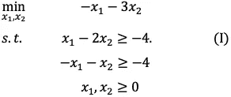

对于线性规划问题，可以通过高效的 [*单纯形算法*](https://en.wikipedia.org/wiki/Simplex_algorithm) 找到最优解(如果存在)。对于问题(I)，最佳解决方案是

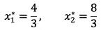

单纯形算法和其他一些优化算法是迭代算法，从起点 *x₀* ，在每次迭代中更新 *x*

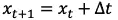

直到找到最优解，或者满足某个停止条件。

*但是我们怎么知道当前的解是最优解呢？这就是 KKT 的情况。*

# KKT 条件

卡鲁什-库恩-塔克(KKT)条件形成了线性和非线性规划的主干

*   线性规划最优性的充要条件。
*   凸优化中最优性的充要条件，如线性回归中的最小二乘最小化。
*   对于非凸优化问题中的最优性是必要的，比如深度学习模型训练。

## 不等式约束线性规划的 KKT 条件

考虑下面的问题(II):

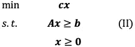

*KKT 条件* : ***x*** 对前述问题**最优当且仅当**条件(1)-(3)成立。

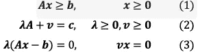

条件(1)仅仅陈述了 ***x*** 是可行解，通常称为 ***初始可行性*** 。条件(2)，通常称为 ***对偶可行*** ，说明 ***x*** 也是对偶问题的可行解。 ***λ*** 和 ***v*** 称为 ***拉格朗日乘数*** (或 ***对偶变量*** )分别对应约束 ***Ax ≥ b*** 和 ***x ≥* 0** 。最后，条件(3)称为*。具体来说，***λ***(***ax-b***)= 0 表示，在最优解 ***x*** ，不失一般性，要么***【λᵢ】***= 0，要么***aᵢx =****bᵢ*(即*)自然， ***vx =* 0** 也可以用类似的方式解读。**

*重温问题(一)*

***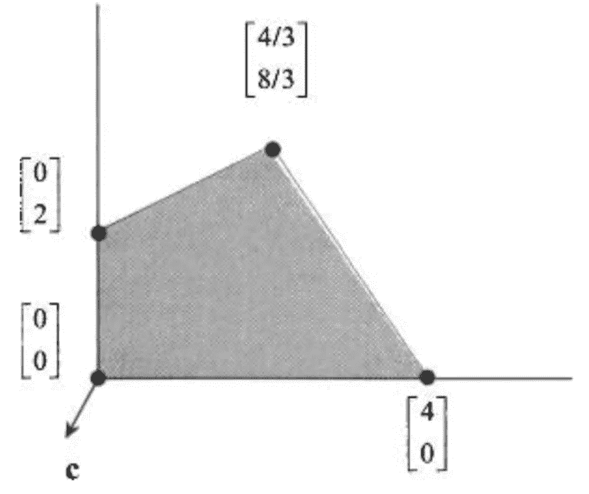*

*对于线性规划，最优解(如果存在)总是位于顶点。在这种情况下，[0，0]、[4，0]、[4/3，8/3]和[0，2]是 4 个候选项。然后，我们可以使用 KKT 条件来验证哪一个是最优解。*

*对于[0，0]来说，绑定约束是 *x₁≥* 0 和 *x₂≥* 0，所以 *w₁=w₂=* 0 被互补松弛。但对偶可行性条件 ***λA+v=c*** 导致 ***v=*** (-1，-3)，违反了另一个对偶可行性条件 ***v≥*** 0。*

*类似的过程可以应用于其他 3 个顶点，直到我们验证[4/3，8/3]满足所有 KKT 条件，并声称它是最优解。*

## *等式约束线性规划的 KKT 条件*

*考虑下面的问题(III):*

*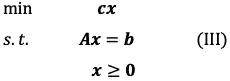*

**KKT 条件* : ***x*** 对前述问题**最优当且仅当**条件(4)-(6)成立。*

*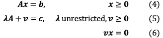*

*在看到问题(II)的 KKT 条件(1)-(3)后，(4)-(6)变得直观。鉴于问题(I)中的约束 ***Ax ≥ b*** 现在成为所有约束情形 ***Ax=b*** ，对应的拉格朗日乘子 ***λ*** 成为无限制。*

## *非线性问题的 KKT 条件*

*考虑下面的非线性优化问题(IV):*

*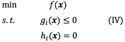*

**KKT 条件*:条件(7)-(9)是 ***x*** 成为前述问题(IV)的最优解的必要条件。如果(IV)是凸的，(7)-(9)也成为充分条件。*

*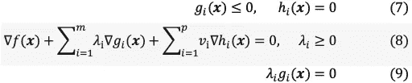*

*(7)类似于(1)，是 ***脑瓜子可行性*** 条件。先跳到条件(9)，不等式约束的 ***互补松弛*** 条件***gᵢ*(*x*)*≤***0，对应问题(二)中的条件(3)。*

**

*最后，(8)是 ***对偶可行性*** 条件保证对偶问题中的可行性。不难发现，问题(II)中的条件(3)是(8)的特例，与*

*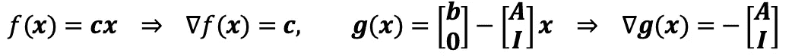*

*用 ***λ*** 和**v**分别代表 ***拉格朗日乘数*** 对于 ***Ax ≥ b*** 和 ***x ≥* 0** ，我们有*

*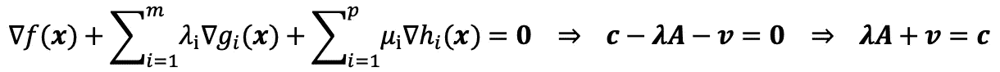*

*条件(8)的第一部分也称为非线性优化问题的一阶条件。*

*值得一提的是，或者你可能已经注意到了，如果问题中的不等式约束是“≥”格式，那么对应的拉格朗日乘子是非正的。或者，您也可以将一阶条件更改为以下格式，以保持它们非负。*

*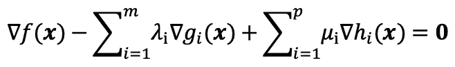*

*到目前为止，我们已经回顾了各种问题的 KKT 条件。虽然 ***原始可行性*** 条件相当直观，但问题是我们应该如何解释 ***对偶*** ***可行性*** 和 ***互补松弛*** 的最优性。*

# *二元性*

*一个优化问题可以从两个角度提出，原始问题或对偶问题。有时，一个问题可以用对偶形式解决，这比用原始形式要有效得多。*

*对于极小化问题，其对偶形式的任何可行解都提供了其原始形式解的下界。因此，对偶最优解和原始最优解之间的差异称为 ***对偶缺口*** 。*

*对于线性问题和凸非线性问题，对偶间隙为零。对于这些问题，一个解不可能对原始和对偶都可行，除非它是最优解。因此，寻找最优性等价于寻找一个在原始和对偶中都可行的解。*

## *线性问题*

*重温问题(二)*

**

*(二)的对偶问题是*

*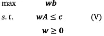*

*由问题定义，我们有如下推论*

*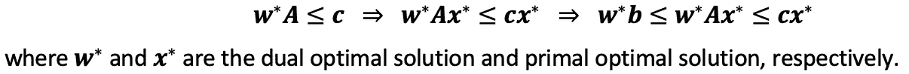*

*因为线性问题的对偶间隙为零，所以我们有*

*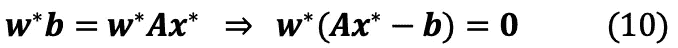*

*这是原问题中的互补松弛条件。*

## *非线性问题*

*重温问题(四)*

**

*给出了(IV)的对偶问题*

*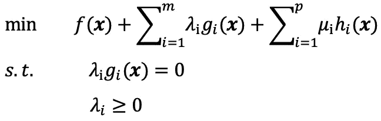*

*对偶问题的目标函数又称为 ***拉格朗日对偶函数。*** 回想一下，拉格朗日函数的一阶导数，连同这两组约束，是非线性情况下的*和 ***互补松弛度*** 的对偶可行性条件。**

# **互补松弛的经济学解释**

**互补的懈怠也可以用经济学的方式来解释。回想一下，在最优性条件下，互补松弛只要求以下两种情况中的一种适用于约束条件(在非退化情况下):**

*   **约束是有约束力的(即平等)**
*   **这个约束的拉格朗日乘数为零**

**如果我们将约束视为资源约束(例如，材料、空间、时间等)。)和拉格朗日乘数作为该资源的价值或价格，那么补充松弛度就是说:**

*   **如果约束是有约束力的，这意味着我们在最大化目标时耗尽了这个资源。这意味着，如果我们拥有更多的这种资源，我们的客观价值就会增加。因此，这种资源是有价值的，它的价格(拉格朗日乘数)应该是正数。这就是为什么有时拉格朗日乘数也被称为影子价格。**
*   **如果约束是非绑定的，那么就潜在的问题而言，这意味着这个资源是无用的。因此，它的价格(拉格朗日乘数)应该为零。**