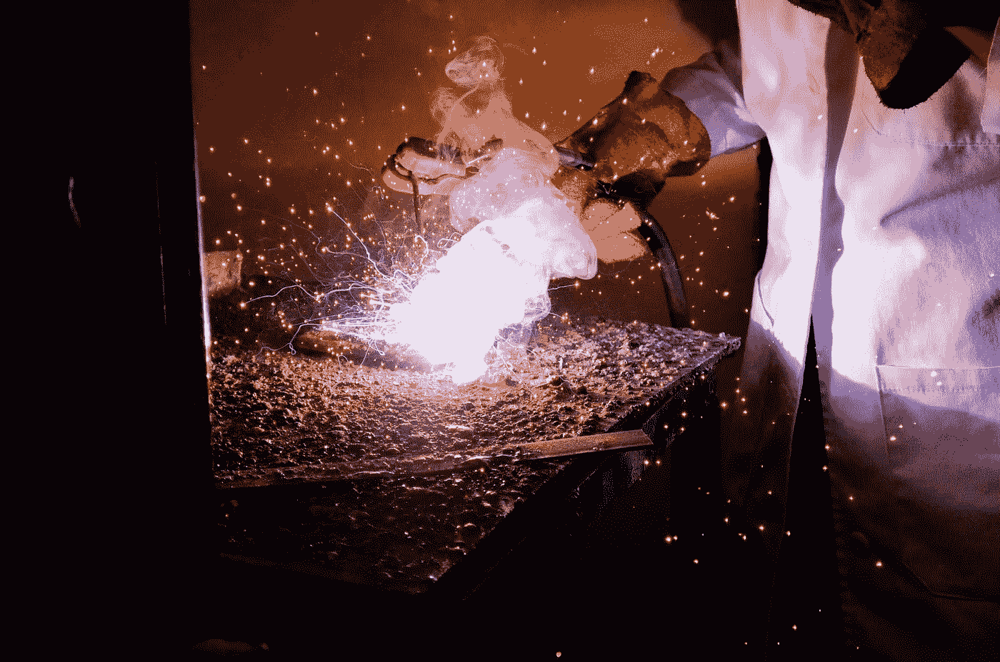
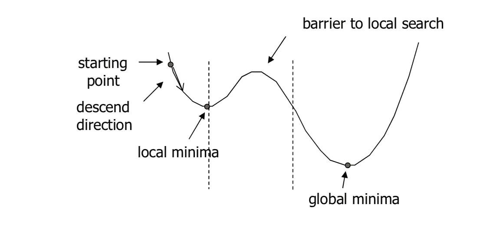
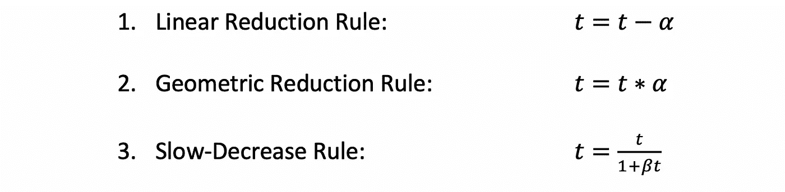
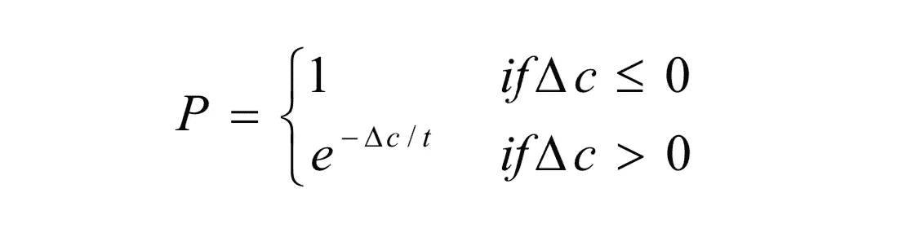
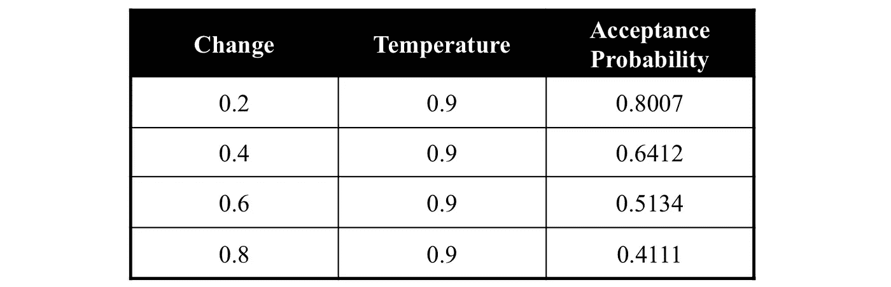
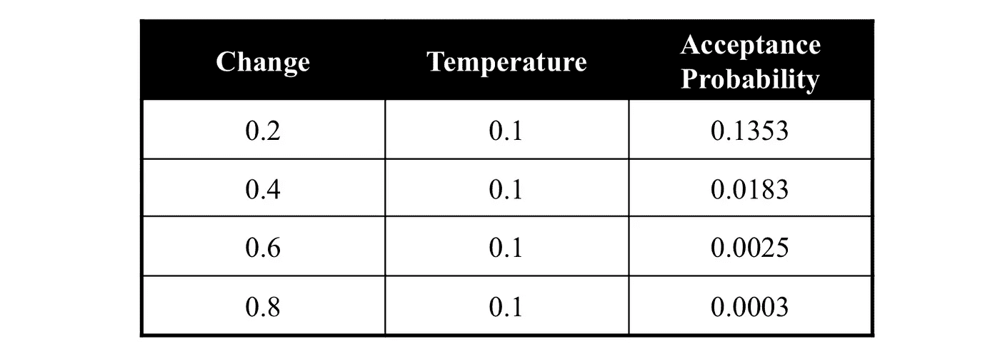

# 优化技术—模拟退火

> 原文：<https://towardsdatascience.com/optimization-techniques-simulated-annealing-d6a4785a1de7?source=collection_archive---------1----------------------->

## 一种优化模型参数的流行方法

照片由[克莱门特·H](https://unsplash.com/@clemhlrdt?utm_source=unsplash&utm_medium=referral&utm_content=creditCopyText)在 [Unsplash](https://unsplash.com/s/photos/classification-coding?utm_source=unsplash&utm_medium=referral&utm_content=creditCopyText) 上拍摄

# 什么是物理退火？

照片由[米盖尔·阿奎莱拉](https://unsplash.com/@m_i_c_k_e_y?utm_source=unsplash&utm_medium=referral&utm_content=creditCopyText)在 [Unsplash](https://unsplash.com/s/photos/metalworks?utm_source=unsplash&utm_medium=referral&utm_content=creditCopyText) 拍摄

模拟退火算法是基于现实生活中的物理退火。物理退火是加热材料直到其达到**退火温度**然后将**缓慢冷却**以将材料改变成所需结构的过程。当材料变热时，分子结构变弱，更容易发生变化。当材料冷却下来时，分子结构变得更硬，更不容易改变。

这种类比的另一个重要部分是来自热力学的以下方程:

这个等式计算能量大小增加的概率。给定一些能量大小和一些温度 *t* 以及玻尔兹曼常数 *k* ，我们可以计算出这个值。

# 模拟退火

模拟退火(SA)模拟物理退火过程，但用于优化模型中的参数。这一过程对于存在大量局部极小值的情况非常有用，这样像梯度下降这样的算法就会停滞不前。

局部极小值问题的例子

在类似上面的问题中，如果梯度下降从指定的起点开始，它将停留在局部最小值，而不能到达全局最小值。

## 算法

第一步:我们首先从一个初始解开始 **s = S₀** 。这可以是符合可接受解决方案标准的任何解决方案。我们也从初始温度开始，t = t₀。

**第二步:**设置降温功能*α*。通常有 3 种主要的降温规则:

每种缩减规则以不同的速率降低温度，并且每种方法更擅长优化不同类型的模型。对于第三个规则， *beta* 是一个任意的常数。

**步骤 3:** 从初始温度开始，循环通过步骤 4 的 *n* 次迭代，然后根据*α*降低温度。停止该循环，直到达到*终止条件*。终止条件可以是达到某个最终温度、对于给定的一组参数达到某个可接受的性能阈值等。时间与温度的映射以及温度下降的速度称为**退火程序**。

**步骤 4:** 给定解的邻域 *N(s)* ，选择一个解，并计算旧解和新邻域解之间的成本差。解的邻域是所有接近该解的解。例如，如果我们改变五个参数中的一个，但保持其余四个不变，则一组五个参数的邻域可能是。

**第五步:**如果新旧方案的成本差大于 0(新方案更好)，则接受新方案。如果成本差异小于 0(旧的解决方案更好)，则生成一个介于 0 和 1 之间的随机数，如果它低于根据之前的能量幅度方程计算的值，则接受它。

在模拟退火的情况下，该等式被修改为如下:

其中*δc*是成本的变化， *t* 是当前温度。

这种情况下计算出的 *P* 就是我们应该接受新方案的概率。

## 高温与低温

由于计算概率的方式，当温度较高时，算法是否更有可能接受更差的解决方案。这促进了搜索空间的**探索**，并允许算法更有可能沿着次优路径行进，以潜在地找到全局最大值。

给定温度为 0.9 的样本接受概率

当温度较低时，算法不太可能或不愿意接受更差的解决方案。这促进了**利用**，这意味着一旦算法处于正确的搜索空间，就没有必要搜索搜索空间的其他部分，而是应该尝试收敛并找到全局最大值。

给定温度为 0.1 的样本接受概率

# 一些用 SA 优化问题的例子

*   旅行推销员问题
*   调度问题
*   任务分配
*   图的着色和划分
*   非线性函数优化

# SA 的优势与劣势

## 优势

*   易于实施和使用
*   为各种问题提供最佳解决方案

## 不足之处

*   如果退火计划很长，可能需要很长时间运行
*   该算法中有许多可调参数

# SA 的实施

这是模拟退火的一个样本样板实现。

# 结论

模拟退火是一种用于优化多参数模型的流行算法，可以相对快速地实现。如果需要多次迭代，模拟退火的计算量会非常大，但它能够找到全局最大值，而不会陷入局部最小值。