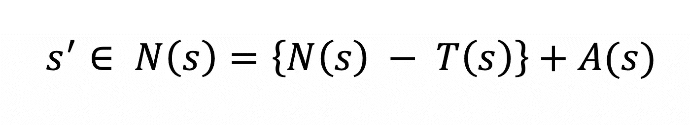

# 优化技术—禁忌搜索

> 原文：<https://towardsdatascience.com/optimization-techniques-tabu-search-36f197ef8e25?source=collection_archive---------10----------------------->

## 一种优化模型参数的流行方法

在 [Unsplash](https://unsplash.com/s/photos/tech?utm_source=unsplash&utm_medium=referral&utm_content=creditCopyText) 上由 [Carlos Muza](https://unsplash.com/@kmuza?utm_source=unsplash&utm_medium=referral&utm_content=creditCopyText) 拍摄的照片

# 什么是禁忌搜索？

禁忌搜索是一种常用的元启发式算法，用于优化模型参数。元启发式算法是一种用于指导和控制实际启发式算法的通用策略。禁忌搜索通常被认为是将**记忆结构**整合到**局部搜索策略**中。由于局部搜索有很多局限性，禁忌搜索被设计用来解决这些问题。

# 禁忌搜索

禁忌搜索的基本思想是惩罚将解带入先前访问过的搜索空间的移动(也称为**禁忌**)。然而，禁忌搜索确实坚决地接受非改进解，以防止陷入局部极小值。

## 短期记忆和长期记忆

**短期**记忆基于*出现的最近度*，用于防止搜索算法重新访问之前访问过的解决方案，也可用于返回好的组件，以便定位和加强搜索。这是通过禁忌列表完成的，也称为**强化**。

**长期**记忆基于*出现的频率*，用于多样化搜索，并通过避免探索区域来探索搜索空间中未被访问的区域。这是通过频率记忆实现的，也称为**多样化**。

## 禁忌列表

禁忌表是利用短期记忆的基石。该列表存储固定数量的最近移动。在一些实现中，使用完整的解决方案来代替所使用的移动，但是如果由于空间限制，完整的解决方案非常大，这是不理想的。这些移动的一些例子是:

*   交换图/旅程中的节点
*   在 0 和 1 之间切换一点
*   在图形中插入或删除边

## 禁忌占有制

禁忌占有期是一步棋在禁忌列表中停留的迭代次数。禁忌列表中的移动是不能再次进行的移动，因为它最近已经被访问过。有两种方法可以实现禁忌任期( ***T*** ):

*   **静态:**选择 T 为常数(常为 *sqrt(T)* )
*   **动态:**在某个 *T_min* 和 *T_max* 之间随机选择 T

## 愿望标准

这是禁忌搜索的可选部分。作为期望标准一部分的移动或解决方案取消了禁忌，即使它在禁忌列表中，也可以进行移动。在禁忌列表禁止所有可能的移动的情况下，这也可以用来防止**停滞**。愿望标准的一些例子是:

*   如果新的解决方案比当前的最佳解决方案更好，那么新的解决方案将被使用，即使它在禁忌列表中
*   将禁忌任期设置为较小的值

## 储频装置

该内存保存了自搜索开始以来每个解决方案的总迭代次数。被访问次数多的解决方案不太可能被再次选择，并且会促进更多样化的解决方案。多样化有两种主要方法:

*   **重启多样化:**通过从这些点重启搜索，允许很少出现在当前解决方案中的组件
*   **持续多样化:**用这些移动的频率来偏向对可能移动的评估。不经常出现的移动将有更高的概率进行。

# 算法

**第一步:**我们首先从一个初始解 ***s = S₀*** 开始。这可以是符合可接受解决方案标准的任何解决方案。

**第二步:**生成当前解 ***s*** 的一组相邻解，标注为 ***N(s)*** 。从这组解决方案中，除了符合期望标准的解决方案之外，禁忌列表中的解决方案将被删除。这组新的结果就是新的 ***N(s)*** 。

**第三步:**从 ***N(s)*** 中选择最佳解，并将这个新解标注为***s’***。如果***s’***的解优于当前最佳解，则更新当前最佳解。之后，不管 ***s'*** 是否比 ***s*** 好，我们把 ***s*** 更新为***' s '***。

**步骤 4:** 通过移除所有超过禁忌期限的招式来更新禁忌列表*，并将新招式***【s’***添加到禁忌列表中。此外，更新符合抽吸标准*的溶液组。如果使用了频率记忆，那么也用新的解决方案增加频率记忆计数器。**

****步骤 5:** 如果满足终止标准，则搜索停止，否则将进入下一次迭代。终止标准取决于手头的问题，但一些可能的例子是:**

*   **最大迭代次数**
*   **如果找到的最佳解决方案优于某个阈值**

# **使用 TS 解决的问题示例**

*   **n 皇后问题**
*   **旅行推销员问题**
*   **最小生成树**
*   **分配问题**
*   **车辆路线**
*   **DNA 测序**

# **TS 的优点和缺点**

## **优势**

*   **可以通过选择非改进的解决方案来避免局部最优**
*   **禁忌列表可用于避免循环和恢复旧的解决方案**
*   **可应用于离散和连续解决方案**

## **不足之处**

*   **迭代次数可能非常高**
*   **该算法中有许多可调参数**

# **实施技术服务**

**这是一个 Tabu 搜索的样本实现。实际的实现取决于问题。**

# **结论**

**禁忌搜索是一种流行的算法，用于优化多参数模型，可以产生异常的结果。尽管实现并不简单，需要调整，但是一旦创建了它，就能够解决各种各样的问题。**