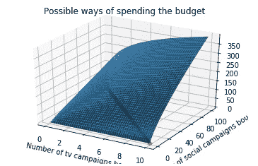
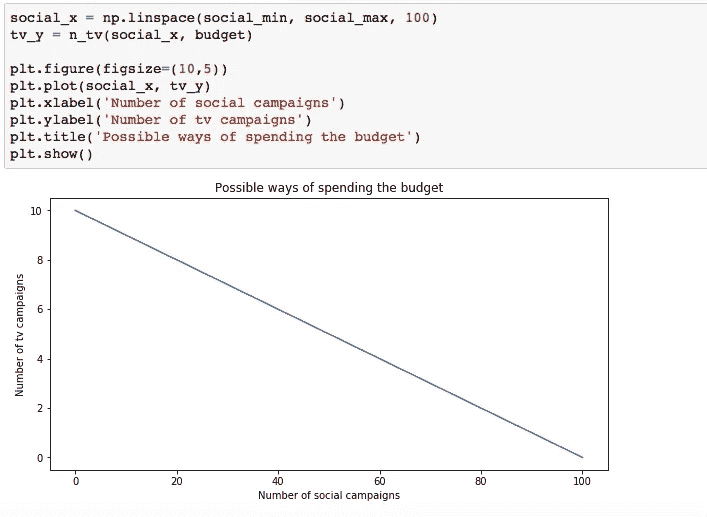
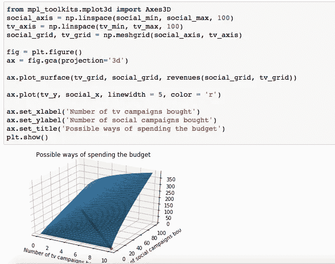
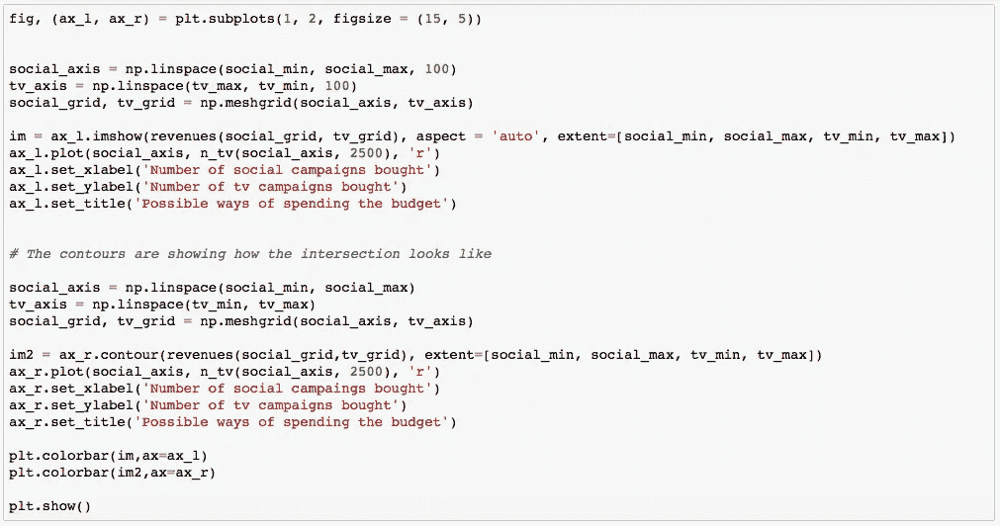
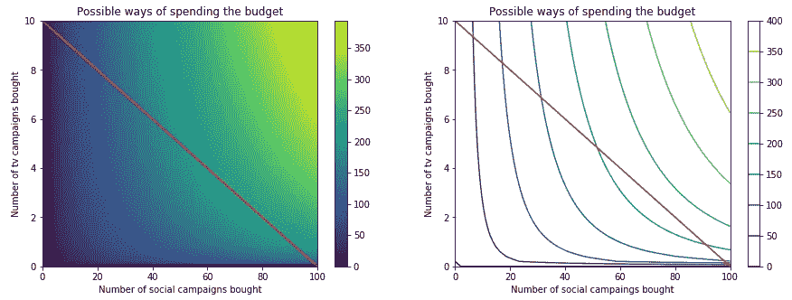
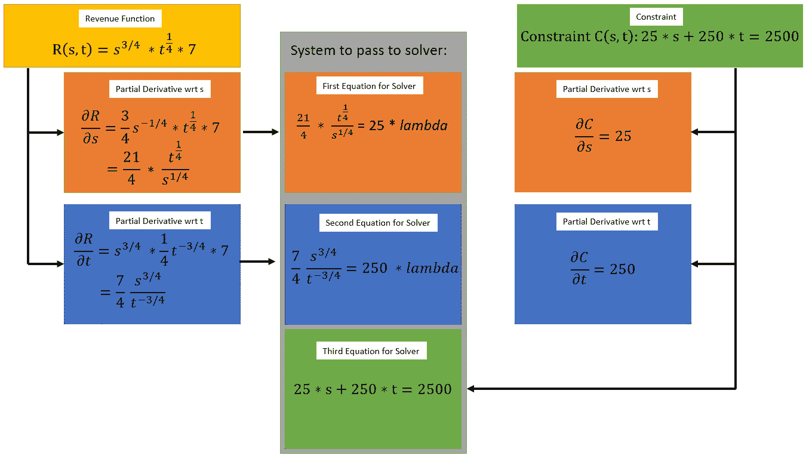
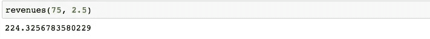

# Python 中使用拉格朗日乘子的约束优化

> 原文：<https://towardsdatascience.com/optimization-with-constraints-using-lagrange-multiplier-in-python-82769c9a43fe?source=collection_archive---------13----------------------->

## 具有 1 个等式约束的二元函数的拉格朗日乘子

作者图片

拉格朗日乘数法是一种在约束条件下优化函数的方法。在本文中，我将展示如何使用拉格朗日乘数来优化一个相对简单的例子，这个例子包含两个变量和一个等式约束。我用 Python 解决了一部分数学问题。

你可以在这里跟随 Python 笔记本。

举个例子，某公司的在线营销部门收到了一笔固定预算，用于社交媒体和电视宣传活动的组合:

*   假设我们有 2500 美元的固定营销预算。
*   假设我们可以选择投资两种类型的活动:社交媒体和电视，你必须做出决定
*   简而言之，我们假设在社交媒体上的一次活动花费 25 美元，在电视上的一次活动花费 250 美元。
*   假设我们在过去做了很多实验，我们已经能够将收入定义为两种媒体投资的函数。
*   在这本笔记本中，我将展示如何使用拉格朗日乘数法找到最大收益和你应该购买的不同类型的活动的数量。

## 检查成本

成本的等式是:

*25 美元乘以社交活动次数+ 250 倍于电视活动次数*

由于我们想准确地花费预算，我们知道这等于 2500 美元，给出以下约束:

*25 *社交+ 250 *电视= 2500*

# 策划可能的预算支出方式

在下图中，我画出了不同的预算支出方式。由于预算是固定的，如果我们在社交活动上花更多的钱，我们自然会在电视活动上花更少的钱，反之亦然。

*   线下的每个工时和材料组合都在预算之内。
*   每一个超出预算的工时和材料组合都超出了预算。
*   如果我们想花掉整个预算(我们通常会这样做)，我们必须准确地在线上。

作者图片

# 检查收入

假设通过实验和分析，有人已经能够确定你的企业的收入曲线，它被定义为:

*收入(以千美元为单位)是社交活动次数的 7 倍，电视活动次数的 3/4 倍，1/4 倍*。

这可以用 Python 函数来表示，如下所示:

# 问题的三维表示

在我们的练习中，我们有三个变量:收入、社会活动的数量和关于材料的电视活动的数量。当然，我们希望收入最大化。

我们还有一个预算约束，就是上面显示的 2D 线:我们可以花费的最大金额。
目标是在预算之内找到最大收益。

我将首先展示这个问题的三维表示，我们看到:

*   社交活动和电视活动的 3D 收入。
*   收入图表下方 2D 显示的约束行。

目标是确定 3D 曲线上的最高点，该最高点正好在约束线上。

作者图片

# 问题的 2D 表示

3D 看起来很酷，但相对难以阅读。因此，我制作了两个 2D 图，显示了完全相同的信息:不是将 Z 轴上的收入相加，而是将收入表示为颜色渐变(左)和轮廓渐变(右)。

目标保持不变:找到最高的收入，只要它低于预算约束线。

作者图片

# 视觉解决方案

如果我们检查图表(无论是梯度还是等高线)，我们可以在红线(最大预算)上看到，最高收入值大约是 3 个电视广告活动和 70 个社交广告活动。

有了这第一个直观的估计是很棒的，现在让我们用数学找到确切的值。

# 数学解决方案

## 最大值在哪里？

我们需要找到收益曲线与约束线相切的点。我们使用的方法是拉格朗日乘数法。

简而言之，它的工作原理如下:
我们可以在收益等高线的梯度与约束线的梯度成正比的点上找到最大值。
你可以回头看看等高线图，看看这是不是真的。

## 如何表示比例性？

所以我们需要解决比例问题，而不是等式问题。
所以不是:“收入梯度”=“约束梯度”
而是:“收入梯度”与“约束梯度”成正比
我们在数学上这样表述
“收入梯度”=λ乘以“约束梯度”

这个λ使它成为一个比例的声明。
这个λ叫做拉格朗日乘数。

## 梯度是导数

在使用内置的 python 优化器之前，一个棘手的步骤是通过获得收入函数和约束函数的导数来获得梯度。因为每个变量有两个，我们需要两个偏导数来得到这两个导数的向量。

## 计算导数

在下图中，我展示了如何创建三个方程，我们可以在 python 求解器中传递这些方程。

*   首先要做的是从收益函数和约束条件到它们的导数。
*   然后设置收益函数的导数等于λ乘以约束的导数。这为求解器提供了前两个方程。
*   第三个等式就是约束本身。

作者图片

现在我们有了三个方程，我们可以手动解出这个系统。或者，更简单的是，我们可以将它传递给 Python 的 sympy 解算器:

# 结论:

拥有:

*   2500 美元的预算
*   25 美元的社会活动费用
*   250 美元的电视广告费用
*   一个收入函数:
    *收入(以千美元为单位)是社交活动次数的 7 次幂 3/4 次幂电视活动次数的 1/4 次幂*。

使用线性求解器，我们确定了 75 个社交活动和 2.5 个电视活动将获得最大收益。总收入(以千美元计)将为 224，即 224，000 美元:

*我希望这篇文章阐明了如何在业务优化用例中使用拉格朗日乘数。当然，你可以很容易地将代码改编成另一组方程和约束，***。现在，感谢阅读！**