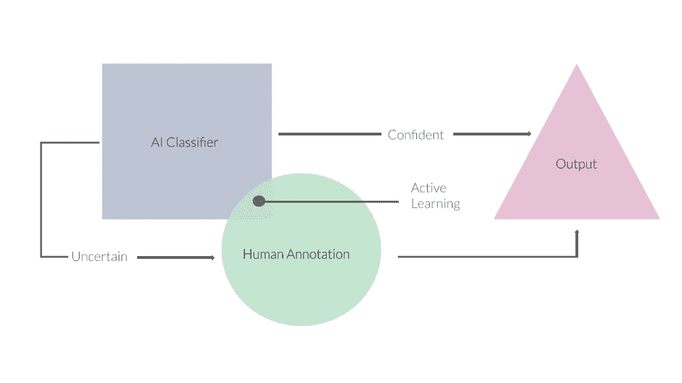
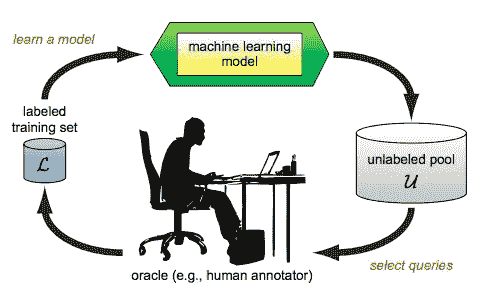

# 优化注释和训练:在线主动学习框架

> 原文：<https://towardsdatascience.com/optimize-annotation-and-training-an-online-active-learning-framework-d1319d746b3f?source=collection_archive---------37----------------------->

作者图片

## 为生产简化您的机器学习项目。

在 [Picsell.ia](https://bit.ly/2YOdW5X) ，我们致力于提供以低成本构建计算机视觉系统的最有效方法。

众所周知，深度学习的标签和培训成本很高，但在过去的几年里，我们看到了有趣技术的出现，使它变得更加实惠。

今天，我将谈论其中的两个:

*   主动学习
*   在线学习

这可能会有点长，所以喝杯咖啡，准备好和我一起潜入 [Picsell.ia 平台](https://bit.ly/2YOdW5X)的幕后。

> 请注意，我们的在线主动学习框架在 Github 上发布于此:【https://github.com/PicselliaTeam/Online-Learning 

# 主动学习的基本概念

2009 年结算

一个经典的监督模型通常会随着更多的标记数据而变得更加精确。然而，注释所有这些数据会花费大量的时间和/或金钱。根据您的目标、预算和时间限制，您可能会考虑减少要标记的数据数量。

主动学习的全部意义在于聪明地选择哪些数据需要被标记以及以什么样的顺序。大量研究论文已经证明，主动学习方法可以减少达到特定精度所需的训练数据量。

> 我将简要介绍主动学习的基本原理，因为有足够多的文章描述了这个过程，可能比我能描述的更好。

 [## 主动学习:你的模特的新私人教练

### 首先，一些事实。事实:主动学习不仅仅是强化学习的另一个名称；主动学习不是…

medium.com](https://medium.com/@ODSC/active-learning-your-models-new-personal-trainer-a89722c0db5a)  [## 主动学习导论

### 机器学习目前的实用性和可访问性部分是由于…

medium.com](https://medium.com/@ODSC/an-introduction-to-active-learning-d050beaa8882) 

主动学习循环由三个主要步骤组成。

*   第一个是**注释数据集的子集**。
*   然后，我们希望**根据这些标记的数据训练一个模型**。
*   最后，我们使用子集上训练的模型**对未标记的数据池**进行预测。

有了这些预测，我们使用一个**采样方法**对注释器进行查询(在文献中称为“ *Oracle* ”)。

最常用的一套抽样方法被称为“不确定抽样”。这些方法将关注模型的决策边界，并选择最不确定的数据。

罗伯特·芒罗的交互式不确定性采样热图

但是不确定性采样本身并不总是选择数据的最相关方式，因为你基本上是**忽略了远离决策边界的未标记空间**。

> 这在文献中通常被称为“*利用*，然而你也需要对你的数据进行一些“*探索*”。

当你的模型在每次训练迭代中更新自己时，决策边界也在移动，这意味着**你正在做一些探索**。但是加入适当的探索方法是很重要的。

探索数据集最常见的方法是简单地混合“不确定性采样”和“随机采样”。通过这种方法，我们选择利用概率为 *p* 的数据(不确定性采样)和探索概率为 *1-p* 的数据(随机采样)。

> 存在更复杂和有效的探索方法，例如基于聚类的采样，但是我们今天不打算明确它们。

> 勘探和开采之间的平衡是该领域中常见的难题。

基本概念非常简单，但实现起来却很棘手:

*   我应该选择哪种抽样方法？
*   如何在数据集的探索和利用之间找到平衡？
*   发送回 oracle 的项目数量应该是多少？
*   oracle 在等待查询时应该做什么？…

所有这些问题都没有最终答案。例如，您可能希望您的模型实时适应注释…或者您可能每年标记一批数据，因此您不需要经常更新您的模型。

在考虑主动学习的实际应用时，主要的实际考虑是:

> “我会通过主动学习节省时间和金钱吗？”

的确，我们已经知道可以用更少的数据进行学习，但是实施主动学习很容易导致**浪费时间**。

*   检索带标签的数据
*   初始化训练
*   训练本身
*   对未标记的数据进行预测并最终进行查询实际上比注释所有数据更耗时。

取决于你希望你的模型适应新的训练数据的速度，你在那里失去的时间可能是交易的破坏者。

就像我之前说的，这真的取决于你更新模型的频率。

事情是这样的，如果你有一个非常大的数据集要注释，并且不能全部完成，或者如果你想让你的模型用来自现实世界的新鲜数据不断学习，那么你可能要使用**“在线学习”**这是一个很大的词，可以说是实时学习，或者至少接近实时学习。

# 在线学习

在线学习的原则是**一旦新的训练数据可用**就训练你的模型，而不需要在每次迭代中重新初始化所有变量，并且总是将它保存在内存中。

这与标准方法相反，在标准方法中，您在开始培训之前已经准备好了所有的培训数据。
通过这种方法，你的模型可以实时适应新数据(或者如果你决定进行批量在线学习，几乎可以适应)。

实时学习的主要挑战是实现而不是概念。

## 缺点

> 如果不在每次迭代中对整个数据集进行训练，在线学习很容易忘记以前的数据。

事实上，如果你只对新的例子进行训练，就像每次都用以前的数据获得的权重进行迁移学习一样。其中**随着时间**给予旧数据的权重越来越小。

反过来的危险是，如果你每次都用所有的数据进行训练，在某个时候你的数据集的大小将无法再被处理，而且你的模型会**认为你的旧数据仍然和你的新数据**一样相关，这可能会在现实世界中导致大问题。

在多个 GPU 实例上进行水平扩展也很困难**。**

**但是，一旦您完成所有设置(我们将随时为您提供帮助)，您将很快看到显著的优势！**

# **将主动学习与在线学习相结合**

**是时候总结一下我们在本文中看到的内容了:**

*   ****主动学习**允许我们对未标记的数据集进行查询，以减少达到特定性能阈值所需的数据量。**
*   **我们还看到，我们可以实现**在线学习**来使我们的模型实时适应输入数据流。**

> **两者结合呢？**

**我们之前提出的所有关于主动学习的问题仍然适用。
但这将导致更多问题，如:**

*   **"在将数据发送到模型之前，需要缓冲多少数据？"**
*   **"我应该每次都训练整个数据集，还是只训练新收到的数据？"**
*   **“我应该持续训练并动态添加新数据，还是在每次迭代后等待新数据的到来？”**

**这就是为什么我们想提出一个 [**小型开源框架**](https://github.com/PicselliaTeam/Online-Learning) 来试验在线主动学习(在计算机视觉上)并防止您在试图回答这些问题时遇到很多麻烦！**

****

# **我们的框架**

**这是一个有两个服务器的小型网络应用程序，一个在后面有一个用于分类和主动学习的最小标记应用程序，另一个则训练模型。**

****

**作者图片**

**目前只支持图像分类，但是**我们很快会添加一个物体检测后端**！(当 Tensorflow 对象检测 API 更新到 TF2 -里程碑:2020 年 7 月 8 日)**

**想法是在总是注释数据的同时训练和进行主动学习查询。通过使用我们的框架简化流程，**即使主动学习策略不成功，你也不会浪费时间。但是如果你尝试我们的工具并找到好的策略，**你可以为你的整个项目节省多达 5 倍的时间！******

**您可以使用不同的参数来调整您的在线主动学习策略，例如:**

*   **发送新数据前的缓冲区大小**
*   **模型**
*   **抽样方法...**

**但是你也可以**在标准不确定性采样方法**之间切换。**

> **我们将增加更多的回购，但你也可以很容易地定义你的。**

**以下是您目前可以找到的内容:**

*   **熵抽样**
*   **最小置信抽样**
*   **置信区间抽样**
*   **置信抽样比率**
*   **不确定性+随机抽样**

**我们添加了一个简单的函数，允许利用概率 p 随机化不确定性采样方法。**

**有了这个框架，我们希望任何人都可以学习如何有效地训练模型，也许可以回答我们之前提出的问题，但它也给你一些直觉，告诉你如何更好地为不同的用例选择参数。**

**如果你想给我们关于框架的反馈，你可以在 Github 上写一个请求。在您的帮助下，我们很高兴能进一步发展！**

**与此同时，请关注我们以获取更多关于机器学习或计算机视觉的文章，加入 [Picsell.ia](https://bit.ly/2YOdW5X) 并访问我们的开放简历平台，其中包含大量免费数据集和预训练模型！**

# **资源**

**[1]罗伯特·芒罗，[循环中的人类机器学习](https://www.manning.com/books/human-in-the-loop-machine-learning) (2021)**

**[2] A. Bondu，V. Lemaire，M. Boullé，[主动学习中的探索与利用:贝叶斯方法](https://www.researchgate.net/publication/224181394_Exploration_vs_exploitation_in_active_learning_A_Bayesian_approach) (2010)**

**[3] 调查毛刺落定，[主动学习文献](http://www.burrsettles.com/pub/settles.activelearning.pdf) (2010)**