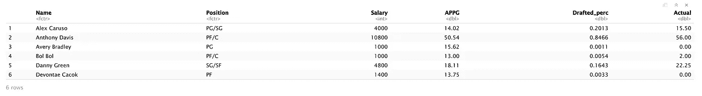
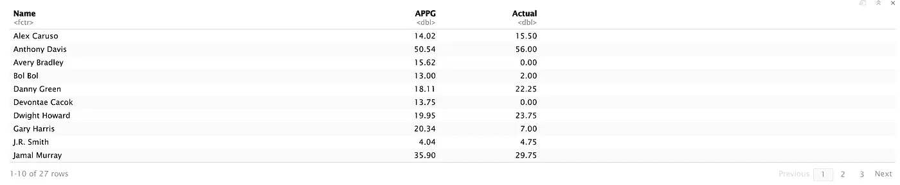
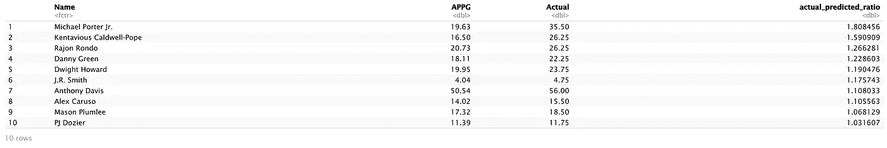
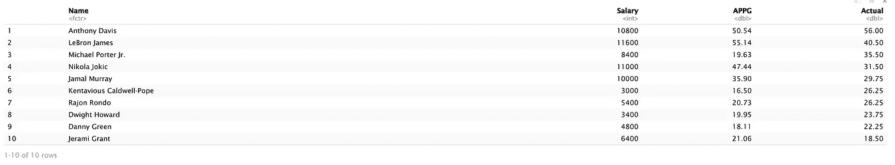
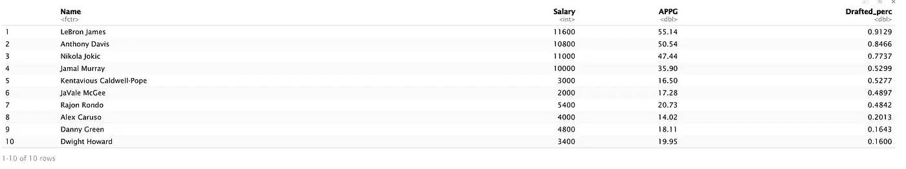
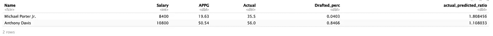
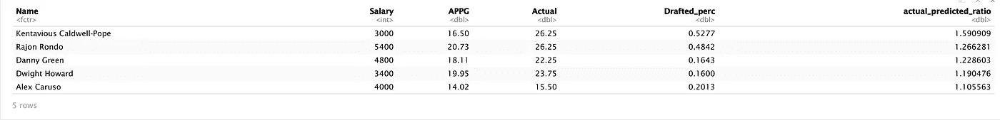

# 使用数据操作技巧优化选秀王 NBA 阵容

> 原文：<https://towardsdatascience.com/optimize-draftkings-nba-lineups-using-data-manipulation-skills-fdf47b2a27e5?source=collection_archive---------37----------------------->

## 编程；编排

## R 中数据操作的实用指南

***免责声明*** *本帖唯一目的是展示 R 中的数据操作技巧；它不应作为任何形式的投资建议或认可。投资伴随着风险！*


迪安·贝内特在 [Unsplash](https://unsplash.com/s/photos/nba?utm_source=unsplash&utm_medium=referral&utm_content=creditCopyText) 上的照片

终于，运动回来了！

[NBA](https://www.draftkings.com/r/bull_ye) 、 [NFL](https://www.draftkings.com/r/bull_ye) 、 [MLB](https://www.draftkings.com/r/bull_ye) 回来了！

所以像 [DraftKings](https://www.draftkings.com/r/bull_ye) 这样的在线博彩网站。一边看着你最喜欢的球员赢得比赛，一边和朋友一起存点钱，这才是正确的做法！

我的阵容策略是分析玩家最近的表现，挑一个手热的下注。然而，不可能只选择最热门的球员，像勒布朗詹姆斯，安东尼·戴维斯，尼古拉·约基奇等。，谁来工资高。作为一个限制， [DraftKings](https://www.draftkings.com/r/bull_ye) 有 5 万美元的工资帽。如果你选择了三名顶级球员，而让其他人都坐冷板凳，薪水不低，却没有上场时间，这不会是一个胜利的阵容策略。

为了找到手热工资合理的球员，我随手找到了 R 中的 ***dplyr*** 库。在这篇文章中，我们学习了一些数据分析和阵容建设的技巧。

> 学习编程的推荐方法是通过实践！
> 
> 有趣的编码方式就是从中赚几个钱！


照片由[埃德加·恰帕罗](https://unsplash.com/@echaparro?utm_source=unsplash&utm_medium=referral&utm_content=creditCopyText)在 [Unsplash](https://unsplash.com/s/photos/nba?utm_source=unsplash&utm_medium=referral&utm_content=creditCopyText) 上拍摄

让我们开始吧。我们将在分析 9 月 18 日洛杉矶湖人队对丹佛掘金队的比赛中球员的表现后，提出第二场比赛的阵容，并与 9 月 20 日的实际表现进行交叉检查。

## 数据集

有两个数据集:[***Basic _ Infor _ Game _ 1***](https://github.com/LeihuaYe/DraftKings_Data_Manipulation)和[***Actual _ point _ Game _ 1***](https://github.com/LeihuaYe/DraftKings_Data_Manipulation))。我强烈建议下载这两个数据集，并随着我们的继续复制代码。

```
#1 data preparation # load the dataset 1
Basic_Infor_Game_1 <- read.csv('Basic_Infor_Game_1.csv')# load the dataset 2
Actual_point_Game_1 <- read.csv('Actual_point_Game_1.csv')# merge the two datasets according to players' names
game_one_9.18 <- merge(Basic_Infor_Game_1,Actual_point_Game_1,by.x= 'Name', by.y ="Player")head(game_one_9.18)
```



**注意事项**

```
Name: players’ names Position: what position they playSalary: the salary assigned to the playerAPPG: average points per game Drafted_perc: the percentage of users drafted this playerActual: the actual points scored for Game 1
```

正如你在上面看到的，有太多我们不需要的还原剂变量。首先，我们只能选择关键变量。

```
#2 load the library: dplyr
library(dplyr)merged_9.18 %>% 
  select(Name, APPG, Actual)
```



好多了，干净多了！

球员越优秀，薪水越高，得分也越高。问题是如何对照他们的工资来评估他们的表现？换句话说，顶级球员提供的积分工资值和替补球员一样吗？

为了回答这些问题，我们创建一个名为***Actual _ predicted _ ratio***的新变量，通过实际得分(*实际得分)和预测得分(*)的平均值之间的除法来计算。这个比率是一个很好的指标，表明球员的表现或与平均表现的偏差。**

**以降序方式重新排列结果，仅显示前 10 个案例。**

```
**merged_9.18 %>% 
  select(Name, APPG, Actual) %>% 
  mutate(actual_predicted_ratio = Actual/APPG) %>%
  arrange(desc(actual_predicted_ratio)) %>% 
  head(10)**
```

****

**最后一列 ***实际 _ 预测 _ 比率*** ，按降序排列。在上面，迈克尔·波特是得分率最高的球员，为 1.808456，这意味着 MP 的得分几乎是他场均得分的 1.8 倍。**

**太棒了。**

**肯塔维奥斯·卡德维尔·波普和拉简·朗多分别位居第二和第三。**

**然而，这不是超级有用的，因为 [DraftKings](https://www.draftkings.com/r/bull_ye) 只允许 6 个玩家玩他们的 showtime 游戏。如果我们根据实际预测的比例来选择前 6 名球员，我们将无法选择像安东尼·戴维斯和詹姆斯这样的球员。**

**我们根据分数对玩家进行排名，选出第一场比赛的前 10 名。**

```
**## Top 10 players who scored the most
top_10_scored_players <- game_one_9.18 %>% 
  select(Name,Salary, APPG, Actual) %>% 
  arrange(desc(Actual)) %>% 
  head(10)
top_10_scored_players**
```

****

**安东尼·戴维斯和勒布朗詹姆斯高居榜首！**

**同样的，我也在想谁是选秀最多的球员。**

```
**## Top 10 most drafted players
game_one_9.18 %>% 
  select(Name,Salary, APPG, Drafted_perc) %>% 
  arrange(desc(Drafted_perc)) %>% 
  head(10)**
```

****

**雄心勃勃的球员薪水更高，这限制了我们阵容中顶级球员的数量。所以，我们可以使用 ***过滤器*** 选择各个薪资区间的球员。**

**我把顶级玩家定义为那些薪水在 8000 美元或以上，但仍超出预期的人。**

```
**## Top players with high salary cap (>=8k) and still beat expectation game_one_9.18 %>% 
  select(Name,Salary, APPG, Actual, Drafted_perc) %>% 
  mutate(actual_predicted_ratio = Actual/APPG) %>% 
  filter(actual_predicted_ratio>=1 & Salary>=8000) %>% 
  arrange(desc(actual_predicted_ratio))**
```

****

**只有迈克尔波特和安东尼·戴维斯在第一场比赛中有这样的表现。特别是，戴维斯有 10800 美元的高薪，仍然能够以超过平均得分 1.1 倍的成绩超出预期。这显示了他的出色表现，使他成为一个明确的选择。**

**尽管波特有显著的优异表现，但他在最后一节用大量的垃圾时间得到了他的大部分得分。数据告诉你，如果比赛很紧张，他可能是一个可疑的选择。**

**对于我们的价值型打法，让我们看看$3，000 到$8，000 范围内的玩家。**

```
**## Good value players (3k-8k) and still beat expectationgame_one_9.18 %>% 
  select(Name,Salary, APPG, Actual, Drafted_perc) %>% 
  mutate(actual_predicted_ratio = Actual/APPG) %>%# new variable: actual_predicted_ratio
  filter(actual_predicted_ratio>=1 & Salary>=3000 & Salary<8000) %>% 
  arrange(desc(actual_predicted_ratio))**
```

****

**这五名球员有很好的价值，我们可能会考虑在第二场比赛中再次选中他们。**

## **阵容建设**

**核心球员:安东尼·戴维斯→勒布朗詹姆斯→尼古拉·约基奇→贾马尔·穆雷**

**价值球员:肯塔维奥斯·卡德维尔·波普→拉简·朗多→丹尼·格伦→德怀特-霍华德→阿莱克斯-卡鲁索**

**我会包括两个核心球员(戴维斯是我的最爱)和两个或三个价值球员，最后一个位置来自其他廉价球员。**

**NBA 季后赛竞争激烈，球员往往会在一场比赛和另一场比赛之间波动。不确定是不可避免的。我的应对策略是通过混合和匹配核心与价值参与者来整合不确定性和风险。**

**事实证明，这些玩家在第二场比赛中获胜。**

**(我保证在写这篇文章的时候，我没有挑选任何提到他们在第二场比赛中表现的球员)。**

*****免责声明*** *本帖唯一目的是展示 R 中的数据操作技巧；它不应作为任何形式的投资建议或认可。投资伴随着风险！***

# **喜欢读这本书吗？**

> **请在 [LinkedIn](https://www.linkedin.com/in/leihuaye/) 和 [Youtube](https://www.youtube.com/channel/UCBBu2nqs6iZPyNSgMjXUGPg) 上找到我。**
> 
> **还有，看看我其他关于人工智能和机器学习的帖子。**