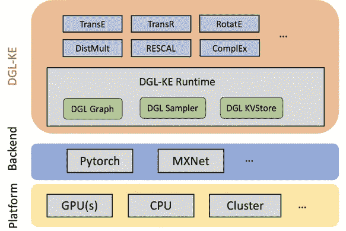
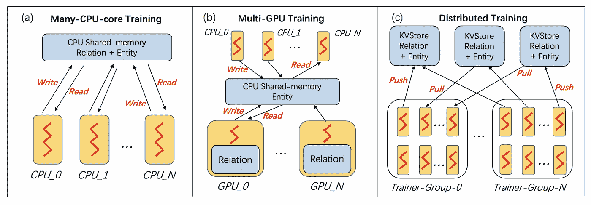
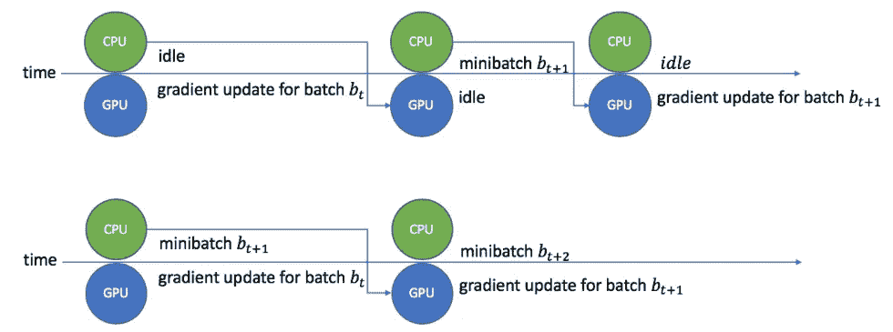

# 用 DGL-柯优化知识图嵌入

> 原文：<https://towardsdatascience.com/optimize-knowledge-graph-embeddings-with-dgl-ke-1fff4ab275f2?source=collection_archive---------48----------------------->

## 了解软件优化，以加速知识图嵌入的训练，并在几分钟内训练你的第一个模型与 DGL 柯

作者:Cyrus Vahid，首席解决方案工程师，郑达，乔治·卡里皮斯和巴拉吉·卡马科蒂:AWS AI

# 介绍

在我们的[上一篇](https://medium.com/@bkamakot/introduction-to-knowledge-graph-embedding-with-dgl-ke-77ace6fb60ef)文章中，我们介绍了知识图嵌入(KGEs)的概念，以及在 DGL-柯中用来生成它们的两个流行模型。这篇博客概述了 DGL-克如何加速 KGE 的训练。我们还分享了一个读者可以在本地机器上运行的例子。

# 什么是 DGL 柯

综上所述，[DGL-克](https://github.com/awslabs/dgl-ke)是一个高性能，易于使用，可扩展的工具包，用于从大型图中生成知识图嵌入。它建立在[深度图形库](https://www.dgl.ai/) (DGL)，一个实现图形神经网络(GNN)的开源库之上。



如上图所示，[DGL-克](https://github.com/awslabs/dgl-ke)实现了一些最流行的知识嵌入模型，如 TransE、TransR、RotateE、DistMulti、RESCAL 和 ComplEx。

# 挑战

尽管有多种模型可用于生成嵌入，但是训练这些嵌入对于大型图来说要么是耗时的，要么是不可行的，原因有两个:

*   **大小**:很多知识图有几百万个节点，几十亿条边，几万个关系。这种规模的图的训练嵌入需要的计算资源远远超过任何单个机器的能力。因此，计算必须分布在不同的设备上。这尤其困难，因为这些设备需要平衡工作负载并减少数据移动开销。
*   **稀疏度**:知识图通常有很多缺失的边，一些关系很少被观察到。这使得很难训练涉及少数关系的实体的嵌入和不经常观察的关系的嵌入。

本博客的其余部分将探讨 DGL-柯为应对这些挑战而实施的这些优化。但是在我们探索这些优化之前，让我们回顾一下训练 KGEs 所需的硬件基础设施。

# 硬件要求

在大型图上训练 KGEs 需要大量的硬件资源，比如多核 CPU 机器、多 GPU 机器和机器集群。目前支持的三种主要配置是:

*   单个共享内存多核机器( ***多核*** )，其中同一机器上的几个核心用于训练。
*   具有多个 GPU(***多 GPU*** )的单个共享内存多核机器，其中使用同一机器上的多个 GPU。
*   一个多核机器集群( ***分布式*** )，其中多个共享内存多核机器 CPU 机器用于训练一个嵌入。

[DGL-科](https://github.com/awslabs/dgl-ke)为所有这些硬件配置提供统一的软件优化，以高效地培训 KGE。

# KGE 培训概述

对于所有的硬件配置，训练过程从分割 KG 的预处理步骤开始，然后是小批量训练。您可以使用此[资源](https://machinelearningmastery.com/gentle-introduction-mini-batch-gradient-descent-configure-batch-size/)了解更多关于小批量训练的信息。分割步骤将 KG 中不相交的三元组集分配给设备。小批量训练执行以下步骤:

*   从属于某个进程的本地分区中采样三元组以形成小批量，并为正三元组构造负样本。
*   从全局实体和关系嵌入张量中获取小批量中涉及的实体和关系嵌入。
*   对上一步提取的嵌入执行前向和后向传播，以计算嵌入的梯度。
*   应用梯度来更新小批量中涉及的嵌入。该步骤需要应用优化算法来调整梯度，并将梯度写回全局实体和关系嵌入张量。

[DGL-克](https://github.com/awslabs/dgl-ke)对每一步都进行了优化，以加速训练。

# 优化数据分布

在训练过程中，每个设备上的小批量计算需要访问与 KG 相关联的数据——实体和关系嵌入。将这些数据放在正确的位置，并协调其访问和更新对 DGL-柯的性能至关重要。

*   在多核系统中，实体和关系嵌入驻留在系统的共享内存中。所有流程都可以有效地访问它来生成小批量，读取嵌入内容，并更新它们。
*   在多 GPU 系统的情况下，由于实体嵌入太大而不适合 GPU 内存，因此它们与知识图一起保存在多核系统的共享内存中。然而，为了减少数据传输，关系嵌入被存储在 GPU 存储器上。GPU 进程从多核系统的共享内存中读取和更新小批量中涉及的实体嵌入。
*   分布式系统上的培训是不同的，因为我们需要分割数据并最大化每台机器的数据局部性。DGL-凯通过使用最小割图分割算法来实现这一点，以平衡负载和最小化通信的方式在机器之间分割知识图。此外，它使用每台机器的 KV-store 服务器来存储对应于分配给它的节点的实体的嵌入。然后，训练器进程使用*推*和*拉* API 来获取嵌入数据并将更新(渐变)发回。

下图以图形方式说明了这些数据分布的执行情况。



# 负采样

[DGL-柯](https://github.com/awslabs/dgl-ke)为每个三联体构建了大量的负样本。总是使用系统 CPU 执行采样。如果负样本是独立构造的，将导致跨硬件访问大量实体。为了减少数据通信，我们对一批中的边的负边进行联合采样，使得一批中被访问的实体的数量不会由于负采样而急剧增加。
由于度数较高的节点需要更多的数据来发现更多的模式，我们执行与节点度数成比例的负采样。这导致产生*硬*阴性样本。这些硬阴性样品通常会提高 KG 包埋的质量。

# 分割关系

KG 中的实际关系相对于批量大小的比率越大(≈1000≈1000)，关系嵌入越稀疏。[DGL-克](https://github.com/awslabs/dgl-ke)采用稀疏关系嵌入读取和更新来提高通信效率。在多 GPU 训练中，[DGL-克](https://github.com/awslabs/dgl-ke)将关系进行分组，将一个组分配给一个 GPU，以减少 CPU 和 GPU 之间的数据通信。

# 渐变更新

[DGL-克](https://github.com/awslabs/dgl-ke)使用 CPU 对小批量进行采样，并加载实体嵌入，然后将其发送到 GPU 进行梯度计算。一旦 GPU 完成了嵌入梯度的计算，它会将它们发送到 CPU 以更新相应的嵌入。这意味着，如果一个进程串行运行，GPU 必须等待 CPU 创建一个小批量，并向嵌入中写入梯度。为了防止 GPU 闲置，[DGL-柯](https://github.com/awslabs/dgl-ke)将 CPU 中的小批量创建和梯度更新与 GPU 中的小批量计算重叠。

由于关系划分，[DGL-克](https://github.com/awslabs/dgl-ke)将关系嵌入保存在 GPU 中，并与 CPU 中的实体嵌入分开更新。更新实体嵌入被卸载到每个训练者的专用过程。这种优化在 [Freebase 数据集](https://www.microsoft.com/en-us/download/details.aspx?id=52312)上为许多 KGE 模型提供了 40%的加速。



# 训练你的第一个知识图嵌入

# 安装 DGL-科

如果您的机器上安装了 [conda](https://docs.conda.io/en/latest/) ，使用以下命令创建一个环境:

```
:~$conda create -n dgl_pytorch python==3.8:~$conda activate dgl_pytorch(dgl_pytorch)…:~$
```

在机器上安装合适版本的 [PyTorch](https://pytorch.org/) 。如果您使用的是 Mac，您可以使用

```
(dgl_pytorch)…:~$conda install PyTorch torchvision -c PyTorch
```

我用的是 Ubuntu 机器，配有 4 个 GPU 和 CUDA 10.0，所以我运行的是:

```
(dgl_pytorch)…:~$conda install PyTorch torchvision cudatoolkit=10 -c PyTorch`
```

测试您的安装

```
(dgl_pytorch)…:~$python — version` #should output Python 3.8.0(dgl_pytorch)…:~$python>>>import torchtorch.__version__ #outputs the version number of PyTorch you have installed. Mine is ‘1.5.0’>>>quit()
```

安装 [DGL](https://www.dgl.ai/pages/start.html) 和 [DGL 克](https://github.com/awslabs/dgl-ke):

```
(dgl_pytorch)…:~$pip install dgl dglke
```

测试您的安装

```
(dgl_pytorch)…:~$python>>> import dgl>>> import dglke>>> dgl.__version__, dglke.__version__ #It should output versions of dgl and dglke respectively. Mine is: (‘0.4.3post2’, ‘0.1.0’)>>>quit()
```

# 让我们做一个快速测试

```
# create a new workspace(dgl_pytorch)…:~$mkdir my_task && cd my_task# Train transE model on FB15k dataset(dgl_pytorch)…my_task:~$DGLBACKEND=pytorch(dgl_pytorch)…my_task:~$dglke_train — model_name TransE_l2 — dataset FB15k — batch_size 1000 \ — neg_sample_size 200 — hidden_dim 400 — gamma 19.9 — lr 0.25 — max_step 500 — log_interval 100 \ — batch_size_eval 16 -adv — regularization_coef 1.00E-09 — test — num_thread 1 — num_proc 8 — — — — — — — Test result — — — — — — — Test average MRR : 0.47339627234644155Test average MR : 58.33693352067851Test average HITS@1 : 0.2806791826784717Test average HITS@3 : 0.6246889336561088Test average HITS@10 : 0.7729342655448528 — — — — — — — — — — — — — — — — — — — — -
```

# 刚刚发生了什么？

首先，我们将 [DGL](https://www.dgl.ai/pages/start.html) 的后端设置为 [PyTorch](https://pytorch.org/) 。然后，我们使用 dglke-train 创建了一个训练任务。这个训练任务使用带 L2 损耗的 TransE，下载 FB15k 数据集。然后，我们指示模型构建 k=200k=200 个负样本，其中γ=400 用于嵌入维度，1000 用于小批量大小(batch_size 1000)，batch_size_eval=16 作为用于测试的超参数。

# 下一步是什么？

了解更多关于[DGL-柯](https://github.com/awslabs/dgl-ke)和 [DGL](https://www.dgl.ai/) 的信息，并继续关注更多的例子。