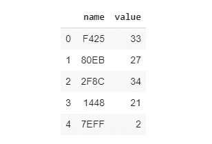
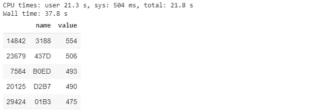
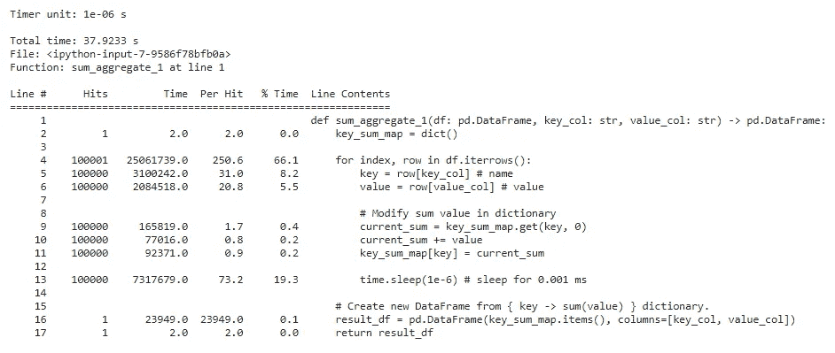
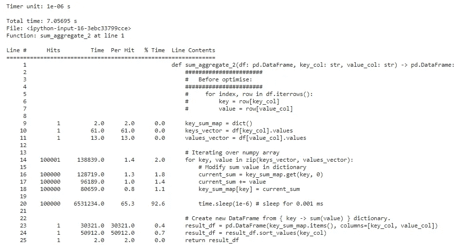

# 在 Jupyter 笔记本中优化 Python 代码

> 原文：<https://towardsdatascience.com/optimize-python-code-in-jupyter-notebook-9df92832a23e?source=collection_archive---------11----------------------->

## 无聊地等待缓慢的 Python 作业完成？让我们找到瓶颈并优化它。


由 [PIRO4D](https://pixabay.com/users/piro4d-2707530/?tab=videos) 在 [Pixabay](https://pixabay.com/videos/time-moondial-time-machine-6358/) 上制作的视频

想在 Jupyter 笔记本里让一个慢的 Python 代码变快？以 sum aggregate 为例，我们将使用`%%time`测量运行时间，并使用`%lprun`行分析器找到瓶颈。

# 要优化的函数:Sum 聚合



假设 Pandas 没有 group-by 和 aggregate 函数，我们需要自己实现它。我们希望**按名称聚合上表，并计算值**的总和。

也许，在我们的第一次迭代中，我们会产生如下代码。我们在字典的帮助下汇总该值(命名为⇨值)。通过迭代每一行，我们更新了字典的值。在迭代结束时，我们将字典转换回 Pandas 的数据框架。

在我们优化代码之前，我们需要问:“我们真的需要优化代码吗？为什么？”如果我们花更多的时间来优化，而不是多等一会儿来完成工作，这是不值得的，不是吗？

> "过早优化是万恶之源."—姜懿翔·克努特

现在，让我们假设 sum aggregate 代码太慢，我们需要优化它。我们如何做到这一点？

# 原则 1:我们不能改进我们不能测量的东西

> “如果你不能衡量它，你就不能改善它。”—彼得·德鲁克

我们需要测量代码运行时间的能力来比较优化前后。我们有可能让事情变得更糟，特别是如果我们使用像 Numpy 和 Pandas 这样的外部库。我们不知道这个库是如何实现的。

前缀为`%%`的代码是 IPython cell magic-function。我们可以通过向单元添加`%%time`来测量单元的运行时间。我们不需要为此安装任何新的库。我们只需要导入`time`，它是 Python 标准库的一部分。

```
**%%time** sum_aggregate_1(df, 'name', 'value').sort_values('value', ascending=False).head()
```



*sum_aggregate_1* 的运行时间

实测运行时间约为 38 s，现在我们需要优化哪个部分？如果是我在猜，我会选择优化`time.sleep()`部分。似乎显而易见。基于直觉的优化可能最终没有显著的改进，只是浪费时间。我们需要找到瓶颈。

# 原则 2:优化瓶颈

> "除了瓶颈之外，任何地方的改进都是一种幻觉."—吉恩·金

优化不是瓶颈的代码部分不会显著减少总运行时间。这就是为什么吉恩·金说，改进只是一种错觉，毫无用处。怎么才能找到瓶颈？

我们可以使用`line-profiler`库来获得每一行的执行时间。我们需要安装`line-profiler`。之后，我们需要用`%load_ext`导入魔法功能。

```
! pip install line-profiler
%load_ext line_profiler
```

我们需要向线路分析器提供`function to profile`和`execution trigger`参数。在我们的例子中，我们想要分析的函数是`sum_aggregate_1`，我们用`sum_aggregate_1(random_df, 'name', 'value)`触发执行。

```
# %lprun -f [function to profile] [execution trigger]
# [function to profile]: sum_aggregate_1
# [execution trigger]: sum_aggregate_1(random_df, 'name', 'value')%lprun -f sum_aggregate_1 sum_aggregate_1(random_df, 'name', 'value')
```



从结果中，我们可以看到该函数的主要瓶颈在第 4 行。现在，我们知道`DataFrame.iterrows()`对于迭代来说非常慢。它花费了 66%的执行时间。

在我们发现瓶颈之后，我们可以继续优化代码。我们可以简单地从搜索引擎中找到`DataFrame.iterrows()`的替代品。

一种替代方法是将键和值列作为 Numpy 数组。之后，压缩两个 Numpy 数组并遍历它。我们可以观察到瓶颈现在正从迭代部分转移到`time.sleep()`部分。总运行时间从 38 秒减少到 7 秒



**通过反复寻找和优化瓶颈，我们首先进行最有效的优化。**这就像使用“贪婪算法”的思维模式来确定优化的优先级。当代码运行时足够快时，我们可以停止优化，尽管做进一步的优化很诱人。

# 最后一个音符

进行优化时，需要记住三件非常重要的事情:

1.  **在真正需要的时候进行优化** 如果代码不值得你花时间去优化，那就不要去优化，因为这样做不但不会使代码变得更快，反而有可能引入新的 bug。
2.  **我们无法改进我们无法衡量的东西** 首先，我们必须选择我们想要优化的指标。之后，我们需要找到如何衡量它。目前，我们试图优化运行时间。在其他情况下，我们也可以选择优化内存使用。
3.  **优化瓶颈
    我们可以使用`line-profiler`库来找到瓶颈。**

你可以从我的 [Google Colab 笔记本](https://colab.research.google.com/drive/1QREeU5FIsS2GIgRJJCz2QSGZG892LIR6)中获取并运行上面的所有代码。从笔记本中，你可以看到我们如何分析一个类方法的例子。有一个例子可以说明如何分析触发函数调用的另一个函数。

感谢阅读。希望这能帮助你在代码太慢的时候优化代码。如果您有任何建议或反馈，请留下评论或留言。