# 使用数据驱动策略优化贷款组合

> 原文：<https://towardsdatascience.com/optimizing-a-loan-portfolio-using-a-data-driven-strategy-92e46b790bf0?source=collection_archive---------21----------------------->

## 金融分析师可以基于以数据为中心的策略和定量算法优化贷款组合吗？

作者:[诺亚·穆赫塔尔](https://medium.com/u/a8e04b919cc4?source=post_page-----92e46b790bf0--------------------------------)，[沙恩·科利](https://medium.com/u/e55b21466f10?source=post_page-----92e46b790bf0--------------------------------)，[沙赫尔·亚尔·贾汉吉尔](https://medium.com/u/2da14ee8aec5?source=post_page-----92e46b790bf0--------------------------------)和[拉米·哈曼](https://medium.com/u/8a2493e3033c?source=post_page-----92e46b790bf0--------------------------------)

(负空格，像素 2020)

(期待最好的，Pexels 2020)

# 银行害怕 P2P 借贷吗？

虽然传统上银行是贷款的主要提供者，但小企业的需求正在发生变化，现在有了更多的顾虑。

2020 年带来了运营成本的飙升和需求波动的加剧。

这些是中小企业在融资时面临的一些极端挑战，而融资是它们增长的一个关键因素。银行经常忽略这些，结果，**这为 P2P 借贷市场的发展打开了大门。**

这就是为什么我们要为 P2P 贷款公司 Prosper market place 创建一个**数据驱动的投资策略，该策略将从处理原始数据到推断业务结果进行全面概述。**

总的来说，我们的预测模型将作为**规定工具**，直接描述对投资者&业务的影响。

# 投资者决策

**投资者需要两个基本步骤来更好地了解投资哪笔贷款:**

1.  Prosper 的投资者将不得不决定投资多少资金(考虑潜在回报)并分配给其他投资选项。
2.  Prosper 的投资者将需要决定选择“好”贷款(即:最终将完全还清的贷款)进行投资，这是我们的贷款分类模型将关注的重点。

然而，重要的是要注意，没有一个理想的投资，因为它在很大程度上取决于投资者的风险偏好。

# 资料组

> 使用注册的 **Prosper** 帐户，可在线下载本次分析中使用的数据集。

## **预测器**

该数据集包含每年公布的所有贷款的综合信息和一组涵盖单笔贷款不同属性的 22 个变量。

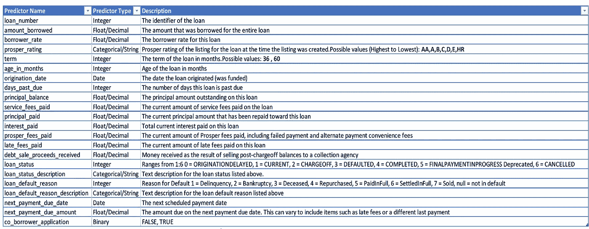

Prosper 数据集描述(22 个变量)

这些信息包括但不限于**贷款金额、支付的利息&费用金额、贷款期限、Prosper 信用评级得分以及贷款状态**及原因(如果已完成或违约)。

## 已完成贷款与违约贷款:0s 与 1s

在 Prosper 的数据中，贷款有 4 种结果:

1.  已完成(A)
2.  注销(B)
3.  电流(摄氏度)
4.  默认(D)

为了简化我们的 Prosper 数据分析，我们决定将值 **0 分配给已完成的贷款(A)** ，将值 **1 分配给剩余的 3 种贷款状态** **(B，C，& D)** ，它们指的是尚未完成的贷款。

## 我们如何识别“好”的贷款？

为了获得识别良好贷款的直觉，认识到所有变量之间的相关性和相互作用是很重要的。

然而，良好贷款的**定义**仍然相当模糊，因此预测应该基于这些目标之一是至关重要的:贷款是否会违约，提前偿还，违约时间，或者如果提前偿还，偿还所需的时间。

# **数据探索**

## 分析贷款条款

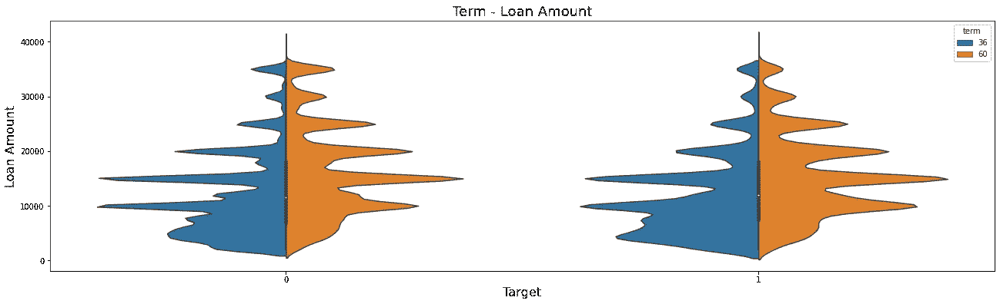

每种贷款的每期贷款金额的小提琴图

该图显示了 60 个月期限(更长的期限)的一些有趣的见解，例如完成贷款和未完成贷款的最高贷款金额约为 15，000 美元。不出所料，借款人倾向于接受更高的贷款额来偿还长期贷款。

而 36 个月期限(较短期限)的贷款往往金额小得多，而且更一致地分布在已完成和未完成贷款中。

## 分析每个贷款状态的利率分布

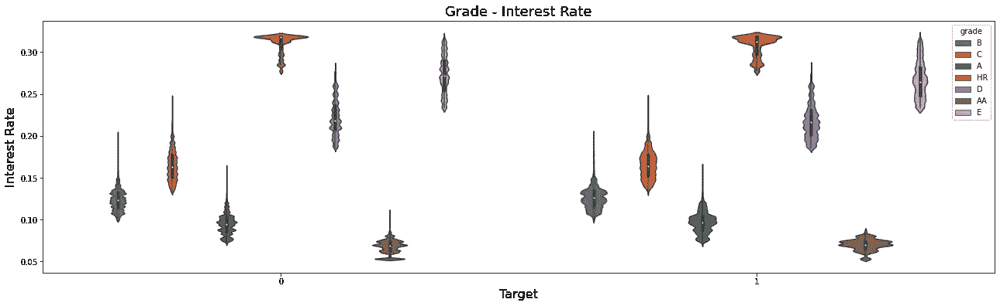

*每个等级每个贷款状态的利率小提琴图*

构建了另一个小提琴图，显示了每个等级类型的每种贷款状态的不同利率水平(范围从 AA-HR:最高等级到最低等级)。

已完成(0)和未完成(1)的较高等级贷款的利率较低，这种趋势对于两种贷款状态都是一致的。

## 数据泄露

当使用在未来预测时不可用的预测器构建模型时，会出现这种现象。因此，我们需要忽略这些预测因素，以防止我们的模型出现偏差。

**关于如何识别泄漏，主要有两种情况:**

1.与目标变量高度相关的预测值。我们将使用所有 22 个预测因子的热图或相关矩阵来检验这一点。

2.在总回报预测期间，预测器信息不可用，例如，late _ fees _ paid 变量。

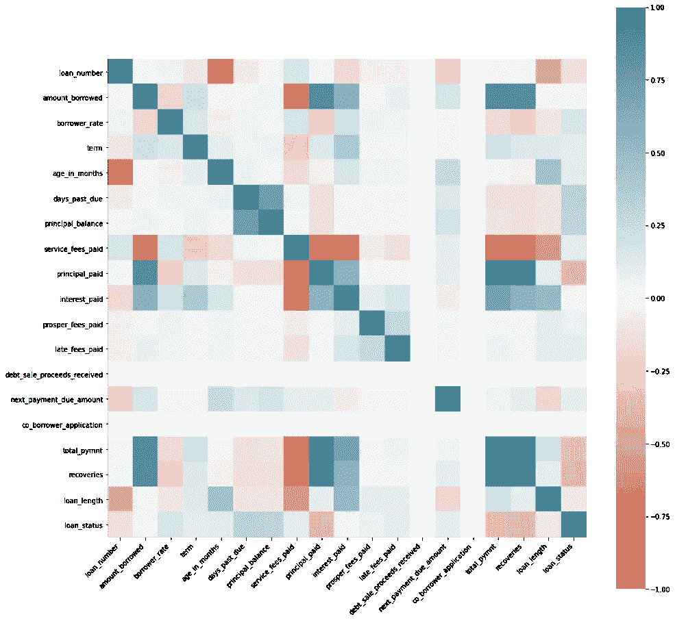

相关热图

不出所料，我们注意到与数据泄露相关的变量，如支付的利息和支付的本金，与贷款状态有很高的相关性。

**基于这种泄漏的定义以及在预测贷款是否会违约时大多数泄漏都不可用的事实，我们忽略以下预测因素:**

> 贷款数量、逾期费用、账龄、逾期天数、发起日期、本金余额、已付本金、已付利息、逾期费用、已收债务、销售收入、贷款违约原因、贷款违约原因、描述、下一次付款到期日期、下一次付款到期金额、共同借款人申请

## **投资者回报的计算**

确定给定贷款的潜在回报所需的最重要数据是每笔贷款收到的总付款的**计算**。

为了建立一个有效的投资策略，我们需要在每笔贷款的回报金额上建立一个强有力的指标变量。**至关重要的是** **回报应考虑部分偿还的违约贷款和在到期日之前已经偿还的贷款**。

## **一般来说，使用以下变量可以创建三种有效的回报标准:**

1.由变量 **p** 表示的总支付账户

2.用变量 **f** 表示的**(借款人借入的金额)**贷款的总投资额

3.以月为单位的贷款名义期限(**贷款期限**)，以变量 **t** 表示

4.用变量 **m** 表示的贷款的实际月长度(**贷款长度**

# 我们的三大投资策略

我们将通过 3 种不同策略下的场景测试来计算预期收益:

## **1)悲观(M1)**

悲观的方法指出，当贷款偿还后，投资者仍然不能再投资，直到贷款期限到期。

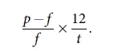

悲观逼近公式

使用等式 1，我们的团队能够创建一个新变量，称为:“ **ret_PESS** ”。

值得注意的是，这种方法有利于长期贷款，因为损失在更大范围内蔓延，贷款会提前违约。

## **2)乐观(M2)**

乐观的方法是，一旦偿还了贷款，投资者的钱也就回来了，投资者可以立即投资于另一笔同样回报的贷款。

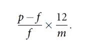

乐观接近公式

使用等式 2，我们的团队能够创建一个名为:" **ret_OPT** "的新变量。

这种方法可以重新表述为贷款在有效期间的年月度回报。然而，它受到一种假设的困扰，即资金可以以相同的利率进行再投资，如果贷款提前违约，损失可能是对负回报的严重高估。从好的方面来看，使用这种方法，短期和长期贷款得到了同等对待。

## **3)固定地平线(M3)**

固定期限方法包括计算 3 种不同利率的固定时间回报:1%，3%和 6 %。

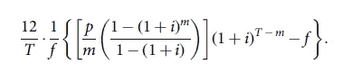

固定水平接近公式

构建了一个名为 **ret_method_3()** 的函数来复制等式 3，并计算数据集中每笔贷款的 3 个新变量。

**通过平衡贷款期限和违约贷款之间的差异，这种方法可能是最准确的。**然而，它倾向于忽略货币随时间的贬值价值。

## **繁荣等级(等级)明细**

对 prosper 信用评级(“等级”)变量进行了更深入的研究，以探索每种回报类型(M1-M3)的任何重大趋势。

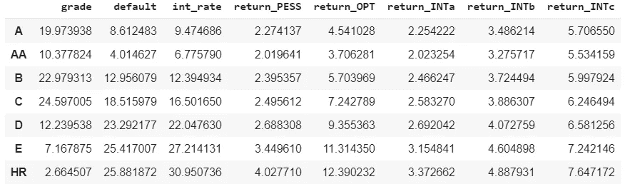

Prosper 等级汇总统计

等级越高，违约比例越小，利率也越低。

平均回报率%非常一致，不同等级的回报率略有上升。此外，任何级别都没有负的平均回报值。

# **解决平衡数据集选项**

对每种类型的贷款状态数量进行快速计数显示，与未完成贷款相比，已完成贷款的数量明显更高，这表明数据集中的类别不平衡。

因此，最有可能的选择是尝试重新平衡数据集，使其包含 50%的已完成贷款和 50%的未完成贷款。然而，这样做可能被证明是有害的，并导致平均回报为负，完全违背了吸引潜在投资者签约繁荣的目的。

因此，为了捕捉真实的趋势和真实的比例，对数据集进行物理平衡会妨碍对分析的实际理解。

相反，将在模型构建阶段使用校准曲线测量来检查构建的模型是否因数据不平衡而有偏差。

# **预测模型分析**

## **预测建模将包括两个阶段的方法:**

首先，我们将构建一个二元分类模型，使用各种行业标准算法预测贷款违约概率，并评估最佳和最准确模型的性能。

第二阶段涉及使用各种行业标准回归器构建回归模型，以预测每种回报方法(M1-M3)下贷款可能为投资者产生的回报金额。

两个阶段的模型都将通过交叉验证的超参数调整进行优化，以获得更高的精度。

## *第一阶段:贷款结果分类*

第一个模型是确定贷款的**等级**和**利率**的预测能力，这通常是行业的标准做法。

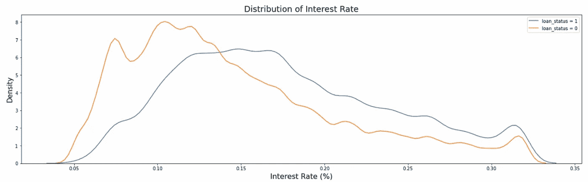

蓝色:违约贷款|红色:已完成贷款[利率]

> **预测指标:** **等级&利率**
> 
> **1 号模型—准确率:85%**

这意味着这两个特征单独有助于成功地确定贷款状态，就像使用所有的预测指标一样。

然而，为了建立一个更健壮的模型并避免欠拟合，我们必须完全放弃这两个特性。

> **预测指标:所有不包括等级&利率**
> 
> **2 号模型——准确度分数:~85%**

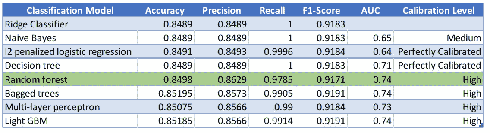

分类模型比较

使用除了等级和利率之外的所有预测因子，模型的精确度达到了大约 85%。虽然朴素贝叶斯提供了非常高的准确性，但它无法解释由于数据不平衡而出现的偏差。

所有上述模型的校准曲线和 AUC 分数都很高，表明性能强劲。校准代码显示了一种衡量模型是否受不平衡影响的方法。如果校准是完美的，这意味着模型不会因不平衡的数据集而产生偏差。换句话说，它不会总是试图预测结果是绝大多数，这是已完成贷款 **(0)** 的情况。

由于随机森林是最佳选择模型，我们决定探索同类最佳的树算法，也称为微软开发的**轻型 GBM 分类器**。它被认为是最新的行业趋势和多个 Kaggle 竞赛的获胜者，所以我们很好奇它在 Prosper 案例中的表现如何。正如假设的那样，对于轻型 GBM 分类器，所有的模型度量都非常高。

## 特征重要性

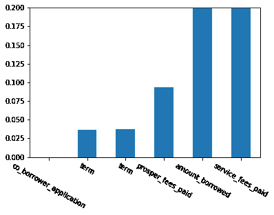

随机森林特征重要性

大多数模型的特征重要性图也是在分类阶段生成的。

我们的模型确定“已付服务费”、“已付推荐费”和“借款金额”是预测我们的目标变量“贷款状态”最有用的，这与投资直觉非常匹配。

## 学习曲线

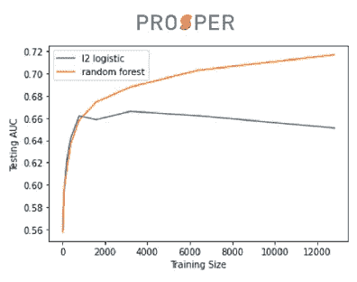

当与样本 L2 逻辑回归模型比较时，还绘制了学习曲线以评估最佳随机森林模型的学习率。

当训练规模以 25 个数据点的间隔增加直到非常大的数量时，随机森林模型 AUC 增加，这意味着该模型将继续学习，并相对于逻辑模型给出更高百分比的准确回报预测。

## *第二阶段:预测预期收益*

使用不同的功能集测试了各种模型。计算了不同回归方法下各种回归模型的 R2 值。

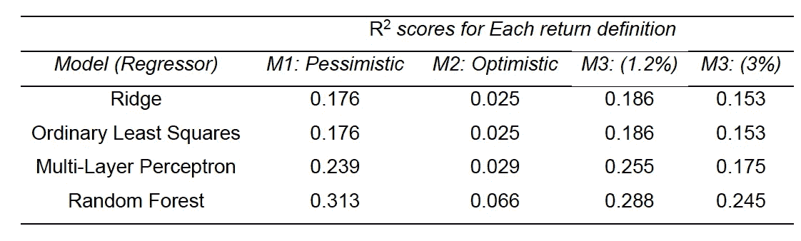

*Prosper 回归模型比较*

与建立的其他模型相比，随机森林回归给出了所有不同类型回报的最高分。

**投资策略**

通过利用分类和回归模型来预测贷款是否会违约和估计回报，可以制定投资策略，以基于用于计算回报的不同方法来最大化投资者的平均回报。

**测试了四种不同的投资策略:**

1.  随机策略
2.  基于默认值
3.  基于简单返回
4.  基于违约和回报的策略。

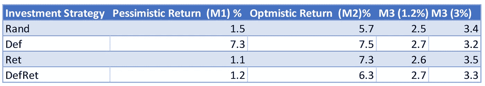

【Prosper 的投资策略回报率

为了描述现实生活中的情景，M3 回报法似乎是一种更准确的衡量%回报的方法。因此，我们比较不同投资策略的基准是 M3 方法。尽管如此，在研究 M3 回报方法时，无论使用哪种投资策略，回报似乎都非常接近。

%回报率的大小也高度依赖于再投资利率(M3)。

## **投资组合规模的敏感性测试**

接下来，对投资组合规模与投资回报百分比进行了敏感性测试

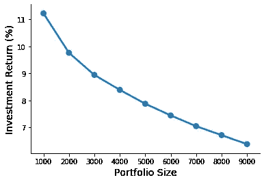

*Prosper 敏感性分析图*

随着潜在投资者投资的贷款数量增加，投资回报的百分比下降。**这也很直观，因为贷款违约的风险系数会随着投资的贷款数量增加而增加**。

换句话说，**投资者可能有类似的机会获得高回报，然后由于贷款违约而失去大部分回报，这种循环会不断重复，导致总回报百分比随着投资贷款数量的增加而下降。**

# **优化**

在本节中，我们使用 Prosper 实现了三种不同的优化模型来改进投资策略。

## **三种不同的优化方法是:**

## 1)直接最大化总利润

在我们的数据集中，为每笔贷款都设置了一个二元变量。添加贷款数量约束(根据我们数据集中的最大贷款数量)并定义目标函数(最大化总利润)。

## 2)在预算约束下实现利润最大化

第二个优化模型考虑了潜在投资者的预算约束。与第一个模型一样，添加了一个新的预算限制约束(测试不同的预算)，优化问题得到了解决。

## 3)通过风险回报权衡实现利润最大化

第三个优化策略包括通过考虑收益的方差来纳入投资组合风险因素。

为了实现这一点，首先，投资者用可调整的 k 参数训练聚类模型。其次，计算每个聚类的标准偏差。第三，可以根据每个聚类的欧几里德距离将每笔贷款分配给特定的聚类。第四，每笔贷款的回报率的标准差可以使用聚类的标准差来估计。

然后建立模型，在包含风险收益权衡约束的情况下使利润最大化。投资者可以设置敏感度/惩罚因子，以说明投资者的风险承受能力。

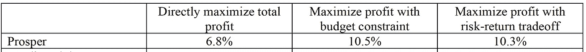

*三种不同场景下投资回报的优化*

**结果显示，Prosper 的最优投资策略是利用预算约束实现利润最大化，预期回报率为 10.5%。**

# 结论

总之，我们看到了来自不同属性的信息如何被用来创建新的预测因子，这些预测因子最终可能会提高我们的模型相对于原始模型的统计显著性。需要注意的是，模型在将数据划分为交叉验证折叠时的表现可能会产生误导，因此多次运行我们的模型以开发训练/测试分割的不同迭代是至关重要的。另一个重要的部分是校准，以及如何测量模型产生的概率是否正确。

# **未来扩展**

如果我们的模型与宏观经济外部数据(代表潜在经济当时的表现，如油价或世界银行的利率)挂钩，以进一步扩展悲观指标的表现，那么看看我们的模型会有什么表现将是很有趣的。

此外，对投资者进行情绪分析以了解他们的风险偏好会很有意思，而不是要求数字输入，因为他们可能缺乏对 P2P 贷款市场如何运作的了解。

# 商务化人际关系网

 [## 诺亚·穆赫塔尔-麦吉尔大学-加拿大| LinkedIn

### 我是一个有抱负的分析师，喜欢把点点滴滴联系起来:不管是来自不同学科的想法，还是来自不同领域的人…

www.linkedin.com](https://www.linkedin.com/in/nmukhtar/)  [## 加拿大蒙特利尔德绍特尔管理学院

### 查看 Shaan Kohli 在世界上最大的职业社区 LinkedIn 上的个人资料。Shaan 的教育列在…

www.linkedin.com](https://www.linkedin.com/in/shaan-kohli/)  [## Shaher yar Jahangir -顾问-项目经理&建模师- Aéro Montréal | LinkedIn

### 沙赫尔贾汉吉尔是麦吉尔大学分析管理硕士(MMA)项目的候选人

www.linkedin.com](https://www.linkedin.com/in/sjahangi/)  [## 加拿大蒙特利尔德绍特尔管理学院

### 在世界上最大的职业社区 LinkedIn 上查看 Ramy Hammam 的个人资料。Ramy 有 5 份工作列在他们的…

www.linkedin.com](https://www.linkedin.com/in/ramy-hammam/)  [## Maxime Cohen -麦吉尔大学副教授| LinkedIn

### 马克西姆科恩是零售管理和运营管理副教授和本萨登学院学者…

www.linkedin.com](https://www.linkedin.com/in/maximecohen/)  [## 丹尼尔·盖塔-商业分析倡议主任，专业…

### 在全球最大的职业社区 LinkedIn 上查看丹尼尔·盖塔的个人资料。丹尼尔列出了 5 份工作…

www.linkedin.com](https://www.linkedin.com/in/daniel-guetta-b4262212/)  [## Kevin Jiao -定量研究员-美国金融监管机构| LinkedIn

### 查看 Kevin Jiao 在全球最大的职业社区 LinkedIn 上的个人资料。凯文有两个工作列在他们的…

www.linkedin.com](https://www.linkedin.com/in/kevin-jiao-98211134/)  [## 福斯特教务长-杰出科学家-指南针| LinkedIn

### 在全球最大的职业社区 LinkedIn 上查看福斯特·普罗沃斯特的个人资料。福斯特有 3 份工作列在…

www.linkedin.com](https://www.linkedin.com/in/foster-provost/) 

# 开源代码库

 [## Noah MMA/贷款 _ 投资组合 _ 优化

### 如何使用数据驱动的策略和定量算法优化贷款组合 GitHub 是 50 多个…

github.com](https://github.com/NoahMMA/loan_portfolio_optimization) 

## 我们的灵感——原创研究

[https://www.liebertpub.com/doi/pdf/10.1089/big.2018.0092](https://www.liebertpub.com/doi/pdf/10.1089/big.2018.0092)