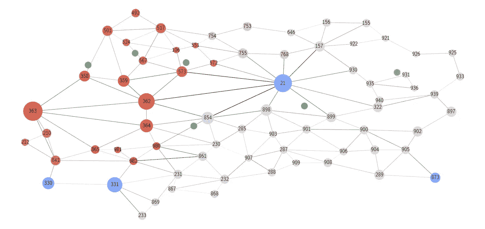
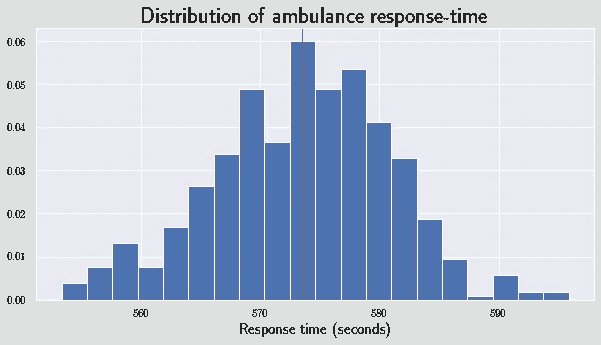
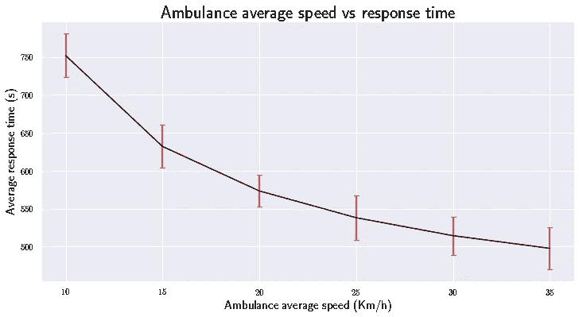
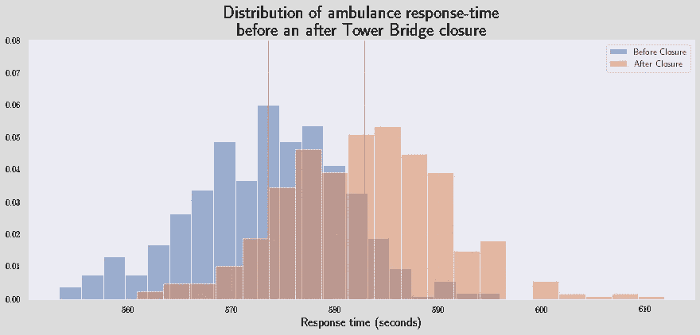
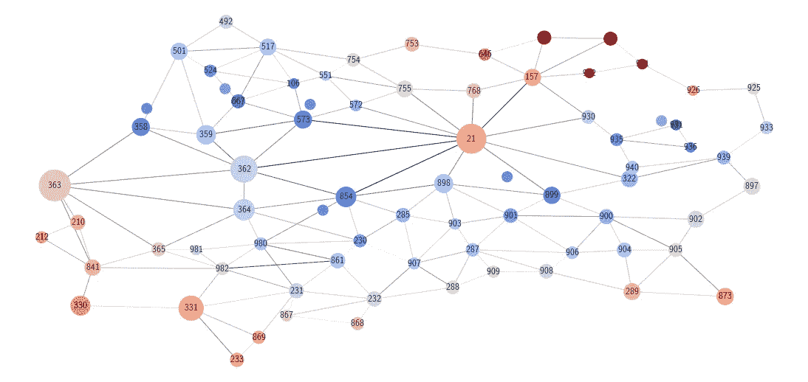
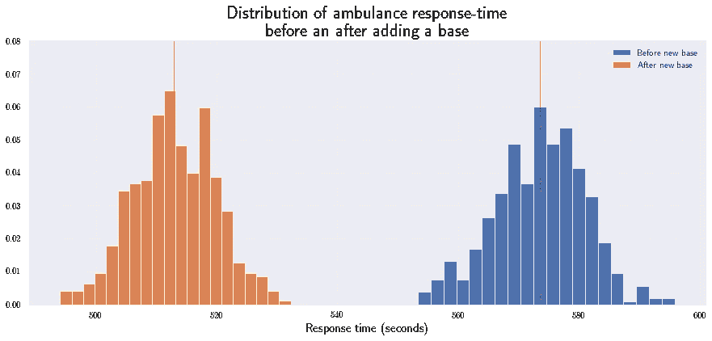

# 使用优步移动数据优化救护车响应时间

> 原文：<https://towardsdatascience.com/optimizing-ambulance-response-time-using-uber-movement-data-4e6618240b67?source=collection_archive---------62----------------------->

## [变更数据](https://towardsdatascience.com/tagged/data-for-change)

## 蒙特卡洛模拟，评估基础设施对救护车响应时间的影响(伦敦塔桥案例研究)。

图片由[eroyka](https://pixabay.com/users/eroyka-3731342/)[pix abay](https://medium.com/u/a640208c527a?source=post_page-----4e6618240b67--------------------------------)(**免版税**)分享

# 介绍

紧急医疗服务(EMS)的效率是一个运行良好的卫生系统的主要指标。在这份报告中，我比较了各种救护车队的管理策略，以尽量减少他们的反应时间。基于现实生活中的数据，我分析并比较了模拟结果与伦敦 EMS 响应时间的基准。此外，我测试了救护车平均速度的变化以及伦敦塔桥在 2016 年最后一个季度关闭对平均响应时间的影响。

# 方法学

将伦敦的道路网格编译成一个网络在计算上是昂贵的，因此该方法是对系统进行粗粒度处理，以区域(平均面积为 1.6 km)作为构建块。使用开源的优步运动数据集，这座城市由大约 1000 个由多边形组成的大伦敦地区构成。接下来，在两个给定区域之间创建边依赖于它们的多边形共享的坐标数(即，如果一对区域共享至少一个坐标，则它们是相邻的，因此它们与边链接)。

使用 [Networkx](https://networkx.github.io/) 软件包生成的大伦敦地区网络

为了进行更有针对性的分析，选择了伦敦地区的一个分区，包括市中心周围的 71 个地区。[优步运动的数据集](https://movement.uber.com/)填充了所有区域对之间的平均旅行时间，然后用作伦敦网络分段的边权重(*深灰色表示高平均旅行时间，浅灰色表示低平均旅行时间*

请求救护车的概率因地区而异。利用伦敦大都会警察局发布的犯罪率指数，每个地区都有一个犯罪率指标，用网络中节点的颜色来表示(T2，红色代表高犯罪率，蓝色代表低犯罪率)。节点的大小反映了以千米为单位的区域面积。最后，伦敦的医院使用谷歌地图 API ( *绿色节点*)定位，然后在伦敦的分区网络中与它们各自的区域相关联。(即，如果医疗中心的坐标落在一个区域的多边形内，那么它将包含在该区域的节点中)。

伦敦 71 个分区的网络

# 假设

尽管网络的构建接近真实设置，但以下假设可作为解释模拟结果的前提:

*   所有救护车都由同一个提供者协调(即，所有请求都到达一个中央计划者，然后根据紧急请求的接近程度来调度救护车)。
*   犯罪率是一个整体指标，包括不涉及住院治疗的犯罪。换句话说，人们可以认为旅游景点会因为扒窃而抬高犯罪率，这并不一定意味着大量的救护车请求。
*   平均行驶时间是基于优步骑行的测量，但救护车可以通过跳过红灯或当汽车为他们让路时切断交通。通过引入救护车速度参数，模拟显示了这种优势。
*   医院被模拟成拥有数量不受限制的救护车。
*   在现实生活中，紧急事件是按优先级分类的，但为了简单起见，模拟中生成的所有紧急事件都具有相同的优先级。

# 建模和仿真

给定底层数据结构，我设计了一个面向对象的程序，它将网络作为输入以及其他参数(救护车的平均速度、医院节点和紧急请求的数量)。这种方法是所有的请求一次生成，然后模拟通过它们来计算平均响应时间。

*   **generate_requests:** 该函数使用由标准化犯罪率加权的正常随机抽样器在城市的不同区域生成紧急呼叫。(即犯罪率相对较高的地区会有更频繁的救护车呼叫)。

*   **estimated_travel_time:** 该函数使用医院和发出紧急呼叫的地区之间的最短路径序列来估计平均行驶时间。对于最短路径上的每条边，样本取自正态分布，其平均值设置为边上的平均行驶时间，标准差设置为边上的行驶时间。最后，它返回边缘样本的总和。(*注:平均值和标准差的估计值均来自优步运动数据*)

*   **shortest_path:** 该函数按照以下过程计算医院节点和产生紧急呼叫的节点之间的最短路径:

# 运行模拟

模拟的迭代性质依赖于两个变量，即生成的请求数和每次模拟的运行次数。使用 2016 年第三季度的旅行时间数据，我控制救护车的速度为 20 公里/小时，然后运行模拟 500 次，每次迭代产生 2000 个请求，这产生了以下响应时间分布的直方图。

# 救护车的平均速度

根据 NHS 伦敦救护车服务的说法，伦敦的救护车在法律上被限制在 20 英里/小时(约 32 公里/小时)的速度限制内。为了测试速度变化的影响，我生成了 2000 个请求，针对从 10 到 35 公里/小时的每个速度进行 100 次模拟

平均响应时间是逐渐减少的；因此，上升的速度有递减的回报。从 10 公里/小时开始，响应时间集中在 700 秒左右，然后平均速度为 20 公里/小时时减少到 570 秒左右，在 35 公里/小时时达到最大值 500 秒。请注意，这些测量值的标准偏差在不同速度(25 秒)下大致相同

# 伦敦塔桥

选择伦敦的一个令人信服的原因是测试基础设施的变化对救护车响应时间的影响。在 2016 年最后一个季度，伦敦塔桥因施工而关闭，并于 2016 年 12 月 30 日重新开放。这是一个很好的自然体验，可以理清对响应时间的因果影响。比较是在两个网络之间进行的(第一个包含 2016 年第三季度的行驶时间，第二个包含第四季度的数据)。

这两种分布都近似正常，但是中间相隔 10 秒，因为在桥关闭之前，整个网络的响应时间要快 10 秒。两种分布的置信区间具有相同的范围(13 秒)

# **新救护基地**

最初，网络模拟有一组分散在伦敦网络中的六家医院。添加新救护车基地的一个启发是首先对具有最高响应时间的节点进行排序。该图显示了一个基于给定节点生成的所有请求的平均响应时间进行着色的网络。我们注意到，与网络的其他部分相比，东北地区的响应时间很长。

突出显示每个地区平均响应时间的模拟结果的网络

由于五个区域之间的行程时间大致相同，我们可以选择一个节点将其指定为医院节点(假设区域 155 包含救护车基地)。通过这样做，我们希望降低整个网络的平均响应时间。

这两种分布是截然不同的(不重叠),因为添加了一个基数后，响应时间减少了 60 秒(从 573.52 秒减少到 512.96 秒)。

> 为了便于比较，在 155 区增加一个基地与将救护车的平均速度从 20 公里/小时改为 30 公里/小时具有相同的影响

# 结论

响应时间对患者及时接受护理的机会有着至关重要的影响。对许多紧急情况来说，轻微的改善可以挽救生命。使用模拟，我们不仅可以判断优化响应时间的经济高效的策略，还可以评估和设计减轻基础设施变化影响的方法。

在伦理背景下，在两种策略之间进行选择不仅要考虑均值，还要考虑每个分布的分布，因为使用功利主义方法来优化大多数可能会伤害异常区域。(例如，我们不希望响应时间最长的区域离平均值太远)。调查结果提到，这些差距最多为 15 秒，这是一个令人放心的指标，表明这些战略在合理/可行的范围内，可以作为决策包括在内。