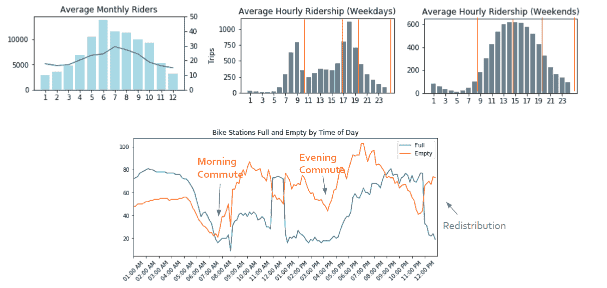
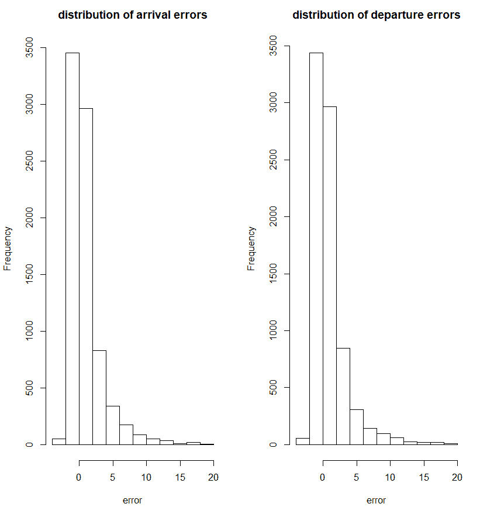
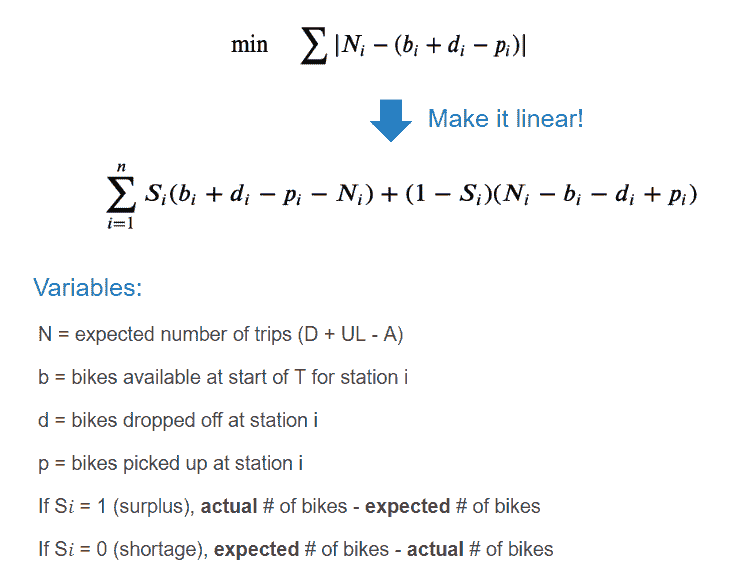
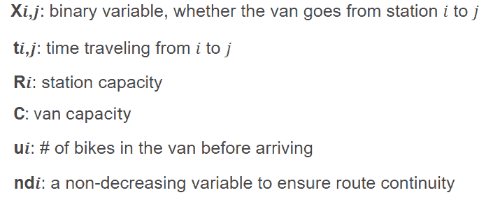
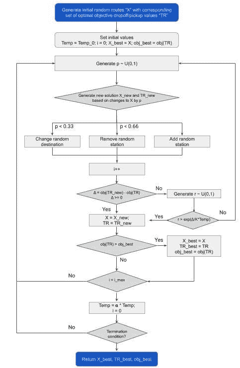
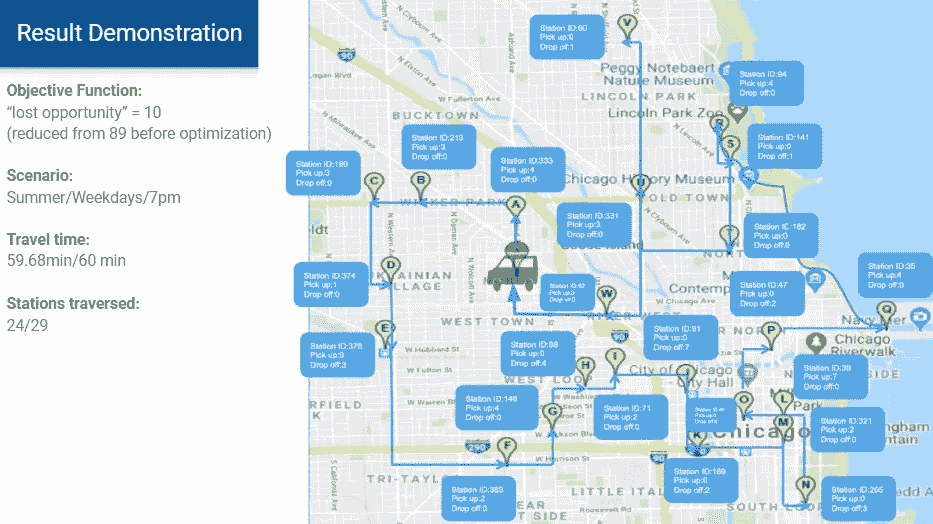

# 优化共享单车分配路线

> 原文：<https://towardsdatascience.com/optimizing-bike-sharing-allocation-routes-in-chicago-81f17b13a4a5?source=collection_archive---------47----------------------->

## 解决大城市共享单车车辆路径问题的新途径

Gabriela Bavaresco Kataoka 摄

住在大城市的好处是出行选择范围广。在芝加哥，Divvy 是一家自行车共享公司，在整个城市有 600 多个站点，尽管你经常会发现这些站点是空的，特别是在拥挤和受欢迎的地区。这对于公司和寻找廉价、高效、健康的城市出行方式的顾客来说都是不利的。

当希望应用从我们的分析硕士优化课程中学到的技能时，我们的团队——由 Amy Lin、Divya Ravindran、Grace Yin 和 Luis Flosi 组成——决定解决这样一个问题，即找到一辆 divy 面包车在选定的自行车站之间行驶的最佳路线，收集和重新分配自行车，以最大限度地减少在客户最需要时丢失自行车的机会。幸运的是，Divvy 已经在芝加哥的[数据门户](https://data.cityofchicago.org/)公开了其自行车的所有行程数据。我们还收集了黑暗天空的天气数据来丰富我们的模型。我们最终的代码库可以在 [GitHub](https://github.com/LuisFlosi/Shared-Bikes-Optimization) 上找到。

我们将从了解数据开始，然后创建预测模型以了解车站之间的需求和供应，最后基于两种不同的方法优化配送路线:线性规划和模拟退火。

# 数据探索

这些数据是在之前的项目中从 Amy 所在的小组导入、清理和结构化的。我们的重点是了解一周中的几天、几个小时和几个月之间的乘车模式，以及这些变化如何影响一个车站的自行车数量。

我们发现，在高峰时段，相当多的车站变得空无一人或人满为患。我们还发现，工作日的模式与周末非常不同。最后，季节对旅行总数也有很大的影响，因为芝加哥的冬天非常寒冷。这项分析由 Amy 负责，她制作了以下图表:

# 假设

我们确定了我们的模型如何能够在给定我们可用的信息和我们可以合理假设的情况下解决问题:

*   我们可以访问 2019 年的每一次旅行，每个车站的自行车容量和每小时的容量状态。从天气数据集中，我们还设法确定了每次旅行的能见度和温度。
*   考虑到分配不一定每小时执行一次，我们将工作日和周末划分为不同的时间段，如上面红线所示。自行车分配将在这些时间范围内执行。
*   作为一个假设，我们建议一辆货车的容量为 20 辆自行车。这个假设可以很容易地在我们的模型中进行调整。
*   为简单起见，我们还假设芝加哥所有地区的交通流量恒定且相等，这意味着车站之间的距离是影响两站之间货车运输“成本”的唯一因素。尽管对于模型来说这也可以很容易地改变，但是在这一点上收集交通信息会更复杂。
*   在我们的模型中，一辆货车只负责一组特定的站点。在未来的模型中，我们肯定会将其扩展到考虑所有站点的无限数量的货车。然而，我们发现，当同时考虑数百个站点时，这种类型的优化问题(通常称为车辆路径问题，或 VRP)的计算量太大。

在这种情况下，我们意识到缺少的主要模型输入是任何给定日期每个站点的预测需求。

# 需求估计

为了估计需求，Divya、Grace 和 Luis 创建了两个预测泊松模型，用于估计到达和离开每个站点的自行车数量。它们考虑了天气状况、月份、小时和星期几。

尽管模型显示了接近零的卡方 p 值，但它们在测试集上表现也很好，显示的误差范围在-1 到 5 个预测行程之间。在预测低值率时，p 值检验可能会产生误导，因此我们决定将该模型用于预测出行。然而，在现实生活中，我们肯定会进一步发展这个模型，使之更加健壮。

根据上面的模型，我们限制了他们的出行预测，以考虑每个站点的自行车容量。最后，我们利用 95%的预测出行上限作为实际出行次数。我们决定考虑上层，以确保大多数日子不会缺少自行车。

对于优化模型，我们将需求定义为需要运输到一个站点的自行车数量，以便满足所有客户的出行。正需求意味着一个加油站在一段时间内有多余的自行车。考虑到这一点，我们将需求定义为:

D = B — (UL — A)

其中 D =需求，B =时间段 T 开始时可用的自行车，A 是时间段 T 内到达的自行车数量，UL 是时间段 T 内离开车站的自行车数量的上限估计值

根据到达和离开每个车站的行程数量，我们能够将每小时的数量汇总到预定义的时间范围内，在该时间范围内将进行优化。从那里，我们只需要计算在时间 T 开始时每个站点实际可用的自行车数量(考虑优化后的变化)。

对于 T = midnight，我们假设可用自行车的数量总是相同的，等于午夜历史时段的平均值，因为 Divvy 历史上在那个时间执行分配。从那时起，每个时间范围将有自行车的数量将被考虑:前一个时间范围的分配结果(实际可用的自行车数量)；“A”代表前一时间段和离开车站的自行车平均数(非上限)。

B_t+1 = O — (L — A)

其中，O 是前一时间段 T 内可用的优化自行车数量，A 是前一时间段内到达车站的自行车数量，L 是前一时间段内模型预测的平均离开自行车数量。

我们对每个新的时间框架重复这个过程，每次计算优化模型的输入 D。

# 配送路线优化

我们使用了两种不同的方法来优化自行车分配路线。第一个是使用 Julia 的 Gurobi 解算器解决的线性规划问题，第二个是使用模拟退火(s a)技术解决的，该技术受[这篇](http://apiems2016.conf.tw/site/userdata/1087/papers/0381.pdf)研究论文的结果启发，该结果显示 SA 可用于以少得多的计算量解决 VRP 问题。

两种解决方案都考虑了由 Amy 导出的相同的目标函数。优化后，我们最小化预期站库存和实际库存之间的绝对差异之和:

# 1.Julia 中的线性规划求解

变量

限制

线性规划解决方案需要定义目标函数将服从的约束。约束条件不仅需要定义容量(如货车和车站容量)，还需要创建路径连接并建立距离作为“成本”，为此将有一个可达到的最大成本(意味着在时间范围到期之前货车可以行驶的总时间)。以下函数也是 Amy 在团队其他成员的支持下开发的:

容量限制

路由约束

# 2.模拟退火方法

前一种方法的主要缺点是计算量非常大。不仅要花几个小时或几天的时间来一次运行所有站点的优化，在一些情况下，只有 20 个站点可能要花几个小时来处理。

前面提到的论文使用模拟退火找到了类似 VRP 模型的替代方法，模拟退火是一种随机选择解决方案并对其进行评估直到找到最佳解决方案的算法。然而，该算法的独特方法是，它允许“坏的”解决方案，以逃避局部最优。

一旦我们完成了最终项目的优化类设置的范围，我们决定更进一步，在我们的数据中实现 SA 算法，以找到我们难以处理的场景的解决方案。尽管我们只实现了 SA 的有限的初稿版本，但我们在运行曾经需要几个小时才能处理的案例时，只用了几分钟就取得了很好的结果。

Luis 针对我们的具体情况对 SA 进行了修改，在此进行了概述。代码可以在我们的知识库中找到。

# 结果和最终考虑

为了展示我们的结果，Divya 和 Grace 选择了一个“默认”的夏季，在工作日的下午 7 点时段有良好的能见度，芝加哥有 29 个随机站点。在 Amy 使用我们的线性模型处理了这个案例之后，他们一起制作了下面的图像来演示最终的路线:

请注意，优化可以在任何给定的情况下运行，只要它有需求、容量约束和距离/行程时间的输入。此外，这是我们冬季季度演示的结果，我们在演示中使用了之前的预测模型。从那以后，我们在 GitHub 页面上看到这个模型得到了改进。

在现实生活中，这可以在任何给定的一天提前运行，为货车创建动态路线，以优化日常工作日、周末、夏季或冬季，甚至特殊活动日的自行车分配。这将允许 Divvy 以最佳和最快的方式合理地分配自行车，不仅最大化它们的机会，而且最大化整体客户满意度。