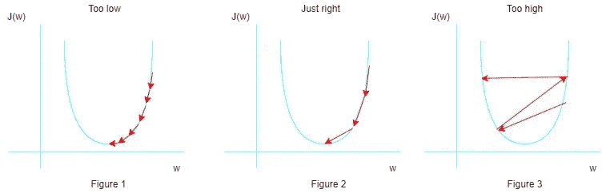
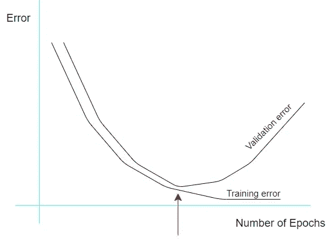
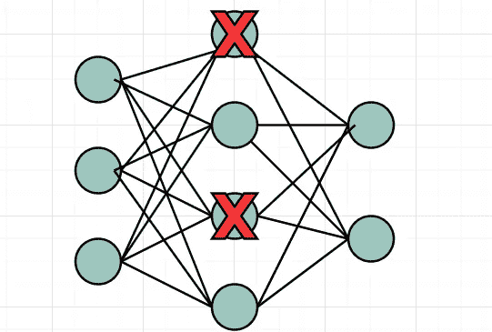
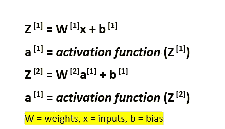

# 通过超参数调整优化深度学习算法

> 原文：<https://towardsdatascience.com/optimizing-deep-neural-networks-through-hyperparameter-tuning-1c8ae15bd3c7?source=collection_archive---------53----------------------->

## 神经网络中超参数的简单指南

Denys Nevozhai 在 [Unsplash](https://unsplash.com/s/photos/network?utm_source=unsplash&utm_medium=referral&utm_content=creditCopyText) 上拍摄的照片

在进入调优和优化机器学习算法之前，让我们看看超参数到底是什么。超参数是一组确定神经网络训练方式和神经网络结构的参数。基本上，超参数在决定你训练的神经网络是否适用于你试图解决的问题方面起着至关重要的作用。

实际上，应用机器学习是一个高度迭代的过程，更简单地说，是一个反复试验的过程。即使是非常有经验的深度学习实践者也无法第一次就获得这些“超参数”。这个过程就是把你的想法变成代码，实验，评估结果，做出改变，重复这个过程，直到你得到预期的或者满意的结果。

下面我们就把其中的几个超参数逐一细说。

## 1.学习率

学习率是一个具有小正值(通常范围在 0.0 到 1.0 之间)的超参数，它控制模型适应问题的速度，换句话说，学习率决定权重在梯度方向上应该有多远，以满足全局最小值。

作者图片

如果学习率太低(图 1 ),训练将进展非常缓慢。如果学习率设置得太高，如图 3 所示，训练可能不会收敛于全局最小值，而是超过它，并继续使模型损失更严重。立刻获得正确的学习速度是不可能的(除非你非常有经验，同时又非常幸运)。正如所有的超参数一样，这是一个反复试验的场景。然而，衰减的学习速率(将随着训练的进行而降低)优于固定的学习速率。学习率的衰减可以是基于时间的衰减、阶跃衰减或指数衰减。

## **2。批量**

批量大小可以定义为神经网络一次训练的数据(样本)数量。假设你有 1000 个样本需要训练。你可以一次通过神经网络传播所有 1000 个样本，也可以小批量传播，比如一次传播 100 个样本。神经网络将首先获取前 100 个样本，然后训练网络，然后是接下来的 100 个样本，我们可以让神经网络继续这样做，直到它被所有样本传播。使用小批量的优势在于，它们需要的内存更少，训练速度比完整批量更快。

## 3.时代数

历元数是学习算法将遍历整个训练数据集的次数。有人可能认为更高的历元数会导致更精确的模型，但这并不总是正确的。

作者图片

从上图中可以看出，随着历元数的增加，训练误差和验证误差都在减少，但只减少到某一点。此后，由于过拟合，验证误差不断增加。因此，为了使模型在面对新数据时表现良好，训练应该在训练和验证误差都最低的点处结束，并且该点处的时期数是理想的时期数。在 TensorFlow 等库中，我们可以选择以这样一种方式编写代码，即当验证误差达到某个期望值时，训练将被终止。

## 4.隐藏单元和层的数量

这些超参数在很大程度上取决于它们所应用的问题维度。隐藏层是神经网络的输入层和输出层之间的层。对于一个简单的问题，几个隐藏层和几个隐藏单元就足够了，但是问题越复杂，需要的隐藏层和隐藏单元就越多。实践中的经验法则是在输入和输出层的单元之间保持隐藏单元的数量。然而，应该记住，不希望的较高数量的隐藏层和隐藏单元不仅会浪费计算能力，而且会导致过拟合，这会降低神经网络的精度。

## 5.辍学者

Dropout 是一种正则化技术，用于减少验证误差，换句话说，用于避免过度拟合。简而言之，丢失意味着随机忽略神经元(单元),这样做将在神经网络的前向和后向传播中被忽略。在训练期间，神经元开始相互依赖，这限制了利用独立神经元的能力，而随机丢弃几个神经元我们能够防止这种情况。

作者图片

漏失以百分比给出，假设你给出了 20%的漏失值，每 5 个神经元中就有 1 个会被随机丢弃，并在训练中被忽略。退出增加了为了收敛到全局最小值而需要执行的迭代次数，但是每次迭代的训练时间将会减少。

## 6.激活功能

激活函数基本上是用于向神经网络引入非线性的数学方程。现在让我们进入数学，

作者图片

正如你所看到的，激活函数实际上决定了每个神经元的输出应该如何表现，因此应该根据你要将训练好的模型应用到的问题仔细选择正确的激活函数。Sigmoid、ReLu 和 tanh 是一些广泛使用的激活函数。每一个激活函数都有它的优点和缺点。要更深入地了解激活功能，请参考下面链接的我的文章。

 [## 了解神经网络中的激活函数。

### 什么是激活功能，为什么你应该知道它们？

towardsdatascience.com](/getting-to-know-activation-functions-in-neural-networks-125405b67428) 

## 结论

正如我在本文开头提到的，超参数调整传统上是手动完成的，这是一个迭代过程。然而，优化算法的研究仍在进行中。网格搜索、随机搜索和贝叶斯优化是一些广为人知的优化算法，但是，这些算法可能计算量很大，并且各有利弊，这超出了本文的范围。(也许是改天的话题！).

感谢您的阅读，希望我能有所帮助。

## 资源

*   超参数:优化方法和真实世界模型管理。
*   [改进神经网络:超参数调整、正则化等等。](https://www.analyticsvidhya.com/blog/2018/11/neural-networks-hyperparameter-tuning-regularization-deeplearning/)