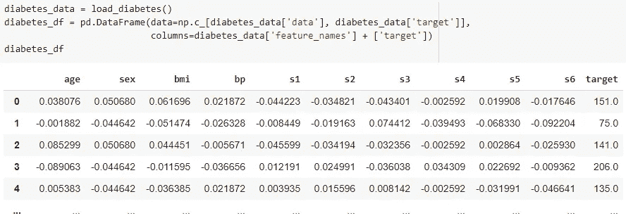
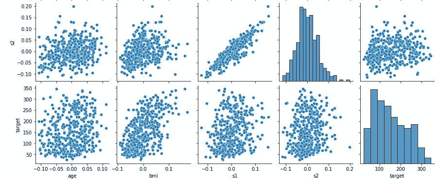
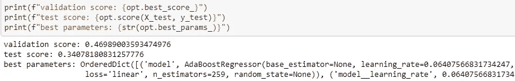
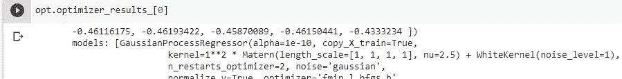
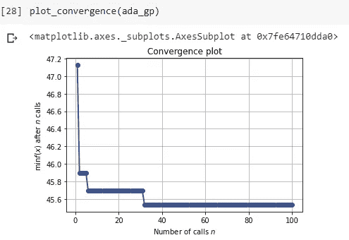
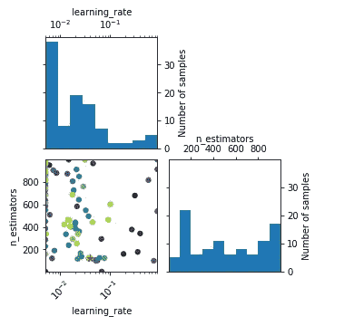

# 以正确的方式优化超参数

> 原文：<https://towardsdatascience.com/optimizing-hyperparameters-the-right-way-3c9cafc279cc?source=collection_archive---------10----------------------->

## 使用 Python 中的 skopt 通过*贝叶斯优化*有效地探索参数搜索。TL；我的超参数总是比你的好。


*高效探索问题空间的广阔峡谷—Photo by*[*fine as Anton*](https://unsplash.com/@fineas_anton?utm_source=unsplash&utm_medium=referral&utm_content=creditCopyText)*on*[*Unsplash*](https://unsplash.com/s/photos/balance-landscape?utm_source=unsplash&utm_medium=referral&utm_content=creditCopyText)

在这篇文章中，我们将使用多个优化器构建一个机器学习管道，并使用贝叶斯优化的力量来为我们所有的参数获得**最佳配置。我们所需要的就是 sklearn [管道](https://scikit-learn.org/stable/modules/generated/sklearn.pipeline.Pipeline.html)和 [Skopt](https://scikit-optimize.github.io/stable/index.html) 。
你可以用你喜欢的 ML 机型，只要有 sklearn 的包装(看你 XGBoost 或者 NGBoost)。**

# 关于超参数

寻找能够解决问题的最佳模型的关键点是*而不是*仅仅是模型。在给定数据集的情况下，我们需要**找到最佳参数**来使我们的模型以最佳方式工作。这被称为寻找或搜索超参数。
例如，我们想在实践中实现一个[随机森林](https://scikit-learn.org/stable/modules/generated/sklearn.ensemble.RandomForestClassifier.html)，它的文档声明:

```
class sklearn.ensemble.RandomForestClassifier(n_estimators=100, *, criterion='gini', max_depth=None, min_samples_split=2, min_samples_leaf=1, min_weight_fraction_leaf=0.0, max_features='auto', max_leaf_nodes=None, ...
```

所有这些参数都可以探索。这可以包括从 1 到 10.000 的森林中所有可能的估计数(n_estimators)，您可以尝试使用 ***{"gini "，" entropy"}*** 进行分割，或者您的树的最大深度是另一个整数，还有许多许多选项。**这些**参数中的每一个**都会影响你的模型**的性能，最糟糕的是大多数时候**当你开始处理一个新的问题集时，你不知道正确的配置**。

# 手提钻又名网格搜索

寻找最佳配置的强力方法是执行网格搜索，例如使用 sklearn 的 [GridSearchCV](https://scikit-learn.org/stable/modules/generated/sklearn.model_selection.GridSearchCV.html) 。这意味着您要在模型上尝试所有可能的参数组合。
从好的方面来看，你可能会找到想要的价值观。问题是**运行时间是可怕的**，并且总的来说**网格搜索不能很好地扩展**。对于您想要尝试的每个新参数，您也将测试所有其他先前指定的参数。这种方法非常缺乏信息，感觉就像在我们的问题空间中盲目地测试所有可能的按钮和配置。与此相反的是我们对超参数的理解:

> 我们有一种**直觉，一些参数的选择比其他的更能提供信息。**

一些参数更有意义，一旦我们知道一些参数范围比其他范围更好。此外，一旦我们知道什么方向起作用，我们就不必在错误的领域探索所有的价值。

我们不需要测试所有的参数——尤其是那些我们知道相差很远的参数。
朝正确方向的一步是像 [RandomizedSearchCV](https://scikit-learn.org/stable/modules/generated/sklearn.model_selection.RandomizedSearchCV.html) 一样的随机搜索，我们在朝正确方向移动的同时随机选取参数。

# 更好的贝叶斯搜索

我们选择的工具是 [BayesSearchCV](https://scikit-optimize.github.io/stable/modules/generated/skopt.BayesSearchCV.html) 。这种方法使用逐步贝叶斯优化来探索问题空间中最有希望的超参数。
简而言之，贝叶斯优化在大型问题空间中找到目标函数的最小值，并且非常适用于连续值。为此，它对目标函数使用高斯过程回归。一个彻底的数学介绍可以在[【2】](https://arxiv.org/pdf/1807.02811.pdf)中找到。在我们的例子中，**目标函数**是在给定我们指定的模型参数的情况下，达到**最佳模型输出。
贝叶斯优化方法的好处是，我们可以给出更大范围的可能值**，因为随着时间的推移，我们会自动探索最有希望的区域，并丢弃不太有希望的区域。简单的网格搜索需要很长时间来愚蠢地探索所有可能的值。
由于我们的行动更加有效，我们可以有更大的活动空间。我们来看一个例子*。*****

# **问题集**

**今天我们使用来自 sklearn 的[糖尿病数据集，以方便使用。
这省去了我们加载和清理数据的麻烦，而且这些特性已经被整齐地编码了。](https://scikit-learn.org/stable/modules/generated/sklearn.datasets.load_diabetes.html)**

****

**我们有一组编码栏，包括年龄、性别、体重指数、血压和血清值，用数字编码。我们的目标值是疾病进展的量度。
我们可以在 s 柱(血清值)上看到一些相互作用，表明某种程度的相关性。**

****

**为了构建我们的管道，我们首先将数据集以 80:20 的比例分别分为训练和测试。**

```
X_train, X_test, y_train, y_test = train_test_split(diabetes_df.drop(columns="target"), diabetes_df.target, test_size=0.2, random_state=21)
```

# **修建管道**

**我们需要三个元素来构建管道:(1)要优化的模型，(sklearn 管道对象，以及(skopt 优化过程。**

**首先，我们选择**两个助推模型** : AdaBoost 和 GradientBoosted 回归器，对于每个模型，我们**在关键超参数**上定义一个搜索空间。来自 sklearn 库深度的任何其他回归器都可以，但 boosting 可能会为您赢得下一次黑客马拉松(…现在是 2015 年，不是吗？)
搜索空间是一个带有
键值对的字典:= { ' model _ _*parameter*':skopt . space . object }。
对于每个参数，我们在我们想要的范围内从 skopt 库中设置一个[空间](https://scikit-optimize.github.io/stable/modules/space.html#space)。分类值也通过将它们作为字符串列表传递来包含(参见下面的分类):**

```
ada_search = {
    'model': [AdaBoostRegressor()],
    'model__learning_rate': Real(0.005, 0.9, prior="log-uniform"),
    'model__n_estimators': Integer(1, 1000),
    'model__loss': Categorical(['linear', 'square', 'exponential'])
}gb_search = {
    'model': [GradientBoostingRegressor()],
    'model__learning_rate': Real(0.005, 0.9, prior="log-uniform"),
    'model__n_estimators': Integer(1, 1000),
    'model__loss': Categorical(['ls', 'lad', 'quantile'])
}
```

**其次，我们通过另一个模型选择回归模型，这是我们的管道元素，其中两个优化器(adaboost 和 gradientboost)一起进行选择:**

```
pipe = Pipeline([('model', GradientBoostingRegressor())])
```

**第三，我们优化我们的搜索空间。为此我们调用 BayesSearchCV。我们还指定优化器应该如何调用我们的搜索空间。在我们的例子中是 100 次调用。然后我们用一个简单的目的来安装管道。fit() 命令:**

```
opt = BayesSearchCV(
    pipe,
    [(ada_search, 100), (gb_search, 100)],
    cv=5
)opt.fit(X_train, y_train)
```

**拟合完成后，我们可以要求找到最佳的参数。这包括对看不见的测试数据使用分数函数。**

****

**我们可以看到验证和测试分数以及最佳拟合的参数。具有最佳结果的模型是 AdaBoost 模型，具有线性损失和 259 个估计器，学习率为 0.064。干净利落。
从输出中我们还可以看到，优化器使用了一个 GP 进行底层优化:**

****

# **GP 最小化**

**为了便于说明，我们也可以专门调用 GP 最小化，我们将使用 AdaBoost 回归器，只关注数值超参数空间。**

```
ada = AdaBoostRegressor(random_state=21)# numerical space
space  = [Real(0.005, 0.9, "log-uniform", name='learning_rate'),
          Integer(1, 1000, name="n_estimators")]
```

**这里的主要变化是我们必须**定义一个目标函数**来优化。为了查看模型在参数空间上的表现，我们使用了 named_args 装饰器。**

```
@use_named_args(space)
def objective(**params):
    ada.set_params(**params)
    return -np.mean(cross_val_score(ada, X_train, y_train, cv=5, n_jobs=-1,
                                    scoring="neg_mean_absolute_error"))
```

**因此，我们的优化是使用[负平均绝对误差](https://scikit-learn.org/stable/modules/generated/sklearn.metrics.mean_absolute_error.html)从交叉验证拟合中获得的负平均分数。其他评分功能可能更适合你。
然后，我们使用 GP 最小化来拟合回归变量的最佳参数。`gp_minimize(objective, space, n_calls=100, random_state=21)`**

# **可视化问题空间—优化后**

**直接使用 GP 优化允许我们在最小化过程中绘制收敛图。**

****

***寻找 AdaBoost 回归器相对于数据集中目标列的最佳超参数时 GP 最小化的收敛性。***

**我们可以看到，在大约 40 次迭代之后，已经达到了函数值的最小值。
最后一个优秀的特性是**可视化探索的问题空间**。因为我们在这一点上只使用了数字输入，所以我们可以通过使用 skopt 绘制来评估问题空间，如下所示:**

****

***将问题空间上调用的 learning_rate 和 n_estimator 值可视化为直方图。问题空间显示为散点图，使得每个 GP 运行(100 次中的一次)揭示该空间中的一个函数值。最小值由散点图中的红星标出。***

**从上图中我们可以看到，在我们的学习率谱的低端进行了大量的探索，经过尝试和测试的估计数的峰值是 200 和 800 以上。
散点图描绘了我们试图优化的问题空间有多困难——最小值标有红星。每个 GP-minimize 运行发现一个函数值，给定它作为输入的参数。虽然我们已经达到收敛，但在最小值周围的区域中没有很多值是明显的，并且可以考虑增加评估的数量。**

**既然我们有了给定参数空间的最佳模型，我们就可以相应地实现该模型，并进行具体的分析。**

# **结论**

**我们已经表明，我们可以有效地探索可能的模型参数的巨大空间，节省时间和计算资源。我们通过将对超参数的搜索公式化为目标函数来做到这一点，我们使用贝叶斯优化来为该目标函数找到最优值。没有必要通过尝试每一个参数来测试无用的参数。如你所见，skopt 是一个在优化领域提供了很多东西的库，我鼓励你在日常的 ML 工程中使用它们。**

**探索愉快！**

**完整的代码可以在笔记本上找到[这里](https://github.com/RMichae1/PyroStudies/blob/master/Bayesian_Optimization.ipynb):**

**[](https://github.com/RMichae1/PyroStudies/blob/master/Bayesian_Optimization.ipynb) [## RMI chae 1/烟火研究

### permalink dissolve GitHub 是超过 5000 万开发人员的家园，他们一起工作来托管和审查代码，管理…

github.com](https://github.com/RMichae1/PyroStudies/blob/master/Bayesian_Optimization.ipynb) 

# 参考

1.  马克·克拉森，[巴特·德·穆尔](https://arxiv.org/search/cs?searchtype=author&query=De+Moor%2C+B)。 [*机器学习中的超参数搜索*](https://arxiv.org/pdf/1502.02127.pdf) 。arXiv 上 2015。
2.  彼得·弗雷泽。 [*贝叶斯优化教程*](https://arxiv.org/pdf/1807.02811.pdf) 。arXiv 上 2018。
3.  sci kit-优化贡献者(BSD 许可证)。[*Scikit-学习超参数搜索包装器*](https://scikit-optimize.github.io/stable/auto_examples/sklearn-gridsearchcv-replacement.html) 。**