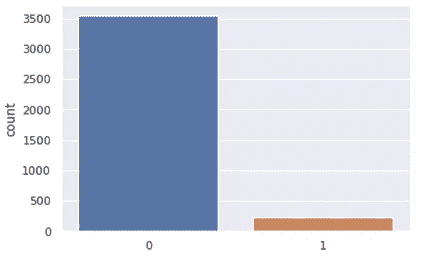
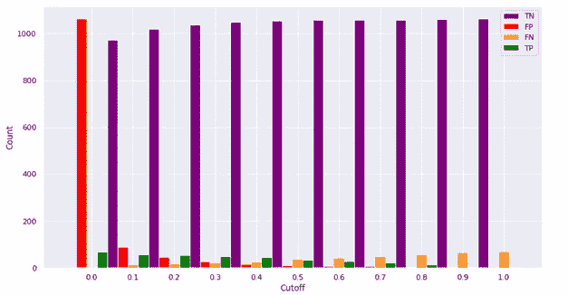
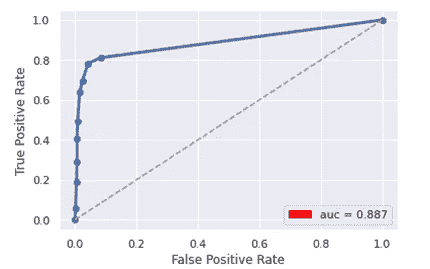
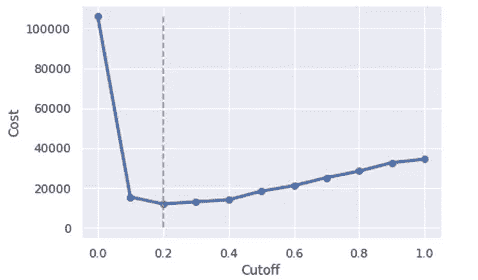

# 不平衡数据集的精确度与成本敏感方法和 ROC 曲线

> 原文：<https://towardsdatascience.com/optimizing-logistic-regression-with-different-cutoff-values-174b6e56ea8d?source=collection_archive---------29----------------------->

## **用不同的截止值优化逻辑回归**

逻辑回归是一种非常适合二分类问题的技术。在给定输入预测值的情况下，该模型计算可确定每个观测值类别的概率。在这项研究中，我们调查了不平衡数据的模型性能评估指标，重点是选择逻辑回归的最佳临界值。我们将逻辑回归应用于甲状腺数据(收集自 UCI 机器学习库)，以检验该模型在不同临界值下的表现[1]。

甲状腺数据集包含 3，772 个观察值和 53 个属性，包括解释患者状态(1:患者有甲状腺，0:患者没有甲状腺)的目标变量。数据集是不平衡的，因为近 94%的观测值在类 0 中，而类 1 包含剩余的观测值。图 1 显示了数据集的不平衡类别分布。我们应用 70%: 30%的比率将数据分成训练和测试数据，同时保持类别分布。数据集中的变量比例不同。因此，训练和测试数据都利用 *z 分数*标准化技术进行了标准化。在标准化测试数据的过程中，我们使用了为训练数据计算的参数(平均值和标准偏差)。最后，将训练数据输入逻辑回归算法来训练模型，并利用测试数据进行预测。

图 1:甲状腺数据的类别分布

图 2:不同临界值的精确度

逻辑回归的预测是每个观察值的后验概率[2]。因此，可以将截止值应用于计算的概率，以对观察值进行分类。例如，如果考虑截止值 *t* ，那么大于或等于 *t* 的分数被分类为 1 级，而小于 *t* 的分数被分类为 0 级。图 2 示出了对于范围从 0.0 到 1.0 的不同截止值的模型的精确度。该模型的精度越来越高，直到在 0.4 的截止值达到其最大值 96.37%。从 0.4 的临界值开始，模型的准确性下降，并且没有显示出改善的迹象。

图 3 示出了混淆矩阵的不同结果，例如真阳性(TP)、假阳性(FP)、假阴性(FN)和真阴性(TN ),具有范围从 0.0 到 1.0 的不同截止值。它展示了我们在选择合理的截止值时所经历的权衡。如果我们增加截止值，那么 1) TN 增加，TP 减少，2) FN 增加，FP 减少。因此，对于 0.4 的截止值，我们可以实现更好的准确性，但是假阴性的数量仍然相对较高。此外，如果我们将测试数据中的所有观察结果分类为负面(0 类)，我们仍然可以达到 94%的准确性，这与模型的准确性相对接近。因此，考虑到不平衡的数据集，精确度不是一个好的性能指标。

图 3:不同临界值的混淆矩阵结果

**成本敏感方法**在这个分类问题中，假阴性意味着一个人是甲状腺患者，但我们的模型未能检测到它，另一方面，假阳性意味着模型将这个人分类为患有甲状腺，而他没有。因此，假阴性会导致严重的后果，如不正确的治疗过程，因为疾病被忽略了，假阳性会导致不必要的护理。因此，产生假阴性比假阳性代价更高，因此，在这个问题中，最小化假阴性比最小化假阳性更重要。我们研究了不同截断值的假阴性和假阳性之间的最佳权衡。

成本分析是确定最佳临界值的方法之一。当假阳性和假阴性的成本已知时，在不同的截止值下计算成本，以实现假阳性和假阴性之间的合理平衡[4]。由于这个问题的真实成本是未知的，我们为一个假阴性指定 500 的成本，为一个假阳性指定 100 的成本。FN 的成本更高，因为它比 FP 的成本更高。图 5 示出了与从 0 到 1 的各种截止值相关联的成本曲线。当截止值为 0.2 时，达到最小成本 12，000。

**ROC 曲线**接收机工作特性(ROC)图对于组织分类器和可视化其性能非常有用【3】。这是所有可能临界值的真阳性率与假阳性率的关系图[4]。图 4 显示了 ROC 曲线，该曲线显示了基于范围从 0.0 到 1.0 的截止值的正确和不正确决策的所有可能组合。该 ROC 曲线下的面积为 0.887，这通常表明该模型的效率。最好的 AUC 可能是 1，而最差的是 0.5(45 度随机线)。当给定数据集不平衡时，我们可以利用 ROC 曲线来检验不同模型的有效性。

图 4: ROC 曲线

图 5:利用成本曲线的最佳截止值

模型性能评估指标在选择最佳模型时起着重要的作用。准确性是模型选择过程中公认的性能指标之一。然而，考虑不平衡数据的指标的局限性要求引入其他测量方法，如成本敏感的最佳临界值和 ROC 曲线。成本敏感分析可用于寻找最佳截止值，此外，ROC 曲线可用于检查模型效率并在给定数据集不平衡时选择最佳模型。

参考

**

***【2】*[*http://ethen 8181 . github . io/machine-earning/unbalanced/unbalanced . html*](http://ethen8181.github.io/machine-learning/unbalanced/unbalanced.html)**

***[3]t .福塞特(2004 年)。ROC 图:研究人员的注意事项和实际考虑。机器学习，31(1)，1–38 页。***

***【4】*[*https://ncsswpengine . net dnassl . com/WP content/themes/NCSs/pdf/Procedures/NCSS/One _ ROC _ Curve _ and _ cut off _ analysis . pdf*](https://ncsswpengine.netdnassl.com/wpcontent/themes/ncss/pdf/Procedures/NCSS/One_ROC_Curve_and_Cutoff_Analysis.pdf)**