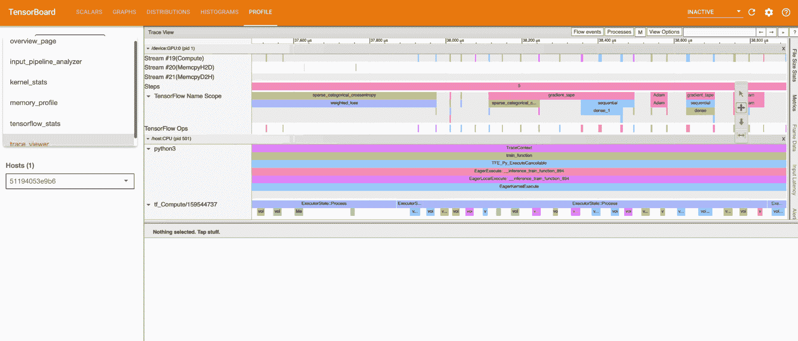
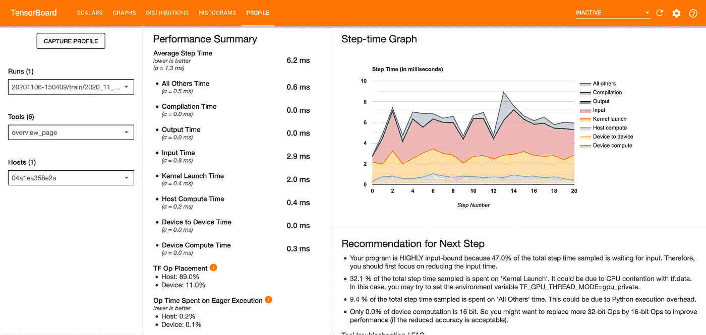
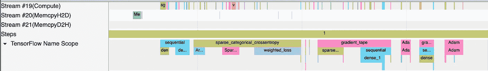
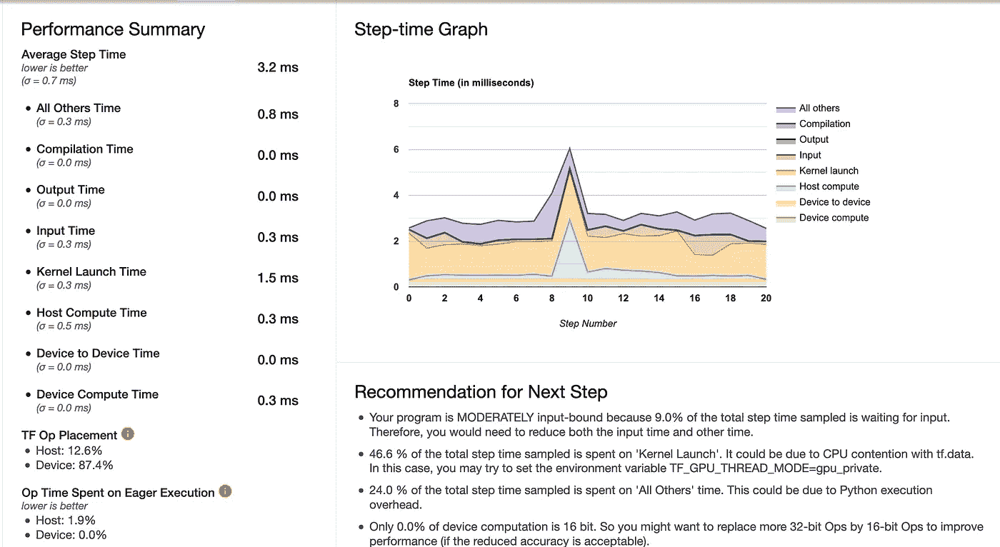
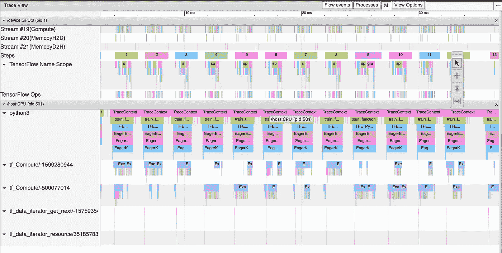

# 用张量流剖面仪优化模型训练

> 原文：<https://towardsdatascience.com/optimizing-model-training-with-tensorflow-profiler-eb94eab0ec18?source=collection_archive---------19----------------------->

## 使用 TensorFlow 优化 GPU 性能



作者的 TensorFlow Profiler 漫游

我们希望我们的模特训练得非常快。我们使用 GPU 使操作执行得更快。然而，即使在加速计算之后，该模型在流水线本身中也可能效率低下，因此可能训练得更慢。在这种情况下，调试代码变得非常困难，事实上，甚至很难判断什么是慢的。

这可以通过使用张量流剖面仪来解决。分析器“分析”张量流代码的执行。在本文中，我们将讨论分析器、如何使用它、最佳实践以及如何优化 GPU 性能。

**注意**本文期望训练 TensorFlow 模型和使用 Tensorboard 的基础知识。你可以[参考我在 Tensorboard](/a-quickstart-guide-to-tensorboard-fb1ade69bbcf) 上的文章，如果你不知道的话。

# 张量流剖面仪

首先，甚至在优化任何东西之前，让我们讨论一下分析器是什么，它提供了什么。

> 分析有助于您了解模型中各种 TensorFlow 操作(ops)的硬件资源消耗(时间和内存),解决性能瓶颈，并最终使模型执行得更快。
> 
> — [张量流文档](https://www.tensorflow.org/guide/profiler)

基本上，分析器监控模型训练。它记录了执行 ops 所需的时间、执行完整步骤所需的时间，收集了关于时间和内存方面的资源利用率的见解，并为理解这些见解提供了可视化效果。

在接下来的章节中，我们将了解如何使用分析器:

1.  **我们将通过分析训练一个简单的模型。**
2.  **探索剖析器，深入了解培训内容。**
3.  **利用这些见解优化培训。**

# 如何给模特做侧写？

要了解如何使用探查器，我们先来训练一个模型！我们将使用来自 [tensorflow-datasets](https://www.tensorflow.org/datasets) 的著名 mnist 数据集:

要安装 TensorFlow Profiler，请使用:

```
pip install -U tensorboard_plugin_profile
```

**注意** Profiler 要求安装最新版本的 TensorFlow 和 TensorBoard。

现在，加载并预处理数据集:

```
(ds_train, ds_test), ds_info = tfds.load(
      'mnist',
      split=['train', 'test'],
      shuffle_files=True,as_supervised=True,with_info=True,                       )def rescale(image, label):
      return tf.cast(image, tf.float32) / 255., labelds_train = ds_train.map(rescale)
ds_train = ds_train.batch(128)
```

构建模型:

```
model = tf.keras.models.Sequential([
      tf.keras.layers.Flatten(input_shape=(28, 28, 1))
      tf.keras.layers.Dense(128,activation='relu'),
      tf.keras.layers.Dense(10, activation='softmax')
])model.compile(
      loss='sparse_categorical_crossentropy',
      optimizer=tf.keras.optimizers.Adam(0.001),
      metrics=['accuracy']
)
```

现在，启用分析器非常简单。您只需要在 tensorboard 回调中添加一个额外的参数:

```
tensorboard_callback = tf.keras.callbacks.TensorBoard(
      log_dir = logs,
      histogram_freq = 1,
 **profile_batch = '500,520'**
)
```

`profile_batch`参数告诉 TensorFlow 捕获执行性能并对其进行分析。***【500，520】***指定您希望评测的批次，即**型号从批次 500 到 520 的性能将被捕获。**

现在，我们将像往常一样使用上面的回调来训练模型:

```
model.fit(
      ds_train,
      epochs=2,
      validation_data=ds_test,
      **callbacks = [t****ensor****board_callback]**
)
```

# 使用分析器

现在我们已经训练了模型，让我们看看在分析器的帮助下我们做得如何:

## 概览页面



按作者分类的探查器概述页面

本节对模型性能进行了高度概括。以下是一些需要注意的事项:

1.  **步进时间图**(右图)是****步数** (x 轴) **v/s 执行相应步骤**(步进时间，y 轴)所需时间的曲线图。它还显示了**每个类别**(彩色分区)使用了该步进时间的哪一部分。看上面的图，我们可以知道我们的模型是**‘高度输入限制’，**，也就是说，它在输入操作上花费了大量的训练时间。我们将在一段时间内对此进行优化:)**
2.  ****平均步进时间**(在性能总结下)给出了平均步进时间的细分。在理想情况下，我们希望我们的模型将大部分时间花在实际的“训练”上，即保持 GPU 忙碌(**设备计算时间**必须是最高的，所有其他开销必须尽可能低)。**
3.  ****TF Op Placement** (在性能摘要下)显示主机(CPU)与设备(GPU)上执行的操作百分比。为了最大化 GPU 利用率，设备操作位置必须最大化。**

> **在理想情况下，您的程序应该具有高 GPU 利用率、最小的 CPU(主机)到 GPU(设备)通信，并且没有来自输入管道的开销。**
> 
> **— [张量流文档](https://www.tensorflow.org/guide/gpu_performance_analysis)**

## **跟踪查看器**

****

**按作者的跟踪查看器**

**因此，在这个工具变得更加可怕之前，让我们来分解一下:**

*   ****左边**(垂直灰柱)，可以看到两大板块:`/device` 和`/host`。这告诉我们哪个 TensorFlow op 在哪个设备(GPU 或 CPU)上执行。).**
*   ****到右侧**，彩色条表示各 TensorFlow 操作已经执行的持续时间。**

> **通常，主机执行输入操作，预处理训练数据并将其传输到设备，而设备执行实际的模型训练。**
> 
> **— [张量流文档](https://www.tensorflow.org/guide/profiler#trace_viewer)**

**探索这个工具将使您对这些持续时间有更好的了解(分别使用 W 和 S 来放大或缩小)。首先，看看这个:**

****

**探索跟踪查看器**

1.  ****流#19** 显示了用于启动计算内核和制作设备到设备副本的时间线。**
2.  ****流#20** 用于主机到设备的拷贝，并且**
3.  *****流* #21** 用于设备托管拷贝。**

**理想情况下，GPU 计算时间线必须是拥挤的(即，GPU 繁忙)。主机到设备和设备到主机的拷贝应该最少。**

**使用**步骤**时间线，您可以看到模型的不同阶段，如**向前传递** ( `sequential`和`dense`)、**损失计算** ( `sparse_categorical_crossentropy`)、**向后传递** ( `gradient_tape`和`Adam`)。这些操作间应挤满**台阶**之间的最小空间。空格表示 GPU 空闲时间，拥挤表示利用率。**

**其余工具提供了关于概述页面和跟踪查看器中涵盖的特定类别或操作的全面见解。让我们快速浏览一下:**

1.  ****输入管道分析器:**输入管道分析器检查输入管道，并通知是否存在性能瓶颈。它还告诉我们，如果我们的模型是输入绑定的。**
2.  ****GPU 内核统计:**这个工具显示每个 GPU 内核的性能统计数据和原始 op。**
3.  ****内存分析:**该工具分析 GPU 内存使用情况。这可用于分析和调试 GPU 内存耗尽时引发的 **OOM** (内存不足)错误。**
4.  ****TensorFlow Stats:** 该工具给出了执行的每个 TensorFlow op 的**性能概述。为了可读性，它为主机和设备操作提供了一个合适的分组。****

# **最佳化**

**在前面的部分中，我们训练了我们的模型，并看到了分析器如何帮助识别管道和资源利用中潜在的低效。本节将尝试解决这些效率低下的问题，看看我们的模型是否做得更好…**

**现在，我们已经看到我们的模型是高度'**输入受限的**，也就是说，它的大部分训练时间都花在了输入操作上(例如，预处理)。如果你从**轨迹查看器**中观察`tf_data_iterator_get_next` ，我们可以看到`tf.data`操作占了很多时间。这是因为我们的`tf.data.Dataset`在训练期间实时获取批次。**

**我们可以做的一件事就是使用 ***缓存*** 和 ***预取*** 。**

1.  **`[tf.data.Dataset.cache](https://www.tensorflow.org/guide/data_performance#caching)`将数据集加载到内存或本地存储器中。这将为昂贵的 I/O 操作节省时间，如在每个时期从文件**中打开和读取数据。****
2.  **`[tf.data.Dataset.prefetch](https://www.tensorflow.org/guide/data_performance#prefetching)`实质上是提前准备数据**和并行准备**和**。****

**因此在没有预取的情况下，在给定的步骤`s`，首先在时间`t1`获取(并预处理)数据。然后，模型在时间`t2`中根据这些数据进行训练。现在步骤`s`的总步骤时间变为`(t1 + t2)`。**

**但是在预取的情况下，一个**后台线程**获取步骤`(s + 1)` 的数据，同时模型正在针对步骤`s`的数据进行训练。因此，如果为步骤`(s + 1)`获取数据所需的时间是`t1`，为步骤`s`训练模型所需的时间是`t2`，那么步骤时间将是`max(t1, t2)`。**

**让我们在前面的代码中添加缓存和预取功能:**

```
ds_train = ds_train.map(rescale)
ds_train = ds_train.batch(128)
ds_train = ds_train.cache()
ds_train = ds_train.prefetch(tf.data.experimental.AUTOTUNE)
```

**然后，用和之前完全一样的方法训练模型。**

**现在我们已经优化了我们的培训，让我们来看看评测器:**

****

**优化后的探查器**

*   **可以清楚地看到，输入开销显著降低。此外，平均步骤时间几乎减半(6.2 到 3.2)。你可以在推荐中看到，程序是'**适度输入绑定的。****
*   **设备 TF Op 布局也有相当大的增加。**

**让我们检查跟踪查看器:**

****

**优化后的跟踪查看器**

*   **注意**流#19** 现在更加拥挤，这意味着 GPU 利用率有所提高。**
*   ****流#20** 和 **#21** 已经最小化，因此主机到设备和设备到主机的拷贝已经减少。**
*   **由于我们使用了**缓存**和**预取，这次`tf_data_iterator_get_next`也不那么拥挤了。****

# **关于优化的更多信息**

**在上一节中，我们看到了优化如何提高模型性能。为了便于演示，我只做了一个优化更改。但是优化远不止这些。**

**在这一节中，我们将浏览一些优化来寻找:**

1.  **首先，**使用 GPU 并不总是好的**。在前面的章节中，我们已经看到，将计算卸载到 GPU 会产生设备到主机和主机到设备的复制开销。此外，启动 GPU 内核也会增加延迟。那么，**如果你的模型很小，以至于这些开销所需的时间比实际训练时间还多，那么使用 GPU 真的是正确的事情吗？****
2.  **在跟踪查看器中，我们看到步骤之间的间隔应该很小(间隔表示 GPU 空闲时间)。我们在上一节中优化了输入管道，但我们看不到间隙长度有太大差异。其中一个可能的原因是:GPU 在每一步开始时执行一些主机端活动，如复制数据或调度。同时，`tf.data`在线程上运行，在 CPU 端并行化输入流水线。这些 CPU 端线程有可能会干扰 GPU 活动。为此，您可以设置环境变量:`TF_GPU_THREAD_MODE=gpu_private`。**这确保了 GPU 内核从它们自己的专用线程中启动，而不会排在** `tf.data` **工作之后。****
3.  **即使在调试线程之后，如果步骤之间的间隔没有缩小，**检查您的回调、步骤之后的执行以及度量评估**。如果禁用这些可以提高性能，那么您可能需要考虑只在几个步骤中计算这些。此外，对于定制培训，您可以使用`[tf.while_loop](https://www.tensorflow.org/api_docs/python/tf/while_loop)`。**
4.  **我们已经讨论过，理想情况下，大多数运算必须放在 GPU 上。**总览页面上的 TF Op 位置**有助于我们做到这一点。这减少了用于制作拷贝的主机-设备通信。这里有一个确保运算在 GPU 上得到最佳分配的技巧:**即使对于一个 GPU，也要使用像** `[tf.distribute.OneDeviceStrategy](https://www.tensorflow.org/api_docs/python/tf/distribute/OneDeviceStrategy)`这样的分配策略。**

# **结论**

**在这篇非常详尽的文章中，我们讨论了一个非常有用的 TensorFlow 工具，它可以用来调试模型。我们看到了该工具提供的功能、使用它的基础知识，以及在 GPU 上优化 TensorFlow 模型性能的方法。**

**关于分析器和优化还有很多，我鼓励您阅读文档(参考资料中的链接)了解更多！**

**本文中我没有提到的一项重要优化技术是使用 [XLA](https://www.tensorflow.org/xla) 和 [fp16 混合精度](https://www.tensorflow.org/guide/mixed_precision)。这实际上可能需要一段时间来涵盖，最好在一个单独的文章中解释！**

# **参考**

**[](https://www.tensorflow.org/guide/profiler) [## 使用 Profiler | TensorFlow Core 优化 TensorFlow 性能

### 使用分析器提供的工具来跟踪 TensorFlow 模型的性能。查看您的模型如何…

www.tensorflow.org](https://www.tensorflow.org/guide/profiler) [](https://www.tensorflow.org/tensorboard/tensorboard_profiling_keras) [## 张量流分析器:分析模型性能|张量板

### 机器学习算法通常计算量很大。因此，量化…的性能至关重要

www.tensorflow.org](https://www.tensorflow.org/tensorboard/tensorboard_profiling_keras) [](https://www.tensorflow.org/guide/gpu_performance_analysis) [## 使用 TensorFlow Profiler 优化 TensorFlow GPU 性能

### 本指南面向利用 GPU 提高模型性能的 TensorFlow 用户。使用张量流剖面仪作为…

www.tensorflow.org](https://www.tensorflow.org/guide/gpu_performance_analysis) [](https://www.tensorflow.org/guide/data_performance) [## 使用 tf.data API | TensorFlow 核心提高性能

### GPU 和 TPU 可以从根本上减少执行单个训练步骤所需的时间。实现最佳性能…

www.tensorflow.org](https://www.tensorflow.org/guide/data_performance) [](/10-tensorflow-tricks-every-ml-practitioner-must-know-96b860e53c1) [## 每个 ML 从业者必须知道的 10 个张量流技巧

### 为什么 TensorFlow 是完整的 ML 包

towardsdatascience.com](/10-tensorflow-tricks-every-ml-practitioner-must-know-96b860e53c1) [](/a-quickstart-guide-to-tensorboard-fb1ade69bbcf) [## TensorBoard 快速入门指南

### 如何使用 TensorBoard 可视化 ML 实验

towardsdatascience.com](/a-quickstart-guide-to-tensorboard-fb1ade69bbcf)**